# Feature Specification: 公司內部請假系統（Leave Management System）

**Feature Branch**: `001-leave-management`  
**Created**: 2026-01-31  
**Status**: Draft  
**Input**: 公司內部請假管理系統：員工可建立/送出/查詢/撤回請假；主管可檢視待審並核准/駁回（駁回需原因）；系統自動計算請假天數、即時計算剩餘額度（含預扣/已扣），避免日期衝突與超額，並遵守既定頁面與業務狀態機。

## User Scenarios & Testing *(mandatory)*

### User Story 1 - 員工建立並送出請假申請 (Priority: P1)

員工登入後可以新增請假申請（先存草稿或直接送出），系統會依公司工作日規則計算天數並在送出時完成驗證（日期合法、無衝突、額度足夠、附件規則）。

**Why this priority**: 這是系統的核心價值（讓員工可以完成請假申請），沒有此流程其他功能也無法被有效使用。

**Independent Test**: 只實作「登入 + 新增草稿 + 送出」即可展示端到端價值（狀態變更與天數/額度規則可被驗證）。

**Acceptance Scenarios**:

1. **Given** 員工已登入且沒有有效 session 過期，**When** 新增請假並選擇假別/日期/原因後送出，**Then** 系統以公司工作日規則計算天數、檢查衝突與額度，建立狀態為 `submitted` 的申請並寫入送出稽核紀錄。
2. **Given** 員工建立了一筆 `draft` 申請，**When** 修改假別或日期並儲存，**Then** 系統以同一規則重新計算天數並更新草稿內容，且僅 `draft` 可編輯。
3. **Given** 假別設定「需附件」，**When** 員工未提供附件即嘗試送出，**Then** 系統拒絕送出並回傳可對應到欄位的錯誤（例如附件缺失）。
4. **Given** 員工在某日期區間已有未取消/未駁回的請假（`draft`/`submitted`/`approved`），**When** 嘗試送出一筆重疊日期的請假，**Then** 系統以衝突錯誤拒絕送出，且不產生額度預扣。

---

### User Story 2 - 主管審核請假（核准/駁回） (Priority: P1)

主管可在「待審核」清單中檢視其管理範圍內員工的 `submitted` 申請，並做出不可逆決策：核准或駁回（駁回需填原因）。決策會更新狀態、寫入審核紀錄並同步調整額度（預扣→已扣 或 釋放）。

**Why this priority**: 沒有審核流程就無法完成請假管理閉環（額度扣抵與狀態終局），也無法達成主管的管理需求。

**Independent Test**: 只實作「主管查待審清單 → 開啟詳情 → 核准/駁回」即可獨立驗證角色權限、狀態不可逆與額度一致性。

**Acceptance Scenarios**:

1. **Given** 主管已登入且申請狀態為 `submitted` 且在其審核範圍內，**When** 主管點擊核准，**Then** 申請狀態成為 `approved`，決策時間與審核者被記錄，且額度由「預扣」轉為「已扣」。
2. **Given** 主管已登入且申請狀態為 `submitted` 且在其審核範圍內，**When** 主管選擇駁回並提供原因，**Then** 申請狀態成為 `rejected`，駁回原因被保存，且預扣額度被釋放。
3. **Given** 主管嘗試審核不在其管理範圍的申請，**When** 開啟或操作審核，**Then** 系統拒絕並回傳「無權限」，且不洩漏申請內容。
4. **Given** 申請已是 `approved` 或 `rejected` 或 `cancelled`，**When** 任一方再嘗試改變狀態（例如再次核准/駁回/撤回），**Then** 系統以狀態違反拒絕並維持資料不變。

---

### User Story 3 - 員工查詢我的請假、撤回、並查看剩餘額度 (Priority: P2)

員工可在「我的請假」列表瀏覽自己的請假紀錄與狀態、進入詳情檢視審核結果；在 `submitted` 且未決策前可以撤回為 `cancelled` 並釋放預扣；並能在「剩餘假期」頁看到各假別 quota/used/reserved/available。

**Why this priority**: 讓員工能追蹤處理進度、理解可用額度並在必要時撤回，是日常使用體驗的關鍵。

**Independent Test**: 只要可列出「我的請假」與「剩餘假期」，並支援撤回一筆 `submitted` 申請，就能獨立驗證狀態顯示與額度釋放。

**Acceptance Scenarios**:

1. **Given** 員工已登入，**When** 打開「我的請假」列表並用假別/狀態/日期區間篩選，**Then** 列表僅顯示員工自己的紀錄且符合篩選條件，排序預設以起始日由新到舊。
2. **Given** 員工有一筆 `submitted` 申請且尚未被審核，**When** 員工撤回，**Then** 申請狀態變為 `cancelled`，撤回時間被記錄，且預扣額度被釋放並反映在「剩餘假期」。
3. **Given** 員工查看某筆已被駁回的申請，**When** 進入詳情，**Then** 可以看到駁回原因、審核者與審核時間，且沒有任何可再次編輯/送出/撤回的動作入口。

---

### User Story 4 - 主管查看待審清單與部門請假日曆 (Priority: P3)

主管可檢視其管理範圍的待審清單與部門日曆（至少顯示 `approved`，並可選擇顯示 `submitted` 並標記為待審），以降低人力衝突風險。

**Why this priority**: 這是主管的工作台視角，能提升審核效率與排班協調品質，但可在核心審核完成後再擴充。

**Independent Test**: 只要能在日曆視圖中看到範圍內事件並能點入詳情（同樣受權限約束）即可獨立測試。

**Acceptance Scenarios**:

1. **Given** 主管已登入，**When** 開啟待審清單，**Then** 僅顯示狀態為 `submitted` 且在其審核範圍內的申請。
2. **Given** 主管已登入，**When** 開啟部門日曆並切換月份，**Then** 日曆只顯示其範圍內的請假事件，且不同狀態有可辨識標記（至少區分 `approved` 與 `submitted`）。

---

### Edge Cases

- Session 在操作中途過期：任一受保護操作都會被拒絕並引導回登入，同時顯示「session expired」。
- 主管在審核頁看到申請後，員工先行撤回：主管審核動作需被拒絕（狀態已非 `submitted`）。
- 兩個分頁同時對同一筆申請送出/撤回/審核：結果需符合狀態機且不得造成重複預扣或重複釋放。
- 日期跨週末或跨月份：天數計算仍依公司工作日規則一致。
- 管理關係/部門變更：審核權限以操作當下的管理範圍為準，且不得讓不具權限者取得既有申請內容。

## Requirements *(mandatory)*

### Functional Requirements

- **FR-001**: 系統 MUST 支援使用 Email + 密碼登入，登入成功後可建立可被驗證的使用者 session（或等價機制）。
- **FR-002**: 系統 MUST 支援登出並使既有 session 失效。
- **FR-003**: 系統 MUST 在應用啟動時檢查是否可恢復 session；若無 session 則導向登入，有 session 則導向「我的請假」。
- **FR-004**: 系統 MUST 提供兩種角色：`employee` 與 `manager`，且所有權限決策 MUST 在伺服端強制執行。
- **FR-005**: 系統 MUST 以部門與管理關係限制審核範圍；預設審核範圍為「同部門 + 直接部屬（direct reports）」。
- **FR-006**: 員工 MUST 能建立請假申請草稿（狀態 `draft`）。
- **FR-007**: 系統 MUST 僅允許 `draft` 被編輯；`submitted/approved/rejected/cancelled` 皆不可編輯。
- **FR-008**: 員工 MUST 能將 `draft` 送出為 `submitted`，送出時 MUST 進行：日期合法、無衝突、額度足夠、附件規則驗證。
- **FR-009**: 系統 MUST 依公司工作日規則計算請假天數，天數欄位由系統產生且不可由使用者直接覆寫。
- **FR-010**: 系統 MUST 拒絕 `end_date < start_date` 的申請。
- **FR-011**: 系統 MUST 視 `draft/submitted/approved` 為會造成衝突的請假；`cancelled/rejected` 不納入衝突。
- **FR-012**: 系統 MUST 提供「我的請假」列表與詳情；員工僅能存取自己的資料。
- **FR-013**: 系統 MUST 提供「剩餘假期」檢視：每個假別顯示 `quota/used/reserved/available`，且 `available = quota - used - reserved`。
- **FR-014**: 系統 MUST 在 `submitted` 時預扣（reserved）額度；在 `approved` 時由預扣轉已扣（used）；在 `rejected/cancelled` 時釋放預扣。
- **FR-015**: 系統 MUST 保證任何時間 `available` 不為負數。
- **FR-016**: 員工 MUST 能在申請為 `submitted` 且未被決策前撤回，狀態變為 `cancelled` 並記錄撤回時間。
- **FR-017**: 主管 MUST 能查詢待審清單，且僅包含其審核範圍內狀態為 `submitted` 的申請。
- **FR-018**: 主管 MUST 僅能對 `submitted` 申請做出核准/駁回；核准/駁回為不可逆決策。
- **FR-019**: 駁回 MUST 要求非空原因並保存於申請中。
- **FR-020**: 系統 MUST 記錄審核軌跡：送出/撤回/核准/駁回的時間、執行者、決策與備註（駁回原因）。
- **FR-021**: 系統 MUST 提供部門請假日曆給主管，並限制僅可檢視其管理範圍內事件；至少顯示 `approved`，並可選擇顯示 `submitted`。
- **FR-022**: 系統 MUST 以一致的錯誤語意回應：未登入為 401、無權限為 403、資料不存在為 404、狀態/衝突違反為 409、欄位驗證失敗為 422。

**Assumptions（合理預設）**:
- 公司工作日規則預設排除週六/週日；公司假日表與半天（0.5）支援不納入 MVP，但保留未來擴充空間。
- 假別預設提供：年假、病假、事假、特休；配額與附件規則由公司政策設定。
- `draft` 是否允許刪除：MVP 預設不提供刪除，以保留稽核軌跡（可在後續版本新增「軟刪除」或「封存」）。

### Data Contract & API Semantics *(mandatory if feature has frontend/backend or external integration)*

以下以「能力契約」描述請求/回應語意與錯誤（不限制具體實作），並與既定的頁面狀態機驗證敘述一致。

- **Contract**: `Login` request: `{ email, password }` → response `200`: `{ session, user:{ id,name,email,role,department_id } }`；錯誤：`401`（帳密錯誤）。
- **Contract**: `Get Session` request: none → response `200`: `{ user:{ id,name,role,department_id,manager_id } }`；錯誤：`401`（無有效 session）。
- **Contract**: `Logout` request: none → response `200`，並使 session 失效。

- **Contract**: `List Leave Types` → response `200`: `[{ id,name,annual_quota,carry_over,require_attachment,is_active }]`（僅回傳啟用的假別）。

- **Contract**: `List My Leave Requests` request: `{ filters?, sort? }` → response `200`: `[{ id, leave_type, start_date, end_date, days, status, submitted_at, decided_at }]`。
- **Contract**: `Get Leave Request Detail` request: `{ id }` → response `200`: `{ id, user, leave_type, start_date, end_date, days, reason, attachment_url?, status, approver?, rejection_reason?, submitted_at?, decided_at?, cancelled_at? }`；錯誤：`403/404`。

- **Contract**: `Create Leave Request Draft` request: `{ leave_type_id, start_date, end_date, reason, attachment_url? }` → response `200`: 新申請（預設 `draft`，`days` 由系統計算）。
- **Contract**: `Update Leave Request Draft` request: `{ id, patch_fields }` → response `200`: 更新後申請（僅允許 `draft`）；錯誤：`409`（狀態不允許）。
- **Contract**: `Submit Leave Request` request: `{ id }` → response `200`: `{ ... status:'submitted', submitted_at }`；錯誤：`409`（衝突/狀態不符）、`422`（欄位/額度/附件規則）。
- **Contract**: `Cancel Leave Request` request: `{ id }` → response `200`: `{ ... status:'cancelled', cancelled_at }`；錯誤：`409`（狀態不符）。

- **Contract**: `List Pending Approvals` request: `{ filters?, sort? }` → response `200`: 待審清單（僅 `submitted` 且 in-scope）；錯誤：`403`（非主管或無範圍）。
- **Contract**: `Approve Leave Request` request: `{ id }` → response `200`: `{ ... status:'approved', approver_id, decided_at }`；錯誤：`403/409`。
- **Contract**: `Reject Leave Request` request: `{ id, reason }` → response `200`: `{ ... status:'rejected', rejection_reason, approver_id, decided_at }`；錯誤：`403/409/422`（原因缺失）。

- **Contract**: `Get Leave Balance` request: `{ year? }` → response `200`: `[{ leave_type, quota, used, reserved, available }]`。
- **Contract**: `Get Department Calendar` request: `{ month, includeSubmitted? }` → response `200`: `[{ leave_request_id, employee:{id,name}, start_date, end_date, days, status }]`（僅主管且 in-scope）。

- **Errors**: `401` → 未登入/ session 過期 → UI 導向登入並顯示「session expired」。
- **Errors**: `403` → 權限不足/超出管理範圍 → UI 顯示「沒有權限」且不洩漏敏感內容。
- **Errors**: `404` → 資料不存在 → UI 顯示 not-found。
- **Errors**: `409` → 狀態機違反或日期衝突 → UI 顯示可行動的提示（例如調整日期或重新整理狀態）。
- **Errors**: `422` → 欄位驗證失敗（日期不合法/額度不足/附件缺失）→ UI 以欄位層級提示。

### State Transitions & Invariants *(mandatory if feature changes state/data)*

**Core request status state machine**（必須遵守）：

- **Invariant**: `LeaveRequest.status` 僅能為 `draft | submitted | approved | rejected | cancelled`。
- **Invariant**: `approved/rejected/cancelled` 為終局狀態，任何改變狀態的請求 MUST 被拒絕（例如以 409 表示狀態違反）。
- **Invariant**: 只有申請者本人（owner）可檢視/操作自己的請假；主管僅能檢視與審核其管理範圍內申請。
- **Invariant**: 送出後（`submitted` 及之後）不可再編輯申請內容。

**Balance reservation state machine**（一致性/交易性）：

- **Invariant**: 對任一使用者/年度/假別，`available = quota - used - reserved`，且 `available >= 0`。
- **Invariant**: `submitted` 代表「已預扣」，`approved` 代表「已扣除」，`rejected/cancelled` 代表「預扣被釋放」。
- **Invariant**: 任何「預扣/釋放/扣除」變更 MUST 原子化，避免重複扣抵或釋放。

**Transitions**（前置條件 → 事件 → 後置條件）：

- **Transition**: Given 申請為 `draft` 且為 owner，When `submit`，Then 狀態為 `submitted`、寫入送出紀錄、若需附件則已提供、日期不衝突、且額度被預扣。
- **Transition**: Given 申請為 `submitted` 且為 owner，When `cancel`，Then 狀態為 `cancelled`、寫入撤回紀錄、且預扣額度被釋放。
- **Transition**: Given 申請為 `submitted` 且主管 in-scope，When `approve`，Then 狀態為 `approved`、寫入核准紀錄、預扣轉已扣。
- **Transition**: Given 申請為 `submitted` 且主管 in-scope 且提供駁回原因，When `reject`，Then 狀態為 `rejected`、寫入駁回紀錄、預扣被釋放。

**Global/page state expectations**（與既定圖一致的可驗證行為）：

- App 啟動若無 session → 進入登入；session 可恢復 → 進入「我的請假」。
- 任何頁面 API 若回 `401` → 導向登入並提示 session 過期。
- 「我的請假/待審核/剩餘假期/日曆/詳情」皆具備 `Loading → Ready / Error` 的可重試行為，且回上一頁需保留列表/篩選狀態。

### Failure Modes & Recovery *(mandatory)*

- **Failure mode**: 送出/撤回/審核時發生暫時性失敗（例如服務不可用或請求逾時）。
- **Recovery**: 使用者可重試同一動作；系統 MUST 保證重試不會造成重複預扣/重複釋放/重複扣除，且最終狀態與額度一致。

- **Failure mode**: 競態條件（主管審核與員工撤回同時發生）。
- **Recovery**: 系統僅允許其中一個事件成功；另一個 MUST 以狀態違反被拒絕，且兩者都不得造成額度錯帳。

- **Failure mode**: 驗證失敗（日期不合法、衝突、額度不足、附件缺失）。
- **Recovery**: 系統回傳可行動錯誤訊息；使用者修改輸入後可再次送出。

### Security & Permissions *(mandatory)*

- **Authentication**: 必須；所有除登入以外的能力皆需有效 session。
- **Authorization**: 以 `employee/manager` 角色與「資料範圍（owner 或 in-scope）」共同決定；即使 UI 隱藏入口，伺服端仍 MUST 強制拒絕未授權行為。
- **Sensitive data**: 密碼不可回傳；請假原因/附件連結屬敏感資訊，僅 owner 與 in-scope 審核者可取用；錯誤訊息不得洩漏他人資料存在與內容。

### Observability *(mandatory)*

- **Logging**: 記錄關鍵事件：login/logout、create draft、update draft、submit、cancel、approve、reject（含 actor、對象申請、天數、假別、決策/原因）。
- **Tracing**: 每次請求需可關聯到同一追蹤識別（例如 request id），便於稽核與問題追蹤。
- **User-facing errors**: 401/403/404/409/422 皆提供可理解且可行動的訊息；422 需能對應到欄位。
- **Developer diagnostics**: 伺服端保留可追查的錯誤代碼/關聯 id，不在一般使用者介面暴露敏感細節。

### Backward Compatibility & Change Risk *(mandatory)*

- **Breaking change?**: No（新系統/新功能）。
- **Migration plan**: 初始提供既定假別與配額資料；使用者/部門/管理關係匯入後即可開始使用。
- **Rollback plan**: 若需回復，停用系統入口並保留既有資料作為稽核查詢；不允許在回復期間進行狀態變更以避免不一致。

### Performance & Scale Assumptions *(mandatory)*

- **Growth assumption**: 1,000–10,000 名員工；每位員工每年 0–50 筆請假申請；主管每日處理 0–200 筆待審。
- **Constraints**: 在一般網路環境下，95% 使用者能在 2 秒內看到列表/額度/日曆載入完成；95% 的送出/撤回/審核動作在 3 秒內得到成功或可行動的失敗回應。

### Key Entities *(include if feature involves data)*

- **User**: 系統使用者（員工/主管），包含部門與管理關係。
	- Key attributes: `id`, `name`, `email`, `password_hash`, `role`, `department_id`, `manager_id`, `created_at`, `updated_at`

- **Department**: 部門，用於限制可審核與日曆範圍。
	- Key attributes: `id`, `name`

- **LeaveType**: 假別政策（年度配額、是否可結轉、是否需附件、是否啟用）。
	- Key attributes: `id`, `name`, `annual_quota`, `carry_over`, `require_attachment`, `is_active`, `created_at`, `updated_at`

- **LeaveRequest**: 請假申請（日期區間、系統計算天數、原因、附件、狀態、審核欄位）。
	- Key attributes: `id`, `user_id`, `leave_type_id`, `start_date`, `end_date`, `days`, `reason`, `attachment_url`, `status`, `approver_id`, `rejection_reason`, `submitted_at`, `decided_at`, `cancelled_at`, `created_at`, `updated_at`

- **LeaveBalance**: 每人每假別每年度的額度彙總（quota/used/reserved）。
	- Key attributes: `id`, `user_id`, `leave_type_id`, `year`, `quota`, `used_days`, `reserved_days`, `created_at`, `updated_at`

- **LeaveBalanceLedger**: 額度變動流水（reserve/release_reserve/deduct/refund），用於一致性與稽核。
	- Key attributes: `id`, `leave_balance_id`, `leave_request_id`, `type`, `days`, `created_at`

- **LeaveApprovalLog**: 行為紀錄（submit/cancel/approve/reject）含執行者與備註。
	- Key attributes: `id`, `leave_request_id`, `actor_id`, `action`, `note`, `created_at`

**Entity Relationships（關聯）**:

- Department 1:N User
- User（manager）1:N User（direct reports）
- User 1:N LeaveRequest
- LeaveType 1:N LeaveRequest
- User 1:N LeaveBalance（依 year 與 leave_type 分組）
- LeaveBalance 1:N LeaveBalanceLedger
- LeaveRequest 1:N LeaveApprovalLog

## Success Criteria *(mandatory)*

### Measurable Outcomes

- **SC-001**: 95% 的員工可在 2 分鐘內完成一次「新增請假 → 送出」流程（含看到成功狀態）。
- **SC-002**: 99% 的「送出/撤回/核准/駁回」動作在 3 秒內回應為成功或可行動的失敗（409/422），不需要人工介入才能判斷結果。
- **SC-003**: 在測試中，0 件「非 owner 或非 in-scope 主管」可取得他人請假詳情內容的案例（權限不可繞過）。
- **SC-004**: 任一時間點 `available = quota - used - reserved` 成立且 `available >= 0`（抽樣/全量檢查皆成立）。
- **SC-005**: 100% 的審核決策（approve/reject）都可追溯到「審核者、時間、決策、（駁回原因）」四要素。

## Appendix: Reference State Machines

以下為本功能必須遵守的參考狀態機（原始驗證語意保留），用於在開發/測試時逐條對照。

### ① Global App Page State Machine（整個網站骨架）

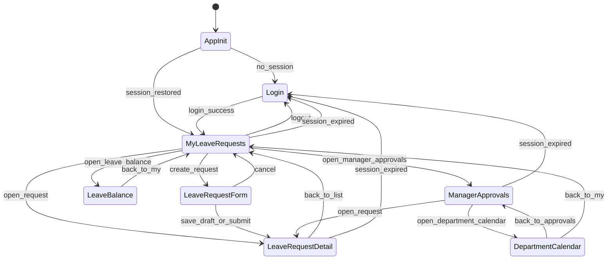

### ② Login Page（登入頁）

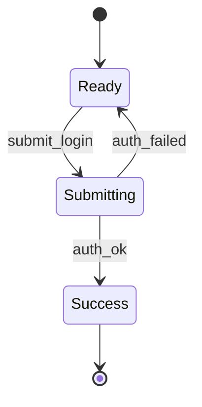

### ③ 我的請假列表（My Leave Requests）（頁面層）

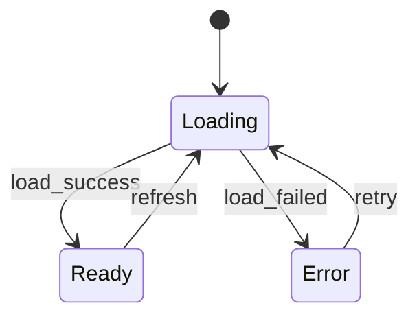

### ④ 我的請假列表（Employee 視角）

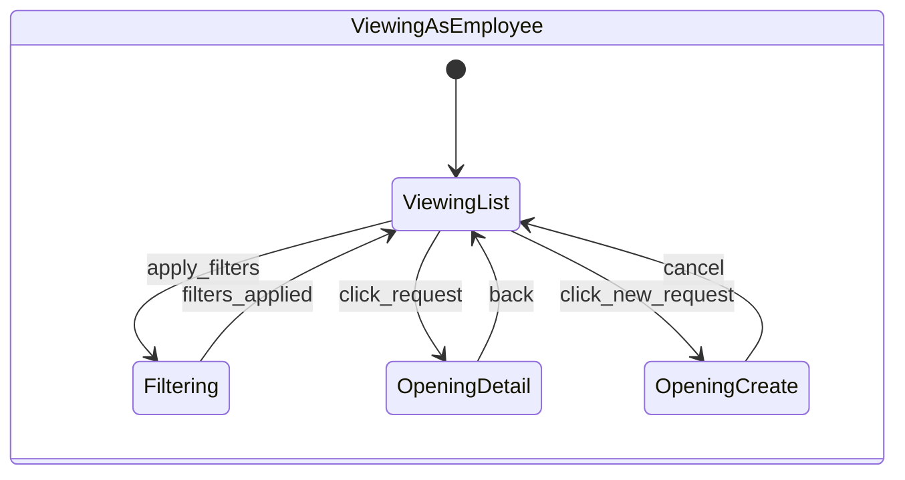

### ⑤ 我的請假列表（Manager 視角）

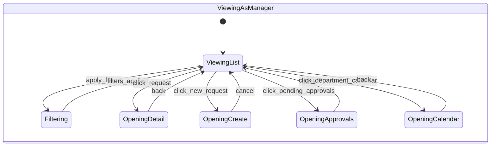

### ⑥ 請假詳情（Leave Request Detail）（頁面層）

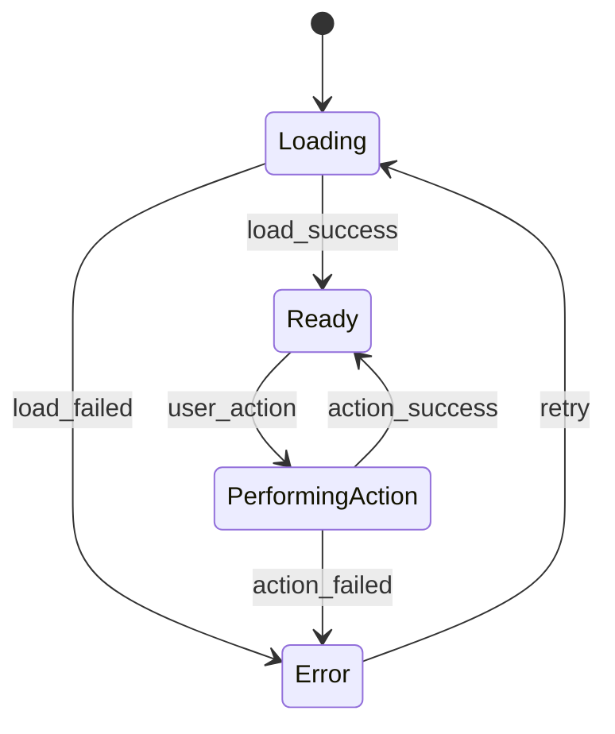

### ⑦ 請假詳情（Employee 視角）

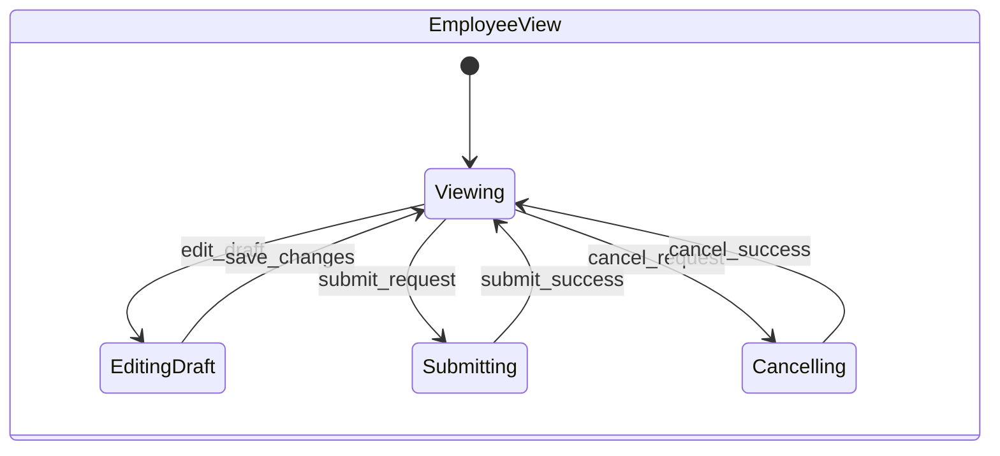

### ⑧ 請假詳情（Manager/Approver 視角）

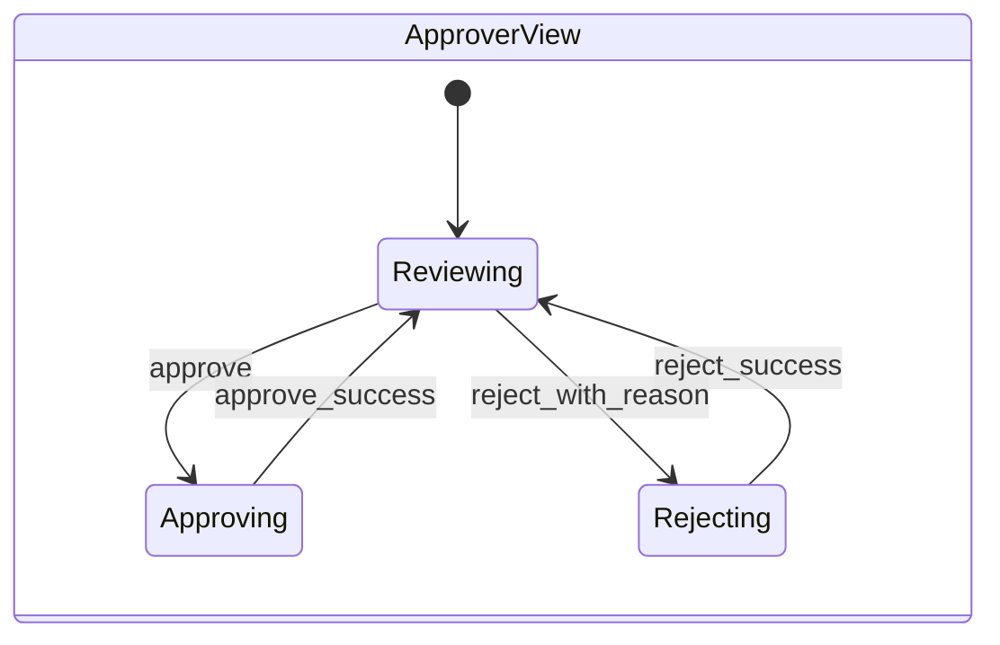

### ⑨ 剩餘假期（Leave Balance）（頁面層）

### ⑩ 待審核清單（Manager Pending Approvals）（頁面層）

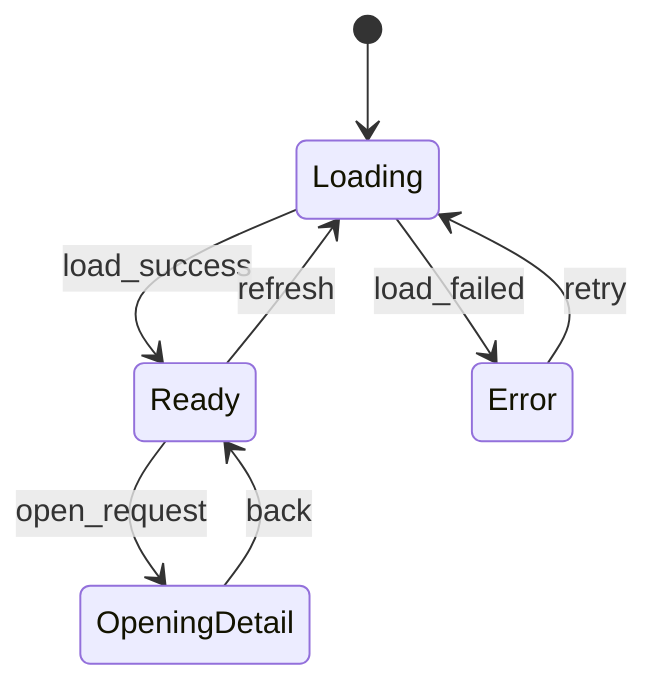

### ⑪ 部門請假日曆（Department Calendar）（頁面層）

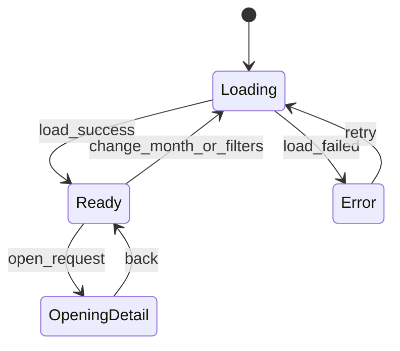

### ⑫ 請假表單（Create/Edit Leave Request）

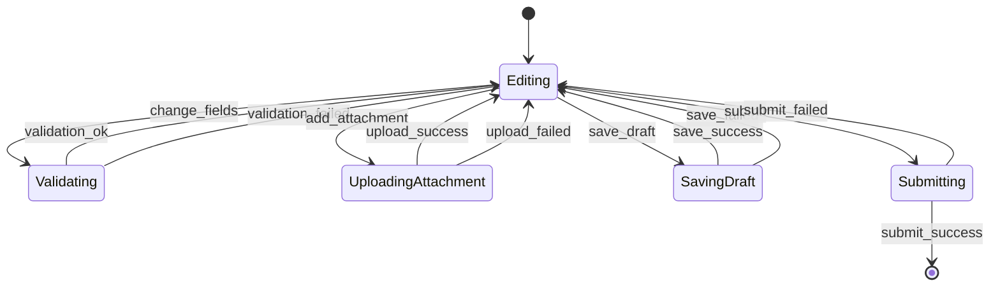

### ⑬ 核心業務狀態機：請假狀態（Leave Request Status）

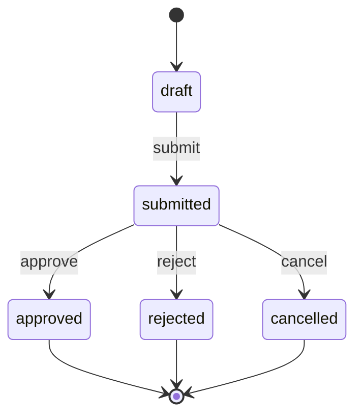

### ⑭ 一致性/額度同步狀態機：預扣與扣抵（Leave Balance Reservation）

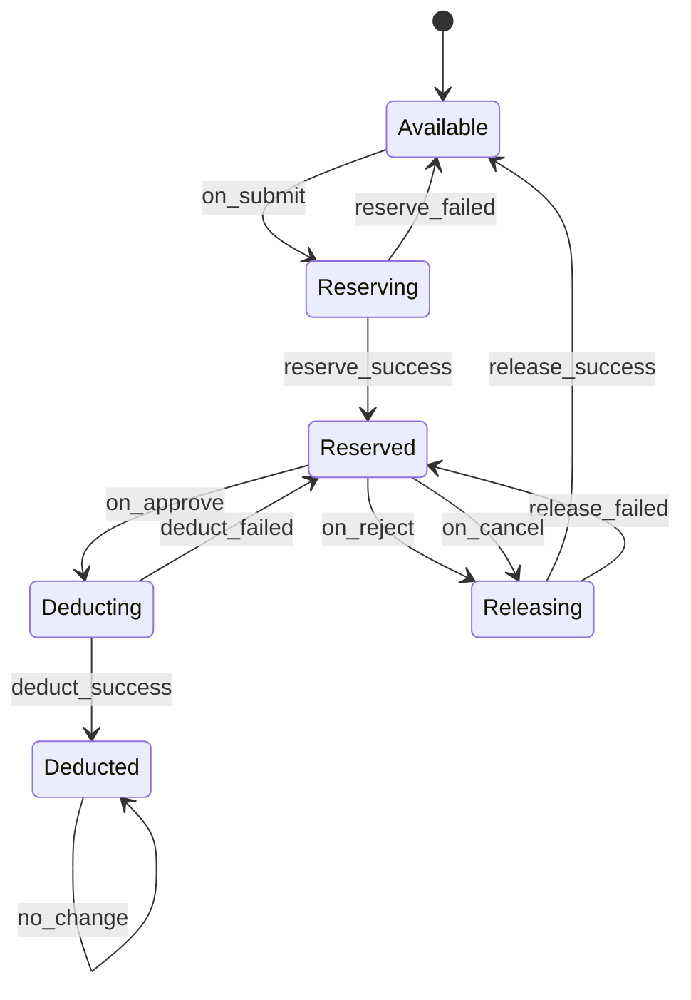

### ⑮ 全站錯誤與權限

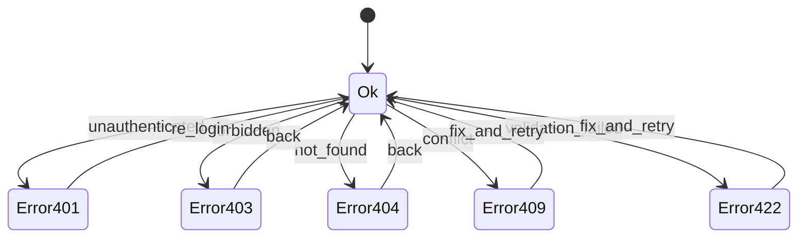
