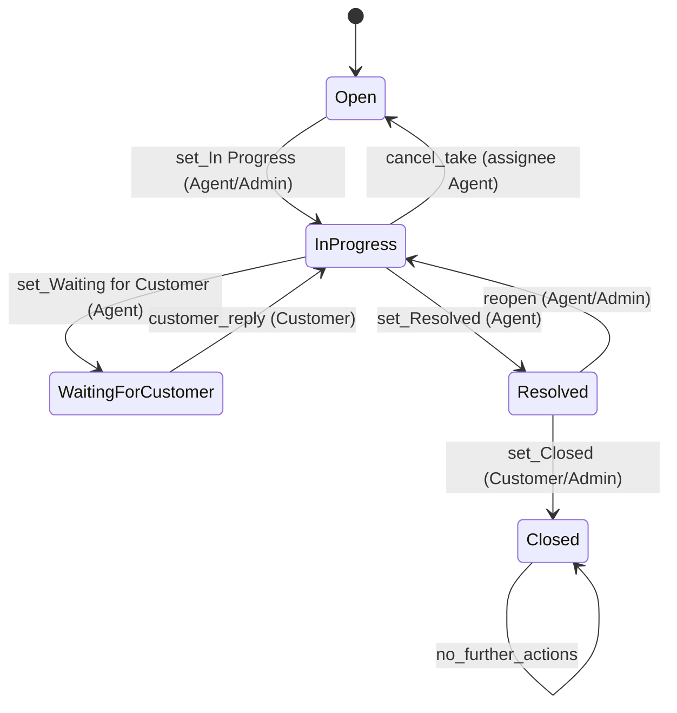
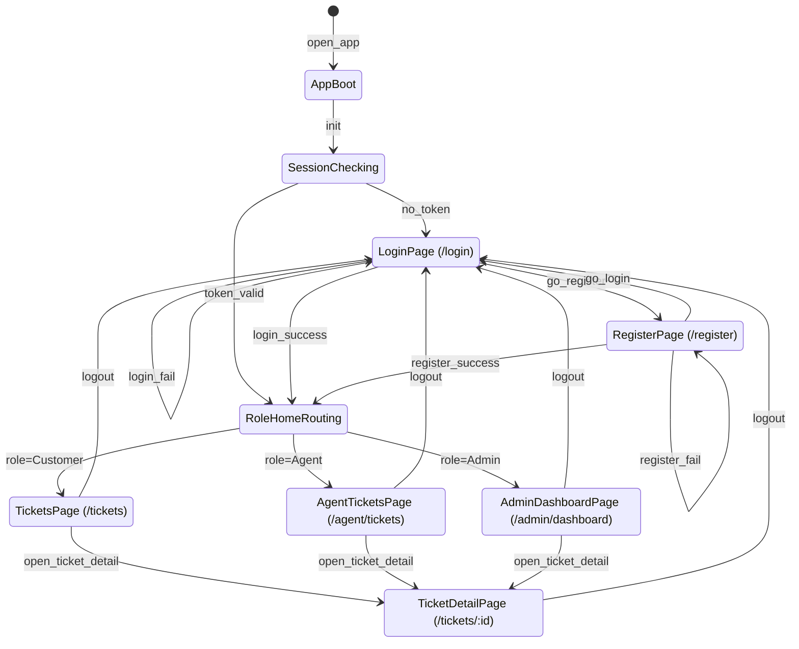
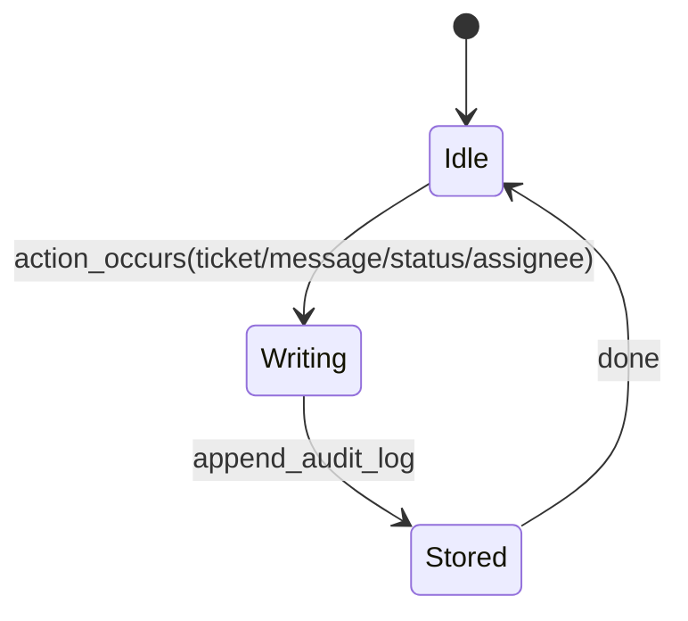
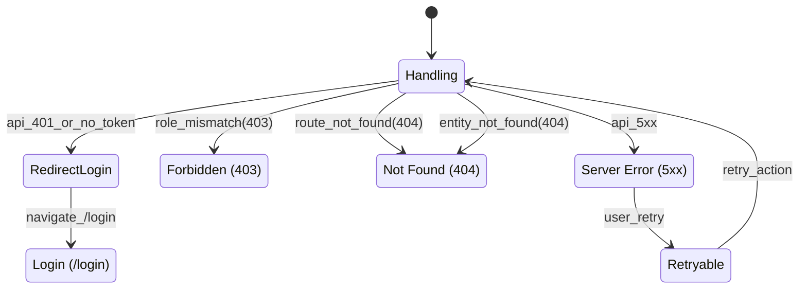

# Feature Specification: 客服工單系統（Helpdesk / Ticket System）

**Feature Branch**: `001-helpdesk-ticket-system`  
**Created**: 2026-02-01  
**Status**: Draft  
**Input**: User description: "建立一套供 Customer/Agent/Admin 使用的客服工單系統，具備 RBAC、嚴格狀態機（Closed 終態）、append-only 歷史與 Audit Log、列表/詳情/統計一致性、完整 UX 狀態、並發一致性與明確錯誤回饋；並遵循提供的全站/頁面/功能狀態機轉移圖。"

## User Scenarios & Testing *(mandatory)*

### User Story 1 - 客戶建立工單並完成結案 (Priority: P1)

客戶在登入後可以建立新工單、追蹤狀態與留言時間軸，並在客服標記已解決後關閉工單（Closed 終態不可再互動）。

**Why this priority**: 這是產品核心價值：讓客戶能把問題送進系統並獲得可追蹤的解決流程。

**Independent Test**: 僅實作 Customer 端 + 工單/留言/狀態機最小集合，即可驗證端到端流程（建立→互動→結案）。

**Acceptance Scenarios**:

1. **Given** Customer 已登入且位於 `/tickets`, **When** 建立新工單（title/category/description）送出, **Then** 系統建立一筆 ticket（status=Open）且在時間軸新增一筆「初始描述」留言（不可修改/刪除）。
2. **Given** ticket.status=Waiting for Customer 且 Customer 為該 ticket 擁有者, **When** Customer 發送回覆留言, **Then** 留言被新增（append-only），ticket.status 轉為 In Progress，且列表 `updated_at` 與詳情一致更新。
3. **Given** ticket.status=Resolved 且 Customer 為該 ticket 擁有者, **When** Customer 關閉工單, **Then** ticket.status 轉為 Closed、`closed_at` 有值、任何留言/狀態/指派操作皆被拒絕且 UI 不提供入口。

---

### User Story 2 - 客服接手與處理工單（含內部備註） (Priority: P2)

客服人員可在工作台查看未指派與指派給我的工單，接手未指派工單後推進處理狀態、與客戶留言往返，必要時新增內部備註（客戶不可見），並在完成後標記為已解決。

**Why this priority**: 沒有 Agent 的高效率處理流程，工單系統無法閉環。

**Independent Test**: 僅實作 Agent 可見範圍（未指派/指派給我）+ 接手 + 狀態推進 + 留言（公開/內部）即可驗證。

**Acceptance Scenarios**:

1. **Given** ticket.status=Open 且 assignee 為空, **When** Agent 在工作台點擊「接手」, **Then** 系統以併發安全方式使 assignee=該 Agent 且 status=In Progress，並寫入 Audit Log。
2. **Given** ticket.status=In Progress 且 assignee=該 Agent, **When** Agent 變更狀態為 Waiting for Customer, **Then** 狀態變更成功且寫入 Audit Log，Customer 端回覆入口變為可用。
3. **Given** ticket.status=In Progress 且 Agent 有可見權, **When** Agent 新增 `is_internal=true` 內部備註, **Then** 內部備註只對 Agent/Admin 可見、客戶不可見，且留言不可編輯/刪除。

---

### User Story 3 - 管理員監控服務品質與管理負載 (Priority: P3)

管理員可檢視全體工單、檢視統計指標（SLA、狀態分佈、客服負載）、對工單進行指派/改派，並在狀態機允許範圍內強制狀態變更；同時可管理客服帳號（建立/停用/角色設定）。

**Why this priority**: 管理者需要掌握整體服務品質與負載以調整人力與流程，避免服務失控。

**Independent Test**: 僅實作 Admin 儀表板讀取統計 + 改派 + 可允許的狀態變更即可驗證管理閉環。

**Acceptance Scenarios**:

1. **Given** Admin 已登入並進入 `/admin/dashboard`, **When** 選擇近 7 天, **Then** 顯示 SLA/狀態分佈/客服負載且「狀態分佈總和」與同範圍可見工單列表一致。
2. **Given** Admin 開啟任一 ticket 詳情, **When** 指派或重新指派 assignee（一次僅一位）, **Then** assignee 更新且寫入 Audit Log（含前後 assignee）。

### Edge Cases

- 兩位 Agent 同時接手同一筆未指派且 status=Open 的 ticket：僅能有一方成功，另一方得到明確衝突回應且 ticket 不被改壞。
- Customer 嘗試以猜測 ID 存取他人的 `/tickets/:id`：系統不可洩漏存在性（建議回 404），且不可回傳任何內容。
- 任意角色嘗試對 status=Closed 的 ticket 新增留言或變更狀態/指派：一律拒絕且不產生任何歷史寫入。
- 任何非法狀態轉換（不在允許集合）：一律拒絕（400）且不寫入狀態變更。
- is_internal=true 留言：Customer 永遠不可見，且即使透過列表/詳情也不可推測其存在。
- 已停用帳號持有舊 token：下一次驗證必須拒絕並導向登入或顯示權限錯誤。

## Requirements *(mandatory)*

### Functional Requirements

- **FR-001**: 系統 MUST 提供 RBAC 角色：Guest / Customer / Agent / Admin，且每個使用者僅能有一個互斥角色（Customer/Agent/Admin）。
- **FR-002**: 系統 MUST 支援 Email + Password 註冊/登入，密碼 MUST 以不可逆雜湊方式儲存。
- **FR-003**: 系統 MUST 使用 token-based session；受保護資源在無效/過期 token 時 MUST 拒絕並使前端導向 `/login`。
- **FR-004**: Customer MUST 只能建立與檢視 `customer_id=自己` 的 ticket；不得能存取他人的 ticket（避免 IDOR）。
- **FR-005**: Agent MUST 只能檢視「未指派」或「assignee=自己」的 ticket。
- **FR-006**: Admin MUST 可檢視所有 ticket。
- **FR-007**: Customer MUST 能建立新 ticket，建立後 status MUST 為 Open，且 MUST 同時建立一筆初始描述留言（append-only）。
- **FR-008**: ticket.title 與 ticket.category MUST 在建立後不可修改。
- **FR-009**: 系統 MUST 支援 ticket 列表依 status 篩選；Agent 工作台 MUST 支援「未指派」與「指派給我」視圖切換。
- **FR-010**: 系統 MUST 實作嚴格狀態機，且所有狀態轉換 MUST 在伺服器端驗證；非法轉換 MUST 拒絕（400）。
- **FR-011**: Closed MUST 為終態；一旦 Closed，任何留言/狀態/指派操作 MUST 被拒絕，且 UI 不提供互動入口。
- **FR-012**: TicketMessage MUST 為 append-only：留言不可編輯、不可刪除。
- **FR-013**: is_internal=true 的留言 MUST 僅對 Agent/Admin 可見，Customer 永遠不可見。
- **FR-014**: Customer MUST 只能在 status=Waiting for Customer 時新增公開留言；且成功回覆後 ticket.status MUST 轉為 In Progress。
- **FR-015**: Agent MUST 能在 status=In Progress 時將 ticket 推進為 Waiting for Customer 或 Resolved。
- **FR-016**: Customer MUST 能在 status=Resolved 時將 ticket 關閉為 Closed；Admin 亦 MUST 能在 status=Resolved 時關閉。
- **FR-017**: Agent/Admin MUST 能在 status=Resolved 時重新開啟（Resolved → In Progress）。
- **FR-018**: Agent 接手 ticket MUST 具備併發安全：兩位 Agent 同時接手同一 ticket，系統 MUST 只允許一位成功，另一位 MUST 得到明確失敗（建議 409）。
- **FR-019**: 所有「ticket 建立、留言新增、狀態變更、指派變更」MUST 寫入 append-only Audit Log，並包含 who/when/what 與必要的前後狀態/指派資訊。
- **FR-020**: 列表、詳情、統計資料 MUST 在相同權限與相同時間範圍下保持一致（例如：狀態分佈總和=列表筆數）。
- **FR-021**: 系統 MUST 完整呈現 Loading / Error / Empty / Forbidden / Not Found 狀態。
- **FR-022**: Admin MUST 能建立/停用客服帳號，並能設定使用者角色；被停用帳號 MUST 不能登入，且既有 token MUST 在下一次驗證時被拒絕。
- **FR-023**: Agent MUST 能「取消接手工單」，其行為 MUST 同時（a）清空 assignee（b）將 ticket.status 從 In Progress 轉回 Open（視為新增一條允許的狀態轉換）。
  - **FR-023a**: 取消接手僅允許在 ticket.status=In Progress 且 actor 為目前 assignee 的情境下執行；不符合條件 MUST 拒絕（400/403）。
  - **FR-023b**: 取消接手成功後，ticket MUST 變為「未指派且 Open」，並寫入 Audit Log（ASSIGNEE_CHANGED + STATUS_CHANGED 或等效語意）。
  - **FR-023c**: 取消接手不得用於 Closed/Resolved/Waiting for Customer/Open；Closed 終態一律拒絕。

### Data Contract & API Semantics *(mandatory if feature has frontend/backend or external integration)*

> 本節描述「契約與語意」，不約束具體傳輸協定/實作框架；回應代碼以語意表示（例：400/401/403/404/409/5xx）。

**Common objects**

- **UserSummary**: `{ id, email, role }`（不包含密碼或雜湊）
- **TicketSummary**: `{ id, title, category, status, updated_at, assignee?: UserSummary }`
- **TicketDetail**: `{ id, title, category, status, customer: UserSummary, assignee?: UserSummary, created_at, updated_at, closed_at?, messages: TicketMessage[] }`
- **TicketMessage**: `{ id, ticket_id, author: UserSummary, role, content, is_internal, created_at }`
- **AuditLogItem**: `{ id, entity_type, entity_id, action, actor: UserSummary, is_internal, aggregate_seq?, metadata_json, created_at }`
  - **Notes**:
    - `is_internal=true` 的 audit item MUST 不回傳給 Customer（用於內部備註或不宜對外揭露的稽核事件）。
    - `aggregate_seq`（可選但建議）為同一 `entity_type+entity_id` 的單調遞增序號，用於 timeline 穩定排序與分頁。

**Auth**

- **Contract**: `Register` request: `{ email, password, password_confirm }`  
  **response**: `{ token, user: UserSummary }`
- **Contract**: `Login` request: `{ email, password }`  
  **response**: `{ token, user: UserSummary }`
- **Contract**: `Logout` request: `{}`  
  **response**: `{ ok: true }`
- **Semantics**: `token` 為 bearer-only JWT；Client MUST 以 `Authorization: Bearer <token>` 存取受保護資源。
- **Errors**:
  - `400` → 欄位驗證失敗/Email 已存在/格式錯誤 → 顯示欄位錯誤
  - `401` → 帳密錯誤/無效 token → 清除 session 並導向 `/login`
  - `403` → 已停用或角色不允許 → 顯示 Forbidden（或導向登入，依策略；需一致）

**Tickets**

- **Contract**: `CreateTicket` request: `{ title (<=100), category, description }`  
  **response**: `{ ticket: TicketDetail }`（含初始描述留言）
- **Contract**: `ListTicketsForCustomer` request: `{ status_filter? }`  
  **response**: `{ items: TicketSummary[], total }`
- **Contract**: `ListTicketsForAgentWorkspace` request: `{ view: unassigned|mine, status_filter? }`  
  **response**: `{ items: TicketSummary[], total }`
- **Contract**: `GetTicketDetail` request: `{ ticket_id }`  
  **response**: `{ ticket: TicketDetail }`

**Messaging**

- **Contract**: `PostPublicMessage` request: `{ ticket_id, content }`  
  **response**: `{ message: TicketMessage, ticket: { id, status, updated_at } }`
- **Contract**: `PostInternalNote` request: `{ ticket_id, content, is_internal: true }`  
  **response**: `{ message: TicketMessage, ticket: { id, updated_at } }`

**State changes**

- **Contract**: `ChangeTicketStatus` request: `{ ticket_id, from_status, to_status }`  
  **response**: `{ ticket: { id, status, updated_at, closed_at? } }`

**Assignment**

- **Contract**: `TakeTicket` request: `{ ticket_id, expected: { status: Open, assignee_id: null } }`  
  **response**: `{ ticket: { id, status: In Progress, assignee_id, updated_at } }`
- **Contract**: `AssignOrReassignTicket` request: `{ ticket_id, assignee_id }`  
  **response**: `{ ticket: { id, assignee_id, updated_at } }`
- **Contract**: `UnassignTicket` request: `{ ticket_id }`  
  **response**: `{ ticket: { id, assignee_id: null, status: Open, updated_at } }`
  - **Semantics**: 僅允許「目前 assignee」的 Agent 在 status=In Progress 時取消接手；成功後 ticket 變為 Open 且未指派。

**Admin dashboard**

- **Contract**: `GetDashboardMetrics` request: `{ range: last_7_days|last_30_days|custom }`  
  **response**: `{ sla: { first_response_time, resolution_time }, status_distribution: { Open, In Progress, Waiting for Customer, Resolved, Closed }, agent_load: { agent_id, in_progress_count }[] }`
- **Errors**: `403` → 非 Admin 存取 → 顯示 Forbidden

**Admin users management**

- **Contract**: `ListUsers` request: `{ role?, is_active? }`  
  **response**: `{ items: { id, email, role, is_active, created_at }[], total }`
- **Contract**: `CreateUser` request: `{ email, password, role }`（role 僅允許 Agent/Admin）  
  **response**: `{ user: { id, email, role, is_active, created_at } }`
- **Contract**: `UpdateUser` request: `{ user_id, is_active?, role? }`  
  **response**: `{ user: { id, email, role, is_active, created_at } }`
- **Errors**:
  - `400` → 欄位驗證失敗/role 不允許
  - `401` → 未登入/無效 token
  - `403` → 非 Admin
  - `404` → user 不存在

**Error semantics (global)**

- `400`：驗證失敗 / 非法狀態轉換 / 狀態不允許的留言
- `401`：未登入或 token 無效/過期 → 前端清除 session 並導向 `/login`
- `403`：已登入但角色或權限不符（例如 Customer 進入 `/admin/dashboard`）→ 顯示 Forbidden
- `404`：ticket 不存在，或為避免洩漏而對「不可見 ticket」統一回 Not Found（建議用於 Customer/Agent 非可見範圍）
- `409`：併發衝突（例如工單已被他人接手/改派導致條件不符）
- `5xx`：系統錯誤 → 顯示可重試 Error 狀態

### State Transitions & Invariants *(mandatory if feature changes state/data)*

**Invariants**

- **Invariant**: Ticket 狀態機轉換必須嚴格遵循允許集合；任何不在集合內的轉換一律拒絕（400）。
- **Invariant**: `Closed` 為終態；一旦 Closed，禁止新增留言/內部備註、禁止狀態變更、禁止指派變更。
- **Invariant**: TicketMessage 與 AuditLog 皆為 append-only；不得修改或刪除既有紀錄。
- **Invariant**: is_internal=true 留言僅 Agent/Admin 可見，Customer 不可見。
- **Invariant**: 對同一 ticket 的狀態變更與指派變更必須以「單一原子操作」完成：更新 ticket + 寫入 Audit Log；避免寫入不一致。

**Allowed transitions (business rules)**

- **Transition**: Given `Open` and actor is Agent/Admin, when `set In Progress`, then status=In Progress.
- **Transition**: Given `In Progress` and actor is Agent, when `set Waiting for Customer`, then status=Waiting for Customer.
- **Transition**: Given `Waiting for Customer` and actor is Customer, when `customer_reply`, then (a) 新增公開留言 (b) status=In Progress.
- **Transition**: Given `In Progress` and actor is Agent, when `set Resolved`, then status=Resolved.
- **Transition**: Given `Resolved` and actor is Customer/Admin, when `set Closed`, then status=Closed and `closed_at` is set.
- **Transition**: Given `Resolved` and actor is Agent/Admin, when `reopen`, then status=In Progress.
- **Transition**: Given `In Progress` and actor is the current assignee (Agent), when `cancel take (unassign)`, then status=Open and assignee becomes null.

**Concurrency rule (take / change)**

- **Transition**: Given ticket matches expected current `(status, assignee_id)` in request, when actor attempts `TakeTicket`, then one actor succeeds; all other concurrent attempts fail with conflict and do not mutate ticket.

**Access-control rule (detail visibility)**

- **Invariant**: Customer 只可存取 `customer_id=自己`；Agent 只可存取 `assignee_id=自己` 或 `assignee_id=null` 的 ticket；Admin 可存取全部。
- **Invariant**: 對「非可見 ticket」回應採 404（Not Found）以避免洩漏存在性；對「路由角色不允許」採 403（Forbidden）。

**Reference transition diagram (ticket status machine)**

**Reference state machines (global/pages/features)**

> 以下為 UX/行為層級的狀態機參考，需與功能與錯誤語意一致。

### Failure Modes & Recovery *(mandatory)*

- **Failure mode**: 併發衝突（接手/改派/狀態變更）造成條件不成立。
  - **Recovery**: 操作失敗方取得明確錯誤（409 或等效語意），客戶端重新整理 ticket 詳情/列表以取得最新狀態後再決定下一步。
- **Failure mode**: 非法狀態轉換或不允許的留言動作。
  - **Recovery**: 系統拒絕（400/403），不改變任何資料，並回傳可理解的原因（例如「狀態已變更」、「Closed 不可互動」）。
- **Failure mode**: 驗證錯誤（title 長度、必填欄位、分類不合法）。
  - **Recovery**: 以欄位級錯誤回應（400），前端保留使用者輸入並提示修正。
- **Failure mode**: 系統/網路錯誤（5xx/連線失敗）。
  - **Recovery**: 顯示可重試 Error 狀態；重試後要么成功要么再次回到錯誤狀態，不得產生部分寫入。
- **Failure mode**: 權限錯誤（未登入/角色不符/不可見）。
  - **Recovery**: 401 導向登入；403 顯示 Forbidden；404 顯示 Not Found（不可見策略一致）。

### Security & Permissions *(mandatory)*

- **Authentication**: 受保護頁面與操作必須要求有效 session/token。
- **Authorization**: 所有權限判斷必須伺服器端強制；不得僅靠 UI 隱藏按鈕。
- **IDOR 防護**: `/tickets/:id` 讀取/操作時必須驗證可見範圍；不可見時採 404（建議）避免洩漏。
- **XSS 防護**: 留言內容輸出必須安全處理（例如：預設轉義；若允許格式需限制白名單）。
- **Sensitive data**: 密碼雜湊與認證 token 為敏感資料；不得在任何列表/詳情/稽核輸出中洩漏。

### Observability *(mandatory)*

- **Logging**: 所有寫入行為（建立 ticket、留言、內部備註、狀態變更、指派變更、帳號停用）需留下可追蹤事件。
- **Tracing**: 每次請求/操作應具備可關聯識別（例如 request id）以利追查併發問題。
- **User-facing errors**: 錯誤訊息需可行動（例如：「已被他人接手，請重新整理」）。
- **Developer diagnostics**: 針對非法轉換/併發衝突需能定位原因（期望狀態 vs 實際狀態）。

### Backward Compatibility & Change Risk *(mandatory)*

- **Breaking change?**: No（新系統/新功能；若未來擴充需維持契約相容）。
- **Migration plan**: 無既有資料假設；若導入既有資料需另立遷移規格（不在本範圍）。
- **Rollback plan**: 若部署後出現嚴重錯誤，需能停用新功能入口並保留既有資料（append-only 歷史不可刪除）。

### Performance & Scale Assumptions *(mandatory)*

- **Growth assumption**:
  - 支援多使用者與多角色同時操作（不可假設單一使用者/單一角色）。
  - 工單與留言量會隨時間累積，需支援按時間排序與分頁（契約層面不限制實作）。
- **Constraints**:
  - 列表與詳情載入需在一般使用情境下保持可用且不造成明顯卡頓（以 UX 為導向）。
  - 重要寫入操作需具備併發安全與一致性保證（接手、狀態切換、指派）。

### Key Entities *(include if feature involves data)*

- **User**: 代表系統使用者（email、role、is_active），角色互斥。
- **Ticket**: 代表客戶提交的問題/需求（title、category、status、customer、assignee、時間欄位）。
- **TicketMessage**: 代表工單留言（author、content、is_internal、created_at；append-only）。
- **AuditLog**: 代表稽核紀錄（action、actor、entity、metadata、created_at；append-only）。

## Success Criteria *(mandatory)*

### Measurable Outcomes

- **SC-001**: Customer 能在 3 分鐘內完成「建立工單」並在列表看到新工單（含 Open 狀態與更新時間）。
- **SC-002**: 95% 的「列表載入」與「詳情載入」在一般網路環境下能於 2 秒內完成可用畫面（含 Loading→Ready/Empty）。
- **SC-003**: 對於同一 ticket 的「接手」併發操作，系統在所有情境下保證最多一位 Agent 成功且資料一致（0 件資料損壞/雙重指派）。
- **SC-004**: 所有關鍵事件（建立、留言、內部備註、狀態、指派）100% 具有可查的 Audit Log（包含 who/when/what 與前後差異）。
- **SC-005**: 管理員儀表板的「狀態分佈總和」與同範圍可見工單列表筆數一致（誤差 0）。
