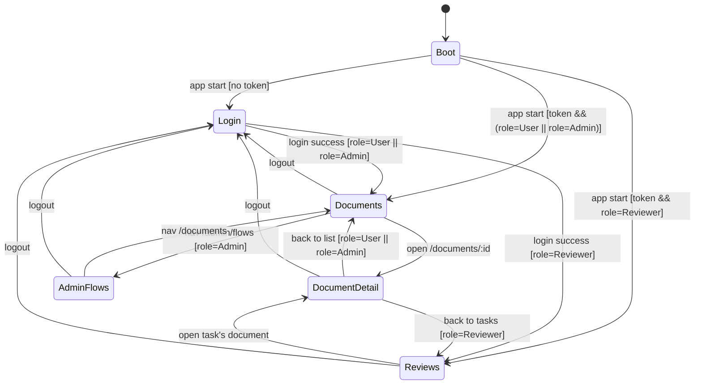
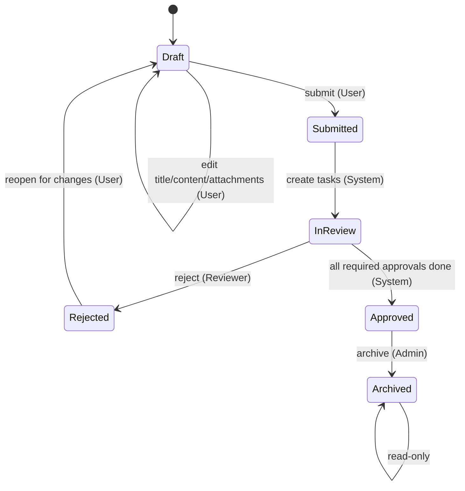
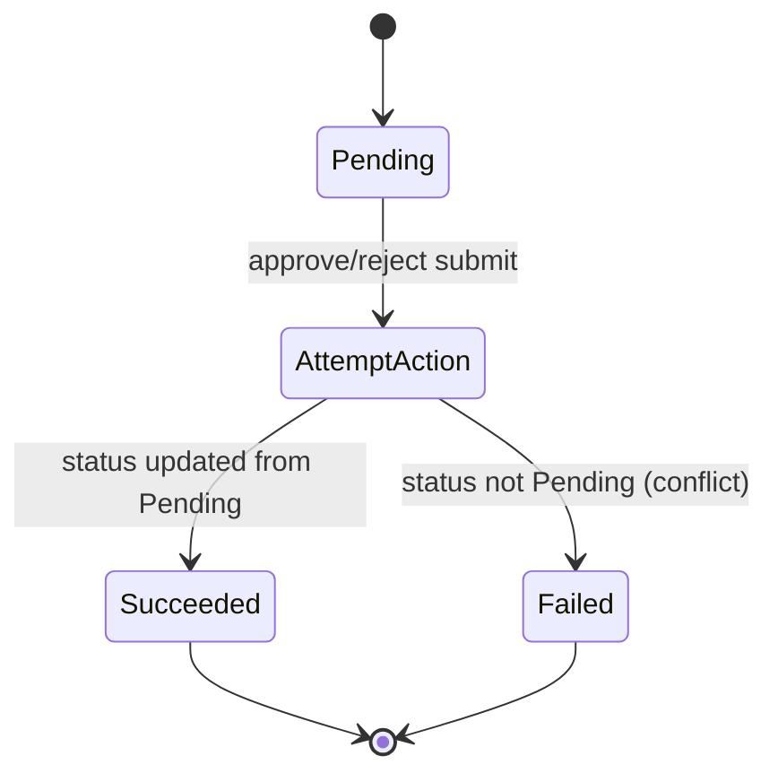
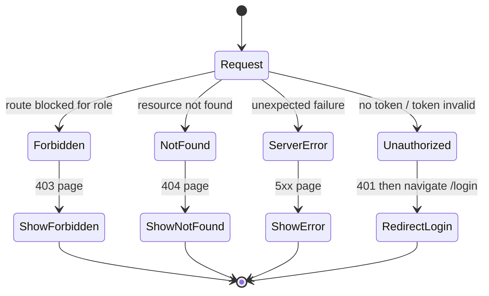

# Feature Specification: 內部文件審核與簽核系統（Internal Document Review & Approval System）

**Feature Branch**: `001-document-review-approval`  
**Created**: 2026-02-02  
**Status**: Draft  
**Input**: User description: "建立公司內部文件審核與簽核系統：RBAC、多狀態機、版本不可變、append-only 稽核/審核紀錄、嚴格資料隔離（防 IDOR）、完整 UX 狀態、併發審核防重處理。"

## User Scenarios & Testing *(mandatory)*

<!--
  IMPORTANT: User stories should be PRIORITIZED as user journeys ordered by importance.
  Each user story/journey must be INDEPENDENTLY TESTABLE - meaning if you implement just ONE of them,
  you should still have a viable MVP (Minimum Viable Product) that delivers value.
  
  Assign priorities (P1, P2, P3, etc.) to each story, where P1 is the most critical.
  Think of each story as a standalone slice of functionality that can be:
  - Developed independently
  - Tested independently
  - Deployed independently
  - Demonstrated to users independently
-->

### User Story 1 - 申請人建立草稿並送出簽核（含版本鎖定與任務建立） (Priority: P1)

申請人（User）登入後，能建立文件草稿、編輯內容與上傳附件，並在符合送審前置條件時送出簽核。送審後該次版本與附件被鎖定為不可變，系統依流程模板建立審核任務並將文件推進到「審核中」。

**Why this priority**: 這是系統核心價值（讓文件能進入可稽核的簽核流程）；沒有此流程就無法產生任何審核/稽核資料。

**Independent Test**: 只實作「草稿建立→編輯→上傳→送審→建立任務→進入審核中」即可在 Demo 中完成最小可用流程，並能驗證不可變與狀態機。

**Acceptance Scenarios**:

1. **Given** 使用者已登入且角色為 User，且目前沒有任何文件，**When** 使用者在文件列表建立新文件，**Then** 系統建立一份 `Draft` 文件並同時建立一筆 Draft 版本作為目前版本，且文件列表立即可見。
2. **Given** 文件狀態為 `Draft` 且操作者為文件擁有者，**When** 使用者更新標題與內容並儲存，**Then** 系統更新目前 Draft 版本的內容，且列表與詳情的狀態與更新時間一致。
3. **Given** 文件狀態為 `Draft` 且操作者為文件擁有者，**When** 使用者上傳附件，**Then** 系統新增一筆附件紀錄並綁定到「目前 Draft 版本」，且附件清單可立即看到新附件。
4. **Given** 文件狀態為 `Draft` 且標題/內容皆非空且選定啟用中的流程模板（每一步均有審核者），**When** 使用者送出簽核，**Then** 系統建立一筆新的「送審鎖定版本」、將文件推進到 `In Review` 並建立對應的審核任務，且此後內容/附件不可再被修改。
5. **Given** 文件狀態不為 `Draft`（例如 `In Review`），**When** 使用者嘗試編輯內容或新增附件或再次送審，**Then** 系統拒絕該寫入行為且不產生任何新版本/附件/任務。

---

### User Story 2 - 審核者處理待辦（同意/退回、退回理由必填、併發防重） (Priority: P2)

審核者（Reviewer）登入後，能看到指派給自己的待辦任務清單，並在文件詳情中對自己的 `Pending` 任務執行「同意」或「退回」。退回需填寫理由。系統需保證同一任務只能被處理一次（避免重複提交/競態），並在退回時取消其他尚未完成的任務。

**Why this priority**: 送審後若無法完成審核決策，流程無法閉合；同時併發防重與 append-only 紀錄是可稽核系統的可信度核心。

**Independent Test**: 僅實作「/reviews 看到自己的 Pending 任務 → 進詳情 → 同意/退回（退回理由必填） → 任務狀態更新 + 審核/稽核紀錄新增 + 競態重複提交被拒」即可獨立驗證審核閉環。

**Acceptance Scenarios**:

1. **Given** 使用者已登入且角色為 Reviewer，且存在指派給他的 `Pending` 任務，**When** Reviewer 進入待辦列表，**Then** 只會看到 `assignee=self` 且 `status=Pending` 的任務。
2. **Given** Reviewer 開啟一份與自己任務關聯的文件詳情，且該 Reviewer 有一筆 `Pending` 任務，**When** Reviewer 點擊「同意」，**Then** 任務狀態更新為 `Approved`，且新增一筆不可變的審核紀錄與稽核事件。
3. **Given** Reviewer 有一筆 `Pending` 任務，**When** Reviewer 點擊「退回」但未填理由就送出，**Then** 系統拒絕並提示「退回理由必填」，且不改變文件/任務狀態。
4. **Given** Reviewer 退回成功導致文件進入 `Rejected`，**When** 系統更新任務集合，**Then** 其他尚未完成的任務一律標記為 `Cancelled`，且文件狀態維持 `Rejected`（只讀）。
5. **Given** 兩次幾乎同時的操作試圖處理同一筆 `Pending` 任務（重複提交/競態），**When** 第一個請求成功完成，**Then** 第二個請求必須被拒絕為「已被處理的衝突」，且不得新增重複的審核紀錄或稽核事件。

---

### User Story 3 - 管理員管理流程模板並封存已核准文件 (Priority: P3)

管理員（Admin）能管理簽核流程模板（建立/編輯/停用），並能檢視任意文件與完整審核/稽核歷史；對已核准文件可執行封存（`Approved → Archived`）。

**Why this priority**: 流程模板是送審的必要前置條件；封存是內控流程中常見的文件生命週期終點。

**Independent Test**: 只實作「模板管理（至少一個可啟用模板）+ 已核准文件封存」即可獨立驗證管理邏輯與狀態機限制。

**Acceptance Scenarios**:

1. **Given** 使用者已登入且角色為 Admin，**When** Admin 進入流程模板管理頁，**Then** 可以看到模板清單（含啟用/停用狀態）並能建立或編輯模板。
2. **Given** 一個模板存在但某個 step 沒有任何審核者指派，**When** 任意使用者嘗試使用該模板送審，**Then** 系統必須拒絕送審並回報「模板不完整（存在無指派步驟）」。
3. **Given** 文件狀態為 `Approved` 且操作者為 Admin，**When** Admin 執行封存，**Then** 文件狀態更新為 `Archived` 並新增稽核事件，且文件保持只讀。
4. **Given** 文件狀態不是 `Approved`，**When** Admin 嘗試封存，**Then** 系統拒絕該狀態轉換且不產生任何稽核事件。

---

[Add more user stories as needed, each with an assigned priority]

### Edge Cases

<!--
  ACTION REQUIRED: The content in this section represents placeholders.
  Fill them out with the right edge cases.
-->

- 存取控制：未登入者嘗試存取受保護頁面，必須導向登入且不可洩漏資料。
- 防止 IDOR：User 嘗試讀取/操作他人文件；Reviewer 嘗試讀取無任務關聯文件，皆不得洩漏文件存在性。
- 併發防重：同一 ReviewTask 被重複提交同意/退回；必須只成功一次且不得產生重複 append-only 記錄。
- 任務一致性：任務建立失敗時，不得出現「文件進入審核中但沒有任何待審任務」的半成品狀態。
- 不可變性：送審鎖定版本與其附件不得被覆寫；Rejected→Draft 只能建立新版本/新附件而不可變更舊版本。
- UX 狀態：列表/詳情的 Loading/Error/Empty/Forbidden/Not Found 呈現必須正確且不顯示過期或殘留資料。

## Requirements *(mandatory)*

<!--
  ACTION REQUIRED: The content in this section represents placeholders.
  Fill them out with the right functional requirements.
-->

### Functional Requirements

#### Authentication / Session

- **FR-001**: 系統 MUST 提供 Email + Password 登入，且 Email MUST 唯一。
- **FR-002**: 系統 MUST 以不可逆方式儲存密碼（不得明碼）。
- **FR-003**: 系統 MUST 使用 token-based session；所有受保護資源 MUST 需要有效 session 才可存取。
- **FR-004**: 當 session 無效/過期時，系統 MUST 視為未登入並阻擋受保護資源；前端 MUST 導向登入頁。
- **FR-005**: 系統 MUST 支援登出，登出後該 session MUST 失效，且受保護操作不可再成功。
- **FR-006**: 登入成功後 MUST 依角色導向預設頁：User/Admin → 文件列表；Reviewer → 待辦列表。

#### Roles / RBAC

- **FR-007**: 系統 MUST 支援互斥角色：Guest / User / Reviewer / Admin；每個帳號在同一時間 MUST 只有一個角色。
- **FR-008**: 系統 MUST 實作路由存取控制：
  - Guest 僅可存取登入頁
  - User 僅可存取文件列表與文件詳情（限自身文件）
  - Reviewer 僅可存取待辦列表與文件詳情（限有任務關聯的文件）
  - Admin 可存取文件列表、文件詳情與流程模板管理
- **FR-009**: 系統 MUST 在伺服端強制執行角色/資源層級授權（不可只依賴前端隱藏按鈕）。

#### Documents / Versions / Attachments

- **FR-010**: User 與 Admin MUST 能建立文件；新文件 MUST 初始為 `Draft` 並同時建立一筆 Draft 版本作為目前版本。
- **FR-011**: 當且僅當文件狀態為 `Draft` 且操作者為 owner（或 Admin）時，MUST 允許更新文件標題與 Draft 版本內容。
- **FR-012**: 文件標題 MUST 必填且長度 MUST ≤ 120 字。
- **FR-013**: 只有 `Draft` 狀態 MUST 允許新增附件，且附件 MUST 綁定到目前 Draft 版本。
- **FR-014**: 附件 MUST 為不可變（同一附件識別不得覆寫內容）；系統 MUST 以新增方式記錄附件。
- **FR-015**: 文件進入 `Submitted` / `In Review` / `Approved` / `Archived` 後，文件內容與附件 MUST 變為只讀且任何寫入行為 MUST 被拒絕。

#### Approval Flow Templates

- **FR-016**: 系統 MUST 支援流程模板，模板 MUST 可被啟用/停用。
- **FR-017**: 模板 MUST 由至少 1 個 step 組成，step 必須包含順序與模式（Serial/Parallel）以及可識別的 step key。
- **FR-018**: 每個 step MUST 指派至少 1 位 Reviewer；若存在任何 step 無指派，該模板 MUST 不可用於送審。
- **FR-019**: 只有 Admin MUST 能建立/編輯/停用流程模板。

#### Submit for Approval

- **FR-020**: 送審前，系統 MUST 驗證：標題與內容非空、選定啟用中模板、模板 steps 完整且每步皆有審核者。
- **FR-021**: `Draft → Submitted` 時，系統 MUST 建立一筆新的「送審鎖定版本」（版本號遞增）並將文件狀態推進。
- **FR-022**: 系統 MUST 在一致性處理中完成 `Submitted → In Review`：建立審核任務並將文件狀態推進；不得留下半完成狀態。

#### Review Tasks / Decisions

- **FR-023**: 系統 MUST 依模板建立 ReviewTask：
  - Serial：同時間僅允許當前 step 存在 `Pending` 任務
  - Parallel：同一 step 可同時存在多筆 `Pending` 任務，且需全數同意才算該步完成
- **FR-024**: Reviewer MUST 只能操作 `assignee=self` 且 `status=Pending` 的任務。
- **FR-025**: 任務的同意/退回 MUST 為一次性動作：同一任務 MUST 只能成功被處理一次；重複提交 MUST 被拒絕且不得產生重複 append-only 記錄。
- **FR-026**: 退回 MUST 要求理由必填。
- **FR-027**: 當任一 Reviewer 退回導致文件進入 `Rejected` 時，系統 MUST 將其餘未完成任務標記為 `Cancelled`。
- **FR-028**: 當所有必要同意完成後，系統 MUST 將文件由 `In Review` 推進至 `Approved`（不得手動跳轉）。

#### Reopen / Resubmit

- **FR-029**: `Rejected → Draft` 必須建立一筆新的 Draft 版本（版本號遞增），其內容 MUST 以被退回送審版本為起點。
- **FR-030**: `Rejected` 狀態下，文件詳情 MUST 保持只讀；只能允許「退回後修改」將其切回 Draft。

#### Archive

- **FR-031**: 只有 Admin MUST 能將文件由 `Approved` 封存為 `Archived`。
- **FR-032**: `Archived` MUST 全部只讀，任何寫入行為 MUST 被拒絕。

#### Auditability / Append-only

- **FR-033**: 系統 MUST 為關鍵事件寫入 append-only 的稽核事件（who/when/what + 必要 metadata）。
- **FR-034**: 系統 MUST 為同意/退回寫入 append-only 的審核紀錄（含 actor、任務、文件、版本、動作、理由/時間）。
- **FR-035**: 稽核事件與審核紀錄 MUST 不可被編輯或刪除。

#### UX Quality

- **FR-036**: 主要頁面 MUST 呈現完整 UX 狀態：Loading / Error / Empty / Forbidden / Not Found，且狀態呈現 MUST 與權限/資源結果一致。
- **FR-037**: 所有寫入型操作 MUST 防重送（操作中不可重複點擊）。
- **FR-038**: 錯誤訊息 MUST 可理解並指出原因（例如：狀態不允許、理由必填、找不到資源、已被他人處理）。

#### Consistency

- **FR-039**: 文件列表與詳情對同一文件呈現的狀態與更新時間 MUST 一致。
- **FR-040**: 文件詳情中顯示的版本、附件、任務、審核紀錄、稽核事件 MUST 對應同一文件與正確版本。

#### Assumptions (documented defaults)

- **A-001**: 角色為互斥且單一（不支援多角色同時擁有）。
- **A-002**: 文件屬公司內部系統，文件可見性以「擁有者」與「任務關聯」為最小授權集合。
- **A-003**: 所有 append-only 記錄一旦寫入即視為最終事實來源；介面以其展示為準。

### Data Contract & API Semantics *(mandatory if feature has frontend/backend or external integration)*

<!--
  ACTION REQUIRED: Define the contract BEFORE implementation.
  Provide at minimum: request schema, response schema, and error semantics.
-->

下列為「操作契約」層級的資料語意（不綁定特定技術或路由實作），用於確保前後端一致。

- **Contract**: Login request: `{ email: string, password: string }`
- **Contract**: Login response: `{ session_token: string, role: 'User'|'Reviewer'|'Admin', expires_at: datetime }`
- **Errors**: Unauthorized → 帳密錯誤/session 無效 → 顯示可理解訊息並停留或導向登入

- **Contract**: ListDocuments request: `{}`（User 僅回自身；Admin 回全部）
- **Contract**: ListDocuments response: `{ items: Array<{ id: uuid, title: string, status: enum, updated_at: datetime }> }`
- **Errors**: Forbidden → 角色不允許瀏覽清單（Reviewer）→ 顯示 Forbidden

- **Contract**: GetDocumentDetail request: `{ document_id: uuid }`
- **Contract**: GetDocumentDetail response: `{ document, versions, attachments, review_tasks, approval_records, audit_logs }`
- **Errors**: NotFound → 不存在或無權限（含 IDOR 防護）→ 顯示 Not Found；Forbidden → 有權限但路由被禁止 → 顯示 Forbidden

- **Contract**: CreateDocument request: `{}`
- **Contract**: CreateDocument response: `{ document_id: uuid, status: 'Draft', current_version_id: uuid }`

- **Contract**: UpdateDraft request: `{ document_id: uuid, title: string, content: text }`
- **Contract**: UpdateDraft response: `{ document_id: uuid, status: 'Draft', current_version_id: uuid, updated_at: datetime }`
- **Errors**: ValidationError → 欄位不合法；StateRejected → 文件非 Draft；NotFound → 無權限

- **Contract**: UploadAttachment request: `{ document_id: uuid, file: binary, filename: string, content_type: string, size_bytes: int }`
- **Contract**: UploadAttachment response: `{ attachment_id: uuid, document_version_id: uuid, created_at: datetime }`
- **Errors**: StateRejected → 文件非 Draft；ValidationError → 檔案資訊不合法；NotFound → 無權限

- **Contract**: SubmitForApproval request: `{ document_id: uuid, template_id: uuid }`
- **Contract**: SubmitForApproval response: `{ document_id: uuid, status: 'In Review', locked_version_id: uuid, created_tasks_count: int }`
- **Errors**: ValidationError → 前置條件不足（標題/內容空、模板不可用/不完整）；StateRejected → 非 Draft；NotFound → 無權限

- **Contract**: ListMyReviewTasks request: `{}`
- **Contract**: ListMyReviewTasks response: `{ items: Array<{ review_task_id: uuid, document_id: uuid, step_key: string, status: 'Pending' }> }`
- **Errors**: Forbidden → 非 Reviewer

- **Contract**: ApproveReviewTask request: `{ review_task_id: uuid }`
- **Contract**: ApproveReviewTask response: `{ review_task_id: uuid, status: 'Approved', acted_at: datetime, document_status: enum }`
- **Errors**: Conflict → 任務已被處理；Forbidden/NotFound → 非指派者或無關聯；StateRejected → 任務非 Pending

- **Contract**: RejectReviewTask request: `{ review_task_id: uuid, reason: text }`
- **Contract**: RejectReviewTask response: `{ review_task_id: uuid, status: 'Rejected', acted_at: datetime, document_status: 'Rejected', cancelled_tasks_count: int }`
- **Errors**: ValidationError → reason 缺失；Conflict → 任務已被處理；Forbidden/NotFound → 非指派者或無關聯

- **Contract**: ReopenAsDraft request: `{ document_id: uuid }`
- **Contract**: ReopenAsDraft response: `{ document_id: uuid, status: 'Draft', new_current_version_id: uuid }`
- **Errors**: StateRejected → 文件非 Rejected；NotFound → 無權限

- **Contract**: ArchiveDocument request: `{ document_id: uuid }`
- **Contract**: ArchiveDocument response: `{ document_id: uuid, status: 'Archived' }`
- **Errors**: Forbidden → 非 Admin；StateRejected → 文件非 Approved

- **Contract**: UpsertFlowTemplate request: `{ template: { id?: uuid, name: string, is_active: boolean, steps: Array<{ step_key: string, order_index: int, mode: 'Serial'|'Parallel', assignees: Array<user_id> }> } }`
- **Contract**: UpsertFlowTemplate response: `{ template_id: uuid, updated_at: datetime }`
- **Errors**: Forbidden → 非 Admin；ValidationError → step_key 重複/steps 不完整

### State Transitions & Invariants *(mandatory if feature changes state/data)*

<!--
  ACTION REQUIRED: Explicitly define preconditions/postconditions.
  Do NOT invent business rules; mark unclear items as NEEDS CLARIFICATION.
-->

#### Core Invariants

- **Invariant**: 文件生命週期 MUST 遵守嚴格狀態機；任何不在白名單內的狀態轉換 MUST 被拒絕。
- **Invariant**: `Draft` 以外狀態（Submitted/In Review/Rejected/Approved/Archived）內容與附件 MUST 只讀。
- **Invariant**: 送審鎖定版本與其附件 MUST 不可變（不可覆寫、不可編輯）。
- **Invariant**: `current_version_id` MUST 永遠指向「目前應顯示的版本」：
  - Draft：指向可被更新的 Draft 版本
  - In Review/Approved/Archived：指向送審鎖定版本
  - Rejected：指向被退回的送審鎖定版本（只讀）
- **Invariant**: ReviewTask MUST 只能被處理一次；成功處理後 MUST 產生且僅產生一筆對應的審核紀錄（append-only）。
- **Invariant**: 稽核事件（Audit）與審核紀錄（Approval）皆 MUST append-only（不可修改、不可刪除）。
- **Invariant**: 授權 MUST 為資源層級（object-level）：
  - User 僅可存取 owner_id=自己之文件
  - Reviewer 僅可存取「有任務關聯」之文件，否則以 Not Found 回應以避免存在性洩漏
  - Admin 可存取全部

#### Document State Transitions (Business Rules)

- **Transition**: Given 文件狀態為 Draft 且操作者為 owner/Admin 且送審前置條件皆通過，when 使用者送審，then 系統建立新的送審鎖定版本、寫入稽核事件、文件狀態依序推進到 In Review 並建立第一批 Pending 任務。
- **Transition**: Given 文件狀態為 In Review 且某 Reviewer 對自己的 Pending 任務退回且理由非空，when Reviewer 送出退回，then 文件進入 Rejected、寫入審核紀錄與稽核事件、其餘 Pending 任務全部 Cancelled。
- **Transition**: Given 文件狀態為 In Review 且某 Reviewer 對自己的 Pending 任務同意，when Reviewer 送出同意，then 任務變更為 Approved 並寫入審核紀錄與稽核事件；若因此滿足「全部必要同意」，then 系統推進文件狀態為 Approved 並寫入相應稽核事件。
- **Transition**: Given 文件狀態為 Rejected 且操作者為 owner/Admin，when 使用者選擇退回後修改，then 系統建立新的 Draft 版本（以退回版本內容為起點）、文件狀態變為 Draft、寫入稽核事件。
- **Transition**: Given 文件狀態為 Approved 且操作者為 Admin，when Admin 封存，then 文件狀態變為 Archived 並寫入稽核事件。

#### Reference Transition Diagrams (must be followed)

以下狀態機圖為需求來源的一部分，做為驗收與一致性檢查依據。

##### ① Global App Page State Machine

##### ⑱ Feature: Document State Machine (Strict)

##### ㉑ Feature: Concurrency Guard (ReviewTask Single-action)

##### ㉒ 全站錯誤與權限

### Failure Modes & Recovery *(mandatory)*

- **Failure mode**: 送審時任務建立失敗或部分建立（導致文件已進入審核中但沒有完整 Pending 任務集合）。
- **Recovery**: 系統 MUST 以一致性方式處理送審：若任務未成功建立，文件狀態與版本指標 MUST 回到送審前的可預期狀態，且不得留下半成品；可透過重新整理文件詳情驗證「狀態/版本/任務」一致。

- **Failure mode**: 審核同意/退回在併發下重複提交，可能產生重複審核紀錄或錯誤狀態推進。
- **Recovery**: 系統 MUST 以一次性動作保障：第二個競態請求 MUST 失敗為衝突，且資料面不得新增任何 append-only 記錄；重新整理後以伺服端最終狀態呈現。

- **Failure mode**: 稽核事件或審核紀錄寫入失敗。
- **Recovery**: 若 append-only 記錄寫入失敗，對應的業務動作 MUST 不得完成（避免「狀態已變但無稽核」）；使用者端看到可理解錯誤並可重試。

- **Failure mode**: 上傳附件失敗（網路中斷/檔案不合法）。
- **Recovery**: 附件清單 MUST 不新增半成品項；使用者可重試，上傳成功才新增附件紀錄。

### Security & Permissions *(mandatory)*

- **Authentication**: 除登入頁外皆 required；原因：文件內容、附件、稽核/審核紀錄皆屬內部敏感資訊。
- **Authorization**: 必須同時包含「角色（RBAC）」與「資源層級授權（ownership/task association）」並由伺服端強制執行。
- **IDOR 防護**: 任何以 `document_id` / `review_task_id` 存取的讀寫操作 MUST 先驗證可見性；Reviewer 對無關聯文件 MUST 回 Not Found 以避免存在性洩漏。
- **Input/Output Safety**: 文件內容與退回理由 MUST 被安全呈現（避免腳本注入）；所有使用者輸入 MUST 經適當驗證。
- **Sensitive data**: 密碼不得回傳；session token 不得被日誌明文記錄；稽核 metadata 僅保留必要資訊。

### Observability *(mandatory)*

- **Logging (append-only audit)**: 對下列關鍵事件 MUST 產生稽核事件：建立文件、更新草稿、上傳附件、送審、建立任務、進入審核中、同意任務、退回任務、取消其他任務、進入核准、封存文件、建立/編輯/停用模板、登入、登出、權限拒絕/存在性隱藏（以不洩漏為前提記錄）。
- **Tracing**: 每次請求 SHOULD 具備可追蹤識別（例如 request id）以便串聯操作與稽核事件。
- **User-facing errors**: 必須可理解且可行動（例如：請重新登入、請補上退回理由、狀態不允許、任務已被處理、找不到資源）。
- **Developer diagnostics**: 內部可使用一致的錯誤分類（Unauthorized/Forbidden/NotFound/Validation/Conflict/StateRejected）協助定位。

### Backward Compatibility & Change Risk *(mandatory)*

- **Breaking change?**: No（此為新系統/新能力的規格，未假設既有對外契約）。
- **Migration plan**: 若未來需匯入既有文件或審核資料，必須以 append-only 方式匯入歷史紀錄，並確保狀態/版本指標與任務資料一致。
- **Rollback plan**: 上線後若需停用新流程，應以「禁止新送審」與「保留既有資料只讀」方式回復，避免刪除或改寫歷史。

### Performance & Scale Assumptions *(mandatory)*

- **Growth assumption**: 預期日常使用以內部團隊為主；文件量與審核任務量會隨部門擴張成長（需能支援多團隊同時送審與審核）。
- **Constraints**:
  - 文件列表在一般網路環境下，使用者 SHOULD 在 2 秒內看到可互動的列表/空狀態。
  - 文件詳情載入（含版本/附件/紀錄）在一般網路環境下，使用者 SHOULD 在 3 秒內看到可互動內容。
  - 審核操作（同意/退回）完成後，使用者 SHOULD 在 2 秒內看到任務狀態更新或明確錯誤。
  - 在合理併發下（多位審核者同時操作），系統 MUST 保持一致性且以衝突回應避免重複處理。

### Key Entities *(include if feature involves data)*

- **User**: 代表系統帳號；關鍵屬性：email（唯一）、role（互斥）、created_at。
- **Document**: 代表一份文件；關鍵屬性：title、status、owner、current_version、timestamps。
- **DocumentVersion**: 文件內容版本；關鍵屬性：version_no（遞增）、content、created_at；送審鎖定版本不可變。
- **Attachment**: 綁定到某一版本的附件；關鍵屬性：filename、content_type、size_bytes、storage_key、created_at；不可覆寫。
- **ApprovalFlowTemplate**: 簽核模板；關鍵屬性：name、is_active、steps。
- **ApprovalFlowStep**: 模板步驟；關鍵屬性：step_key（同模板唯一）、order_index、mode（Serial/Parallel）、assignees。
- **ReviewTask**: 審核任務；關鍵屬性：document_id、document_version_id（送審版本）、assignee、step_key、mode、status、acted_at；一次性處理。
- **ApprovalRecord (append-only)**: 審核決策紀錄；關鍵屬性：review_task_id、actor、action（Approved/Rejected）、reason（退回必填）、created_at。
- **AuditLog (append-only)**: 稽核事件；關鍵屬性：actor、action、entity_type/entity_id、metadata、created_at。

## Success Criteria *(mandatory)*

<!--
  ACTION REQUIRED: Define measurable success criteria.
  These must be technology-agnostic and measurable.
-->

### Measurable Outcomes

- **SC-001**: 新使用者在首次使用時，能在 3 分鐘內完成「建立草稿→填寫內容→送出簽核」的端到端流程。
- **SC-002**: Reviewer 能在 2 分鐘內完成「開啟待辦→檢視文件→同意或退回（含理由）」的單一任務流程。
- **SC-003**: 在 95% 的使用情境中，文件列表與文件詳情的狀態一致性驗證（status/更新時間/目前版本指標）不出現不一致。
- **SC-004**: 針對重複提交/競態的審核動作，系統能 100% 避免產生重複審核紀錄與重複稽核事件（以資料檢核驗證）。
- **SC-005**: 100% 的關鍵業務動作（建立/編輯/上傳/送審/同意/退回/封存/模板管理/登入登出）皆能在文件詳情中追溯到對應的稽核事件。
- **SC-006**: 角色/資源隔離測試（含 IDOR 測試）通過率 100%：User 無法讀取他人文件；Reviewer 無任務關聯時不可推斷文件存在。
