# Feature Specification: 線上課程平台（非影音串流）

**Feature Branch**: `001-content-course-platform`  
**Created**: 2026-02-03  
**Status**: Draft  
**Input**: User description: "線上課程平台（非影音串流）：文字/圖片/PDF 課程內容、RBAC、課程狀態機、購買後永久存取、後台審核與統計"（本規格以使用者提供之完整需求與狀態機/轉移圖為準）

## User Scenarios & Testing *(mandatory)*

### User Story 1 - 學員從瀏覽到購買並閱讀（Priority: P1）

未登入或已登入學員可以瀏覽已上架（published）的課程行銷資訊；登入後可購買課程並永久存取課程內容（文字/圖片/PDF），同時能在閱讀過程中標記單元完成並看到進度。

**Why this priority**: 這是平台最核心的價值交付：讓學員完成「找課 → 買課 → 讀課 → 看到進度」的閉環。

**Independent Test**: 只要有一門已上架課程，就能獨立驗證：課程列表/詳情可見、購買一次成功、購買後閱讀內容可見、未購買時內容不可見、完成標記與進度正確更新。

**Acceptance Scenarios**:

1. **Given** 使用者是 Guest，**When** 進入課程列表並點擊一門 published 課程，**Then** 可以看到課程詳情的行銷資訊與章節/單元標題（不可看到內容與附件下載）。
2. **Given** 使用者是已登入的 Student 且未購買，**When** 在課程詳情點擊購買並完成購買，**Then** 取得永久存取權，且「我的課程」出現該課程。
3. **Given** 使用者是已登入的 Student 且已購買，**When** 進入課程閱讀頁並選擇任一單元，**Then** 可看到對應內容（文字/圖片/PDF 下載），且可標記完成並更新進度。
4. **Given** 使用者是已登入的 Student 且未購買，**When** 嘗試直接進入課程閱讀頁或讀取課程內容，**Then** 必須被拒絕並顯示 403 對應 UI（不得顯示任何受保護內容）。

---

### User Story 2 - 教師建立課程、編排課綱、提交審核與維護（Priority: P2）

教師能建立課程草稿、編排章節/單元並上傳圖片或 PDF，設定價格與行銷資訊後提交審核；課程核准上架後可持續維護內容，並可在 published/archived 間切換上下架。

**Why this priority**: 沒有教師供給就沒有課程可賣；提交審核與上架是平台供給側的關鍵流程。

**Independent Test**: 只要用教師帳號即可獨立驗證：草稿建立、課綱編排與內容維護、狀態從 draft → submitted、被駁回後 rejected → draft、上架後 published ↔ archived 切換。

**Acceptance Scenarios**:

1. **Given** 使用者是 Instructor，**When** 建立新課程，**Then** 產生一門 draft 課程且只有作者/管理員可見。
2. **Given** 使用者是 Instructor 且是作者，**When** 新增/編輯/排序章節與單元並保存，**Then** 課綱結構與內容持久化且順序一致。
3. **Given** 使用者是 Instructor 且課程狀態為 draft 或 rejected，**When** 提交審核，**Then** 課程狀態變更為 submitted 且教師無法在 submitted 期間直接回到 draft。
4. **Given** 使用者是 Instructor 且課程狀態為 published 或 archived，**When** 執行上下架切換，**Then** 狀態在 published ↔ archived 間合法轉換且列表/詳情顯示一致。

---

### User Story 3 - 管理員審核、治理（分類/標籤/使用者）與統計（Priority: P3）

管理員能檢視待審課程並核准或駁回（駁回理由必填並留存紀錄），同時能管理分類/標籤（建立/編輯/停用）、管理使用者（啟用/停用、設定主要角色），並查看平台統計。

**Why this priority**: 平台需要治理機制以維持內容品質與營運可視性；審核是上架前置的關鍵控制點。

**Independent Test**: 用管理員帳號可獨立驗證：待審清單、核准/駁回與審核紀錄、分類/標籤唯一性與停用、停用帳號無法登入、統計可載入且合理。

**Acceptance Scenarios**:

1. **Given** 使用者是 Admin，**When** 檢視待審清單並核准某 submitted 課程，**Then** 課程狀態變更為 published 並從待審清單移除。
2. **Given** 使用者是 Admin，**When** 駁回某 submitted 課程且提供理由，**Then** 課程狀態變更為 rejected 並留存審核紀錄（含決策與理由）。
3. **Given** 使用者是 Admin，**When** 停用某使用者帳號，**Then** 該帳號不得再登入（顯示明確拒絕）。

### Edge Cases

- 已購買者再次嘗試購買同一課程時，必須被阻擋並提示「已購買」。
- 內容權限邊界：未購買者不得取得任何單元內容或附件下載；作者與管理員可存取。
- 存在性保護：對於「存在但無權限」的非 published 課程詳情，需以 404 呈現以避免暴露。
- Session 失效：進入受保護頁面需導向登入或顯示 401 對應 UI（策略一致且不可載入受保護資料）。
- 被停用帳號：登入必須被拒絕；既有 session 需在下一次驗證時失效。
- 上傳檔案：非允許格式/超過大小限制需明確失敗且不可留下不一致（例如孤兒檔案/不完整內容）。
- 課綱排序：順序不可重複；保存後重新整理順序不得回退或亂序。
- 重要操作（購買/提交審核/審核決策/保存課綱/完成標記）需防重送：同一使用者的重複請求不可造成重複資料或半成功狀態。

## Requirements *(mandatory)*

### Assumptions

- 本平台不提供影音串流功能。
- 課程內容型態僅限：文字、圖片、PDF。
- 購買後永久存取，不提供退款。
- 一個帳號只有一種主要角色（student / instructor / admin）；可由管理員調整。
- 權限策略預設：
  - 需要登入但未登入 → 401 對應 UI（或導向登入），策略須一致。
  - 權限不足存取內容/後台 → 403。
  - 需要隱藏資源存在性（例如他人非 published 課程詳情）→ 404。

### Functional Requirements

- **FR-001**: 系統 MUST 支援以 Email + 密碼進行註冊、登入、登出。
- **FR-002**: 系統 MUST 確保 Email 唯一；重複 Email 註冊必須失敗並提供可理解的錯誤訊息。
- **FR-003**: 系統 MUST 對密碼執行最小長度驗證（至少 8 碼）。
- **FR-004**: 系統 MUST 在每次載入/刷新時驗證 session 狀態並決定使用者角色（Guest / Student / Instructor / Admin）。
- **FR-005**: 系統 MUST 實作角色權限（RBAC），並同時在伺服端與使用者介面層面限制操作入口。
- **FR-006**: 系統 MUST 依路由規則限制頁面存取：
  - Guest 可進入公開頁面（例如課程列表/詳情、登入/註冊、錯誤頁）。
  - `/my-courses/*` 需要登入。
  - `/instructor/*` 僅 Instructor 或 Admin 可進入。
  - `/admin/*` 僅 Admin 可進入。
- **FR-007**: 系統 MUST 支援課程生命週期狀態：draft / submitted / published / rejected / archived。
- **FR-008**: 系統 MUST 僅允許合法狀態轉換並阻擋非法轉換（詳見「State Transitions & Invariants」）。
- **FR-009**: 系統 MUST 支援課程行銷資訊（標題、描述、分類、標籤、價格、封面、狀態）供課程列表與詳情呈現。
- **FR-010**: 系統 MUST 支援課綱結構：Course 包含多個 Section；Section 包含多個 Lesson；兩者皆需支援排序。
- **FR-011**: 系統 MUST 支援 Lesson 內容型態：文字、圖片、PDF；且同一 Lesson 的內容型態為三選一。
- **FR-012**: 系統 MUST 僅允許作者（Instructor）與 Admin 新增/編輯/刪除/排序章節與單元。
- **FR-013**: 系統 MUST 允許任何人（含未登入）瀏覽 published 課程的列表與詳情行銷資訊。
- **FR-014**: 系統 MUST 對 draft/submitted/rejected/archived 課程詳情套用可見性限制：只有作者與 Admin 可見；其他人以 404 呈現。
- **FR-015**: 系統 MUST 僅允許作者、購買者、Admin 存取課程內容（章節/單元內容與附件下載）。
- **FR-016**: 系統 MUST 阻擋未購買者存取課程閱讀/內容，並一致採用 403 策略。
- **FR-017**: 系統 MUST 支援購買 published 課程；購買成功後提供永久存取。
- **FR-018**: 系統 MUST 阻擋重複購買同一課程並提示「已購買」。
- **FR-019**: 系統 MUST 提供「我的課程」清單：顯示使用者已購買課程（封面、標題、講師、購買日期）與進度（完成單元數/總單元數）。
- **FR-020**: 系統 MUST 支援單元完成標記並正確更新課程進度；重複點擊完成不得造成不一致。
- **FR-021**: 系統 MUST 提供管理後台審核流程：
  - 管理員可核准 submitted → published。
  - 管理員可駁回 submitted → rejected，且駁回理由必填。
- **FR-022**: 系統 MUST 留存每次審核動作紀錄（誰、何時、決策、理由/備註）。
- **FR-023**: 系統 MUST 允許作者與 Admin 對 published/archived 課程進行上下架切換。
- **FR-024**: 系統 MUST 允許 Admin 管理分類與標籤（建立/編輯/停用），並對名稱唯一性做約束。
- **FR-025**: 系統 MUST 允許 Admin 管理使用者（檢視、停用/啟用、設定主要角色）。
- **FR-026**: 系統 MUST 提供平台統計至少包含：課程數量（依狀態）、購買數量、使用者數量。
- **FR-027**: 所有主要頁面 MUST 定義並呈現 Loading / Error / Empty 狀態，且重要操作在處理期間需 disabled 以避免重複送出。
- **FR-028**: 系統 MUST 以安全方式呈現文字內容，避免注入造成的安全風險。

### Data Contract & API Semantics *(mandatory if feature has frontend/backend or external integration)*

> 本節以「能力/契約」描述資料交換語意，不綁定特定路徑或技術；可用於前後端或服務間協作。

- **Contract**: 註冊（Register）
  - request: `{ email, password }`
  - response: `{ user: { id, email, role, isActive }, session?: { ... } }`（註冊成功後導向登入，不要求自動登入）
  - errors: `400`（格式錯誤/Email 已存在/密碼過短）→ 顯示欄位級錯誤

- **Contract**: 登入（Login）
  - request: `{ email, password }`
  - response: `{ session: { userId, role, issuedAt, expiresAt }, user: { id, email, role } }`
  - errors: `401`（帳密錯誤或 session 無效）→ 顯示明確錯誤；`403`（帳號停用）→ 顯示帳號被停用

- **Contract**: 登出（Logout）
  - request: `{}`
  - response: `{ ok: true }`
  - errors: `401`（未登入或 session 已失效）→ 前端視為已登出並回到 Guest 導覽

- **Contract**: Session 驗證（Verify Session）
  - request: `{}`
  - response: `{ authenticated: boolean, user?: { id, role } }`

- **Contract**: 列出課程（List Published Courses）
  - request: `{ filters?: { categoryId?, tagIds?, q? } }`
  - response: `{ items: [ { id, title, price, category, coverImage, instructorSummary } ] }`
  - errors: `500`（系統錯誤）→ 顯示 Error 與重試

- **Contract**: 取得課程詳情（Get Course Detail - Marketing）
  - request: `{ courseId }`
  - response: `{ course: { id, title, description, price, category, tags, coverImage, status }, outline: { sections: [ { title, order, lessons: [ { title, order } ] } ] }, viewer: { isAuthenticated, role, isAuthor, isPurchased } }`
  - errors: `404`（課程不存在或對該使用者需隱藏存在性）→ 顯示 404；`500` → 顯示 Error

- **Contract**: 購買課程（Purchase Course）
  - request: `{ courseId }`
  - response: `{ purchase: { id, courseId, userId, purchasedAt } }`
  - errors: `401`（未登入）→ 導向登入；`400`（非 published/已購買）→ 顯示阻擋原因；`500` → 顯示 Error 可重試

- **Contract**: 我的課程清單（List My Courses + Progress）
  - request: `{}`
  - response: `{ items: [ { course: { id, title, coverImage, instructorSummary }, purchasedAt, progress: { completedLessons, totalLessons } } ] }`
  - errors: `401`（未登入）→ 導向登入或顯示 401 UI

- **Contract**: 課程閱讀（Get Course Reader Payload）
  - request: `{ courseId }`
  - response: `{ course: { id, title }, curriculum: { sections: [ ...lessonsWithContentAndCompletion ] }, access: { canRead: true } }`
  - errors: `401`（未登入）→ 401 UI；`403`（未購買且非作者且非管理員）→ 403 UI；`404`（課程不存在）→ 404 UI

- **Contract**: 單元完成標記（Mark Lesson Complete）
  - request: `{ lessonId, isCompleted: true }`
  - response: `{ progress: { lessonId, isCompleted: true, completedAt }, courseProgress?: { completedLessons, totalLessons } }`
  - errors: `401` / `403`（無權限）→ 顯示拒絕；`400`（不合法輸入）→ 顯示錯誤；`500` → 可重試

- **Contract**: 教師建立課程草稿（Create Draft Course）
  - request: `{ title, description, categoryId, price, coverImage?, tagIds? }`
  - response: `{ course: { id, status: "draft", ... } }`
  - errors: `401`（未登入）/ `403`（非 Instructor/Admin）→ 顯示 403；`400`（欄位錯誤/分類不存在或停用/price<0）→ 顯示欄位級錯誤

- **Contract**: 教師更新課程基本資訊（Update Course）
  - request: `{ courseId, patch: { title?, description?, categoryId?, price?, coverImage?, tagIds? } }`
  - response: `{ course: { ...updatedFields } }`
  - errors: `404`（他人課程需隱藏存在性）→ 404；`400`（欄位錯誤）→ 顯示錯誤

- **Contract**: 提交審核（Submit Course For Review）
  - request: `{ courseId }`
  - response: `{ course: { id, status: "submitted" } }`
  - errors: `400`（非 draft/rejected）→ 顯示阻擋原因；`404`（他人課程）→ 404

- **Contract**: 課程上下架切換（Toggle Publish/Archive）
  - request: `{ courseId, targetStatus: "published" | "archived" }`
  - response: `{ course: { id, status, publishedAt?, archivedAt? } }`
  - errors: `400`（非法轉換）→ 顯示錯誤；`404`（他人課程）→ 404

- **Contract**: 管理員審核（Admin Review Decision）
  - request: `{ courseId, decision: "published" | "rejected", reason?: string }`
  - response: `{ course: { id, status }, review: { id, decision, reason?, createdAt, adminId } }`
  - errors: `403`（非 Admin）→ 403；`400`（非 submitted / 駁回未填 reason）→ 顯示欄位級錯誤

- **Contract**: 分類/標籤管理（Admin Manage Taxonomy）
  - request: `{ action: create|update|deactivate, entity: category|tag, payload: { ... } }`
  - response: `{ categoryOrTag: { id, name, isActive } }`
  - errors: `403`（非 Admin）→ 403；`400`（名稱重複/格式錯誤）→ 顯示錯誤

- **Contract**: 使用者管理（Admin Manage Users）
  - request: `{ userId, patch: { role?, isActive? } }`
  - response: `{ user: { id, email, role, isActive } }`
  - errors: `403`（非 Admin）→ 403；`400`（非法 role）→ 顯示錯誤

- **Contract**: 平台統計（Admin Stats）
  - request: `{}`
  - response: `{ counts: { usersTotal, purchasesTotal, coursesByStatus: { draft, submitted, published, rejected, archived } } }`
  - errors: `403`（非 Admin）→ 403；`500` → 顯示 Error 與重試

### State Transitions & Invariants *(mandatory if feature changes state/data)*

#### 0) 狀態機分層（必須遵守）

整體狀態機以以下層級排列與設計，並以此文件中的 Mermaid 圖為最終參考：

1. Global App State
2. Page State Machine
3. Role-specific Page State
4. Feature / Function State Machine
5. 回到 Page 或跳轉其他 Page

#### 1) 全域不變量（Invariants）

- **Invariant**: 每個帳號 MUST 只有一個主要角色（student / instructor / admin）。
- **Invariant**: 課程內容（單元內容與附件）不得被未購買者存取；可存取者僅限作者、購買者、管理員。
- **Invariant**: 對於他人且非 published 的課程詳情，系統 MUST 以 404 呈現以避免暴露存在性。
- **Invariant**: submitted 狀態下教師不得自行回到 draft（除非先被駁回）。
- **Invariant**: 駁回決策 MUST 具有理由且需被留存。

#### 2) Global App Page State Machine

```mermaid
stateDiagram-v2
    [*] --> Boot
    %% verify: 首次進入站點時會先執行 session 檢查（存在且有效則帶入 role；無 session 則視為 Guest）。

    Boot --> Guest : noSession
    %% verify: 無 session 時導覽列僅出現 /courses、/login、/register；不可出現 /my-courses、/instructor/*、/admin/*。

    Boot --> Student : session(role=student)
    %% verify: session 回傳 role=student；導覽列出現 /my-courses；不可出現 /instructor/*、/admin/*。

    Boot --> Instructor : session(role=instructor)
    %% verify: session 回傳 role=instructor；導覽列出現 /instructor/courses；不可出現 /admin/*。

    Boot --> Admin : session(role=admin)
    %% verify: session 回傳 role=admin；導覽列出現 /admin/review、/admin/courses、/admin/taxonomy、/admin/users、/admin/stats。

    Guest --> Login : nav:/login
    %% verify: 進入 /login 時不需要已登入；頁面呈現 Email/Password 表單且沒有重複的登入按鈕（Header 已有入口則頁面內不再出現第二顆）。

    Guest --> Register : nav:/register
    %% verify: 進入 /register 時不需要已登入；頁面呈現註冊表單；Header 與頁面內不重複呈現同一個註冊 CTA。

    Guest --> CoursesList : nav:/courses
    %% verify: /courses 可被 Guest 進入；API 僅回傳 published 課程；UI 顯示封面/標題/價格/分類。

    Guest --> CourseDetail : nav:/courses/:courseId
    %% verify: Guest 進入已上架課程詳情成功（200）；若 course 非 published 且非作者/管理員則回 404。

    Student --> CoursesList : nav:/courses
    %% verify: Student 進入 /courses 正常；導覽列包含 /my-courses；不可包含 /admin/*。

    Student --> CourseDetail : nav:/courses/:courseId
    %% verify: Student 進入課程詳情可看到購買/已購買狀態；未購買時內容區顯示鎖定提示，不可看到單元內容與 PDF 下載。

    Student --> MyCourses : nav:/my-courses
    %% verify: /my-courses 需要登入；API 只回傳該使用者已購買課程；進度顯示為 完成單元數/總單元數。

    Student --> CourseReader : nav:/my-courses/:courseId
    %% verify: 未購買者進入閱讀頁時被拒絕（403）；已購買者可讀取章節/單元與內容（200）。

    Student --> Logout : action:logout
    %% verify: 登出後 session 被清除；導覽列回到 Guest；再次進入 /my-courses 會被導向登入或顯示 401 對應 UI。

    Instructor --> CoursesList : nav:/courses
    %% verify: Instructor 可瀏覽 /courses 與課程詳情；導覽列包含 /instructor/courses 與 /my-courses。

    Instructor --> CourseDetail : nav:/courses/:courseId
    %% verify: 若為作者可在詳情看到管理入口（導向 /instructor/courses/:courseId/edit）；若非作者且未購買則顯示購買 CTA。

    Instructor --> MyCourses : nav:/my-courses
    %% verify: Instructor 作為已登入使用者可進入 /my-courses；只顯示其購買的課程，不包含其「開課」清單。

    Instructor --> CourseReader : nav:/my-courses/:courseId
    %% verify: 作者可存取自己的課程內容（即使未購買）；非作者且未購買會被拒絕（403）。

    Instructor --> InstructorCourses : nav:/instructor/courses
    %% verify: /instructor/courses 只有 role=instructor 或 admin 可進入；student/guest 進入顯示 403。

    Instructor --> Logout : action:logout
    %% verify: 登出後導覽列不再顯示教師入口；直接輸入 /instructor/courses 會顯示 403 或導向登入（策略需一致）。

    Admin --> CoursesList : nav:/courses
    %% verify: Admin 進入 /courses 正常；導覽列包含所有 /admin/* 入口。

    Admin --> CourseDetail : nav:/courses/:courseId
    %% verify: Admin 可檢視已上架課程詳情；可強制進入閱讀（不需購買）。

    Admin --> MyCourses : nav:/my-courses
    %% verify: Admin 進入 /my-courses 時只顯示自己購買的課程（若有）；不會看到其他人的購買資料。

    Admin --> CourseReader : nav:/my-courses/:courseId
    %% verify: Admin 可強制存取任何課程內容（200）；內容 API 不因未購買而拒絕。

    Admin --> AdminReview : nav:/admin/review
    %% verify: /admin/review 僅 admin 可進；載入後顯示 submitted 課程清單（若無則顯示 Empty）。

    Admin --> AdminCourses : nav:/admin/courses
    %% verify: /admin/courses 僅 admin 可進；可對 published/archived 課程執行上下架切換。

    Admin --> AdminTaxonomy : nav:/admin/taxonomy
    %% verify: /admin/taxonomy 僅 admin 可進；可管理分類與標籤（新增/編輯/停用）。

    Admin --> AdminUsers : nav:/admin/users
    %% verify: /admin/users 僅 admin 可進；可檢視使用者列表並更新角色/啟用狀態。

    Admin --> AdminStats : nav:/admin/stats
    %% verify: /admin/stats 僅 admin 可進；至少顯示課程數量（依狀態）、購買數量、使用者數量。

    Admin --> Logout : action:logout
    %% verify: Admin 登出後 /admin/* 皆不可再進入；UI 顯示 403 或導向登入（與既定策略一致）。

    Login --> Student : submit:loginOk(role=student)
    %% verify: API 回 200 並建立 session；導覽列切換為 StudentNav；導向 postLogin 頁。

    Login --> Instructor : submit:loginOk(role=instructor)
    %% verify: API 回 200 並建立 session；導覽列切換為 InstructorNav；可進入 /instructor/courses。

    Login --> Admin : submit:loginOk(role=admin)
    %% verify: API 回 200 並建立 session；導覽列切換為 AdminNav；可進入 /admin/review。

    Login --> Login : submit:loginFail
    %% verify: API 回 401（或等價錯誤碼）；頁面顯示明確錯誤訊息；提交按鈕在請求期間為 disabled，避免重複送出。

    Register --> Login : submit:registerOk
    %% verify: API 回 201；Email 唯一性生效；成功後導向 /login。

    Register --> Register : submit:registerFail
    %% verify: API 回 400（例如 Email 已存在/格式錯誤/密碼過短）；頁面顯示欄位級錯誤訊息。

    Logout --> Guest : logoutOk
    %% verify: session 清除成功；導覽列僅顯示 Guest 入口；不殘留角色專屬選項。

    Guest --> Forbidden403 : guard:accessDenied
    %% verify: 直接輸入 /my-courses 或 /instructor/* 或 /admin/* 時顯示 403（或導向登入；需與系統策略一致），不得載入受保護資料。

    Student --> Forbidden403 : guard:accessDenied
    %% verify: student 直接輸入 /admin/* 或 /instructor/* 會顯示 403；後端 API 也回 403。

    Instructor --> Forbidden403 : guard:accessDenied
    %% verify: instructor 直接輸入 /admin/* 會顯示 403；後端 API 也回 403。

    Guest --> NotFound404 : nav:unknownRoute
    %% verify: unknown route 顯示 404 頁；提供回到 /courses 的入口。

    Student --> NotFound404 : nav:unknownRoute
    %% verify: unknown route 顯示 404 頁；不因登入狀態而暴露額外資訊。

    Instructor --> NotFound404 : nav:unknownRoute
    %% verify: unknown route 顯示 404 頁；仍可返回 /instructor/courses 或 /courses。

    Admin --> NotFound404 : nav:unknownRoute
    %% verify: unknown route 顯示 404 頁；可返回 /admin/review 或 /courses。

    Guest --> ServerError500 : serverError
    %% verify: 後端 5xx 時顯示 500 頁或通用錯誤提示；提供重試。

    Student --> ServerError500 : serverError
    %% verify: 後端 5xx 時顯示錯誤提示與重試；不得卡在 loading。

    Instructor --> ServerError500 : serverError
    %% verify: 後端 5xx 時顯示錯誤提示；重要操作（保存/提交）能再次嘗試。

    Admin --> ServerError500 : serverError
    %% verify: 後端 5xx 時顯示錯誤提示；審核/管理操作不應造成資料不一致（無半成功狀態）。
<!-- End of document -->

#### 3) Page State Machines（依頁面分解）

> 以下每頁皆需具備 Loading / Error / Empty 的一致行為，且重要操作需防重送。

##### Home Page（/）

```mermaid
stateDiagram-v2
    [*] --> Init
    %% verify: 進入 / 時載入頁面骨架；Header 依登入/角色顯示對應導覽，不出現不該出現的入口。

    Init --> Loading : enter
    %% verify: 若有首頁資料請求則顯示 loading；若無資料請求也需快速進入 Ready（不空轉）。

    Loading --> Ready : fetchOk
    %% verify: fetchOk 後顯示內容；無錯誤訊息；主要 CTA（例如前往 /courses）位於頁面內容區。

    Loading --> Error : fetchFail
    %% verify: fetchFail 時顯示錯誤訊息與重試；不顯示空白頁。

    Ready --> CoursesList : nav:/courses
    %% verify: 點擊前往課程列表導向 /courses；route guard 不阻擋。

    Ready --> Login : nav:/login
    %% verify: Guest 點擊登入導向 /login；已登入者若進入 /login 需導向 postLogin（避免重複登入）。

    Ready --> Register : nav:/register
    %% verify: Guest 點擊註冊導向 /register；已登入者若進入 /register 需導向 postLogin。
```

##### Login Page（/login）

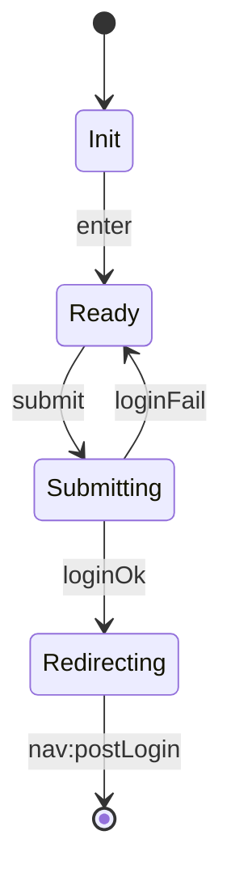
```mermaid
stateDiagram-v2
    [*] --> Init
    %% verify: 進入 /login 時顯示登入表單（Email/Password）與送出按鈕；表單驗證可提示格式/必填。

    Init --> Ready : enter
    %% verify: Ready 狀態下可輸入；若已登入則不應停留於登入頁（導向 postLogin）。

    Ready --> Submitting : submit
    %% verify: submit 後按鈕 disabled 並顯示 loading；避免重複送出。

    Submitting --> Ready : loginFail
    %% verify: loginFail 時 API 回 401；顯示明確錯誤訊息；不建立 session。

    Submitting --> Redirecting : loginOk
    %% verify: loginOk 時 API 回 200；建立 session；Header 立刻切換成對應角色的導覽。

    Redirecting --> [*] : nav:postLogin
    %% verify: 依角色導向：student/instructor/admin 的 postLogin 目的地符合導覽可見性規則。
```

##### Register Page（/register）

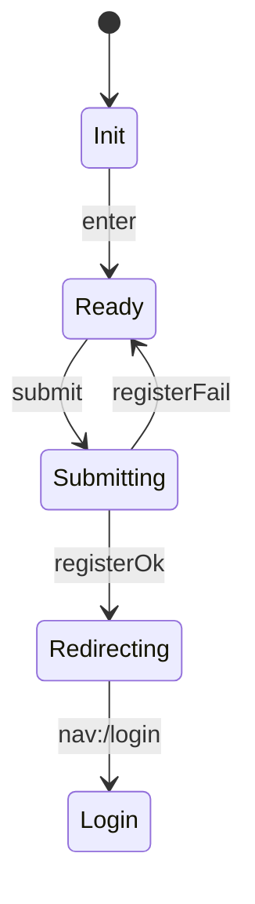
```mermaid
stateDiagram-v2
    [*] --> Init
    %% verify: 進入 /register 時顯示註冊表單（Email/Password）；Email 唯一性與密碼長度在前後端都驗證。

    Init --> Ready : enter
    %% verify: Ready 狀態可輸入；若已登入不應停留於註冊頁（導向 postLogin）。

    Ready --> Submitting : submit
    %% verify: submit 後顯示 loading；按鈕 disabled；避免重複送出。

    Submitting --> Ready : registerFail
    %% verify: registerFail 時 API 回 400；顯示欄位級錯誤（例如 Email 已存在/格式錯誤/密碼過短）。

    Submitting --> Redirecting : registerOk
    %% verify: registerOk 時 API 回 201；成功後導向登入頁；不自動建立管理員角色。

    Redirecting --> Login : nav:/login
    %% verify: 導向 /login 後可用新帳號登入；導覽維持 Guest 規則。
```

##### Courses List Page（/courses）

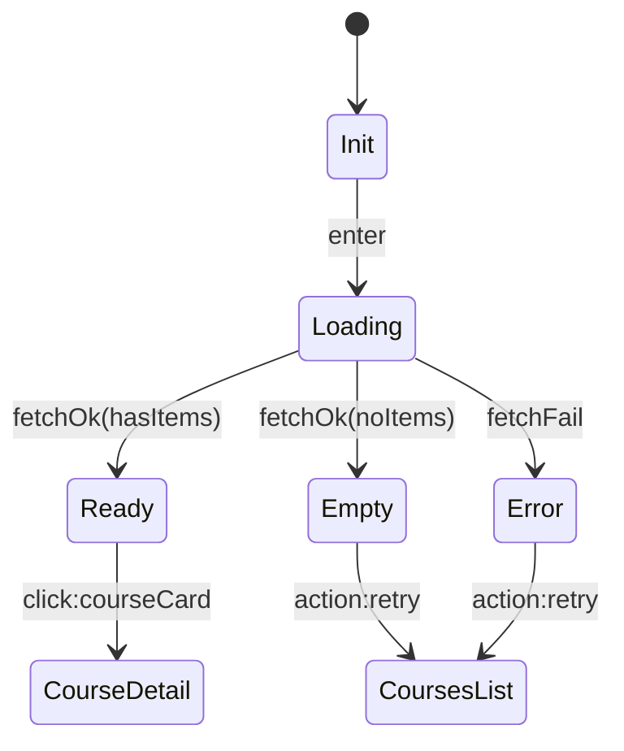
```mermaid
stateDiagram-v2
    [*] --> Init
    %% verify: 任何角色（含 Guest）都可進入 /courses；頁面可見 published 課程，不包含非 published（除非為作者/管理員的特定管理入口）。

    Init --> Loading : enter
    %% verify: 顯示 loading；若請求失敗不得顯示過期資料。

    Loading --> Ready : fetchOk(hasItems)
    %% verify: 回傳 200 且有資料；顯示課程卡（封面/標題/價格/分類），點擊可進入詳情。

    Loading --> Empty : fetchOk(noItems)
    %% verify: 回傳 200 且無資料；顯示 Empty 文案與引導（例如稍後再試/回首頁）。

    Loading --> Error : fetchFail
    %% verify: 回傳 5xx 或網路錯誤；顯示錯誤訊息與重試；不當作 Empty。

    Ready --> CourseDetail : click:courseCard
    %% verify: 導向 /courses/:courseId；courseId 正確；詳情頁會再取資料，不僅靠列表快取。

    Empty --> CoursesList : action:retry
    %% verify: retry 會重新發送請求並回到 Loading；不會卡住。

    Error --> CoursesList : action:retry
    %% verify: retry 會重新發送請求；成功後進入 Ready/Empty。
```

##### Course Detail Page（/courses/:courseId）

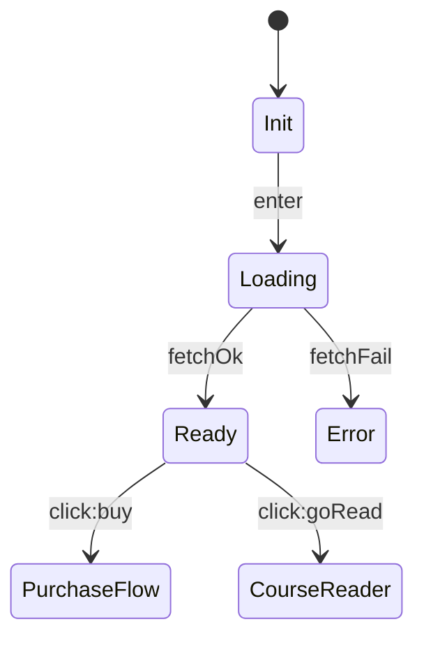
```mermaid
stateDiagram-v2
    [*] --> Init
    %% verify: 進入課程詳情會取課程行銷資訊；未購買者只能看大綱標題不可看內容；非 published 且非作者/管理員回 404。

    Init --> Loading : enter
    %% verify: Loading 時主內容顯示骨架；購買按鈕不可點或顯示 loading。

    Loading --> Ready : fetchOk
    %% verify: 200 回應包含 title/description/price/category/tags/cover/status；大綱顯示章節與單元標題與順序。

    Loading --> Error : fetchFail
    %% verify: 5xx 或網路錯誤顯示 Error 與重試；不洩漏敏感內容。

    Ready --> PurchaseFlow : click:buy
    %% verify: 未登入點 buy 會導向 /login；已登入但非 published 或已購買會被阻擋並提示原因。

    Ready --> CourseReader : click:goRead
    %% verify: 僅在已購買/作者/管理員時顯示 goRead；點擊後進入 /my-courses/:courseId，並通過後端存取檢查。
```

##### My Courses Page（/my-courses）

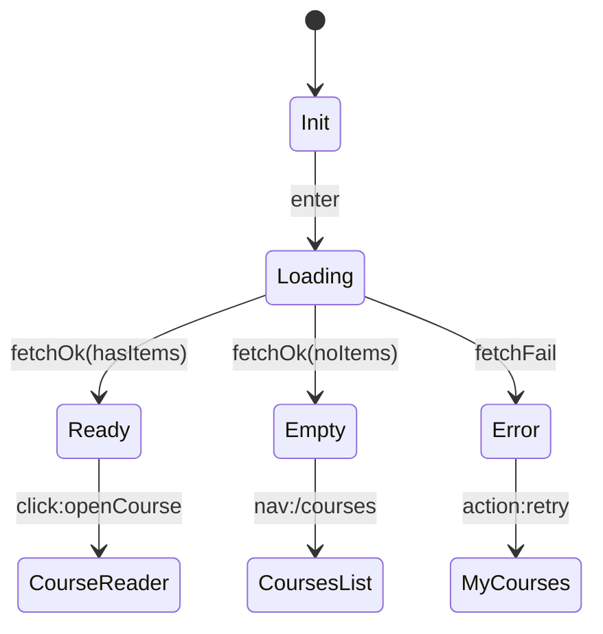
```mermaid
stateDiagram-v2
    [*] --> Init
    %% verify: 進入 /my-courses 需要登入；Guest 會被導向登入或顯示 401 對應 UI（策略一致）。

    Init --> Loading : enter
    %% verify: Loading 顯示骨架；列表區不顯示舊資料。

    Loading --> Ready : fetchOk(hasItems)
    %% verify: API 僅回傳該使用者 Purchase 的課程；每筆顯示進度（完成單元數/總單元數）。

    Loading --> Empty : fetchOk(noItems)
    %% verify: 無購買課程時顯示 Empty 文案並提供前往 /courses 的入口。

    Loading --> Error : fetchFail
    %% verify: 失敗時顯示 Error 與重試；不顯示空清單當作成功。

    Ready --> CourseReader : click:openCourse
    %% verify: 導向 /my-courses/:courseId；後端會驗證該課程可被存取（購買者/作者/管理員）。

    Empty --> CoursesList : nav:/courses
    %% verify: 點擊引導前往課程列表導向 /courses。

    Error --> MyCourses : action:retry
    %% verify: retry 重新發送請求；成功後進入 Ready/Empty。
```

##### Course Reader Page（/my-courses/:courseId）

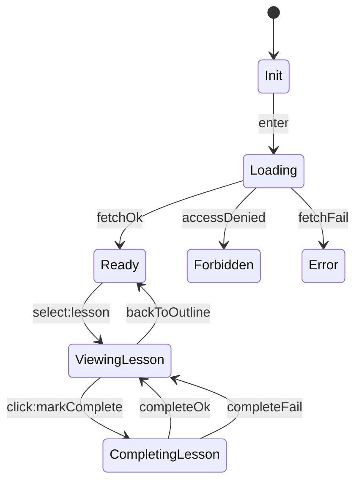
```mermaid
stateDiagram-v2
    [*] --> Init
    %% verify: 進入閱讀頁會取章節/單元清單與內容；未購買且非作者且非管理員必須拒絕。

    Init --> Loading : enter
    %% verify: Loading 顯示骨架；單元內容區不顯示任何實際內容。

    Loading --> Ready : fetchOk
    %% verify: 200 回應包含章節/單元結構、單元內容（text/image/pdf）與完成單元數；PDF 下載連結需受保護。

    Loading --> Forbidden : accessDenied
    %% verify: accessDenied 回 403；UI 顯示 403 或權限不足提示；不顯示課程內容。

    Loading --> Error : fetchFail
    %% verify: 5xx 或網路錯誤顯示 Error 與重試；不當作 Forbidden。

    Ready --> ViewingLesson : select:lesson
    %% verify: 選擇單元後顯示對應內容；文字以安全方式渲染；圖片與 PDF 正確載入（或顯示錯誤狀態）。

    ViewingLesson --> Ready : backToOutline
    %% verify: 返回大綱後仍保留目前進度顯示；不丟失已完成標記。

    ViewingLesson --> CompletingLesson : click:markComplete
    %% verify: 點擊完成會送出完成標記請求；按鈕在請求期間 disabled；避免重複送出。

    CompletingLesson --> ViewingLesson : completeOk
    %% verify: API 回 200；LessonProgress.is_completed=true；我的課程進度（完成單元數）同步更新。

    CompletingLesson --> ViewingLesson : completeFail
    %% verify: API 回 400/403/5xx 時顯示錯誤訊息；完成狀態不應被錯誤地更新為已完成。
```

##### Instructor / Admin 管理頁（/instructor/*）

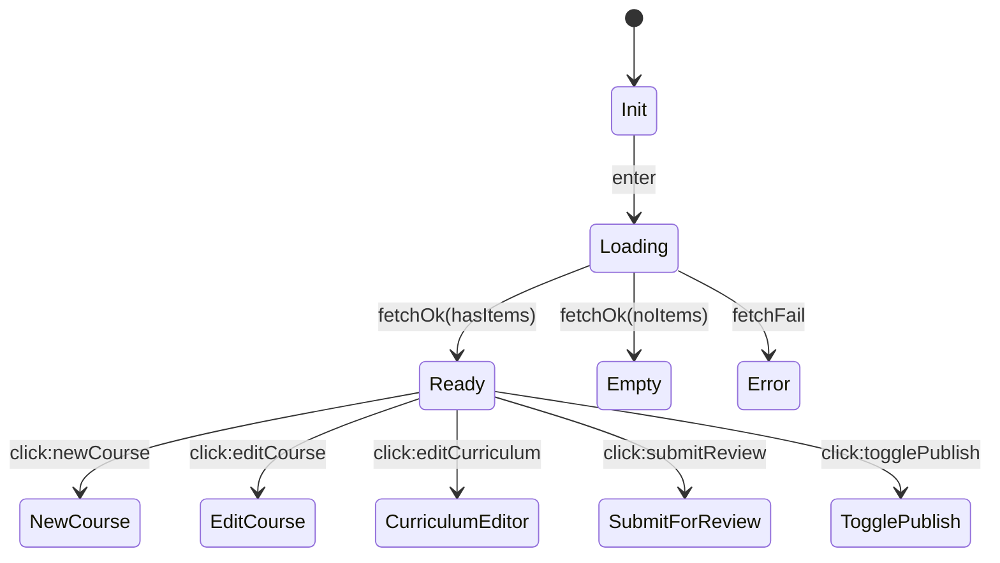
```mermaid
stateDiagram-v2
    [*] --> Init
    %% verify: 僅 instructor 或 admin 可進入；student/guest 顯示 403（且後端 API 回 403）。

    Init --> Loading : enter
    %% verify: Loading 顯示骨架；列表資料取自「本人課程」。

    Loading --> Ready : fetchOk(hasItems)
    %% verify: 顯示本人課程清單與狀態（draft/submitted/published/rejected/archived）；每筆的可用操作需依狀態顯示。

    Loading --> Empty : fetchOk(noItems)
    %% verify: 無課程時顯示 Empty 與建立課程入口。

    Loading --> Error : fetchFail
    %% verify: 失敗時顯示 Error 與重試。

    Ready --> NewCourse : click:newCourse
    %% verify: 導向 /instructor/courses/new；建立課程入口位於頁面內主要 CTA 區。

    Ready --> EditCourse : click:editCourse
    %% verify: 只能編輯自己的課程；若嘗試編輯他人課程則回 404（避免暴露）。

    Ready --> CurriculumEditor : click:editCurriculum
    %% verify: 只能管理自己的課程課綱；不符合權限回 404。

    Ready --> SubmitForReview : click:submitReview
    %% verify: 只有 draft/rejected 可提交審核；提交後狀態變為 submitted；submitted/published/archived 不顯示提交入口。

    Ready --> TogglePublish : click:togglePublish
    %% verify: 只有 published/archived 可上下架切換；切換成功後列表狀態更新且一致。
```

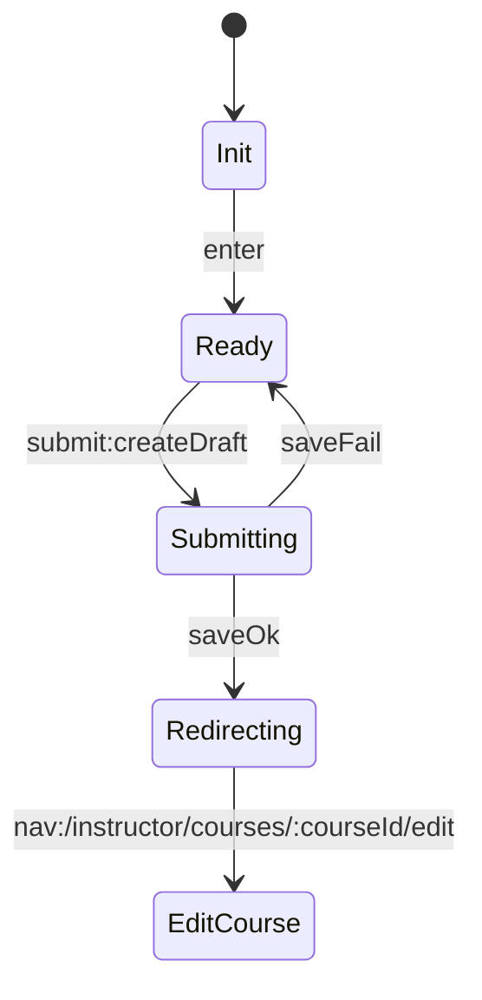
```mermaid
stateDiagram-v2
    [*] --> Init
    %% verify: 僅 instructor/admin 可進入；表單至少包含 title/description/category/price/cover/tags（可分步填寫）。

    Init --> Ready : enter
    %% verify: Ready 狀態可輸入；表單有必填與格式/範圍驗證（例如 price >= 0）。

    Ready --> Submitting : submit:createDraft
    %% verify: 提交時顯示 loading；按鈕 disabled；後端建立 Course 並回傳 id，初始狀態為 draft。

    Submitting --> Ready : saveFail
    %% verify: saveFail 時回 400/5xx；顯示錯誤訊息；不產生半成品課程或狀態錯誤。

    Submitting --> Redirecting : saveOk
    %% verify: saveOk 時回 201；回傳 courseId；導向編輯頁。

    Redirecting --> EditCourse : nav:/instructor/courses/:courseId/edit
    %% verify: nav 路徑包含正確 courseId；編輯頁能載入剛建立的 draft。
```

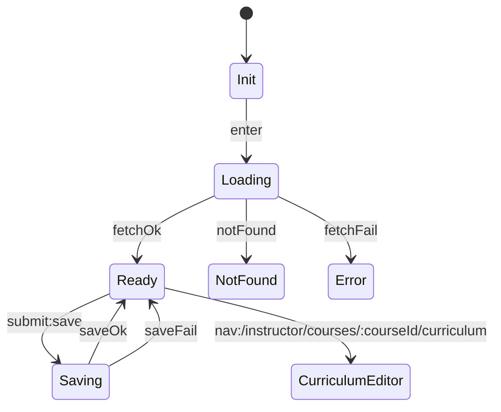
```mermaid
stateDiagram-v2
    [*] --> Init
    %% verify: 僅作者/管理員可進入；他人不可進入並回 404；頁面會載入課程基本資訊。

    Init --> Loading : enter
    %% verify: Loading 顯示骨架；若取不到資料不顯示空表單。

    Loading --> Ready : fetchOk
    %% verify: fetchOk 回 200；表單帶入 title/description/category/tags/price/cover/status；依 status 控制可編輯性（submitted 可檢視但不可變更關鍵欄位或需明確規則）。

    Loading --> NotFound : notFound
    %% verify: notFound 時顯示 404 頁；不揭露他人課程存在。

    Loading --> Error : fetchFail
    %% verify: 5xx 或網路錯誤顯示 Error 與重試。

    Ready --> Saving : submit:save
    %% verify: submit 時顯示 loading；按鈕 disabled；後端驗證欄位（例如 price>=0、category 存在且啟用）。

    Saving --> Ready : saveOk
    %% verify: saveOk 回 200；資料更新成功；狀態未被意外變更；列表/詳情顯示一致。

    Saving --> Ready : saveFail
    %% verify: saveFail 回 400/403/5xx；顯示可理解錯誤；資料不應被部分更新。

    Ready --> CurriculumEditor : nav:/instructor/courses/:courseId/curriculum
    %% verify: 導向課綱頁；仍需權限驗證；不符合權限回 404。
```

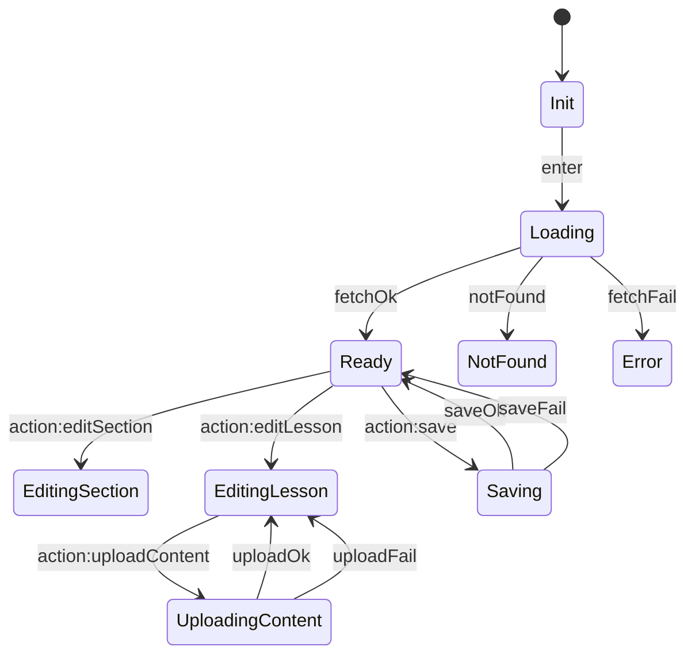
```mermaid
stateDiagram-v2
    [*] --> Init
    %% verify: 僅作者/管理員可進入；頁面載入章節/單元清單與順序；可管理文字/圖片/PDF。

    Init --> Loading : enter
    %% verify: Loading 顯示骨架；列表不閃爍舊資料。

    Loading --> Ready : fetchOk
    %% verify: fetchOk 回 200；顯示章節/單元（含 order）；可新增/編輯/刪除/排序。

    Loading --> NotFound : notFound
    %% verify: notFound 顯示 404；避免暴露他人課程。

    Loading --> Error : fetchFail
    %% verify: 5xx 或網路錯誤顯示 Error 與重試。

    Ready --> EditingSection : action:editSection
    %% verify: editSection 只能修改標題與順序；變更後 UI 反映且尚未保存時有未保存提示（若實作）。

    Ready --> EditingLesson : action:editLesson
    %% verify: editLesson 可修改標題、內容型態與內容；內容型態為 text/image/pdf 三選一。

    EditingLesson --> UploadingContent : action:uploadContent
    %% verify: 上傳圖片/PDF 時顯示 loading；成功後拿到可存取的檔案 URL；未授權者不可上傳。

    UploadingContent --> EditingLesson : uploadOk
    %% verify: uploadOk 回 200；回傳 file_url/image_url 與 file_name；UI 顯示預覽或檔名；不洩漏公開未保護連結（若需受保護則以受保護端點提供）。

    UploadingContent --> EditingLesson : uploadFail
    %% verify: uploadFail 回 400/413/5xx；顯示錯誤訊息；不應產生孤兒檔案記錄（若有）。

    Ready --> Saving : action:save
    %% verify: save 時寫入章節/單元與 order；後端驗證 order 不重複且連續性策略一致；保存後重新載入仍一致。

    Saving --> Ready : saveOk
    %% verify: saveOk 回 200；資料更新成功；再次進入閱讀頁可看到最新大綱/內容（若課程已上架）。

    Saving --> Ready : saveFail
    %% verify: saveFail 回 400/403/5xx；顯示錯誤；資料不應部分保存造成順序錯亂。
```

##### Admin Panel（/admin/*）

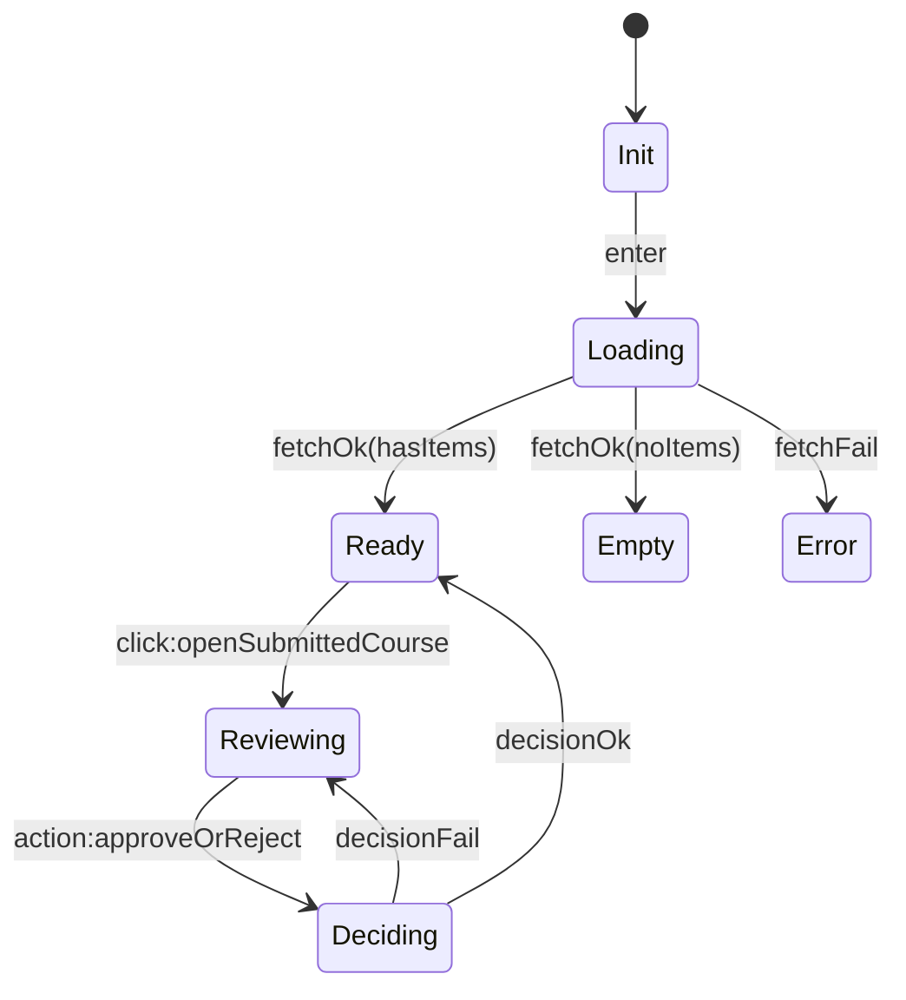
```mermaid
stateDiagram-v2
    [*] --> Init
    %% verify: 僅 admin 可進入；頁面會顯示 submitted 課程清單；無資料顯示 Empty。

    Init --> Loading : enter
    %% verify: Loading 顯示骨架；不得先顯示上一批資料。

    Loading --> Ready : fetchOk(hasItems)
    %% verify: fetchOk 回 200；列表只包含 status=submitted；每筆可進行核准/駁回。

    Loading --> Empty : fetchOk(noItems)
    %% verify: 無待審時顯示 Empty 文案（例如「目前沒有待審課程」）。

    Loading --> Error : fetchFail
    %% verify: 5xx 或網路錯誤顯示 Error 與重試。

    Ready --> Reviewing : click:openSubmittedCourse
    %% verify: 開啟後可看到課程內容摘要與課綱大綱；可執行核准/駁回；不應改變課程資料本身（除審核狀態）。

    Reviewing --> Deciding : action:approveOrReject
    %% verify: approve 會將狀態改為 published；reject 需填 reason 並將狀態改為 rejected；兩者皆寫入 CourseReview。

    Deciding --> Ready : decisionOk
    %% verify: decisionOk 回 200；Course 狀態更新；待審清單即時移除該課程；CourseReview 記錄包含 admin_id/decision/reason/created_at。

    Deciding --> Reviewing : decisionFail
    %% verify: decisionFail 回 400/5xx；顯示錯誤；Course 狀態不應被部分更新；不得產生不完整 CourseReview。
```

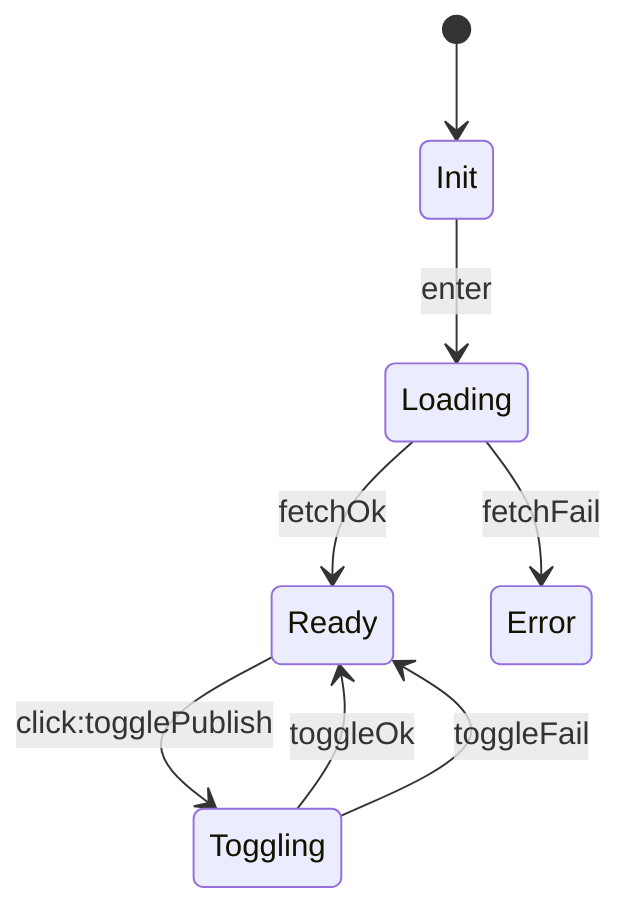
```mermaid
stateDiagram-v2
    [*] --> Init
    %% verify: 僅 admin 可進入；可檢視課程清單並上下架 published/archived。

    Init --> Loading : enter
    %% verify: Loading 顯示骨架；清單不應閃現舊資料。

    Loading --> Ready : fetchOk
    %% verify: fetchOk 回 200；顯示課程狀態；可針對 published/archived 執行切換。

    Loading --> Error : fetchFail
    %% verify: 5xx 或網路錯誤顯示 Error 與重試。

    Ready --> Toggling : click:togglePublish
    %% verify: 只有 published/archived 可切換；draft/submitted/rejected 不提供切換入口。

    Toggling --> Ready : toggleOk
    %% verify: toggleOk 回 200；狀態與 archived_at/published_at（若有）更新一致；課程列表與詳情一致。

    Toggling --> Ready : toggleFail
    %% verify: toggleFail 回 400/5xx；顯示錯誤；狀態不變；不出現 UI 與後端不一致。
```

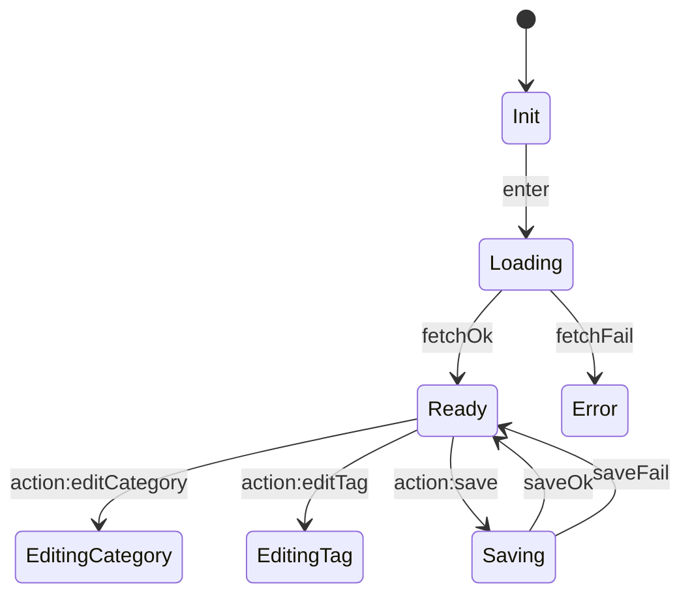
```mermaid
stateDiagram-v2
    [*] --> Init
    %% verify: 僅 admin 可進入；可管理分類與標籤（新增/編輯/停用）。

    Init --> Loading : enter
    %% verify: Loading 顯示骨架。

    Loading --> Ready : fetchOk
    %% verify: fetchOk 回 200；顯示分類與標籤清單；包含 is_active 狀態。

    Loading --> Error : fetchFail
    %% verify: 5xx 或網路錯誤顯示 Error 與重試。

    Ready --> EditingCategory : action:editCategory
    %% verify: 可新增/編輯分類 name；name 唯一；停用後不可再被新課程選用。

    Ready --> EditingTag : action:editTag
    %% verify: 可新增/編輯標籤 name；name 唯一；停用後不可再被新課程選用。

    Ready --> Saving : action:save
    %% verify: save 送出後按鈕 disabled；後端做唯一性與資料有效性驗證。

    Saving --> Ready : saveOk
    %% verify: saveOk 回 200；列表立即反映更新；新建項目可在課程編輯頁選取（若課程頁提供選取）。

    Saving --> Ready : saveFail
    %% verify: saveFail 回 400/5xx；顯示欄位級錯誤（例如名稱重複）；資料不應部分保存。
```

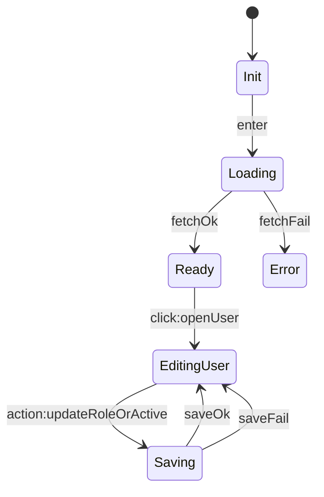
```mermaid
stateDiagram-v2
    [*] --> Init
    %% verify: 僅 admin 可進入；可檢視使用者（email/role/is_active）並更新角色/啟用狀態。

    Init --> Loading : enter
    %% verify: Loading 顯示骨架；避免顯示舊資料。

    Loading --> Ready : fetchOk
    %% verify: fetchOk 回 200；列表顯示 email/role/is_active；可開啟使用者詳情/編輯。

    Loading --> Error : fetchFail
    %% verify: 5xx 或網路錯誤顯示 Error 與重試。

    Ready --> EditingUser : click:openUser
    %% verify: 開啟使用者可修改 role（student/instructor/admin）與 is_active；UI 顯示目前值。

    EditingUser --> Saving : action:updateRoleOrActive
    %% verify: save 送出後按鈕 disabled；後端驗證 role enum 合法。

    Saving --> EditingUser : saveOk
    %% verify: saveOk 回 200；列表立即反映更新；被停用的使用者無法登入（登入回 403 或等價拒絕策略）。

    Saving --> EditingUser : saveFail
    %% verify: saveFail 回 400/5xx；顯示錯誤；資料不應部分更新。
```

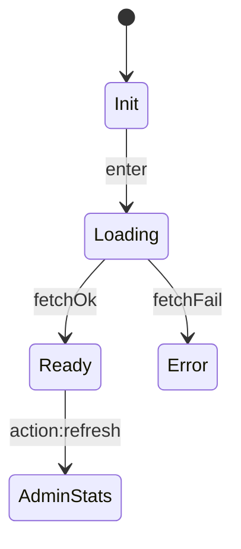
```mermaid
stateDiagram-v2
    [*] --> Init
    %% verify: 僅 admin 可進入；統計至少包含：課程數量（依狀態）、購買數量、使用者數量。

    Init --> Loading : enter
    %% verify: Loading 顯示骨架。

    Loading --> Ready : fetchOk
    %% verify: fetchOk 回 200；數值為可追溯的聚合結果（例如各狀態課程數相加等於總課程數）。

    Loading --> Error : fetchFail
    %% verify: 5xx 或網路錯誤顯示 Error 與重試。

    Ready --> AdminStats : action:refresh
    %% verify: refresh 重新取數；更新完成後 UI 數值改變一致；不重複顯示 loading 卡死。
```

#### 4) Role-specific Page State

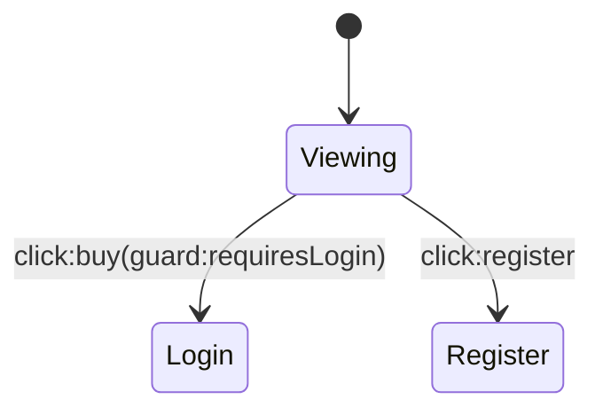
```mermaid
stateDiagram-v2
    [*] --> Viewing
    %% verify: Guest 在課程詳情只能看到行銷資訊與大綱標題；不可看到單元內容與 PDF 下載。

    Viewing --> Login : click:buy(guard:requiresLogin)
    %% verify: 點擊 buy 導向 /login；未建立 Purchase；回到詳情仍顯示未購買狀態。

    Viewing --> Register : click:register
    %% verify: 點擊註冊導向 /register；註冊成功後回到 /login。
```

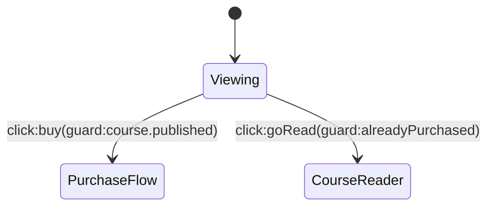
```mermaid
stateDiagram-v2
    [*] --> Viewing
    %% verify: Student 在課程詳情可看到 buy 或 goRead（依是否已購買）；內容區仍遵守未購買鎖定規則。

    Viewing --> PurchaseFlow : click:buy(guard:course.published)
    %% verify: 僅 published 可購買；若非 published 則不顯示 buy 或點擊後被阻擋並提示。

    Viewing --> CourseReader : click:goRead(guard:alreadyPurchased)
    %% verify: 已購買時顯示 goRead；導向 /my-courses/:courseId 且可讀取內容（200）。
```

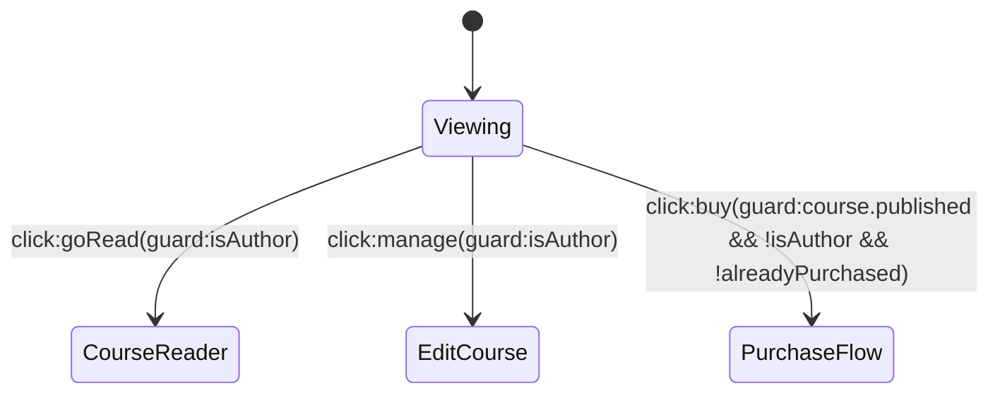
```mermaid
stateDiagram-v2
    [*] --> Viewing
    %% verify: Instructor 若為作者則看到 manage 與 goRead；若非作者則行為同 Student。

    Viewing --> CourseReader : click:goRead(guard:isAuthor)
    %% verify: 作者可不經購買直接閱讀內容（200）；內容 API 的權限判斷包含 isAuthor。

    Viewing --> EditCourse : click:manage(guard:isAuthor)
    %% verify: manage 導向 /instructor/courses/:courseId/edit；非作者不可看到該入口。

    Viewing --> PurchaseFlow : click:buy(guard:course.published && !isAuthor && !alreadyPurchased)
    %% verify: 非作者且未購買時可購買；購買成功後才顯示 goRead。
```

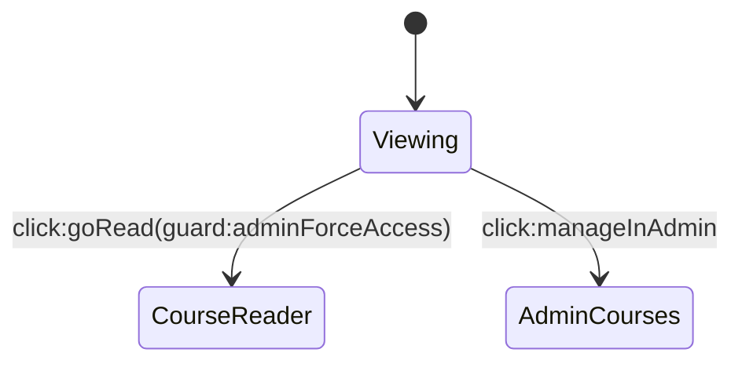
```mermaid
stateDiagram-v2
    [*] --> Viewing
    %% verify: Admin 可強制存取課程內容；詳情頁提供 goRead 與管理入口（至 /admin/courses）。

    Viewing --> CourseReader : click:goRead(guard:adminForceAccess)
    %% verify: 不需 Purchase；仍可取得內容（200）；不會因未購買回 403。

    Viewing --> AdminCourses : click:manageInAdmin
    %% verify: 導向 /admin/courses；可上下架；draft/submitted/rejected 不提供上下架動作。
```

```mermaid
stateDiagram-v2
    [*] --> CheckingAccess
    %% verify: 進入閱讀頁會先檢查 Purchase 是否存在；不存在則拒絕。

    CheckingAccess --> Forbidden : guard:notPurchased
    %% verify: notPurchased 時回 403；UI 不顯示任何單元內容或附件。

    CheckingAccess --> Ready : guard:purchased
    %% verify: purchased 時回 200；回傳章節/單元清單、內容與完成狀態。

    Ready --> ViewingLesson : select:lesson
    %% verify: 選擇單元後顯示內容；內容型態與欄位一致（text/image/pdf）。

    ViewingLesson --> CompletingLesson : click:markComplete
    %% verify: 發送完成請求；按鈕 disabled；避免重複送出。

    CompletingLesson --> ViewingLesson : completeOk
    %% verify: completeOk 回 200；LessonProgress.is_completed=true；我的課程進度同步更新。

    CompletingLesson --> ViewingLesson : completeFail
    %% verify: completeFail 回 400/403/5xx；顯示錯誤；完成狀態不變。
```

```mermaid
stateDiagram-v2
    [*] --> CheckingAccess
    %% verify: Instructor 進入閱讀頁時若是作者可直接通過；非作者需 Purchase。

    CheckingAccess --> Forbidden : guard:notAuthorAndNotPurchased
    %% verify: 非作者且未購買回 403；UI 不顯示內容。

    CheckingAccess --> Ready : guard:isAuthorOrPurchased
    %% verify: isAuthor 或 purchased 回 200；內容可讀取。

    Ready --> ViewingLesson : select:lesson
    %% verify: 選擇單元顯示內容；若單元內容缺失需顯示 Error 或空狀態而非崩潰。
```

```mermaid
stateDiagram-v2
    [*] --> Ready
    %% verify: Admin 進入閱讀頁不需 Purchase；後端檢查 role=admin 後直接允許（200）。

    Ready --> ViewingLesson : select:lesson
    %% verify: 可查看任意課程內容；PDF 下載也可用；仍需對應檔案存在性與錯誤處理。
```

#### 5) Feature / Function State Machines

```mermaid
stateDiagram-v2
    [*] --> ResolveContext
    %% verify: 每次載入/刷新時會重新判斷 session 與 role，確保導覽顯示正確。

    ResolveContext --> GuestNav : noSession
    %% verify: GuestNav 僅顯示 /courses、/login、/register；不可顯示 /my-courses、/instructor/*、/admin/*。

    ResolveContext --> StudentNav : session(role=student)
    %% verify: StudentNav 顯示 /courses、/my-courses、登出；不顯示教師/管理員入口。

    ResolveContext --> InstructorNav : session(role=instructor)
    %% verify: InstructorNav 顯示 /instructor/courses；不顯示 /admin/*。

    ResolveContext --> AdminNav : session(role=admin)
    %% verify: AdminNav 顯示所有 /admin/*；導覽項目不重複顯示同一動作入口。

    GuestNav --> GuestNav : render(links=/courses,/login,/register)
    %% verify: Header 渲染後頁面內不重複顯示相同的登入/註冊 CTA（避免兩顆按鈕）。

    StudentNav --> StudentNav : render(links=/courses,/my-courses,/logout)
    %% verify: /logout 為唯一登出入口；頁面內若有登出不再重複顯示。

    InstructorNav --> InstructorNav : render(links=/courses,/my-courses,/instructor/courses,/logout)
    %% verify: Teacher 入口只在 role=instructor（或 admin）出現；student 不可見。

    AdminNav --> AdminNav : render(links=/courses,/my-courses,/admin/review,/admin/courses,/admin/taxonomy,/admin/users,/admin/stats,/logout)
    %% verify: admin 導覽不出現在非 admin；直接輸入 /admin/* 也會被 route guard 拒絕。
```

```mermaid
stateDiagram-v2
    [*] --> Idle
    %% verify: 只有在課程詳情且 course.status=published 時可啟動購買流程。

    Idle --> CheckingEligibility : click:buy
    %% verify: click:buy 觸發 eligibility 檢查；未登入需先導向登入（或提示需登入）。

    CheckingEligibility --> Blocked : guard:alreadyPurchased
    %% verify: 已購買者不可重複購買；回 400（或等價）；UI 顯示「已購買」。

    CheckingEligibility --> Blocked : guard:courseNotPublished
    %% verify: 非 published 不可購買；UI 不顯示購買入口或顯示阻擋訊息；不建立 Purchase。

    CheckingEligibility --> Confirming : ok
    %% verify: 符合條件時顯示確認購買畫面；顯示課程標題與價格。

    Confirming --> Purchasing : click:confirmPurchase
    %% verify: 確認後送出購買請求；按鈕 disabled；避免重複送出。

    Purchasing --> Success : purchaseOk
    %% verify: purchaseOk 回 201；Purchase(user_id, course_id) 建立；再次進入詳情顯示已購買。

    Purchasing --> Failure : purchaseFail
    %% verify: purchaseFail 回 400/5xx；顯示錯誤；不得建立半成品 Purchase。

    Success --> CourseReader : nav:/my-courses/:courseId
    %% verify: 導向閱讀頁後可存取內容（200）；/my-courses 清單包含新購買課程。

    Blocked --> Idle : close
    %% verify: close 後回到詳情畫面；狀態維持一致。

    Failure --> Confirming : action:retry
    %% verify: retry 會重新送出購買請求；成功後進入 Success。
```

```mermaid
stateDiagram-v2
    [*] --> draft
    %% verify: 新建課程初始狀態為 draft；只有作者/管理員可看到。

    draft --> submitted : instructorSubmit
    %% verify: instructorSubmit 只有作者可觸發；回 200；狀態變更為 submitted；出現在 /admin/review。

    submitted --> published : adminApprove
    %% verify: adminApprove 只有 admin 可觸發；回 200；狀態變更為 published；published_at 設定；課程出現在 /courses。

    submitted --> rejected : adminReject
    %% verify: adminReject 只有 admin 可觸發且 reasonRequired；回 200；狀態變更為 rejected；rejected_reason 被寫入；CourseReview 記錄 decision=rejected。

    rejected --> draft : instructorEditAfterReject
    %% verify: 只有作者可觸發；回 200；狀態回到 draft；可再次提交審核。

    published --> archived : instructorOrAdminArchive
    %% verify: 作者或 admin 可觸發；回 200；狀態變更為 archived；課程不再出現在 /courses；購買者仍可閱讀已購買內容。

    archived --> published : instructorOrAdminRepublish
    %% verify: 作者或 admin 可觸發；回 200；狀態回到 published；重新出現在 /courses。
```

```mermaid
stateDiagram-v2
    [*] --> Idle
    %% verify: 只有作者/管理員可進入課綱管理；他人回 404；資料包含 Section/Lesson 與 order。

    Idle --> Editing : openCurriculumEditor
    %% verify: openCurriculumEditor 後載入完成進入 Editing；Loading/Error/Empty 狀態正確。

    Editing --> Editing : addSection
    %% verify: addSection 後 UI 立即顯示新章節；保存前有清楚提示；保存後資料持久化。

    Editing --> Editing : addLesson
    %% verify: addLesson 後 UI 顯示新單元；可設定 content_type；保存後可在閱讀頁看到（若可讀）。

    Editing --> Editing : reorder
    %% verify: reorder 後 order 更新一致；重新整理頁面順序不回退；後端驗證 order 合法。

    Editing --> Editing : editTitle
    %% verify: editTitle 有表單驗證（不可空白）；保存失敗顯示錯誤。

    Editing --> Uploading : upload(imageOrPdf)
    %% verify: 上傳僅允許 image/pdf 類型；超過大小限制時回 400/413；顯示錯誤。

    Uploading --> Editing : uploadOk
    %% verify: uploadOk 回 200；回傳 file_url/image_url 與 file_name；在單元內容預覽區可看到。

    Uploading --> Editing : uploadFail
    %% verify: uploadFail 回 400/5xx；顯示錯誤；不應將 content_file_url/content_image_url 設為不完整值。

    Editing --> Saving : click:save
    %% verify: 保存時包含所有新增/修改/刪除與 order；後端回 200；再次載入一致。

    Saving --> Editing : saveOk
    %% verify: saveOk 後 UI 顯示保存成功提示；不殘留未保存狀態。

    Saving --> Editing : saveFail
    %% verify: saveFail 顯示錯誤與重試；資料不應部分保存造成課綱結構破損。
```

```mermaid
stateDiagram-v2
    [*] --> ViewingSubmitted
    %% verify: 僅 admin 可進入此功能；只能針對 submitted 課程操作；非 submitted 不顯示核准/駁回。

    ViewingSubmitted --> Approving : click:approve
    %% verify: click:approve 後送出核准請求；按鈕 disabled；避免重複核准。

    ViewingSubmitted --> Rejecting : click:reject
    %% verify: click:reject 需先輸入 reason；reasonRequired；未填不得送出。

    Approving --> Done : approveOk
    %% verify: approveOk 回 200；Course.status=published；CourseReview 記錄 decision=published；課程出現在 /courses。

    Approving --> ViewingSubmitted : approveFail
    %% verify: approveFail 回 400/5xx；顯示錯誤；課程狀態維持 submitted；不產生不一致的審核紀錄。

    Rejecting --> Done : submitReject(reasonRequired)
    %% verify: submitReject 回 200；Course.status=rejected；rejected_reason 寫入；CourseReview 記錄 decision=rejected 且帶 reason。

    Rejecting --> ViewingSubmitted : rejectFail
    %% verify: rejectFail 回 400/5xx；顯示錯誤；不得把課程變更為 rejected 但沒有 reason。
```

```mermaid
stateDiagram-v2
    [*] --> NotCompleted
    %% verify: 初次進入單元時若無 LessonProgress 或 is_completed=false，顯示未完成狀態。

    NotCompleted --> Completing : click:markComplete
    %% verify: click 後送出完成請求；按鈕 disabled；避免重複送出。

    Completing --> Completed : completeOk
    %% verify: completeOk 回 200；LessonProgress.is_completed=true 且 completed_at 設定；My Courses 完成單元數增加。

    Completing --> NotCompleted : completeFail
    %% verify: completeFail 回 400/403/5xx；顯示錯誤；完成狀態不變；不增加進度。
```

```mermaid
stateDiagram-v2
    [*] --> Normal
    %% verify: 正常狀態下頁面可運作；任何失敗會被映射為對應錯誤 UI，而非無限 loading。

    Normal --> Unauthorized401 : authRequired
    %% verify: 受保護頁面被未登入存取時觸發；顯示需登入提示並提供導向 /login。

    Unauthorized401 --> Login : nav:/login
    %% verify: 導向 /login 後，登入成功回到原目標頁（若實作）或導向 postLogin（策略一致）。

    Normal --> Forbidden403 : accessDenied
    %% verify: 權限不足回 403；UI 顯示 403 頁；不顯示受保護資料。

    Forbidden403 --> Normal : nav:back
    %% verify: 可返回上一頁或回到 /courses；不會卡住。

    Normal --> NotFound404 : resourceNotFound
    %% verify: 不存在路由/資源顯示 404；對他人非 published 課程詳情採 404（避免暴露）。

    NotFound404 --> Normal : nav:/courses
    %% verify: 404 頁提供回到 /courses 的入口並可正常導向。

    Normal --> ServerError500 : serverError
    %% verify: 5xx 顯示 500 頁或錯誤提示；重要操作不會造成資料半更新。

    ServerError500 --> Normal : action:retry
    %% verify: retry 可重新嘗試；成功後回到正常流程；失敗仍顯示錯誤而非空白。
```

### Failure Modes & Recovery *(mandatory)*

- **Failure mode**: 連線/逾時導致資料載入失敗（課程列表、詳情、我的課程、後台清單）。
  - **Recovery**: 顯示 Error 與重試；成功後需回到 Ready/Empty，不能卡在 Loading。
- **Failure mode**: 表單驗證失敗（註冊、登入、課程建立/編輯、審核駁回理由、課綱保存）。
  - **Recovery**: 顯示欄位級錯誤並保留輸入；不得產生半成功資料或錯誤狀態轉移。
- **Failure mode**: 重要操作重送（購買、提交審核、審核決策、完成標記）。
  - **Recovery**: 伺服端需阻擋重複結果（例如已購買不可再建購買）；用戶端按鈕 disabled；回傳可理解原因。
- **Failure mode**: 檔案上傳失敗或中斷。
  - **Recovery**: 顯示失敗原因並允許重試；不得留下不完整內容參照；不得讓未授權者取得可存取連結。
- **Failure mode**: 權限判斷錯誤造成資料外洩風險。
  - **Recovery**: 以最小權限為預設，任何不確定情況一律拒絕；並留存審計事件以便追溯。

### Security & Permissions *(mandatory)*

- **Authentication**: 必要。需支援 Email + 密碼登入；session 需可驗證有效性與使用者是否啟用。
- **Authorization**: 必要。RBAC 需在伺服端強制執行；用戶端僅作為 UX 輔助（隱藏入口），不可作為唯一防護。
- **Sensitive data**:
  - 使用者密碼不得以明文儲存或回傳。
  - 課程內容（單元內容、附件下載）屬受保護資料，僅授權者可存取。
  - 對於需隱藏存在性的資源（他人非 published 課程詳情），回應需採 404。

### Observability *(mandatory)*

- **Logging**: 必須紀錄關鍵事件與失敗（登入失敗、購買成功/失敗、課程狀態轉移、審核決策、檔案上傳失敗、權限拒絕）。
- **Tracing**: 每次請求/操作應可被關聯（例如 requestId/traceId 概念），以支援問題追查。
- **User-facing errors**: 錯誤訊息需可理解並提供下一步（重試、導向登入、返回課程列表）。
- **Developer diagnostics**: 建議提供內部錯誤代碼或可追溯的事件 id 以便支援查詢（不向一般使用者揭露敏感細節）。

### Backward Compatibility & Change Risk *(mandatory)*

- **Breaking change?**: No（本功能為新系統規格；若後續與既有系統整合則需另行評估）。
- **Migration plan**: 初期以空資料集啟動；後續若導入既有課程/使用者需另行規劃資料匯入。
- **Rollback plan**: 如上線後發現重大風險，可暫停購買與內容存取入口（保留公開瀏覽）並回復至只讀模式；同時保留審核/購買/狀態轉移日誌以利追溯。

### Performance & Scale Assumptions *(mandatory)*

- **Growth assumption**:
  - 平台可支援至少 10,000 名註冊使用者。
  - 同時在線閱讀與瀏覽可達 500 名使用者。
- **Constraints**:
  - 在一般網路環境下，95% 的「課程列表 / 課程詳情 / 我的課程」頁面在 2 秒內完成可操作呈現。
  - 課程閱讀頁切換單元時，95% 的情況在 1 秒內完成內容顯示或給出明確的 Loading/錯誤狀態。
  - PDF 下載在授權通過後應在 2 秒內開始下載或明確提示失敗原因。

### Key Entities *(include if feature involves data)*

- **User**: 帳號資料（Email、主要角色、啟用狀態、建立/更新時間）。
- **Course**: 課程行銷資訊與生命週期狀態（作者、分類、標籤、價格、封面、狀態、上架/下架時間、駁回理由）。
- **CourseCategory**: 課程分類（名稱唯一、啟用狀態）。
- **Tag**: 課程標籤（名稱唯一、啟用狀態）。
- **Section**: 課程章節（標題、排序）。
- **Lesson**: 課程單元（標題、排序、內容型態與內容/附件資訊）。
- **Purchase**: 使用者購買紀錄（user、course、購買時間）。
- **LessonProgress**: 單元完成狀態（user、lesson、是否完成、完成時間）。
- **CourseReview**: 管理員審核紀錄（course、admin、決策、理由、時間）。

## Success Criteria *(mandatory)*

### Measurable Outcomes

- **SC-001**: 90% 的新使用者可在 2 分鐘內完成註冊並成功登入。
- **SC-002**: 95% 的購買流程可在 1 分鐘內完成（從點擊購買到看到「可進入閱讀」）。
- **SC-003**: 95% 的「課程列表/課程詳情/我的課程」在一般網路環境下 2 秒內可操作呈現。
- **SC-004**: 0 起未授權內容存取事件（以安全稽核/事件紀錄為準）：未購買者不得取得單元內容或 PDF。
- **SC-005**: 100% 的駁回審核紀錄包含理由，且可追溯到決策者與時間。
