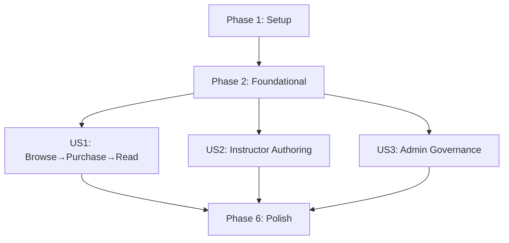

---

description: "Task list for feature implementation"
---

# Tasks: 線上課程平台（非影音串流）

**Input**: Design documents from `/specs/001-content-course-platform/`

- Required: `plan.md`, `spec.md`
- Available: `research.md`, `data-model.md`, `contracts/openapi.yaml`, `quickstart.md`

**Scope Note（依你的要求）**：本 tasks.md 目標是「完成的專案結果」，包含後端邏輯 + UI 介面 + 權限/狀態機一致性 + 重要錯誤/空狀態；不是只做 MVP。

**Tests**: 本 repo 的憲章要求核心業務規則必須有測試，但本次 spec 未明確要求 TDD，因此此 tasks.md 以「可獨立驗收的測試準則（Independent Test）」為主，並在 Polish 階段加入最低限度的自動化測試落地任務。若你要嚴格 TDD，可在後續把各 story 的 API/Domain 測試任務前置。

**Organization**: Tasks are grouped by user story to enable independent implementation and testing of each story.

## Format: `- [ ] [TaskID] [P?] [Story?] Description with file path`

- **[P]**: 可平行（不同檔案、無未完成依賴）
- **[US#]**: User Story 標籤（僅用在 User Story phases）
- 每個 task 描述必須包含明確檔案路徑

---

## Phase 1: Setup（專案初始化）

**Purpose**: 初始化 Next.js + TypeScript 全端專案骨架、工具鏈、資料夾結構

- [X] T001 建立 Next.js App Router + TypeScript 專案骨架並提交必要檔案於 package.json
- [X] T002 [P] 初始化 Next.js 設定於 next.config.ts
- [X] T003 [P] 初始化 TypeScript 設定於 tsconfig.json
- [X] T004 [P] 初始化 Tailwind 設定於 tailwind.config.ts 與 postcss.config.mjs
- [X] T005 [P] 建立全域樣式與 Tailwind import 於 app/globals.css
- [X] T006 [P] 初始化 ESLint + Prettier（含格式化規則）於 .eslintrc.* 與 .prettierrc
- [X] T007 建立專案資料夾結構（domain/use-cases/server/shared/ui）於 src/
- [X] T008 [P] 建立 tests 目錄結構於 tests/unit 與 tests/e2e
- [X] T009 [P] 建立 storage 目錄與 git 追蹤點於 storage/uploads/.gitkeep
- [X] T010 [P] 新增環境變數範本與說明於 .env.example
- [X] T011 更新 npm scripts（dev/build/start/test/lint/format）於 package.json

---

## Phase 2: Foundational（阻塞性基礎建設）

**Purpose**: DB、Session、共用 Guard、錯誤格式、requestId、共用 UI/資料抓取骨架（完成後才能開始任何 User Story）

**⚠️ CRITICAL**: No user story work can begin until this phase is complete

### Database & Prisma

- [X] T012 建立 Prisma schema（含 User/Course/Section/Lesson/Purchase/LessonProgress/CourseReview/Category/Tag）於 prisma/schema.prisma
- [X] T013 [P] 依受保護下載需求新增 FileUpload model（含 isPublic、mimeType、size、path、ownerCourseId/ownerLessonId）於 prisma/schema.prisma
- [X] T014 建立 Prisma Client 初始化與 singleton 於 src/server/db/prisma.ts
- [X] T015 建立首次 migration（init）於 prisma/migrations/
- [X] T016 [P] 建立 seed 腳本（建立 admin/instructor/student 與 sample course）於 prisma/seed.ts
- [X] T017 [P] 串接 seed script 與 prisma generate/migrate scripts 於 package.json

### Error / Observability / Config

- [X] T018 定義一致的 ErrorResponse 與 error codes（AUTH_UNAUTHORIZED、AUTH_FORBIDDEN、NOT_FOUND、VALIDATION_ERROR…）於 src/server/errors/errorResponse.ts
- [X] T019 [P] 建立 HttpError/DomainError 型別與轉換器於 src/server/errors/errors.ts
- [X] T020 建立 requestId 產生/傳遞工具（含回應 header）於 src/server/observability/requestId.ts
- [X] T021 [P] 建立 server logger（console 基礎即可，但必帶 requestId/userId/route/errorCode）於 src/server/observability/logger.ts
- [X] T022 建立環境變數讀取與驗證（Zod）於 src/server/config/env.ts

### Auth / Session / Guards

- [X] T023 [P] 安裝並封裝 argon2id 密碼雜湊/比對於 src/server/auth/password.ts
- [X] T024 建立 cookie session（payload: userId/role/issuedAt/expiresAt）於 src/server/session/session.ts
- [X] T025 [P] 建立 getSession / getCurrentUser（每次查 User.is_active）於 src/server/session/getCurrentUser.ts
- [X] T026 建立 RBAC 型別與 helper（student/instructor/admin）於 src/domain/rbac.ts
- [X] T027 建立 route handler guard：requireAuth / requireRole / optionalAuth 於 src/server/guards/auth.ts
- [X] T028 建立 resource-level access control（course detail 404 隱藏、course content 403）於 src/domain/accessControl.ts

### Course State Machine（Domain）

- [X] T029 建立 CourseStatus enum 與 transition 函式（pre/post 條件）於 src/domain/courseStatus.ts
- [X] T030 [P] 建立 course 狀態欄位更新規則（published_at/archived_at/rejected_reason）於 src/domain/courseStatus.ts

### API Foundations（Route Handlers + Zod schemas）

- [X] T031 建立共用 request/response Zod schemas（auth）於 src/shared/schema/auth.ts
- [X] T032 [P] 建立共用 request/response Zod schemas（courses/purchases/progress）於 src/shared/schema/api.ts
- [X] T033 建立 API handler 共用 wrapper（統一 try/catch、映射 ErrorResponse、注入 requestId）於 src/server/http/routeHandler.ts

### Auth API

- [X] T034 實作註冊 API（POST /api/auth/register）於 app/api/auth/register/route.ts
- [X] T035 實作登入 API（POST /api/auth/login）於 app/api/auth/login/route.ts
- [X] T036 實作登出 API（POST /api/auth/logout）於 app/api/auth/logout/route.ts
- [X] T037 實作 session 驗證 API（GET /api/auth/session）於 app/api/auth/session/route.ts

### File Storage（受保護下載基礎）

- [X] T038 建立檔案儲存服務（save/open/stream、路徑安全）於 src/server/files/storage.ts
- [X] T039 [P] 建立檔案型別/大小驗證（只允許 image/* 與 application/pdf）於 src/server/files/validateUpload.ts
- [X] T040 建立檔案授權判斷（由 fileId 追溯到 course 並套用 accessControl）於 src/server/files/authorizeFileRead.ts

### UI Foundations

- [X] T041 建立 React Query provider 與 hydration（client）於 app/providers.tsx
- [X] T042 [P] 建立共用 api client（fetch + credentials + error mapping）於 src/ui/lib/apiClient.ts
- [X] T043 [P] 建立共用 UI 元件（Button/Input/Select/Modal/Spinner）於 src/ui/components/
- [X] T044 建立全站 Layout + 導覽列（依 role 顯示連結）於 app/layout.tsx 與 src/ui/components/NavBar.tsx
- [X] T045 [P] 建立 error/empty/loading 樣式規約（components）於 src/ui/components/States.tsx
- [X] T046 建立 401/403/404 頁面（符合 spec 導覽）於 app/unauthorized/page.tsx、app/forbidden/page.tsx、app/not-found.tsx

### Auth UI

- [X] T047 建立註冊頁（RHF+Zod）於 app/(auth)/register/page.tsx
- [X] T048 建立登入頁（RHF+Zod）於 app/(auth)/login/page.tsx
- [X] T049 [P] 建立 session boot hook（呼叫 /api/auth/session 並更新 UI 狀態）於 src/ui/hooks/useSession.ts

**Checkpoint**: Foundation ready - user story implementation can now begin

---

## Phase 3: User Story 1 - 學員從瀏覽到購買並閱讀（Priority: P1）

**Goal**: 完成「找課 → 看詳情 → 登入購買 → 讀課 → 進度」閉環，並嚴格遵守 401/403/404 策略

**Independent Test**:

- Guest 可看 /courses 列表與 /courses/:id 詳情（僅行銷資訊 + 課綱標題）
- 未購買者嘗試進入閱讀頁或讀取內容：回 403 + 顯示 403 UI
- 已購買者可讀取文字/圖片/PDF 內容且可標記完成並更新進度

### API（Public browse + purchase + my-courses + progress）

- [X] T050 [P] [US1] 實作分類清單 API（GET /api/taxonomy/categories）於 app/api/taxonomy/categories/route.ts
- [X] T051 [P] [US1] 實作標籤清單 API（GET /api/taxonomy/tags）於 app/api/taxonomy/tags/route.ts
- [X] T052 [US1] 實作課程列表 API（GET /api/courses，僅 published）於 app/api/courses/route.ts
- [X] T053 [US1] 實作課程詳情 API（GET /api/courses/:courseId；非 published 且非作者/admin → 404）於 app/api/courses/[courseId]/route.ts
- [X] T054 [US1] 實作購買 API（POST /api/purchases；已購買→400；非 published→400）於 app/api/purchases/route.ts
- [X] T055 [US1] 實作我的課程 API（GET /api/my-courses；含 progress 聚合）於 app/api/my-courses/route.ts
- [X] T056 [US1] 實作閱讀 payload API（GET /api/my-courses/:courseId；未購買且非作者/admin→403）於 app/api/my-courses/[courseId]/route.ts
- [X] T057 [US1] 實作單元完成標記 API（PUT /api/lessons/:lessonId/progress；冪等）於 app/api/lessons/[lessonId]/progress/route.ts
- [X] T058 [US1] 實作受保護檔案讀取 API（GET /api/files/:fileId；套用相同內容授權）於 app/api/files/[fileId]/route.ts

### UI（Public pages + My Courses + Reader）

- [X] T059 [P] [US1] 建立課程列表頁（filters + loading/error/empty）於 app/(public)/courses/page.tsx
- [X] T060 [US1] 建立課程詳情頁（行銷資訊 + 課綱標題 + viewer flags）於 app/(public)/courses/[courseId]/page.tsx
- [X] T061 [US1] 在課程詳情頁加入「購買」CTA（未登入→導向登入；已購買→disabled 顯示已購買）於 app/(public)/courses/[courseId]/page.tsx
- [X] T062 [US1] 建立我的課程頁（list + progress）於 app/(protected)/my-courses/page.tsx
- [X] T063 [US1] 建立閱讀頁（章節/單元導覽、內容顯示、完成勾選）於 app/(protected)/my-courses/[courseId]/page.tsx
- [X] T064 [P] [US1] 建立 CourseCard/CourseOutline UI 元件於 src/ui/components/course/
- [X] T065 [P] [US1] 建立 Reader 元件（Text/Image/PDF renderer；安全渲染）於 src/ui/components/reader/
- [X] T066 [US1] 建立 403 內容拒絕 UI（spec 要求）於 app/forbidden/page.tsx

**Checkpoint**: User Story 1 fully functional and independently testable

---

## Phase 4: User Story 2 - 教師建立課程、編排課綱、提交審核與維護（Priority: P2）

**Goal**: Instructor 完整供給側：建立草稿、編排課綱與內容（文字/圖片/PDF）、提交審核、上架後可上下架

**Independent Test**:

- Instructor 可建立 draft，僅作者/admin 可見
- 可新增/編輯/排序 Section/Lesson（保存後順序一致）
- draft/rejected 可 submit → submitted；submitted 期間不可自行回 draft
- published ↔ archived 可合法切換

### Contracts（補齊 instructor/課綱/內容相關 OpenAPI）

- [X] T067 [US2] 更新 OpenAPI 補齊課綱與內容管理 endpoints（sections/lessons/reorder/upload）於 specs/001-content-course-platform/contracts/openapi.yaml

### API（Instructor course + curriculum + uploads）

- [X] T068 [US2] 實作講師課程列表 API（GET /api/instructor/courses）於 app/api/instructor/courses/route.ts
- [X] T069 [US2] 實作建立課程草稿 API（POST /api/instructor/courses）於 app/api/instructor/courses/route.ts
- [X] T070 [US2] 實作更新課程基本資訊 API（PATCH /api/instructor/courses/:courseId）於 app/api/instructor/courses/[courseId]/route.ts
- [X] T071 [US2] 實作提交審核 API（POST /api/instructor/courses/:courseId/submit）於 app/api/instructor/courses/[courseId]/submit/route.ts
- [X] T072 [US2] 實作上下架切換 API（POST /api/instructor/courses/:courseId/lifecycle）於 app/api/instructor/courses/[courseId]/lifecycle/route.ts
- [X] T073 [US2] 實作建立/更新/刪除 Section API（/api/instructor/courses/:courseId/sections*）於 app/api/instructor/courses/[courseId]/sections/
- [X] T074 [US2] 實作 Section reorder API（/api/instructor/sections/:sectionId/reorder）於 app/api/instructor/sections/[sectionId]/reorder/route.ts
- [X] T075 [US2] 實作建立/更新/刪除 Lesson API（/api/instructor/sections/:sectionId/lessons*）於 app/api/instructor/sections/[sectionId]/lessons/
- [X] T076 [US2] 實作 Lesson reorder API（/api/instructor/lessons/:lessonId/reorder）於 app/api/instructor/lessons/[lessonId]/reorder/route.ts
- [X] T077 [US2] 實作檔案上傳 API（image/pdf；回 fileId + url）於 app/api/files/upload/route.ts
- [X] T078 [US2] 讓 Lesson content_type 的互斥欄位在 server 端強制（validation + DB 更新）於 src/use-cases/instructor/updateLesson.ts

### UI（Instructor console）

- [X] T079 [P] [US2] 建立講師課程列表頁（draft/submitted/published/rejected/archived tabs）於 app/instructor/courses/page.tsx
- [X] T080 [US2] 建立建立課程頁（RHF+Zod；分類/標籤選取）於 app/instructor/courses/new/page.tsx
- [X] T081 [US2] 建立課程編輯頁（基本資訊 + 提交審核 + 上下架）於 app/instructor/courses/[courseId]/page.tsx
- [X] T082 [US2] 建立課綱編輯 UI（Section/Lesson CRUD + reorder buttons）於 app/instructor/courses/[courseId]/curriculum/page.tsx
- [X] T083 [P] [US2] 建立 SectionEditor 元件於 src/ui/components/instructor/SectionEditor.tsx
- [X] T084 [P] [US2] 建立 LessonEditor 元件（content_type 三選一）於 src/ui/components/instructor/LessonEditor.tsx
- [X] T085 [US2] 建立檔案上傳元件（image/pdf；顯示檔名/大小/錯誤）於 src/ui/components/instructor/FileUploader.tsx
- [X] T086 [US2] 建立提交審核確認對話框（避免重送）於 src/ui/components/instructor/SubmitForReviewDialog.tsx
- [X] T087 [US2] 在 instructor UI 中加入狀態限制提示（submitted 不可編輯關鍵欄位等）於 app/instructor/courses/[courseId]/page.tsx

**Checkpoint**: User Stories 1 AND 2 should both work independently

---

## Phase 5: User Story 3 - 管理員審核、治理（分類/標籤/使用者）與統計（Priority: P3）

**Goal**: Admin 後台：待審清單、審核決策留存、taxonomy 管理、使用者停用/角色調整、平台統計

**Independent Test**:

- Admin 可看待審清單並核准→published/駁回→rejected（reason 必填）
- taxonomy 名稱唯一、可停用；停用後不可被 instructor 新課程使用
- 停用使用者後，該使用者不可登入（既有 session 下一次驗證失效）
- stats 可載入且數字合理

### Contracts（補齊 admin taxonomy/users endpoints）

- [X] T088 [US3] 更新 OpenAPI 補齊 admin taxonomy CRUD 與 users 管理 endpoints 於 specs/001-content-course-platform/contracts/openapi.yaml

### API（Admin review + taxonomy + users + stats）

- [X] T089 [US3] 實作待審清單 API（GET /api/admin/reviews/pending）於 app/api/admin/reviews/pending/route.ts
- [X] T090 [US3] 實作審核決策 API（POST /api/admin/courses/:courseId/review；rejected 必填 reason）於 app/api/admin/courses/[courseId]/review/route.ts
- [X] T091 [US3] 實作分類管理 API（create/update/deactivate）於 app/api/admin/taxonomy/categories/route.ts
- [X] T092 [US3] 實作標籤管理 API（create/update/deactivate）於 app/api/admin/taxonomy/tags/route.ts
- [X] T093 [US3] 實作使用者列表/更新 API（list + patch role/isActive）於 app/api/admin/users/route.ts
- [X] T094 [US3] 實作統計 API（GET /api/admin/stats）於 app/api/admin/stats/route.ts

### UI（Admin console）

- [X] T095 [P] [US3] 建立待審清單頁（submitted list）於 app/admin/review/page.tsx
- [X] T096 [US3] 建立審核決策對話框（approve/reject；reject 必填 reason）於 src/ui/components/admin/ReviewDecisionDialog.tsx
- [X] T097 [US3] 建立分類管理頁（CRUD + deactivate）於 app/admin/taxonomy/categories/page.tsx
- [X] T098 [US3] 建立標籤管理頁（CRUD + deactivate）於 app/admin/taxonomy/tags/page.tsx
- [X] T099 [US3] 建立使用者管理頁（role select + is_active toggle）於 app/admin/users/page.tsx
- [X] T100 [US3] 建立統計頁（cards/table）於 app/admin/stats/page.tsx
- [X] T101 [P] [US3] 建立 taxonomy 管理共用元件（NameForm/List/Table）於 src/ui/components/admin/taxonomy/

**Checkpoint**: All user stories should now be functional

---

## Phase 6: Polish & Cross-Cutting Concerns（全域收斂：完成系統品質）

**Purpose**: 覆蓋多故事的品質、UX、一致性、安全性、可觀測性與基本自動化

- [X] T102 [P] 補齊所有頁面 Loading/Error/Empty 狀態一致呈現於 src/ui/components/States.tsx
- [X] T103 建立全域 toast/notification（成功/失敗）於 src/ui/components/Toast.tsx
- [X] T104 強化所有 mutation 防重送（按鈕 disabled + optimistic UI 策略）於 src/ui/lib/mutations.ts
- [X] T105 強化 401/403/404 的導覽一致性（含 login redirect 回跳）於 src/ui/hooks/useSession.ts
- [X] T106 強化檔案上傳補償機制（DB 失敗刪檔、孤兒檔清理）於 src/server/files/compensation.ts
- [X] T107 強化安全：禁止在任何內容渲染使用 dangerouslySetInnerHTML 於 src/ui/components/reader/
- [X] T108 [P] 增加 Vitest：Course 狀態機合法/非法轉換覆蓋於 tests/unit/courseStatus.test.ts
- [X] T109 [P] 增加 Vitest：access control 403/404 策略覆蓋於 tests/unit/accessControl.test.ts
- [X] T110 增加 Playwright：P1 end-to-end（browse→login→purchase→read→progress）於 tests/e2e/us1.spec.ts
- [X] T111 增加 Playwright：P2 instructor（create→edit curriculum→submit）於 tests/e2e/us2.spec.ts
- [X] T112 增加 Playwright：P3 admin（review approve/reject + taxonomy/users + stats）於 tests/e2e/us3.spec.ts
- [X] T113 [P] 補齊 quickstart 指令與實際 scripts 一致性（含 test:e2e）於 specs/001-content-course-platform/quickstart.md
- [X] T114 [P] 建立 README（如何啟動/測試/資料夾結構）於 README.md

---

## Dependencies & Execution Order

### Phase Dependencies

- **Setup (Phase 1)**: 無依賴
- **Foundational (Phase 2)**: 依賴 Setup 完成；會阻塞所有 user stories
- **User Stories (Phase 3+)**: 全部依賴 Foundational
- **Polish (Phase 6)**: 依賴所有 user stories 完成

### User Story Completion Order（依 spec priority）

- US1（P1）→ US2（P2）→ US3（P3）→ Polish

### Dependency Graph（User Stories）

---

## Parallel Execution Examples

### US1 Parallel Example

可同時進行（不同檔案）：

- UI：T059（courses list）+ T064（course components）+ T065（reader components）
- API：T050（categories）+ T051（tags）

### US2 Parallel Example

- API：T073（sections CRUD）+ T075（lessons CRUD）+ T077（upload）
- UI：T083（SectionEditor）+ T084（LessonEditor）+ T085（FileUploader）

### US3 Parallel Example

- API：T091（admin categories）+ T092（admin tags）+ T093（admin users）
- UI：T097（categories page）+ T098（tags page）+ T099（users page）

---

## Implementation Strategy

### MVP First（風險控制用；不是你的最終交付範圍）

1. 完成 Phase 1 + Phase 2（基礎建設）
2. 完成 Phase 3（US1）並做一次完整驗收
3. 再依序完成 US2、US3、Polish

### Full System Delivery（你要的「完成系統」建議路徑）

1. Phase 1 → Phase 2：把 DB/session/guards/error/UI foundation 穩定好（避免後面大返工）
2. Phase 3（US1）完成後先做一次端到端手動驗收（Independent Test）
3. Phase 4（US2）完成後驗收 instructor 流程與狀態機限制
4. Phase 5（US3）完成後驗收 admin 治理與審核留存
5. Phase 6（Polish）一次收斂 UX/一致性/測試/文件

### Risk Note（若你選擇延後自動化測試）

- 風險：狀態機與權限規則容易回歸
- 替代驗證：每個 US 的 Independent Test + quickstart 的驗收腳本
- 回滾：所有 DB 寫入操作以 transaction；migration 可回退；檔案上傳具補償刪檔
