# Feature Specification: 線上課程平台（內容型，非影音串流）

**Feature Branch**: `001-content-course-platform`  
**Created**: 2026-02-03  
**Status**: Draft  
**Input**: User description: "線上課程平台：文字 / 圖片 / 檔案（PDF）型課程內容，不提供影音串流；含 Email+Password 認證、可撤銷 session、RBAC、課程狀態機、購買後存取控制、後台審核與操作防重送，以及完整頁面/功能狀態機（mermaid）需求。"

## User Scenarios & Testing *(mandatory)*

### User Story 1 - 瀏覽已上架課程（行銷資訊）(Priority: P1)

身為訪客或已登入使用者，我可以瀏覽平台上已上架（published）的課程列表與課程詳情（行銷資訊），並在未購買時僅看到課綱標題與順序，不會看到受保護內容與附件。

**Why this priority**: 這是平台的最小對外價值（探索與導購）與後續購買的前置流程。

**Independent Test**: 僅建立一門 published 課程即可獨立驗證列表與詳情顯示、404 可見性與大綱限制。

**Acceptance Scenarios**:

1. **Given** 我是 Guest，**When** 我進入 `/courses`，**Then** 我只看到 published 課程清單。
2. **Given** 我是 Guest 且課程狀態為 non-published，**When** 我進入 `/courses/:courseId`，**Then** 系統回 404 並顯示 `/404`，且不暴露課程存在性。
3. **Given** 我是已登入但未購買者且課程為 published，**When** 我進入課程詳情頁，**Then** 我只能看到章節/單元標題與順序，且不可看到內容與附件下載入口。

---

### User Story 2 - 註冊/登入/登出與 Session 失效一致性 (Priority: P1)

身為使用者，我可以使用 Email+密碼註冊與登入，登入後建立可撤銷的 session；當 session 過期或被撤銷時，受保護頁面與 API 行為一致（401），前端導向登入並保留 redirect。

**Why this priority**: 這是所有受保護功能（購買、閱讀、教師後台、管理後台）的共同前置能力。

**Independent Test**: 以單一帳號即可測試註冊、登入、登出、session 失效後受保護路由導向與 401 行為。

**Acceptance Scenarios**:

1. **Given** 我尚未註冊，**When** 我使用 Email+密碼註冊，**Then** 註冊成功後導向 `/login` 且不自動登入。
2. **Given** 我的帳號 `is_active=false`，**When** 我嘗試登入，**Then** 登入被拒絕且顯示明確停用訊息。
3. **Given** 我已登入但 session 已過期/撤銷，**When** 我進入 `/my-courses`，**Then** 後端回 401 且前端導向 `/login?redirect=/my-courses`。

---

### User Story 3 - 購買課程並永久存取內容（含進度）(Priority: P2)

身為學員（student）或教師（instructor），我可以購買已上架課程；購買成功後永久存取課程閱讀內容與受保護附件，並可在閱讀頁標記單元完成，於「我的課程」看到進度。

**Why this priority**: 這是平台的核心商業價值與付費後交付。

**Independent Test**: 以一門 published 課程與一位使用者即可測試購買、重複購買防護、閱讀存取、403 拒絕策略、完成標記冪等與進度統計。

**Acceptance Scenarios**:

1. **Given** 我已登入且尚未購買 published 課程，**When** 我點擊「購買課程」，**Then** 購買成功後我可進入 `/my-courses/:courseId` 看到內容。
2. **Given** 我已購買該課程，**When** 我再次嘗試購買，**Then** 系統阻擋並提示「已購買」，且不產生第二筆有效購買。
3. **Given** 我未購買該課程且非作者/管理員，**When** 我直連 `/my-courses/:courseId`，**Then** 系統回 403 並顯示 `/403`。
4. **Given** 我在閱讀頁標記某單元完成，**When** 我重複點擊或重送請求，**Then** 系統不產生重複完成紀錄，且完成狀態保持一致。

---

### User Story 4 - 教師建立課程、編排課綱、提交審核與內容維護 (Priority: P2)

身為教師（instructor），我可以建立課程草稿、管理章節/單元與排序、設定基本資訊與價格，並提交審核；提交後課程進入 submitted 並鎖定不可修改；上架後可維護內容並可上下架（published ↔ archived）。

**Why this priority**: 這是供給端內容產出與治理的主流程，直接影響平台可用課程的供應。

**Independent Test**: 僅以一位 instructor 帳號即可測試 draft 建立、課綱管理、submitted 鎖定、上下架狀態轉換限制。

**Acceptance Scenarios**:

1. **Given** 我是 instructor，**When** 我建立新課程，**Then** 課程狀態為 draft 且我可編輯基本資訊與課綱。
2. **Given** 課程狀態為 draft，**When** 我提交審核，**Then** 狀態轉為 submitted 且編輯行為被鎖定（僅可檢視）。
3. **Given** 課程狀態為 published，**When** 我將課程下架，**Then** 狀態轉為 archived；之後可再重新上架回 published。

---

### User Story 5 - 管理員審核課程並留存審核紀錄 (Priority: P3)

身為管理員（admin），我可以查看待審課程並核准或駁回；駁回需填寫理由、核准可填備註，所有決策都必須留存審核紀錄（誰、何時、決策、理由/備註）。

**Why this priority**: 平台品質控管與上架治理能力，確保內容合規與一致性。

**Independent Test**: 以一門 submitted 課程即可測試核准/駁回、必填/可選欄位與審核紀錄生成。

**Acceptance Scenarios**:

1. **Given** 我是 admin 且課程狀態為 submitted，**When** 我核准課程，**Then** 課程狀態變為 published，並產生一筆審核紀錄（decision=published）。
2. **Given** 我是 admin 且課程狀態為 submitted，**When** 我駁回但未填理由，**Then** 系統拒絕且顯示欄位錯誤，課程狀態不變。
3. **Given** 我是 admin 且課程狀態為 submitted，**When** 我駁回並填理由，**Then** 課程狀態變為 rejected 且 `rejected_reason` 有值，並產生審核紀錄（decision=rejected, reason 有值）。

---

### Edge Cases

- Email 大小寫差異（例如 `A@B.com` 與 `a@b.com`）不得造成重複註冊。
- Session 失效時：受保護頁面直連、API 呼叫、以及前端 redirect 行為需一致。
- 「存在但無權限」的課程行銷資訊（他人 draft/submitted/rejected/archived）必回 404；課程內容拒絕必回 403。
- 重複操作：重複購買、重複提交審核、重複完成標記、重複上下架切換、重複審核決策。
- submitted 鎖定期間的任何內容/價格/課綱變更嘗試都必須被拒絕。
- 單元內容安全渲染：輸入含 HTML/Script 等惡意內容時，顯示層不得注入/執行。
- 附件不存在/已移除：下載需回 404，且不得回 200 空檔。

## Requirements *(mandatory)*

### Assumptions

- 本平台不包含影音串流能力；課程內容僅包含文字、圖片、PDF 附件。
- 價格為整數且不小於 0；貨幣單位由平台統一設定並於 UI 明確標示。
- 購買成功即取得永久存取權；不包含退款與退費流程。
- 角色為單一主要角色（student / instructor / admin），但 instructor 擁有 student 的功能集合。

### Functional Requirements

- **FR-001**: 系統 MUST 提供 Email + 密碼註冊，且 Email 必須唯一並以 lowercase 儲存與比對。**Verify**: 以大小寫不同的相同 Email 註冊會被視為重複並遭拒。
- **FR-002**: 系統 MUST 對密碼實施最小長度 8 碼限制，並在前後端皆提供可理解的驗證錯誤提示。**Verify**: 密碼少於 8 碼時前後端皆回傳/顯示欄位錯誤。
- **FR-003**: 註冊成功後系統 MUST 導向登入頁，且 MUST NOT 自動登入。**Verify**: 註冊後存取受保護頁仍會被視為未登入並觸發 401/導向登入。
- **FR-004**: 系統 MUST 提供登入並建立「可撤銷」session；每次登入 MUST 建立一筆 session（含 `expires_at`）。**Verify**: 登入成功回應包含 session 識別與到期時間。
- **FR-005**: 若使用者 `is_active=false`，系統 MUST 拒絕登入並顯示明確錯誤訊息。**Verify**: 停用帳號登入回應為拒絕且 UI 顯示停用訊息。
- **FR-006**: 系統 MUST 提供登出以撤銷目前 session（設定 `revoked_at`），撤銷後任何受保護 API MUST 回 401。**Verify**: 登出後直連 `/my-courses` 必回 401 並導向登入。
- **FR-007**: 進入受保護頁面（例如 `/my-courses*`）時若 session 無效，後端 MUST 回 401；前端 MUST 導向 `/login` 並保留 redirect。**Verify**: `/login?redirect=原路徑` 存在且登入成功可導回。
- **FR-008**: 系統 MUST 實作 RBAC：student / instructor / admin 三種主要角色，且一個帳號同時只能有一種主要角色。**Verify**: 後台變更主要角色後，該帳號導覽列與路由權限立即改變。
- **FR-009**: 系統 MUST 實作路由存取控制（Route Guard），且前後端 MUST 對齊相同的允許/拒絕規則。**Verify**: 非 admin 直連 `/admin/*` 顯示 `/403`，不得僅靠隱藏入口。
- **FR-010**: 系統 MUST 依 session 與 role 決定導覽列可見入口（Guest/Student/Instructor/Admin Header）且不得出現越權入口。**Verify**: Guest Header 不出現「我的課程/教師入口/管理後台入口」。

- **FR-011**: 系統 MUST 只允許所有人瀏覽 published 課程的列表與詳情（行銷資訊）。**Verify**: `/courses` 僅出現 published；Guest 可開啟 `/courses/:id`（published）。
- **FR-012**: 對於 non-published 課程的行銷資訊，系統 MUST 僅允許課程作者與 admin 存取；其他人 MUST 回 404（存在性保護）。**Verify**: 非作者非 admin 對他人 draft/submitted/rejected/archived 的詳情回 404。
- **FR-013**: 課程內容（閱讀頁、內容介面、附件下載）系統 MUST 僅允許作者、購買者或 admin 存取；未符合者 MUST 回 403。**Verify**: 未購買者直連閱讀頁回 403（非 404）。

- **FR-014**: 課程狀態 MUST 僅能在 `draft/submitted/published/rejected/archived` 間依定義之合法轉換移動，任何非法轉換 MUST 被拒絕。**Verify**: 以不合法動作嘗試狀態轉換會收到拒絕且狀態不變。
- **FR-015**: `submitted` 狀態下 instructor MUST 僅能檢視，不得修改會影響審核結果的內容、課綱、價格或狀態；後端 MUST 拒絕這些變更。**Verify**: submitted 狀態下送出編輯請求被拒絕且資料未變更。
- **FR-016**: 首次進入 `published` 時 MUST 寫入 `published_at`，後續重新上架 MUST 保留首次 `published_at` 不變。**Verify**: archived 後再 published 時 `published_at` 未被覆寫。
- **FR-017**: 進入 `archived` 時 MUST 寫入 `archived_at`。**Verify**: 第一次下架後 `archived_at` 有值。
- **FR-018**: `rejected_reason` MUST 僅在狀態為 rejected 時有值；非 rejected 時 MUST 為 null。**Verify**: rejected→draft 時理由被清空。

- **FR-019**: 課綱 MUST 支援 Section/Lesson 階層與排序，且同一 Course 內 `Section.order` MUST 唯一；同一 Section 內 `Lesson.order` MUST 唯一。**Verify**: 嘗試建立重複 order 會被拒絕。
- **FR-020**: Lesson MUST 支援 `text/image/pdf` 三種內容型態，且內容欄位 MUST 與 `content_type` 一致（不相容欄位不得同時有值）。**Verify**: `content_type=pdf` 時必有檔名/檔案指標，且文字/圖片欄位不得同時有值。
- **FR-021**: 只有課程作者與 admin MUST 能新增/編輯/刪除/排序章節與單元；其他角色 MUST 被拒絕。**Verify**: 非作者非 admin 嘗試編輯課綱被拒絕。

- **FR-022**: 只有已登入 student/instructor MUST 能購買課程，且僅能購買狀態為 published 的課程。**Verify**: 未登入購買回 401；non-published 購買被拒絕。
- **FR-023**: 購買 MUST 具備冪等性：同一 `user_id + course_id` MUST 只能存在一筆有效購買；重複購買 MUST 被阻擋並回傳可顯示的錯誤。**Verify**: 連續發送兩次購買請求，結果仍只有一筆有效購買。
- **FR-024**: 重要操作 MUST 防重送：前端送出後需 disable 按鈕；後端 MUST 以唯一性/冪等機制避免重複副作用（至少涵蓋購買、提交審核、完成標記、審核決策）。**Verify**: 重送請求不會造成狀態/資料被重複變更。

- **FR-025**: 「我的課程」 MUST 顯示已購買課程清單（含封面、標題、講師、購買日期）與課程進度（完成單元數/總單元數）。**Verify**: 無購買時顯示 Empty；有購買時顯示進度數字。
- **FR-026**: 課程進度 MUST 以使用者在該課程所有 Lesson 的完成狀態計算；閱讀頁完成標記 MUST 可反映於我的課程列表（重新整理或局部更新皆可）。**Verify**: 完成一個 lesson 後，我的課程進度數字增加。
- **FR-027**: 完成標記 MUST 為冪等：重複標記不得產生重複完成紀錄，且結果狀態一致。**Verify**: 重複標記回應一致且完成時間不被反覆改寫（或以一致規則處理）。

- **FR-028**: 管理員 MUST 能審核課程：`submitted → published` 或 `submitted → rejected`。**Verify**: 非 admin 嘗試審核被拒絕；admin 可完成狀態轉換。
- **FR-029**: 駁回 MUST 要求必填理由；核准 MAY 提供備註；兩者皆 MUST 留存審核紀錄（誰、何時、決策、理由/備註）。**Verify**: 駁回缺理由被拒絕；成功審核可查到紀錄。

- **FR-030**: 管理員 MUST 能管理分類與標籤（建立/編輯/停用），且名稱 MUST 唯一；停用項目 MUST NOT 可再被選為課程分類/標籤。**Verify**: 停用後在課程建立/編輯的選單中不可再選取。
- **FR-031**: 管理員 MUST 能管理使用者（檢視、停用/啟用、設定主要角色），且角色調整後路由/導覽可見性 MUST 立即生效。**Verify**: 被停用者無法登入；變更角色後 `/admin/*` 存取權立即改變。
- **FR-032**: 管理員 MUST 能查看平台統計，至少包含課程數量（依狀態）、購買數量、使用者數量。**Verify**: 統計頁顯示各狀態課程數且加總合理。

- **FR-033**: 系統 MUST 提供一致錯誤處理：401 導向登入（含 redirect）、403 顯示 `/403`、404 顯示 `/404`、5xx 顯示 `/500`（含重試入口）。**Verify**: 以各類錯誤情境觸發時皆導向正確錯誤頁。
- **FR-034**: 課程文字內容顯示 MUST 採安全渲染/必要時轉義，以避免注入。**Verify**: 內容含 `<script>` 等輸入時，畫面不會執行且僅顯示安全文字。
- **FR-035**: 附件下載/讀取 MUST 為受保護路徑，且每次下載 MUST 進行存取檢查；不得提供未授權可直接存取的公開連結。**Verify**: 未授權者取得附件 URL 仍無法下載（回 401/403）。

### Data Contract & API Semantics *(mandatory if feature has frontend/backend or external integration)*

以下以「介面合約」描述（不綁定特定技術/框架），重點為請求/回應欄位與錯誤語意一致性。

- **Contract**: 註冊 request: `{ email, password }`（email 需 lowercase 後送出或由伺服器標準化）
- **Contract**: 註冊 response: `201 Created`（不回傳 session）
- **Errors**: `400`（欄位驗證失敗）→ 顯示欄位錯誤；`409`（email 已存在）→ 顯示「Email 已被使用」

- **Contract**: 登入 request: `{ email, password }`
- **Contract**: 登入 response: `200 OK { user: { id, email, role }, session: { id, expiresAt } }`
- **Errors**: `401`（帳密錯誤）→ 留在登入頁顯示錯誤；`403`（帳號停用）→ 顯示停用訊息

- **Contract**: 登出 request: 無
- **Contract**: 登出 response: `204 No Content`
- **Errors**: `401`（session 已無效）→ 前端視為已登出並顯示 Guest Header

- **Contract**: 課程列表 request: 可含分頁/篩選參數
- **Contract**: 課程列表 response: `200 OK { items: [ { id, title, description, price, coverImageUrl, category, tags, instructor } ] }`（僅 published）
- **Errors**: `5xx` → 顯示 `/500`

- **Contract**: 課程詳情（行銷）request: `courseId`
- **Contract**: 課程詳情（行銷）response: `200 OK { course: {...}, outline: [ { sectionTitle, sectionOrder, lessons: [ { lessonTitle, lessonOrder } ] } ], viewer: { isAuthenticated, isPurchased, isOwner, isAdmin } }`
- **Errors**: `404`（不存在或不可見）→ 顯示 `/404`；`5xx` → 顯示 `/500`

- **Contract**: 購買課程 request: `courseId`
- **Contract**: 購買課程 response: `200 OK { purchaseId, purchasedAt }` 或 `201 Created`（擇一一致）
- **Errors**: `401`（未登入/無效 session）→ 導向登入；`403`（非 published 或不可購買）→ 顯示可理解錯誤；`409`（已購買）→ 顯示「已購買」

- **Contract**: 我的課程列表 request: 無
- **Contract**: 我的課程列表 response: `200 OK { items: [ { course, purchasedAt, progress: { completedLessons, totalLessons } } ] }`
- **Errors**: `401` → 導向登入（帶 redirect）；`5xx` → 顯示 `/500`

- **Contract**: 課程閱讀內容 request: `courseId`（可另含 `lessonId` 表示目前閱讀單元）
- **Contract**: 課程閱讀內容 response: `200 OK { course, curriculum: [...], lesson: { id, title, contentType, content, attachments }, progressSummary }`
- **Errors**: `401` → 導向登入；`403`（無內容存取權）→ 顯示 `/403`；`404`（課程不存在）→ 顯示 `/404`

- **Contract**: 標記單元完成 request: `{ lessonId }`
- **Contract**: 標記單元完成 response: `200 OK { lessonId, isCompleted: true, completedAt }`
- **Errors**: `401` → 導向登入；`403`（無內容存取權）→ 顯示 `/403`；`404`（lesson 不存在）→ 顯示 `/404`

- **Contract**: 受保護附件下載 request: `attachmentId`
- **Contract**: 受保護附件下載 response: `200 OK`（下載/串流檔案）
- **Errors**: `401` → 導向登入；`403`（無內容存取權）→ 顯示 `/403`；`404`（檔案不存在）→ 顯示 `/404`

### State Transitions & Invariants *(mandatory if feature changes state/data)*

本功能的狀態機需求為本規格的強制約束。以下 Mermaid 圖為需求來源的「保留狀態/轉換的精簡版」，任何實作必須符合該轉換與不變量。

- **Invariant**: 未登入或 session 無效時，所有受保護介面 MUST 回 401。
- **Invariant**: 課程行銷資訊「存在但無權限」必回 404；課程內容拒絕必回 403（不得用 404 取代）。
- **Invariant**: `user_id + course_id` 的購買唯一性必須成立。
- **Invariant**: `submitted` 鎖定時 instructor 不得修改會影響審核結果之任何資料。

#### Course State Machine（必須嚴格遵守）

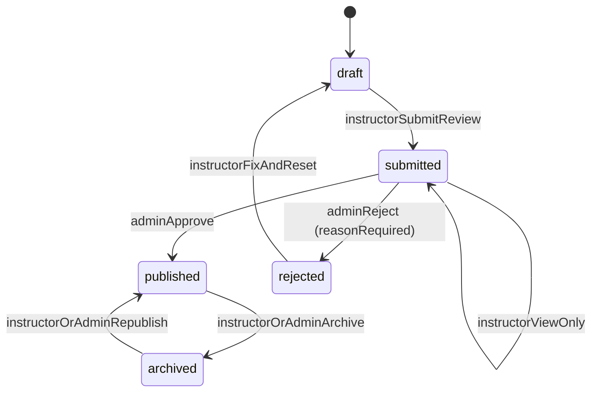
```mermaid
stateDiagram-v2
    [*] --> draft

    draft --> submitted : instructorSubmitReview
    submitted --> published : adminApprove
    submitted --> rejected : adminReject (reasonRequired)
    rejected --> draft : instructorFixAndReset
    published --> archived : instructorOrAdminArchive
    archived --> published : instructorOrAdminRepublish

    submitted --> submitted : instructorViewOnly
```

#### Marketing 可見性 vs Content 存取（404 vs 403）

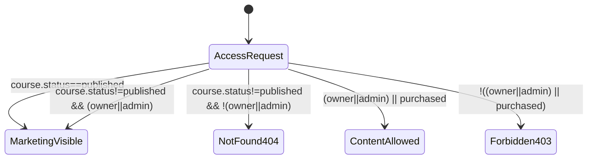
```mermaid
stateDiagram-v2
    [*] --> AccessRequest

    AccessRequest --> MarketingVisible : course.status==published
    AccessRequest --> MarketingVisible : course.status!=published && (owner||admin)
    AccessRequest --> NotFound404 : course.status!=published && !(owner||admin)

    AccessRequest --> ContentAllowed : (owner||admin) || purchased
    AccessRequest --> Forbidden403 : !((owner||admin) || purchased)
```

#### Purchase（冪等與防重送）

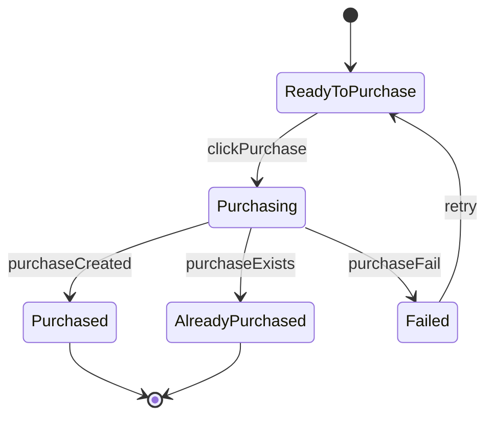
```mermaid
stateDiagram-v2
    [*] --> ReadyToPurchase

    ReadyToPurchase --> Purchasing : clickPurchase
    Purchasing --> Purchased : purchaseCreated
    Purchasing --> AlreadyPurchased : purchaseExists
    Purchasing --> Failed : purchaseFail

    Purchased --> [*]
    AlreadyPurchased --> [*]
    Failed --> ReadyToPurchase : retry
```

#### Lesson Progress（標記完成不可重複）

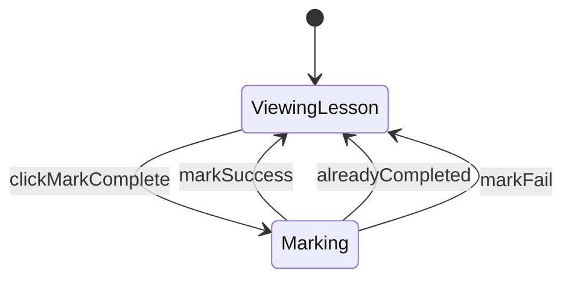
```mermaid
stateDiagram-v2
    [*] --> ViewingLesson
    ViewingLesson --> Marking : clickMarkComplete
    Marking --> ViewingLesson : markSuccess
    Marking --> ViewingLesson : alreadyCompleted
    Marking --> ViewingLesson : markFail
```

#### Curriculum Editor（submitted 鎖定）

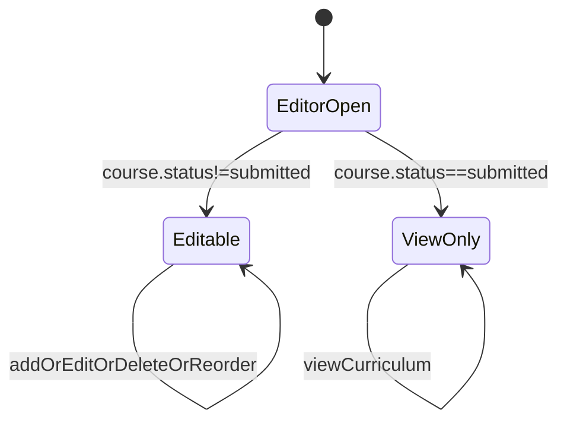
```mermaid
stateDiagram-v2
    [*] --> EditorOpen
    EditorOpen --> Editable : course.status!=submitted
    EditorOpen --> ViewOnly : course.status==submitted
    Editable --> Editable : addOrEditOrDeleteOrReorder
    ViewOnly --> ViewOnly : viewCurriculum
```

#### Protected Attachment Download

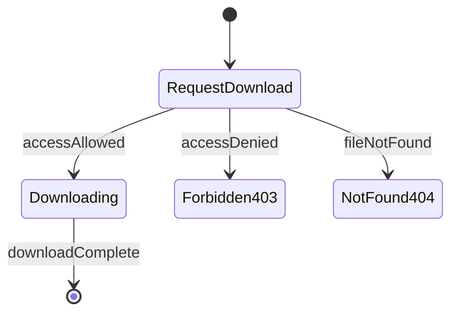
```mermaid
stateDiagram-v2
    [*] --> RequestDownload
    RequestDownload --> Downloading : accessAllowed
    RequestDownload --> Forbidden403 : accessDenied
    RequestDownload --> NotFound404 : fileNotFound
    Downloading --> [*] : downloadComplete
```

#### 全站錯誤導向（前後端一致）

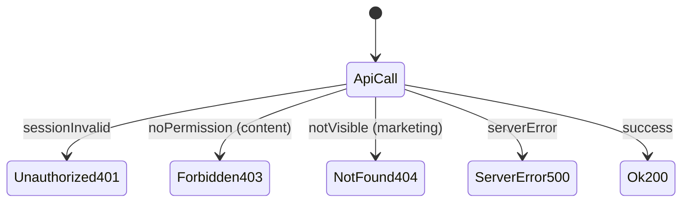
```mermaid
stateDiagram-v2
    [*] --> ApiCall
    ApiCall --> Unauthorized401 : sessionInvalid
    ApiCall --> Forbidden403 : noPermission (content)
    ApiCall --> NotFound404 : notVisible (marketing)
    ApiCall --> ServerError500 : serverError
    ApiCall --> Ok200 : success
```

### Failure Modes & Recovery *(mandatory)*

- **Failure mode**: 重複送出造成重複購買/重複審核/重複完成標記。
- **Recovery**: 後端以冪等/唯一性拒絕重複副作用，回傳一致錯誤（例如 409 已購買），前端恢復按鈕可用並顯示提示。

- **Failure mode**: session 過期/撤銷造成受保護請求失敗。
- **Recovery**: 後端統一回 401；前端導向登入並保留 redirect，登入成功後導回原頁。

- **Failure mode**: 權限判斷錯誤導致越權存取（IDOR）。
- **Recovery**: 所有資源存取均以「資源層級權限」判斷；上線前以測試情境覆蓋 401/403/404 分流規則。

- **Failure mode**: 附件檔案遺失或不可用。
- **Recovery**: 下載回 404 並顯示可理解提示；不影響課程/進度資料。

### Security & Permissions *(mandatory)*

- **Authentication**: 受保護頁面與介面（我的課程、閱讀、教師/管理後台、附件下載）皆為 required；公開行銷頁（首頁/課程列表/已上架課程詳情）為 not required。
- **Authorization**: 必須以 RBAC + 資源層級規則（作者/購買者/admin）在伺服器端強制執行；前端僅負責 UI 隱藏與導向，不能取代後端檢查。
- **Sensitive data**: 密碼（不可回傳）、session 識別、受保護內容與附件；回應中不得洩露他人 non-published 課程存在性（行銷路徑一律 404）。

### Observability *(mandatory)*

- **Logging**: 註冊/登入/登出、session 撤銷/過期、課程狀態轉換、購買嘗試（成功/已購買/失敗）、審核決策（含理由/備註）、附件下載（成功/403/404）、權限拒絕（401/403/404 分類）。
- **Tracing**: 每次請求需有可關聯的請求識別碼，以便追蹤同一操作的前後端事件。
- **User-facing errors**: 需可理解、可行動（例如「請重新登入」、「你沒有存取權」、「課程不存在或不可見」、「已購買」）。
- **Developer diagnostics**: 對內可提供錯誤代碼以便排查，但不得在 UI 暴露敏感細節。

### Backward Compatibility & Change Risk *(mandatory)*

- **Breaking change?**: No（新系統建置）。
- **Migration plan**: 無（初始上線）。
- **Rollback plan**: 若發生重大問題，可暫停購買/審核入口並保留已購買者閱讀存取，確保核心交付不中斷。

### Performance & Scale Assumptions *(mandatory)*

- **Growth assumption**: 10,000 註冊使用者、1,000 門課程、每門課程 20 章節/200 單元等級；尖峰同時在線 300 人。
- **Constraints**: 課程列表與詳情頁在一般網路環境下應於 2 秒內可互動；附件下載開始時間在 5 秒內開始傳輸（大型檔案依網路速度）。

### Key Entities *(include if feature involves data)*

- **User**: 使用者帳號（email、主要角色、啟用狀態）。
- **Session**: 可撤銷登入狀態（綁定 user、到期時間、撤銷時間）。
- **Course**: 課程（作者、分類、標籤、價格、封面、狀態、上架/下架時間、駁回理由）。
- **CourseCategory / Tag**: 課程分類與標籤（名稱唯一、可停用）。
- **Section / Lesson**: 課綱結構與排序（Lesson 內容型態：text/image/pdf）。
- **Purchase**: 購買紀錄（user 與 course 的唯一性關係）。
- **LessonProgress**: 單元完成狀態（冪等更新、完成時間）。
- **CourseReview**: 審核紀錄（admin、決策、理由/備註、時間）。

## Success Criteria *(mandatory)*

### Measurable Outcomes

- **SC-001**: 新使用者可在 2 分鐘內完成註冊並成功登入（不含驗證信流程）。
- **SC-002**: 已登入使用者在 session 過期後，首次進入受保護頁會被正確導向登入頁，且登入後可自動導回原本頁面（redirect 成功率 ≥ 95%）。
- **SC-003**: 重複購買/重複完成標記等重送情境下，不會產生重複交易/重複完成紀錄（重複副作用事件數 = 0）。
- **SC-004**: 95% 的課程列表/課程詳情頁在一般網路環境下 2 秒內可互動（以使用者體感可操作為準）。
- **SC-005**: 權限錯誤導向正確率：401/403/404/500 導向與顯示頁面符合規格（抽測通過率 100%）。
- **SC-006**: 管理員可在 1 分鐘內完成一筆課程審核（核准或駁回）並可在系統中查到完整審核紀錄（包含決策者與時間）。

## Appendix: Transition Diagrams（Authoritative Reference）

本附錄為需求提供的「權威狀態機參考」。規劃與實作必須遵守其語意與 verify 描述。

全體結構說明（必須依此層級思考與拆分）：

1. **Global App State**
2. **Page State Machine**
3. **Role-specific Page State**
4. **Feature / Function State Machine**
5. **可能回到 Page 或跳轉其他 Page**

---

### ① Global App Page State Machine

```mermaid
stateDiagram-v2
    [*] --> Home : open /
    %% verify: 進入 `/` 時 UI 顯示 Home；若 API 請求失敗則導向 `/500`。

    Home --> CoursesList : nav:課程列表
    %% verify: Header 點擊「課程列表」導向 `/courses`；Guest/Authenticated 皆可進入。

    Home --> Login : nav:登入
    %% verify: Header 點擊「登入」導向 `/login`；僅 Guest Header 會出現此入口。

    Home --> Register : nav:註冊
    %% verify: Header 點擊「註冊」導向 `/register`；僅 Guest Header 會出現此入口。

    CoursesList --> CourseDetail : click:課程卡片
    %% verify: 點擊課程卡片導向 `/courses/:courseId`；若課程不可見則回 404 並顯示 `/404`。

    CourseDetail --> CoursesList : click:返回列表
    %% verify: 點擊返回後回到 `/courses`；列表重新載入或維持先前狀態。

    Login --> Home : loginSuccess (no redirect)
    %% verify: 登入成功建立 Session（Session.created_at/expires_at）；無 redirect 時導向 `/`。

    Login --> CoursesList : loginSuccess (redirect=/courses)
    %% verify: 登入成功後若 redirect 為 `/courses` 則導向該頁；session 有效時不再看到 Guest Header。

    Login --> MyCourses : loginSuccess (redirect=/my-courses)
    %% verify: 登入成功後導向 `/my-courses`；API 若回 401 則代表 session 無效且需重新登入。

    Login --> CourseReader : loginSuccess (redirect=/my-courses/:courseId)
    %% verify: 登入成功後導向 `/my-courses/:courseId`；若無存取權內容 API 回 403 並顯示 `/403`。

    Register --> Login : registerSuccess
    %% verify: 註冊成功後不自動登入；導向 `/login`；Email 以 lowercase 儲存且唯一。

    state "Route Guard" as Guard {
        [*] --> RouteCheck
        %% verify: 任一受保護路由進入前都會觸發 route guard 檢查。

        RouteCheck --> Login : requireAuth && sessionInvalid (redirect)
        %% verify: 進入 `/my-courses` 或 `/my-courses/:courseId` 且 session 無效時，後端回 401；前端導向 `/login` 並帶 redirect。

        RouteCheck --> Forbidden403 : roleNotAllowed (instructor/admin routes)
        %% verify: 進入 `/instructor/*` 或 `/admin/*` 且角色不符時，前端顯示 `/403`；不得僅隱藏 UI 而允許直連。

        RouteCheck --> NotFound404 : courseMarketingNotVisible
        %% verify: 存在但無權限的課程行銷資訊（他人 draft/submitted/rejected/archived）後端回 404；前端顯示 `/404`。

        RouteCheck --> Forbidden403 : courseContentForbidden
        %% verify: 課程內容（閱讀/內容 API/附件下載）不符合存取條件時後端回 403；前端顯示 `/403`。

        RouteCheck --> Allowed : ok
        %% verify: 通過檢查時允許進入目標頁；後續 API 仍需做資源層級權限驗證。
    }

    Home --> Guard : routeEnter
    %% verify: 任何路由進入時都會執行 guard；guard 結果決定導向或允許。

    CoursesList --> Guard : routeEnter
    %% verify: 進入 `/courses` 時 guard 不應阻擋；若 server error 則顯示 `/500`。

    CourseDetail --> Guard : routeEnter
    %% verify: 進入 `/courses/:courseId` 時 guard 需套用 404 可見性規則（marketing path）。

    MyCourses --> Guard : routeEnter
    %% verify: 進入 `/my-courses` 時 guard 需檢查 session；無效回 401 並導向 `/login`。

    CourseReader --> Guard : routeEnter
    %% verify: 進入 `/my-courses/:courseId` 時 guard 需檢查 session；內容存取不符回 403。

    InstructorCourses --> Guard : routeEnter
    %% verify: 進入 `/instructor/courses` 僅 instructor/admin 允許；否則顯示 `/403`。

    NewCourse --> Guard : routeEnter
    %% verify: 進入 `/instructor/courses/new` 僅 instructor/admin 允許；否則顯示 `/403`。

    EditCourse --> Guard : routeEnter
    %% verify: 進入 `/instructor/courses/:courseId/edit` 僅 instructor/admin 允許；非作者且非 admin 對該課程回 404。

    CurriculumEditor --> Guard : routeEnter
    %% verify: 進入 `/instructor/courses/:courseId/curriculum` 僅 instructor/admin 允許；submitted 狀態仍可檢視但不得編輯。

    AdminReviewQueue --> Guard : routeEnter
    %% verify: 進入 `/admin/review` 僅 admin 允許；其他角色顯示 `/403`。

    AdminCourses --> Guard : routeEnter
    %% verify: 進入 `/admin/courses` 僅 admin 允許；其他角色顯示 `/403`。

    AdminTaxonomy --> Guard : routeEnter
    %% verify: 進入 `/admin/taxonomy` 僅 admin 允許；其他角色顯示 `/403`。

    AdminUsers --> Guard : routeEnter
    %% verify: 進入 `/admin/users` 僅 admin 允許；其他角色顯示 `/403`。

    AdminStats --> Guard : routeEnter
    %% verify: 進入 `/admin/stats` 僅 admin 允許；其他角色顯示 `/403`。

    Guard --> Home : Allowed && route==/
    %% verify: guard 放行且目標為 `/` 時顯示 Home。

    Guard --> CoursesList : Allowed && route==/courses
    %% verify: guard 放行且目標為 `/courses` 時顯示課程列表。

    Guard --> CourseDetail : Allowed && route==/courses/:courseId
    %% verify: guard 放行且目標為 `/courses/:courseId` 時顯示詳情；不可見時應在 guard 或資料載入階段導向 `/404`。

    Guard --> MyCourses : Allowed && route==/my-courses
    %% verify: guard 放行且目標為 `/my-courses` 時呼叫購買列表 API；空清單顯示 Empty 狀態。

    Guard --> CourseReader : Allowed && route==/my-courses/:courseId
    %% verify: guard 放行且目標為 `/my-courses/:courseId` 時呼叫內容 API；無權限應回 403。

    Guard --> InstructorCourses : Allowed && route==/instructor/courses
    %% verify: guard 放行且目標為教師課程列表時，僅顯示自己的課程；admin 可檢視但仍需遵守行為限制。

    Guard --> NewCourse : Allowed && route==/instructor/courses/new
    %% verify: guard 放行後進入建立課程頁；建立成功後課程狀態為 draft。

    Guard --> EditCourse : Allowed && route==/instructor/courses/:courseId/edit
    %% verify: guard 放行後載入課程；submitted 狀態 UI 必須鎖定且後端拒絕會影響審核結果的修改。

    Guard --> CurriculumEditor : Allowed && route==/instructor/courses/:courseId/curriculum
    %% verify: guard 放行後載入課綱；submitted 狀態僅檢視。

    Guard --> AdminReviewQueue : Allowed && route==/admin/review
    %% verify: guard 放行後載入 submitted 清單；非 admin 進入應顯示 `/403`。

    Guard --> AdminCourses : Allowed && route==/admin/courses
    %% verify: guard 放行後載入課程管理清單；操作上下架需留有成功/失敗提示。

    Guard --> AdminTaxonomy : Allowed && route==/admin/taxonomy
    %% verify: guard 放行後載入分類與標籤；停用後不得被選為課程分類/標籤。

    Guard --> AdminUsers : Allowed && route==/admin/users
    %% verify: guard 放行後載入使用者列表；可切換 is_active 與設定主要角色。

    Guard --> AdminStats : Allowed && route==/admin/stats
    %% verify: guard 放行後載入統計；至少包含課程數量（依狀態）、購買數量、使用者數量。

    Login --> Home : nav:回首頁
    %% verify: login 頁提供返回首頁入口；回到 `/` 後 header 仍為 Guest Header。

    CoursesList --> Home : nav:回首頁
    %% verify: 課程列表提供回首頁入口；不影響登入狀態。

    MyCourses --> CourseReader : click:課程
    %% verify: 點擊已購買課程進入閱讀頁；未購買者不應出現在此列表。

    CourseReader --> MyCourses : nav:返回我的課程
    %% verify: 返回我的課程後進度顯示需反映最新完成狀態（可透過 refresh 或局部更新）。

    CoursesList --> Login : click:需要登入才可購買
    %% verify: 未登入嘗試購買時 UI 提示需登入並導向 `/login`（可帶 redirect 回課程詳情）。

    state "Admin / Instructor Entry" as RoleEntry {
        [*] --> RoleLanding
        %% verify: 角色入口僅在符合角色的 Header 顯示。

        RoleLanding --> InstructorCourses : nav:教師課程管理 (role==instructor||role==admin)
        %% verify: instructor/admin 點擊教師入口導向 `/instructor/courses`；student/guest 不應看到入口。

        RoleLanding --> AdminReviewQueue : nav:管理後台入口 (role==admin)
        %% verify: admin 點擊管理後台入口導向 `/admin/review`；非 admin 不應看到入口。
    }

    Home --> RoleEntry : nav:roleEntry
    %% verify: Home 上從 Header 進入角色入口；入口可見性需符合 Navigation Visibility Rules。

    Forbidden403 --> Home : click:返回首頁
    %% verify: `/403` 頁提供返回首頁；不應自動變更登入狀態。

    NotFound404 --> CoursesList : click:返回課程列表
    %% verify: `/404` 頁提供返回課程列表；不應暴露不可見課程存在性。

    ServerError500 --> Home : click:返回首頁
    %% verify: `/500` 頁提供返回首頁與重試；重試成功後回到原本頁面或安全預設頁。
```

---

### ② Home Page

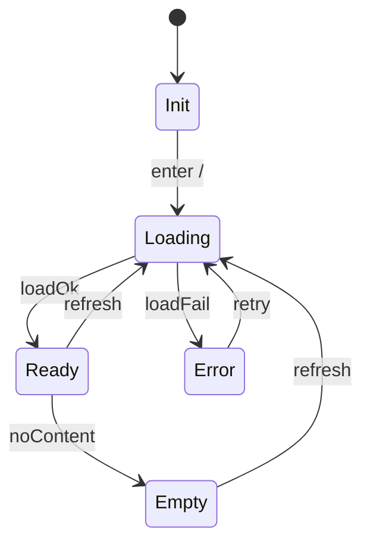
```mermaid
stateDiagram-v2
    [*] --> Init

    Init --> Loading : enter /
    %% verify: 進入 `/` 會進入 Loading；主要 CTA（導向課程列表）可用但避免重複觸發相同請求。

    Loading --> Ready : loadOk
    %% verify: 載入成功顯示 Ready；Guest 看到「課程列表/登入/註冊」。

    Loading --> Error : loadFail
    %% verify: 載入失敗顯示 Error 並提供重試；重試會回到 Loading。

    Ready --> Loading : refresh
    %% verify: refresh 會重新請求資料；期間按鈕需 disable 避免重送。

    Error --> Loading : retry
    %% verify: retry 會重新嘗試載入；成功後進入 Ready。

    Ready --> Empty : noContent
    %% verify: 若 Home 沒有任何可顯示內容則顯示 Empty；仍應提供導向課程列表入口。

    Empty --> Loading : refresh
    %% verify: Empty 狀態下 refresh 會重新請求並可能進入 Ready。
```

### ③ Login Page

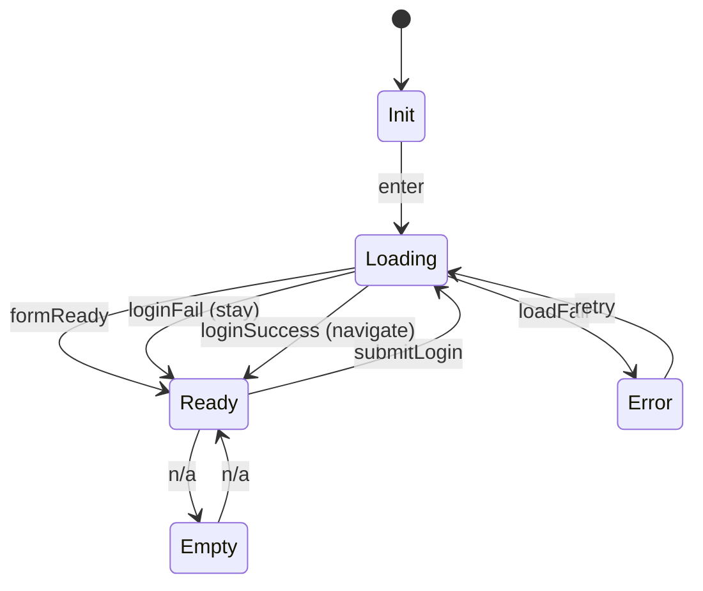
```mermaid
stateDiagram-v2
    [*] --> Init

    Init --> Loading : enter
    %% verify: 進入 `/login` 顯示 Loading 初始化表單狀態。

    Loading --> Ready : formReady
    %% verify: Ready 顯示登入表單；送出時按鈕需 disable 防重送。

    Loading --> Error : loadFail
    %% verify: 初始化失敗顯示 Error；提供 retry。

    Ready --> Loading : submitLogin
    %% verify: 送出登入後進入 Loading；API 失敗需回到 Ready 並顯示明確錯誤。

    Loading --> Ready : loginFail (stay)
    %% verify: 登入失敗（含 is_active=false）API 回 401/403（依設計）且 UI 顯示明確錯誤；不建立 session。

    Loading --> Ready : loginSuccess (navigate)
    %% verify: 登入成功 API 回 200 並建立 Session（expires_at 有值、revoked_at 為 null）；前端導向 redirect 或預設頁。

    Error --> Loading : retry
    %% verify: retry 重新初始化表單並可再次登入。

    Ready --> Empty : n/a
    %% verify: login 頁不應出現空清單 Empty；若無法渲染表單應視為 Error。

    Empty --> Ready : n/a
    %% verify: 不適用；若發生則回到 Ready 或 Error。
```

### ④ Register Page

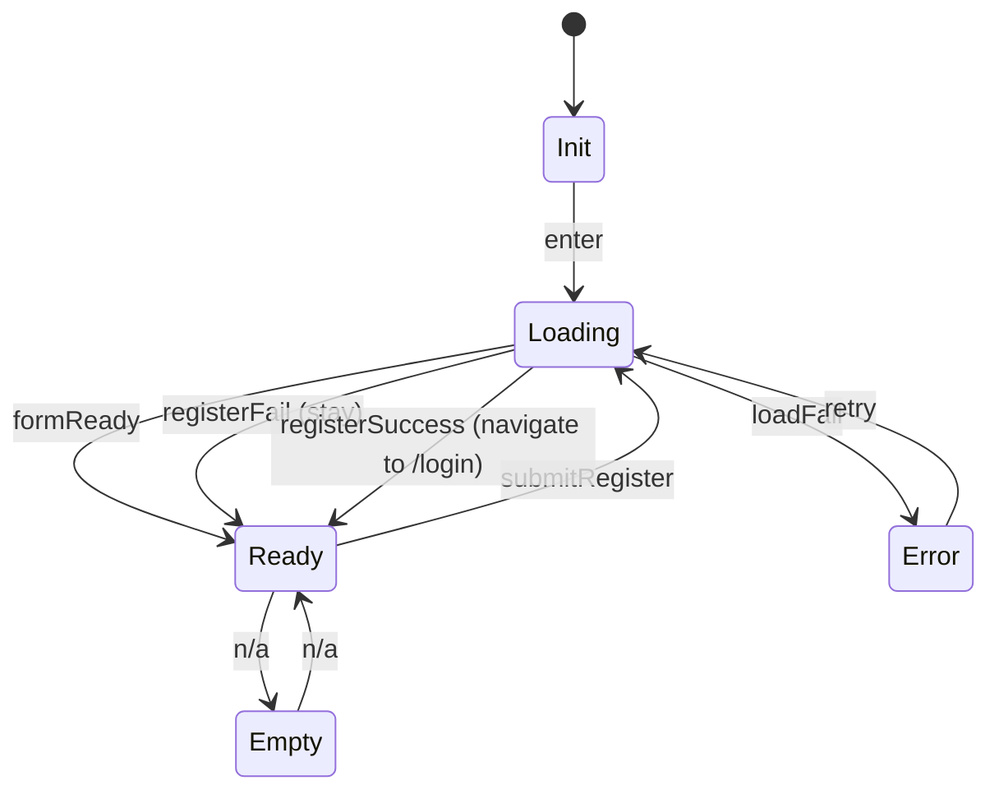
```mermaid
stateDiagram-v2
    [*] --> Init

    Init --> Loading : enter
    %% verify: 進入 `/register` 顯示 Loading 初始化表單狀態。

    Loading --> Ready : formReady
    %% verify: Ready 顯示註冊表單；Email 需 lowercase；密碼至少 8 碼。

    Loading --> Error : loadFail
    %% verify: 初始化失敗顯示 Error；提供 retry。

    Ready --> Loading : submitRegister
    %% verify: 送出註冊後進入 Loading；按鈕 disable 防重送。

    Loading --> Ready : registerFail (stay)
    %% verify: 註冊失敗（Email 重複/格式錯誤/密碼過短）顯示欄位錯誤；不建立 session。

    Loading --> Ready : registerSuccess (navigate to /login)
    %% verify: 註冊成功後導向 `/login`；不自動登入；資料庫中 Email 以 lowercase 儲存且唯一。

    Error --> Loading : retry
    %% verify: retry 重新初始化表單。

    Ready --> Empty : n/a
    %% verify: register 頁不應出現 Empty；無法渲染視為 Error。

    Empty --> Ready : n/a
    %% verify: 不適用；若發生則回到 Ready 或 Error。
```

### ⑤ Courses List Page

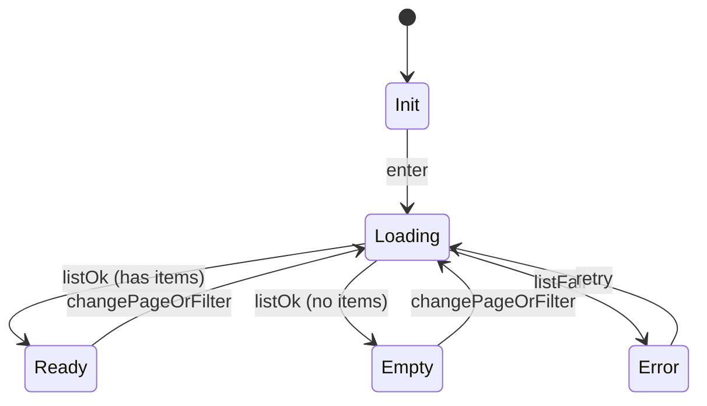
```mermaid
stateDiagram-v2
    [*] --> Init

    Init --> Loading : enter
    %% verify: 進入 `/courses` 會請求 published 課程列表；Loading 期間主要互動需有骨架或 loading。

    Loading --> Ready : listOk (has items)
    %% verify: API 回 200 且有資料時顯示 Ready；每個項目可進入 `/courses/:courseId`。

    Loading --> Empty : listOk (no items)
    %% verify: API 回 200 但無資料時顯示 Empty；顯示清楚空狀態提示。

    Loading --> Error : listFail
    %% verify: API 失敗顯示 Error；提供 retry。

    Ready --> Loading : changePageOrFilter
    %% verify: 變更分頁/篩選會重新請求；期間需 disable 重複操作。

    Empty --> Loading : changePageOrFilter
    %% verify: Empty 狀態下操作分頁/篩選會重新請求並可能進入 Ready。

    Error --> Loading : retry
    %% verify: retry 重新請求列表，成功後進入 Ready/Empty。
```

### ⑥ Course Detail Page

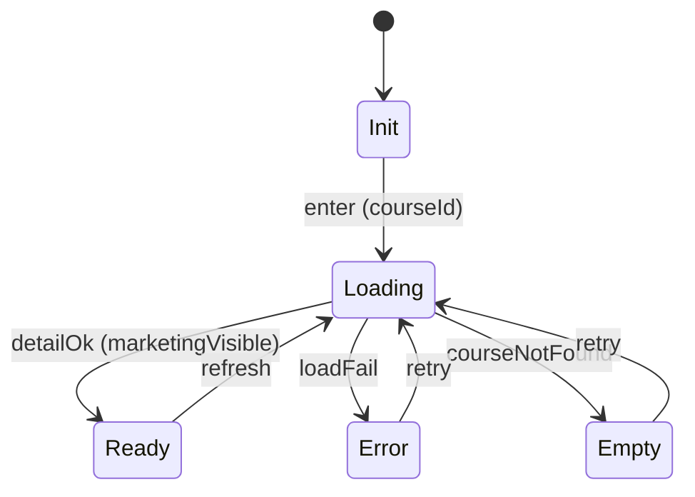
```mermaid
stateDiagram-v2
    [*] --> Init

    Init --> Loading : enter (courseId)
    %% verify: 進入 `/courses/:courseId` 會請求課程行銷資訊與章節/單元大綱；未購買者僅回傳標題與順序。

    Loading --> Ready : detailOk (marketingVisible)
    %% verify: 若課程對使用者可見（published 或 owner/admin）API 回 200；UI 顯示描述/分類/標籤/價格/封面/狀態/大綱。

    Loading --> Error : loadFail
    %% verify: API 失敗顯示 Error；提供 retry。

    Loading --> Empty : courseNotFound
    %% verify: 課程不存在或不可見（依 404 規則）API 回 404；前端導向 `/404` 或顯示空狀態但不得暴露存在性。

    Ready --> Loading : refresh
    %% verify: refresh 重新請求詳情；購買狀態改變後 CTA 需切換（購買→前往閱讀）。

    Error --> Loading : retry
    %% verify: retry 重新請求，成功後回到 Ready。

    Empty --> Loading : retry
    %% verify: retry 重新請求；若仍 404 則維持導向 `/404`。
```

### ⑦ My Courses Page

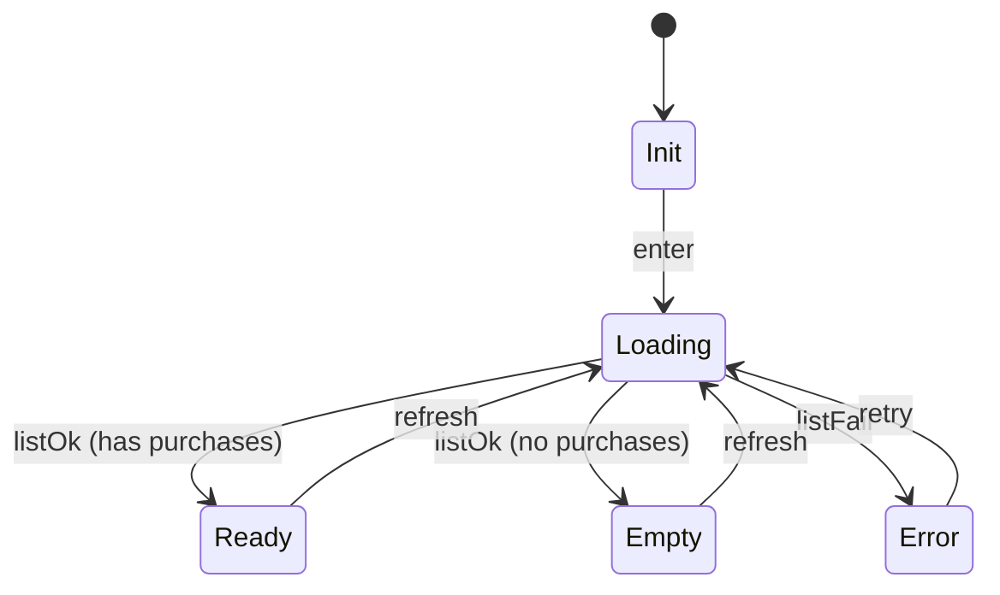
```mermaid
stateDiagram-v2
    [*] --> Init

    Init --> Loading : enter
    %% verify: 進入 `/my-courses` 需 session 有效；無效時後端回 401 並導向 `/login`（帶 redirect）。

    Loading --> Ready : listOk (has purchases)
    %% verify: API 回 200 且有購買課程時顯示 Ready；每列顯示封面/標題/講師/購買日期/進度。

    Loading --> Empty : listOk (no purchases)
    %% verify: API 回 200 且無購買課程時顯示 Empty；顯示清楚提示並提供導向 `/courses`。

    Loading --> Error : listFail
    %% verify: API 失敗顯示 Error；提供 retry。

    Ready --> Loading : refresh
    %% verify: refresh 後進度需反映最新完成狀態。

    Empty --> Loading : refresh
    %% verify: Empty 狀態下 refresh 重新請求。

    Error --> Loading : retry
    %% verify: retry 重新請求，成功後進入 Ready/Empty。
```

### ⑧ Course Reader Page

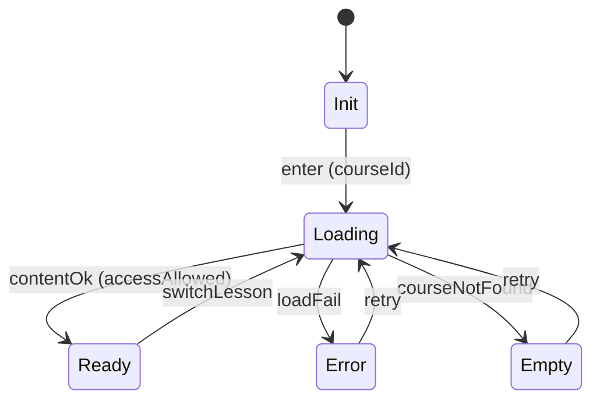
```mermaid
stateDiagram-v2
    [*] --> Init

    Init --> Loading : enter (courseId)
    %% verify: 進入 `/my-courses/:courseId` 需 session 有效；內容 API 需檢查作者/購買者/admin 存取條件。

    Loading --> Ready : contentOk (accessAllowed)
    %% verify: accessAllowed 時 API 回 200；UI 顯示章節/單元內容與附件下載入口。

    Loading --> Error : loadFail
    %% verify: API 失敗顯示 Error；提供 retry。

    Loading --> Empty : courseNotFound
    %% verify: 課程不存在 API 回 404；前端導向 `/404`。

    Ready --> Loading : switchLesson
    %% verify: 切換單元時重新載入單元內容；按鈕需在 loading 期間 disable。

    Error --> Loading : retry
    %% verify: retry 重新請求內容，成功後回到 Ready。

    Empty --> Loading : retry
    %% verify: retry 後仍 404 則維持導向 `/404`。
```

### ⑨ Instructor Courses Page

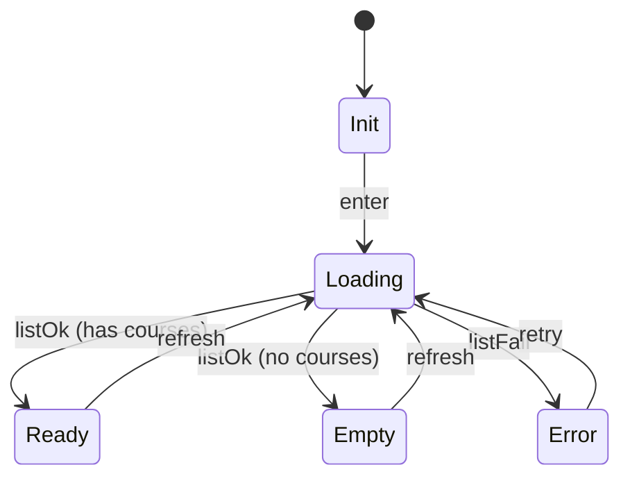
```mermaid
stateDiagram-v2
    [*] --> Init

    Init --> Loading : enter
    %% verify: 進入 `/instructor/courses` 僅 instructor/admin 允許；不符角色顯示 `/403`。

    Loading --> Ready : listOk (has courses)
    %% verify: API 回 200 且有課程時顯示 Ready；顯示狀態 draft/submitted/published/rejected/archived。

    Loading --> Empty : listOk (no courses)
    %% verify: API 回 200 且無課程時顯示 Empty；提供新增課程入口。

    Loading --> Error : listFail
    %% verify: API 失敗顯示 Error；提供 retry。

    Ready --> Loading : refresh
    %% verify: refresh 後狀態與審核結果需更新。

    Empty --> Loading : refresh
    %% verify: Empty 狀態下 refresh 重新請求。

    Error --> Loading : retry
    %% verify: retry 重新請求並回到 Ready/Empty。
```

### ⑩ New Course Page

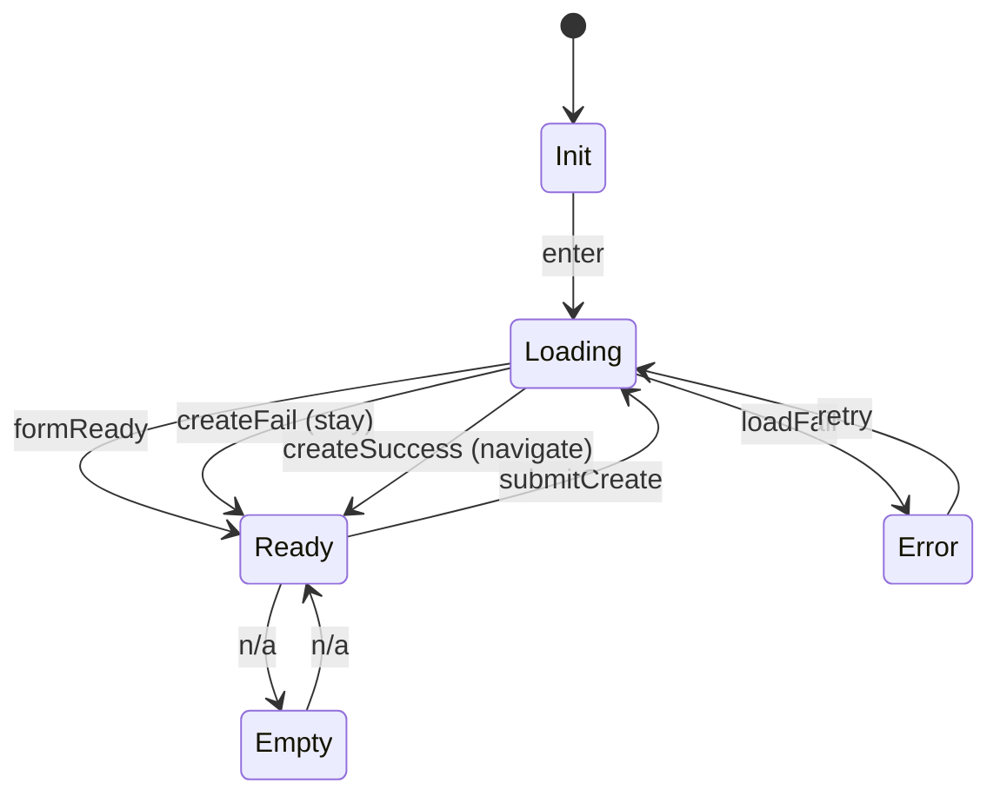
```mermaid
stateDiagram-v2
    [*] --> Init

    Init --> Loading : enter
    %% verify: 進入 `/instructor/courses/new` 僅 instructor/admin 允許；不符角色顯示 `/403`。

    Loading --> Ready : formReady
    %% verify: 顯示建立課程表單；分類與標籤僅可選啟用項目。

    Loading --> Error : loadFail
    %% verify: 載入失敗顯示 Error；提供 retry。

    Ready --> Loading : submitCreate
    %% verify: 送出建立後按鈕 disable 防重送；成功時新增 Course 且 status==draft。

    Loading --> Ready : createFail (stay)
    %% verify: 建立失敗（必填/數值範圍/分類停用）顯示欄位錯誤；不應產生 Course。

    Loading --> Ready : createSuccess (navigate)
    %% verify: 建立成功導向教師課程列表或編輯頁；新課程可被作者與 admin 檢視。

    Error --> Loading : retry
    %% verify: retry 後可再次操作建立。

    Ready --> Empty : n/a
    %% verify: 不適用；若缺少表單資料應視為 Error。

    Empty --> Ready : n/a
    %% verify: 不適用。
```

### ⑪ Edit Course Page

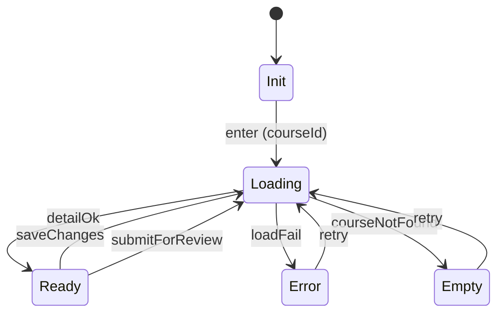
```mermaid
stateDiagram-v2
    [*] --> Init

    Init --> Loading : enter (courseId)
    %% verify: 進入 `/instructor/courses/:courseId/edit` 需 instructor/admin；非作者且非 admin 對該課程回 404。

    Loading --> Ready : detailOk
    %% verify: 載入成功顯示課程基本資訊；submitted 狀態 UI 顯示鎖定且不可提交修改。

    Loading --> Error : loadFail
    %% verify: 載入失敗顯示 Error；提供 retry。

    Loading --> Empty : courseNotFound
    %% verify: 課程不存在或不可見時 API 回 404；前端導向 `/404`。

    Ready --> Loading : saveChanges
    %% verify: saveChanges 僅在非 submitted 且符合權限時允許；成功後 updated_at 變更且資料回顯一致。

    Ready --> Loading : submitForReview
    %% verify: submitForReview 僅允許 draft→submitted 或 rejected→draft 後再 draft→submitted；重複提交需被阻擋。

    Error --> Loading : retry
    %% verify: retry 重新載入資料。

    Empty --> Loading : retry
    %% verify: retry 後仍 404 則維持導向 `/404`。
```

### ⑫ Curriculum Editor Page

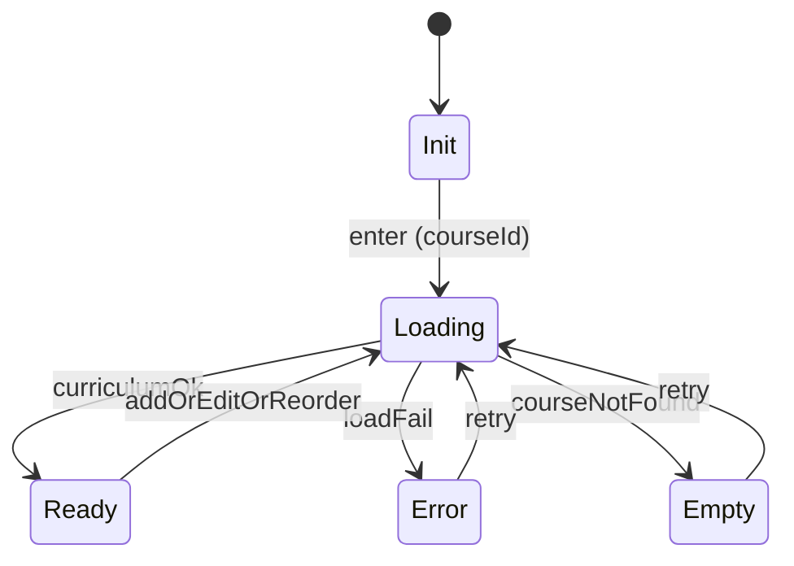
```mermaid
stateDiagram-v2
    [*] --> Init

    Init --> Loading : enter (courseId)
    %% verify: 進入 `/instructor/courses/:courseId/curriculum` 需 instructor/admin；submitted 狀態僅檢視。

    Loading --> Ready : curriculumOk
    %% verify: 載入成功顯示章節/單元；order 在同一 Course/Section 下需唯一。

    Loading --> Error : loadFail
    %% verify: 載入失敗顯示 Error；提供 retry。

    Loading --> Empty : courseNotFound
    %% verify: 課程不存在或不可見時 API 回 404；前端導向 `/404`。

    Ready --> Loading : addOrEditOrReorder
    %% verify: 非 submitted 狀態允許新增/編輯/刪除/排序；submitted 狀態後端拒絕變更並回 403/400（依設計）且 UI 顯示提示。

    Error --> Loading : retry
    %% verify: retry 重新載入。

    Empty --> Loading : retry
    %% verify: retry 後仍 404 則維持導向 `/404`。
```

### ⑬ Admin Review Queue Page

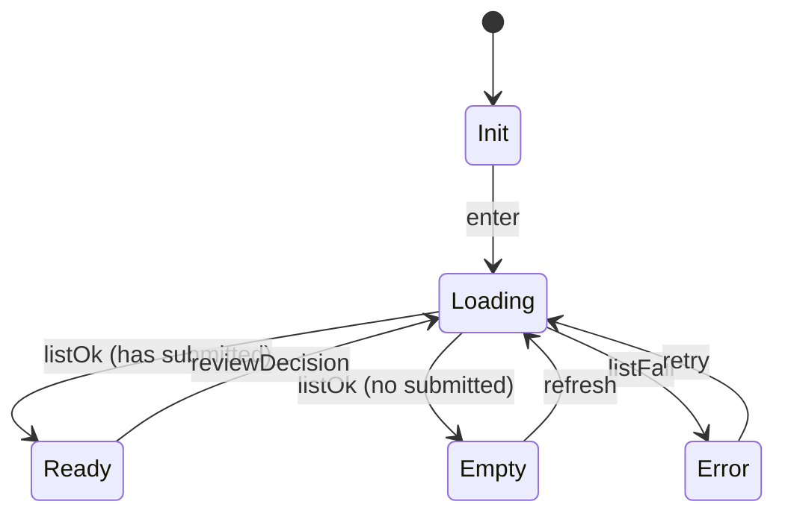
```mermaid
stateDiagram-v2
    [*] --> Init

    Init --> Loading : enter
    %% verify: 進入 `/admin/review` 僅 admin；不符角色顯示 `/403`。

    Loading --> Ready : listOk (has submitted)
    %% verify: API 回 200 且有 submitted 課程時顯示 Ready；可檢視課程與課綱並能抽查內容。

    Loading --> Empty : listOk (no submitted)
    %% verify: API 回 200 且無待審時顯示 Empty。

    Loading --> Error : listFail
    %% verify: API 失敗顯示 Error；提供 retry。

    Ready --> Loading : reviewDecision
    %% verify: 進行核准/駁回時按鈕 disable 防重送；成功需寫入 CourseReview 並更新 Course.status。

    Empty --> Loading : refresh
    %% verify: refresh 重新請求待審清單。

    Error --> Loading : retry
    %% verify: retry 重新請求。
```

### ⑭ Admin Courses Page

```mermaid
stateDiagram-v2
    [*] --> Init

    Init --> Loading : enter
    %% verify: 進入 `/admin/courses` 僅 admin；不符角色顯示 `/403`。

    Loading --> Ready : listOk
    %% verify: 載入課程清單成功；可對 published/archived 執行上下架切換。

    Loading --> Empty : listOk (no courses)
    %% verify: 無課程時顯示 Empty。

    Loading --> Error : listFail
    %% verify: 載入失敗顯示 Error；提供 retry。

    Ready --> Loading : archiveOrPublish
    %% verify: 上下架操作成功需更新 Course.status 並寫入 archived_at（進入 archived 時）；重複操作需被阻擋。

    Error --> Loading : retry
    %% verify: retry 重新請求。

    Empty --> Loading : refresh
    %% verify: refresh 重新請求清單。
```

### ⑮ Admin Taxonomy Page

```mermaid
stateDiagram-v2
    [*] --> Init

    Init --> Loading : enter
    %% verify: 進入 `/admin/taxonomy` 僅 admin；不符角色顯示 `/403`。

    Loading --> Ready : taxonomyOk
    %% verify: 載入分類與標籤成功；名稱需唯一；停用後不應可被選為課程分類/標籤。

    Loading --> Empty : taxonomyOk (no items)
    %% verify: 無分類/標籤時顯示 Empty；仍可新增。

    Loading --> Error : loadFail
    %% verify: 載入失敗顯示 Error；提供 retry。

    Ready --> Loading : createOrEditOrToggleActive
    %% verify: 新增/編輯/停用成功後列表即時更新；表單驗證失敗需顯示明確訊息。

    Error --> Loading : retry
    %% verify: retry 重新請求。

    Empty --> Loading : refresh
    %% verify: refresh 重新請求。
```

### ⑯ Admin Users Page

```mermaid
stateDiagram-v2
    [*] --> Init

    Init --> Loading : enter
    %% verify: 進入 `/admin/users` 僅 admin；不符角色顯示 `/403`。

    Loading --> Ready : listOk
    %% verify: 載入使用者列表成功；顯示 email/role/is_active。

    Loading --> Empty : listOk (no users)
    %% verify: 無使用者時顯示 Empty（通常不會發生，但仍需定義）。

    Loading --> Error : listFail
    %% verify: 載入失敗顯示 Error；提供 retry。

    Ready --> Loading : toggleActiveOrSetRole
    %% verify: 切換 is_active 後該使用者登入行為需改變；設定主要角色後 Header/路由權限需立即生效。

    Error --> Loading : retry
    %% verify: retry 重新請求。

    Empty --> Loading : refresh
    %% verify: refresh 重新請求。
```

### ⑰ Admin Stats Page

```mermaid
stateDiagram-v2
    [*] --> Init

    Init --> Loading : enter
    %% verify: 進入 `/admin/stats` 僅 admin；不符角色顯示 `/403`。

    Loading --> Ready : statsOk
    %% verify: statsOk 時顯示課程數量（依狀態）、購買數量、使用者數量。

    Loading --> Empty : statsOk (no data)
    %% verify: 若無資料顯示 Empty，但仍應呈現 0 值或空狀態說明。

    Loading --> Error : statsFail
    %% verify: 載入失敗顯示 Error；提供 retry。

    Ready --> Loading : refresh
    %% verify: refresh 重新請求統計並更新畫面。

    Error --> Loading : retry
    %% verify: retry 重新請求。

    Empty --> Loading : refresh
    %% verify: refresh 重新請求。
```

### ⑱ 403 Page

```mermaid
stateDiagram-v2
    [*] --> Init

    Init --> Loading : enter
    %% verify: 進入 `/403` 顯示 Loading 初始化錯誤資訊。

    Loading --> Ready : renderOk
    %% verify: Ready 顯示無權限訊息與返回入口；不得暴露敏感資源資料。

    Loading --> Error : renderFail
    %% verify: renderFail 顯示 Error 並提供 retry。

    Ready --> Empty : noContext
    %% verify: 無上下文時顯示 fallback 訊息；仍提供返回入口。

    Empty --> Ready : renderFallback
    %% verify: fallback 成功後顯示 Ready。

    Error --> Loading : retry
    %% verify: retry 重新嘗試渲染。
```

### ⑲ 404 Page

```mermaid
stateDiagram-v2
    [*] --> Init

    Init --> Loading : enter
    %% verify: 進入 `/404` 顯示 Loading 初始化錯誤資訊。

    Loading --> Ready : renderOk
    %% verify: Ready 顯示找不到資源訊息與返回入口；不得暗示不可見課程存在。

    Loading --> Error : renderFail
    %% verify: renderFail 顯示 Error 並提供 retry。

    Ready --> Empty : noContext
    %% verify: 無上下文時顯示 fallback 訊息。

    Empty --> Ready : renderFallback
    %% verify: fallback 成功後顯示 Ready。

    Error --> Loading : retry
    %% verify: retry 重新嘗試渲染。
```

### ⑳ 500 Page

```mermaid
stateDiagram-v2
    [*] --> Init

    Init --> Loading : enter
    %% verify: 進入 `/500` 顯示 Loading 初始化錯誤資訊。

    Loading --> Ready : renderOk
    %% verify: Ready 顯示伺服器錯誤訊息與重試入口。

    Loading --> Error : renderFail
    %% verify: renderFail 顯示 Error 並提供 retry。

    Ready --> Empty : noContext
    %% verify: 無上下文時顯示 fallback 訊息。

    Empty --> Ready : renderFallback
    %% verify: fallback 成功後顯示 Ready。

    Error --> Loading : retry
    %% verify: retry 重新嘗試渲染。
```

---

### ㉗ Feature: Global Navigation Rendering

```mermaid
stateDiagram-v2
    [*] --> DetermineHeader
    %% verify: 每次進入頁面時根據 session 與 role 決定 Header 內容。

    DetermineHeader --> GuestHeader : noSession
    %% verify: 無 session 時顯示 Guest Header；不得出現「我的課程/教師課程管理/管理後台入口」。

    DetermineHeader --> StudentHeader : role==student
    %% verify: role==student 時顯示「課程列表/我的課程/登出」；不得出現教師或管理後台入口。

    DetermineHeader --> InstructorHeader : role==instructor
    %% verify: role==instructor 時顯示「課程列表/我的課程/教師課程管理/登出」；不得出現管理後台入口。

    DetermineHeader --> AdminHeader : role==admin
    %% verify: role==admin 時顯示「課程列表/管理後台入口/登出」；Header 不得重複頁面主要 CTA（例如購買/審核）。

    GuestHeader --> CoursesList : click:課程列表
    %% verify: 點擊課程列表導向 `/courses`；不需登入。

    GuestHeader --> Login : click:登入
    %% verify: 點擊登入導向 `/login`。

    GuestHeader --> Register : click:註冊
    %% verify: 點擊註冊導向 `/register`。

    StudentHeader --> CoursesList : click:課程列表
    %% verify: 點擊課程列表導向 `/courses`。

    StudentHeader --> MyCourses : click:我的課程
    %% verify: 點擊我的課程導向 `/my-courses`；若 session 失效則導向 `/login`。

    StudentHeader --> Home : click:登出
    %% verify: 登出成功後 session.revoked_at 非空；Header 變回 Guest Header。

    InstructorHeader --> CoursesList : click:課程列表
    %% verify: 點擊課程列表導向 `/courses`。

    InstructorHeader --> MyCourses : click:我的課程
    %% verify: 點擊我的課程導向 `/my-courses`。

    InstructorHeader --> InstructorCourses : click:教師課程管理
    %% verify: 點擊教師課程管理導向 `/instructor/courses`；若角色不符不得出現入口。

    InstructorHeader --> Home : click:登出
    %% verify: 登出後不可再存取受保護頁；直連受保護頁後端回 401。

    AdminHeader --> CoursesList : click:課程列表
    %% verify: 點擊課程列表導向 `/courses`。

    AdminHeader --> AdminReviewQueue : click:管理後台入口
    %% verify: 點擊管理後台入口導向 `/admin/review`；非 admin 不得出現入口。

    AdminHeader --> Home : click:登出
    %% verify: 登出後 session 無效；admin routes 直連顯示 `/403`（依 route guard）。
```

### ㉘ Feature: Register / Login / Logout / Session

```mermaid
stateDiagram-v2
    [*] --> LoggedOut
    %% verify: LoggedOut 狀態下無有效 session；Header 為 Guest。

    LoggedOut --> Registering : submitRegister
    %% verify: 送出註冊時後端驗證 Email 唯一與密碼長度；重複送出需被阻擋。

    Registering --> LoggedOut : registerSuccess (navigate /login)
    %% verify: 註冊成功導向 `/login`；不建立 session。

    Registering --> LoggedOut : registerFail
    %% verify: 註冊失敗顯示欄位錯誤；不建立 session。

    LoggedOut --> LoggingIn : submitLogin
    %% verify: 送出登入後端驗證密碼並檢查 is_active；前端顯示 loading 並 disable。

    LoggingIn --> LoggedIn : loginSuccess (sessionCreated)
    %% verify: 登入成功建立 Session（revoked_at==null，expires_at>now）；前端更新登入狀態。

    LoggingIn --> LoggedOut : loginFail
    %% verify: 登入失敗顯示明確錯誤；若 is_active=false 必須顯示停用訊息。

    LoggedIn --> LoggedOut : clickLogout (sessionRevoked)
    %% verify: 登出後 session.revoked_at 設定；後續 API 需回 401。

    LoggedIn --> LoggedOut : sessionExpiredOrRevoked
    %% verify: session 到期或撤銷時，受保護頁面請求回 401 並導向 `/login`（帶 redirect）。
```

### ㉙ Feature: RBAC Route Access Control

```mermaid
stateDiagram-v2
    [*] --> RouteEnter
    %% verify: 每次路由進入必做權限檢查；前後端一致。

    RouteEnter --> Allowed : routeAllowed
    %% verify: 允許進入時頁面載入正常；Header 僅顯示該角色可見入口。

    RouteEnter --> Login : requireAuth && sessionInvalid
    %% verify: requireAuth 的 `/my-courses*` 在 session 無效時後端回 401；前端導向 `/login` 並帶 redirect。

    RouteEnter --> Forbidden403 : adminOrInstructorRouteDenied
    %% verify: `/instructor/*` 或 `/admin/*` 對不符角色顯示 `/403`；不可以 404 取代。

    RouteEnter --> NotFound404 : courseMarketingNotVisible
    %% verify: 課程詳情行銷路徑對無權者回 404；不得暴露 draft/submitted/rejected/archived 存在。

    RouteEnter --> Forbidden403 : courseContentForbidden
    %% verify: 課程內容路徑對無存取者回 403；UI 顯示 `/403`。
```

### ㉚ Feature: Course State Machine (draft/submitted/published/rejected/archived)

```mermaid
stateDiagram-v2
    [*] --> draft
    %% verify: 建立課程預設 status==draft；rejected_reason==null；published_at/archived_at==null。

    draft --> submitted : instructorSubmitReview
    %% verify: 只有作者可提交；提交後 status==submitted 且 submitted 狀態 UI 鎖定；重複提交需被阻擋。

    submitted --> published : adminApprove
    %% verify: 只有 admin 可核准；決策寫入 CourseReview(decision==published, note 可空)；首次進入 published 設定 published_at。

    submitted --> rejected : adminReject (reasonRequired)
    %% verify: 只有 admin 可駁回；reason 必填；Course.status==rejected 且 rejected_reason 有值；寫入 CourseReview(decision==rejected, reason 有值)。

    rejected --> draft : instructorFixAndReset
    %% verify: 只有作者可將 rejected 課程回到 draft；回到 draft 時 rejected_reason 必須清為 null。

    published --> archived : instructorOrAdminArchive
    %% verify: 作者或 admin 可下架；status==archived 且 archived_at 設定；published_at 保留不變。

    archived --> published : instructorOrAdminRepublish
    %% verify: 作者或 admin 可重新上架；status==published；published_at 保留首次值且不得被覆寫。

    submitted --> submitted : instructorViewOnly
    %% verify: submitted 狀態下 instructor 只能檢視；任何會影響審核結果的修改後端拒絕並回錯誤；UI 必須鎖定。
```

### ㉛ Feature: Course Marketing Visibility vs Content Access

```mermaid
stateDiagram-v2
    [*] --> AccessRequest
    %% verify: 進入課程詳情或內容前需分流行銷可見性（404）與內容存取（403）。

    AccessRequest --> MarketingVisible : course.status==published
    %% verify: published 行銷資訊對所有人可見；未購買者僅能看到大綱標題與順序。

    AccessRequest --> MarketingVisible : course.status!=published && (owner||admin)
    %% verify: 非 published 但作者或 admin 可見行銷資訊；其他人不可見。

    AccessRequest --> NotFound404 : course.status!=published && !(owner||admin)
    %% verify: 非 published 且非作者/admin 的詳情必回 404。

    AccessRequest --> ContentAllowed : (owner||admin) || purchased
    %% verify: 課程內容存取允許需滿足 owner 或 purchased 或 admin；API 回 200 並可下載附件。

    AccessRequest --> Forbidden403 : !((owner||admin) || purchased)
    %% verify: 不符合內容存取條件時 API 回 403；不得以 404 取代。
```

### ㉜ Feature: Purchase Course (idempotent)

```mermaid
stateDiagram-v2
    [*] --> ReadyToPurchase
    %% verify: 僅已登入且課程 status==published 且尚未購買者顯示購買 CTA。

    ReadyToPurchase --> Purchasing : clickPurchase
    %% verify: 點擊購買後按鈕 disable；後端以唯一約束確保 user_id+course_id 只會有一筆 Purchase。

    Purchasing --> Purchased : purchaseCreated
    %% verify: 建立 Purchase 成功後 API 回 200；我的課程列表可看到該課程。

    Purchasing --> AlreadyPurchased : purchaseExists
    %% verify: 若已購買再購買需被阻擋；API 回 409/400（依設計）且 UI 顯示「已購買」。

    Purchasing --> Failed : purchaseFail
    %% verify: 購買失敗顯示錯誤訊息；按鈕恢復可點擊。

    Purchased --> CourseReader : navigateToReader
    %% verify: 導向 `/my-courses/:courseId` 後內容 API 回 200。

    AlreadyPurchased --> CourseReader : navigateToReader
    %% verify: 已購買狀態導向閱讀頁；不得再產生重複 Purchase。

    Failed --> ReadyToPurchase : retry
    %% verify: retry 後可再次嘗試；若重複請求後端仍需維持唯一性。
```

### ㉝ Feature: Lesson Progress Mark Complete (anti-duplicate)

```mermaid
stateDiagram-v2
    [*] --> ViewingLesson
    %% verify: ViewingLesson 顯示單元內容與完成狀態；未完成時顯示「標記完成」。

    ViewingLesson --> Marking : clickMarkComplete
    %% verify: 點擊標記完成後按鈕 disable；後端需防重送並避免重複完成紀錄。

    Marking --> ViewingLesson : markSuccess
    %% verify: 成功後 LessonProgress.is_completed=true 且 completed_at 有值；UI 顯示已完成。

    Marking --> ViewingLesson : alreadyCompleted
    %% verify: 重複標記時後端回 200 並回傳既有狀態（或等價處理）；不得新增第二筆 LessonProgress。

    Marking --> ViewingLesson : markFail
    %% verify: 失敗顯示錯誤提示；按鈕恢復可操作。
```

### ㉞ Feature: Curriculum Editor (Section/Lesson + ordering + submitted lock)

```mermaid
stateDiagram-v2
    [*] --> EditorOpen
    %% verify: 開啟課綱管理前需載入課程狀態與現有章節/單元。

    EditorOpen --> Editable : course.status!=submitted
    %% verify: 非 submitted 狀態可編輯；操作需立即反映排序與內容。

    EditorOpen --> ViewOnly : course.status==submitted
    %% verify: submitted 狀態僅檢視；任何新增/編輯/刪除/排序操作 UI 應禁用且後端拒絕。

    Editable --> Editable : addSection
    %% verify: 新增章節成功後 Section.order 在同一 Course 下唯一；UI 顯示新增結果。

    Editable --> Editable : editSection
    %% verify: 編輯章節標題成功後 updated_at 更新；列表立即更新。

    Editable --> Editable : deleteSection
    %% verify: 刪除章節成功後該章節與其 Lesson 不再顯示；需符合權限。

    Editable --> Editable : reorderSection
    %% verify: 調整章節順序後 order 唯一且 UI 反映；後端拒絕重複 order。

    Editable --> Editable : addLesson
    %% verify: 新增單元成功；Lesson.order 在同一 Section 下唯一；content_type 與對應欄位一致。

    Editable --> Editable : editLesson
    %% verify: 編輯單元成功；content_type 改變時相關欄位（content_text/content_image_url/content_file_url/content_file_name）需符合規則。

    Editable --> Editable : deleteLesson
    %% verify: 刪除單元成功後不再顯示；進度計算總單元數需更新。

    Editable --> Editable : reorderLesson
    %% verify: 調整單元順序後 order 唯一且 UI 反映；後端拒絕重複 order。

    ViewOnly --> ViewOnly : viewCurriculum
    %% verify: ViewOnly 僅能瀏覽；不提供可點擊的編輯 CTA。
```

### ㉟ Feature: Admin Review (submitted → published/rejected + audit)

```mermaid
stateDiagram-v2
    [*] --> Reviewing
    %% verify: 只有 admin 可進入審核流程；待審課程狀態必為 submitted。

    Reviewing --> Approving : clickApprove
    %% verify: 點擊核准後需填寫可選 note；按鈕 disable 防重送；後端寫入 CourseReview。

    Approving --> Reviewed : decisionPublished (noteOptional)
    %% verify: 決策為 published 時 Course.status==published；published_at 首次寫入；CourseReview.note 可為 null。

    Approving --> Reviewing : validationFail
    %% verify: 若輸入不合法或狀態不允許，顯示錯誤並回到 Reviewing；不得改變課程狀態。

    Reviewing --> Rejecting : clickReject
    %% verify: 點擊駁回必填 reason；按鈕 disable 防重送。

    Rejecting --> Reviewed : decisionRejected (reasonRequired)
    %% verify: 決策為 rejected 時 Course.status==rejected 且 rejected_reason 有值；CourseReview.reason 必有值。

    Rejecting --> Reviewing : validationFail
    %% verify: reason 為空時後端拒絕；UI 顯示欄位錯誤並回到 Reviewing。
```

### ㊴ Feature: Protected Attachment Download

```mermaid
stateDiagram-v2
    [*] --> RequestDownload
    %% verify: 下載請求必先驗證 session 與課程內容存取權（owner/purchased/admin）。

    RequestDownload --> Downloading : accessAllowed
    %% verify: accessAllowed 時後端回 200 並回傳檔案串流/下載；不得提供未授權可直連的下載連結。

    RequestDownload --> Forbidden403 : accessDenied
    %% verify: 無權限時後端回 403；前端顯示 `/403` 或對應 UI。

    RequestDownload --> NotFound404 : fileNotFound
    %% verify: 檔案不存在時回 404；不得回傳成功但空檔。

    Downloading --> [*] : downloadComplete
    %% verify: 下載完成後 UI 提示成功或完成狀態；不應改變課程/進度資料。
```

### ㊵ 全站錯誤與權限

```mermaid
stateDiagram-v2
    [*] --> ApiCall
    %% verify: 任一 API 請求都遵循一致錯誤策略與 UI 導向。

    ApiCall --> Unauthorized401 : sessionInvalid
    %% verify: 未登入或 session 無效時回 401；前端導向 `/login` 並帶 redirect。

    ApiCall --> Forbidden403 : noPermission (content)
    %% verify: 內容路徑無權限時回 403；前端顯示 `/403`。

    ApiCall --> NotFound404 : notVisible (marketing)
    %% verify: 行銷資訊路徑不可見時回 404；避免暴露存在性。

    ApiCall --> ServerError500 : serverError
    %% verify: 伺服器錯誤回 5xx；前端顯示 `/500` 並提供重試。

    ApiCall --> Ok200 : success
    %% verify: 成功回 200 並回傳 payload；UI 正常顯示且操作按鈕恢復可用。

    Unauthorized401 --> Login : navigate (with redirect)
    %% verify: 導向 `/login` 並保留原路徑 redirect；登入成功導回原頁。

    Forbidden403 --> Forbidden403 : show /403
    %% verify: 顯示 `/403`；不得以 404 取代內容拒絕。

    NotFound404 --> NotFound404 : show /404
    %% verify: 顯示 `/404`；不得在訊息中透露不可見資源存在。

    ServerError500 --> ServerError500 : show /500
    %% verify: 顯示 `/500` 並提供 retry；retry 成功後回到原本請求流程。
```
