# 功能規格：SmartBooking 預約與排程平台

**Feature Branch**: `001-smartbooking-scheduling`  
**建立日期**: 2026-03-04  
**狀態**: Draft  
**輸入**: 使用者描述：「SmartBooking 預約型服務平台（含 RBAC / 預約狀態機 / 名額一致性 / 後台管理 / 稽核，以及提供的 Page+Feature transition diagrams）」

## 使用者情境與測試（必填）

### 使用者故事 1：公開瀏覽 + 身份入口（優先級：P1）

作為 Guest，我可以瀏覽公開服務與時段資訊，並可註冊/登入/忘記密碼，取得對應角色的登入狀態與可見導覽，讓我能開始使用平台。

**為何此優先級**: 沒有瀏覽入口與身分取得，就無法開始任何預約/管理流程。

**獨立測試**: 只需具備公開服務資料與帳號系統，即可端到端測試「訪客瀏覽 → 註冊或登入 → 依角色導向與導覽列顯示」的完整閉環。

**驗收情境**:

1. **Given** 我是未登入 Guest，**When** 我進入 `/` 與 `/services`，**Then** 我能看到公開服務清單與服務詳情（只讀），且 Header 只顯示「服務列表/登入/註冊」。
2. **Given** 我是未登入 Guest，**When** 我在 `/register` 以 Email/Password 並選擇角色（User 或 Provider）完成註冊，**Then** 系統建立帳號且 Email 唯一、密碼不以明文保存，並將我導向對應角色的預設首頁。
3. **Given** 我是未登入 Guest，**When** 我在 `/login` 以正確帳密登入，**Then** 系統回傳可驗證的登入憑證並導向對應角色首頁；若帳密錯誤或帳號為 SUSPENDED，則停留在登入頁並顯示可理解錯誤訊息。
4. **Given** 我在 `/login` 點選忘記密碼並提交 Email，**When** 系統受理請求，**Then** UI 回應不得洩漏 Email 是否存在，且系統建立一次性且有期限的重設連結；完成重設後該連結不可重用。

---

### 使用者故事 2：User 安全建立與取消預約（優先級：P2）

作為 User，我可以在服務詳情選擇時段建立預約，並能在取消截止時間前取消自己的預約；平台需在高併發下避免超賣，且資料一致。

**為何此優先級**: 這是平台的核心價值（線上預約與名額控管）。

**獨立測試**: 只需具備 Service/TimeSlot/Booking 的最小資料模型與預約 API，就能測試「建立/查詢/取消」與名額一致性不變量。

**驗收情境**:

1. **Given** 我是已登入且狀態為 ACTIVE 的 User，且某 TimeSlot 為 OPEN 且 `booked_count < capacity`，**When** 我在 `/services/:id` 對該時段點擊「立即預約」送出，**Then** 系統建立一筆屬於我的 Booking，並在同一原子操作中將 booked_count 正確 +1，且不會超過 capacity。
2. **Given** 我是已登入的 User，且該時段已滿（`booked_count >= capacity`），**When** 我嘗試建立預約，**Then** 系統拒絕並回傳可辨識的衝突/名額不足錯誤，且 booked_count 不變。
3. **Given** 我是已登入的 User，且我對某時段已有一筆有效 Booking（狀態為 PENDING 或 CONFIRMED），**When** 我重複送出建立預約，**Then** 系統拒絕重複建立並回傳可辨識錯誤。
4. **Given** 我是已登入的 User，且我的 Booking 狀態為 PENDING 或 CONFIRMED 且尚未超過取消截止時間，**When** 我在 `/my-bookings` 執行取消，**Then** 系統將 Booking 狀態更新為 CANCELLED 並寫入 cancelled_at，且在同一原子操作中將 booked_count 正確 -1（不可為負）。
5. **Given** 我是已登入的 User，且已超過取消截止時間或 Booking 已是 COMPLETED，**When** 我嘗試取消，**Then** 系統拒絕並回傳可辨識錯誤，且 booked_count 與 Booking 狀態不被改動。

---

### 使用者故事 3：Provider 管理供給與履約（優先級：P3）

作為 Provider，我可以管理自己名下的服務與時段供給、查看預約名單，並依履約結果更新預約狀態；所有越權存取必須被阻擋且可追溯。

**為何此優先級**: 沒有供給與履約管理，平台無法支持實際營運。

**獨立測試**: 只需 Provider 帳號 + Service/TimeSlot/Booking 管理 API，即可測試「只操作自己資料」與「狀態機合法轉移 + 稽核」。

**驗收情境**:

1. **Given** 我是已登入的 Provider，**When** 我在 `/provider/dashboard` 建立或更新服務/時段，**Then** 只能操作 `provider_id = 自己` 的資料，且每次變更都寫入 AuditLog。
2. **Given** 我是 Provider，且我嘗試修改他人 Provider 的 Service/TimeSlot/Booking，**When** 我送出操作，**Then** 系統必須拒絕（403 或等價不洩漏策略）且不得更動任何資料。
3. **Given** 某 TimeSlot 已有 booked_count，**When** 我嘗試將 capacity 調降至小於 booked_count，**Then** 系統必須拒絕更新並回傳可辨識錯誤。
4. **Given** 我是 Provider，且我更新自己服務的 Booking 狀態，**When** 目標轉移符合狀態機，**Then** 狀態更新成功並寫入 AuditLog；若不符合狀態機，則必須拒絕。

---

### 使用者故事 4：Admin 治理與營運控管（優先級：P4）

作為 Admin，我可以管理全站帳號狀態、服務狀態並檢視全站報表摘要；所有管理操作需稽核可追溯。

**為何此優先級**: 支援平台治理、違規處置與營運監控。

**獨立測試**: 只需 Admin 權限 + 管理 API，就能測試「狀態切換 + 稽核 + 報表讀取」。

**驗收情境**:

1. **Given** 我是已登入 Admin，**When** 我在 `/admin` 停用某帳號（ACTIVE→SUSPENDED），**Then** 該帳號後續登入必須被拒絕，且變更操作被記錄到 AuditLog。
2. **Given** 我是 Admin，**When** 我切換服務狀態（ACTIVE/INACTIVE），**Then** INACTIVE 的服務不得再被建立新 Booking，但既有 Booking 仍可查，且操作被稽核。

### 邊界情境

- 同一 TimeSlot 高併發搶位：同一瞬間多個建立預約請求，同步結束後 `booked_count` 不得超過 `capacity`。
- 取消冪等：對同一筆已 CANCELLED 的 Booking 重複取消，不得再次扣減 booked_count。
- User 越權：嘗試用 Booking id 讀取/取消他人的 Booking（IDOR）必須被阻擋且不洩漏存在性。
- Provider 越權：嘗試更新非自己服務的 Booking 狀態必須被阻擋。
- TimeSlot 調整：調降 capacity 小於 booked_count 必須拒絕；同一服務下時段重疊必須拒絕。
- Account SUSPENDED：已登入後被停權，後續受保護請求應被視為不可用並導向未授權處理。
- Password reset token：過期/已使用/不匹配都必須失敗；成功使用一次後再用同 token 必須失敗。

## 需求（必填）

### 功能需求

- **FR-001**: 系統必須支援以 Email + 密碼註冊，且註冊時必須且只能選擇一種角色：USER 或 PROVIDER。
- **FR-002**: 系統必須強制所有帳號的 Email 全域唯一。
- **FR-003**: 系統必須以不可逆雜湊儲存密碼，且不得保存明文密碼。
- **FR-004**: 系統必須支援以 Email + 密碼登入，並簽發已簽章且具有效期的存取憑證，用於受保護請求的身份驗證。
- **FR-005**: 當帳號狀態為 SUSPENDED 時，系統必須拒絕驗證（禁止登入）。
- **FR-006**: 系統必須支援登出，使客戶端不再視為已驗證（受保護路由需重新驗證）。
- **FR-007**: 系統必須支援忘記密碼請求與重設確認，使用一次性且會過期的 token（最多使用一次）。

- **FR-008**: 系統必須實作 Guest / User / Provider / Admin 的 RBAC，且授權必須由伺服器端強制。
- **FR-009**: 系統必須強制資料隔離：
  - User 只能存取/修改自己的 Bookings。
  - Provider 只能管理自己名下的 Services、其 TimeSlots 與相關 Bookings。
  - 只有 Admin 可以跨所有使用者/供應者管理資源。

- **FR-010**: 系統必須實作 Booking 狀態機，且只允許以下轉移：
  - PENDING → CONFIRMED → COMPLETED
  - PENDING → CANCELLED
  - CONFIRMED → CANCELLED
- **FR-011**: 系統必須拒絕任何非法 Booking 轉移：
  - COMPLETED 不得再轉移到任何其他狀態。
  - CANCELLED 不得再轉移到任何其他狀態。

- **FR-012**: 系統必須允許 Provider 建立/更新/停用（軟刪除）Services，欄位包含：name, description, duration_minutes, status。
- **FR-013**: 系統必須允許 Provider 建立/更新/關閉（軟刪除）TimeSlots，欄位包含：start_time, end_time, capacity, cancel_deadline_at, status。
- **FR-014**: 系統必須拒絕任何會將 capacity 設為低於目前 booked_count 的 TimeSlot 更新。
- **FR-015**: 系統必須禁止同一 Service 下的 TimeSlot 時段重疊（任意時間範圍重疊視為無效）。
- **FR-016**: 系統必須將 booked_count 視為僅能由系統管理的欄位；任何 users/providers/admins 均不得透過寫入 API 直接設定 booked_count。

- **FR-017**: 系統必須僅在下列所有條件成立時，才允許 User 對指定 TimeSlot 建立 Booking：
  - 使用者已登入，且 role=USER、status=ACTIVE
  - 對應 Service.status=ACTIVE
  - TimeSlot.status=OPEN
  - booked_count < capacity
  - 同一使用者對同一 TimeSlot 不得已有有效 Booking（PENDING/CONFIRMED）
- **FR-018**: 建立 Booking 必須與名額保留同交易/同原子操作，確保在併發下 booked_count 不會超過 capacity。
- **FR-019**: 系統必須防止同一 (user_id, timeslot_id) 在有效狀態（PENDING/CONFIRMED）出現重複預約。

- **FR-020**: 系統必須允許 User 查看自己的 bookings，且包含歷史狀態：PENDING, CONFIRMED, CANCELLED, COMPLETED。
- **FR-021**: 系統必須僅在下列條件成立時，才允許 User 取消自己的 Booking：
  - booking.status is PENDING or CONFIRMED
  - current_time <= TimeSlot.cancel_deadline_at
- **FR-022**: 取消 Booking 必須與名額釋放同交易/同原子操作，確保 booked_count 只會扣減一次且不得為負。
- **FR-023**: 對已為 CANCELLED 的 Booking 重複取消，必須回傳可辨識的錯誤，且不得再次扣減 booked_count。

- **FR-024**: 當 Service.status=INACTIVE 或 TimeSlot.status=CLOSED 時，系統必須禁止建立新預約。
- **FR-025**: 系統必須以（capacity - booked_count）計算並顯示剩餘名額。

- **FR-026**: 系統必須提供與提供之圖一致的路由存取控管：
  - `/my-bookings` 僅限 User
  - `/provider/dashboard` 僅限 Provider
  - `/admin` 僅限 Admin
  - 未登入者存取受保護路由時，必須導向 `/login` 並保留 returnTo
  - 已登入但角色不符時，必須導向 `/403`
  - 憑證無效/過期時，必須導向 `/401`

- **FR-027**: 系統必須強制導覽可見規則：
  - Guest: Services, Login, Register
  - User: Services, My Bookings, Logout
  - Provider: Services, Provider Dashboard, Logout
  - Admin: Admin, Logout
  且不得顯示不屬於當前角色的連結。

- **FR-028**: 系統必須為關鍵頁面（`/services`, `/services/:id`, `/my-bookings`, `/provider/dashboard`, `/admin`）提供一致的 Loading / Empty / Error 狀態。
- **FR-029**: 系統必須遵守 CTA 去重規則（同一頁面、同一動作僅能有單一主要 CTA）。

- **FR-030**: 系統必須為下列每個動作寫入一筆 AuditLog（包含 actor、target、before/after、timestamp）：
  - Admin: user status change, service status change
  - Provider: service create/update/deactivate, timeslot create/update/close, booking status update
  - User: booking create, booking cancel

- **FR-031**: 系統必須支援 Admin 管理 user status（ACTIVE/SUSPENDED）與 service status（ACTIVE/INACTIVE），且不得硬刪除。
- **FR-032**: 系統必須提供 Admin 報表摘要，至少包含：預約量、取消率、服務活躍度。

- **FR-033**: 系統必須提供標準化錯誤處理語意與使用者頁面/路由：`/401`, `/403`, `/404`, `/500`。

### 資料契約與 API 語意（若有前後端或外部整合則必填）

- **契約**: Register request: `{ email, password, role: USER|PROVIDER }`
- **契約**: Register response: `{ user: { id, email, role, status }, auth: { accessToken, expiresAt } }`
- **契約**: Login request: `{ email, password }`
- **契約**: Login response: `{ user: { id, role, status }, auth: { accessToken, expiresAt }, returnToApplied?: boolean }`
- **契約**: Logout request: authenticated; no body required.
- **契約**: Logout response: `{ success: true }` 且 client 必須清除本地端登入狀態。

- **契約**: Password reset request: `{ email }`
- **契約**: Password reset request response: `{ accepted: true }`（不得洩漏 email 是否存在）
- **契約**: Password reset confirm request: `{ resetToken, newPassword }`
- **契約**: Password reset confirm response: `{ success: true }`（token 成功使用一次後不可再用）

- **契約**: List services response: `{ services: [{ id, name, descriptionSummary, durationMinutes, status }] }`（公開可讀）
- **契約**: Service detail response: `{ service: {...}, timeSlots: [{ id, startTime, endTime, status, capacity, bookedCount, remaining, cancelDeadlineAt }] }`

- **契約**: Create booking request: `{ timeSlotId }`
- **契約**: Create booking response: `{ booking: { id, timeSlotId, userId, status, createdAt } }`
- **契約**: List my bookings response: `{ bookings: [{ id, status, createdAt, cancelledAt?, completedAt?, service: { id, name }, timeSlot: { id, startTime, endTime, cancelDeadlineAt } }] }`
- **契約**: Cancel booking request: `{ bookingId }`
- **契約**: Cancel booking response: `{ booking: { id, status: CANCELLED, cancelledAt } }`

- **契約**: Provider 管理 service/timeSlot 的請求必須限制於「provider 自己擁有的資源」；回應不得洩漏其他 provider 的資料。
- **契約**: Provider update booking status request: `{ bookingId, targetStatus: CONFIRMED|COMPLETED|CANCELLED }`
- **契約**: Provider update booking status response: `{ booking: { id, status, completedAt?, cancelledAt? } }`

- **契約**: Admin user status update request: `{ userId, status: ACTIVE|SUSPENDED }`
- **契約**: Admin service status update request: `{ serviceId, status: ACTIVE|INACTIVE }`
- **契約**: Admin report summary response: `{ totals: { bookings, cancelled }, cancellationRate, activeServices, generatedAt }`

- **錯誤**:
  - `400` → 驗證失敗 / 非法狀態轉移 / reset token 過期 / 超過取消截止 → 顯示可行動的錯誤訊息
  - `401` → 未驗證或憑證無效/過期 → 依路由守衛導向 `/401` 或 `/login`
  - `403` → 已驗證但無權限（角色不符 / 跨租戶存取）→ 顯示 `/403`
  - `404` → 資源不存在或為避免洩漏而隱藏 → 顯示 `/404`
  - `409` → 名額衝突 / 重複預約 / 冪等衝突 → 顯示衝突訊息並刷新 UI
  - `500` → 非預期伺服器錯誤 → 顯示 `/500` 並提供重試入口

### 狀態轉移與不變量（若功能會改變狀態/資料則必填）

- **不變量**: 對每個 TimeSlot，`0 <= booked_count <= capacity` 必須永遠成立。
- **不變量**: 剩餘名額必須為 `capacity - booked_count`，且不得為負。
- **不變量**: booked_count 只能因「建立/取消預約」的原子操作（含 provider/admin 觸發的取消）而改變，不得由手動直接編輯。
- **不變量**: User 不得讀取/修改其他 User 的 Booking。
- **不變量**: Provider 不得管理其他 Provider 的 Service/TimeSlot/Booking。

- **轉移**: 建立 Booking
  - Given：使用者已登入（role=USER, status=ACTIVE）、Service.status=ACTIVE、TimeSlot.status=OPEN、`booked_count < capacity`，且 (user_id, timeslot_id) 不存在有效 booking
  - When：使用者送出建立預約
  - Then：建立一筆 Booking（status=PENDING），並以原子操作將 booked_count +1；若任一條件不成立，資料不應改變。

- **轉移**: 取消 Booking（User）
  - Given：booking 屬於該使用者、booking.status in {PENDING, CONFIRMED}、且 current_time <= cancel_deadline_at
  - When：使用者取消
  - Then：booking.status 變為 CANCELLED 並寫入 cancelled_at，且以原子操作將 booked_count -1（只能扣一次）。

- **轉移**: 更新 Booking 狀態（Provider）
  - Given：booking 屬於該 provider 名下的 service
  - When：provider 依允許的狀態機轉移 booking
  - Then：狀態更新並寫入對應 timestamp（completed_at/cancelled_at），且必須寫入 AuditLog。

#### 參考：轉移圖（必須逐字實作）

以下圖表為頁面/功能狀態與角色視角的單一真相來源。

##### ① Entry State Machine
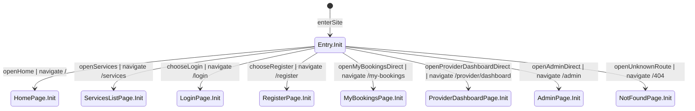

##### ② Home Page (`/`)
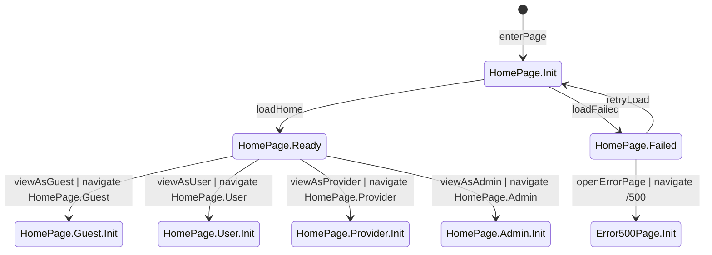

##### ③ Services List Page (`/services`)
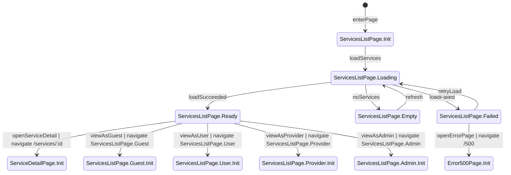

##### ④ Service Detail Page (`/services/:id`)
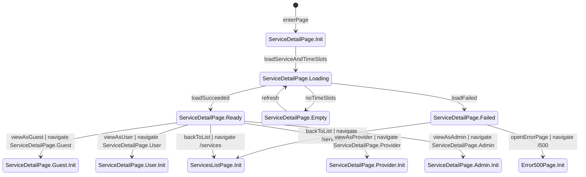

##### ⑤ My Bookings Page (`/my-bookings`)
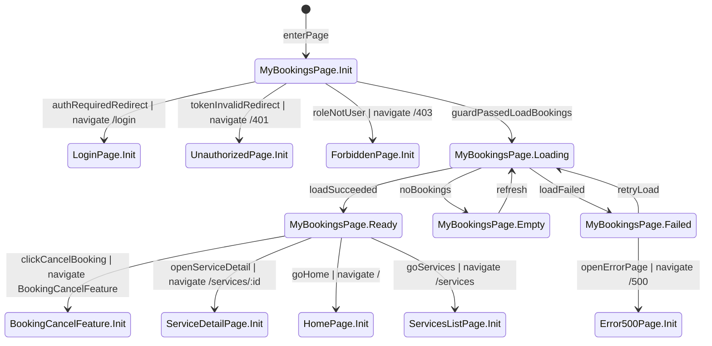

##### ⑥ Provider Dashboard Page (`/provider/dashboard`)
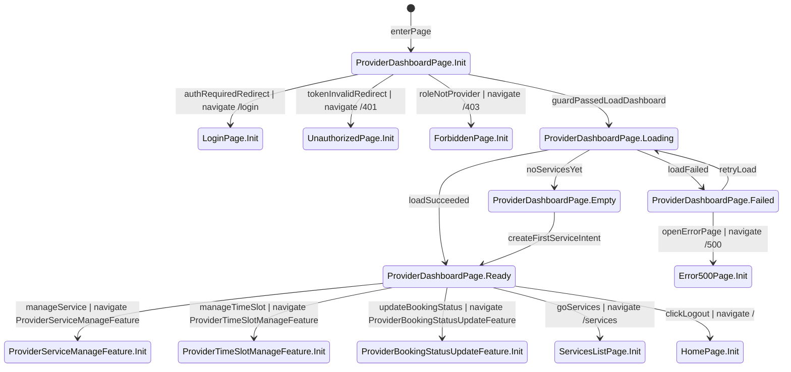

##### ⑦ Admin Page (`/admin`)
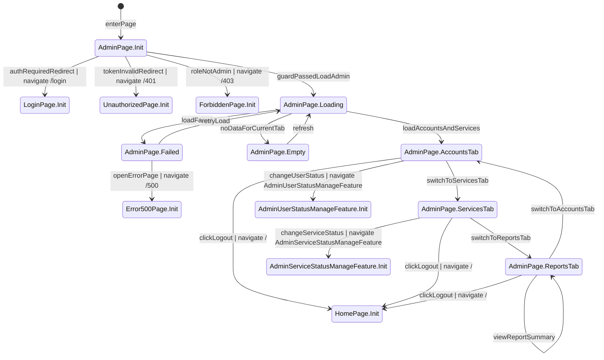

##### ⑧ Login Page (`/login`)
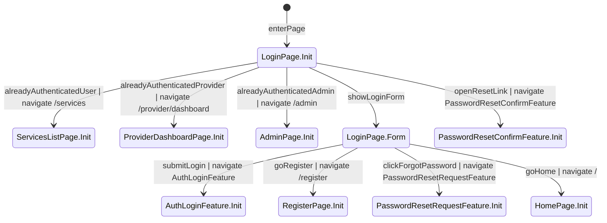

##### ⑨ Register Page (`/register`)
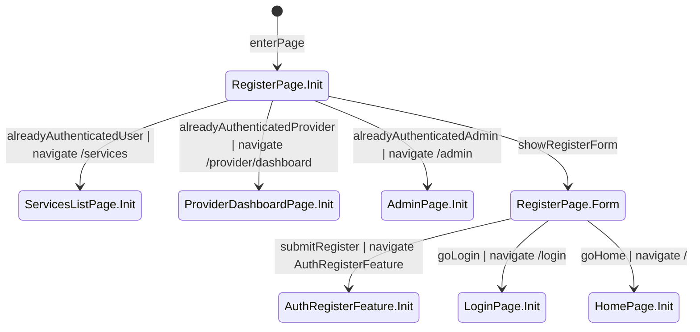

##### ⑩ Unauthorized Page (`/401`)
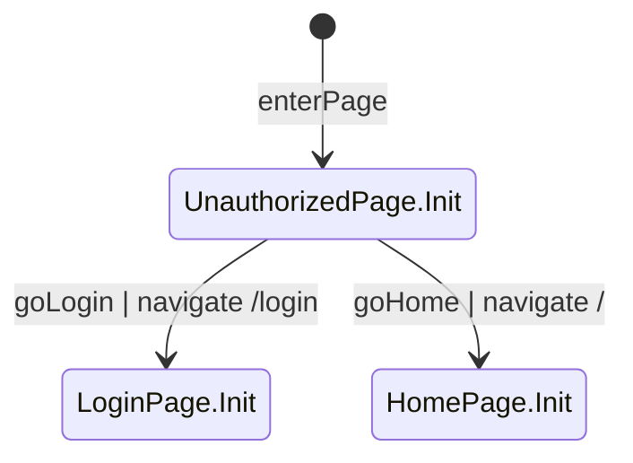

##### ⑪ Forbidden Page (`/403`)
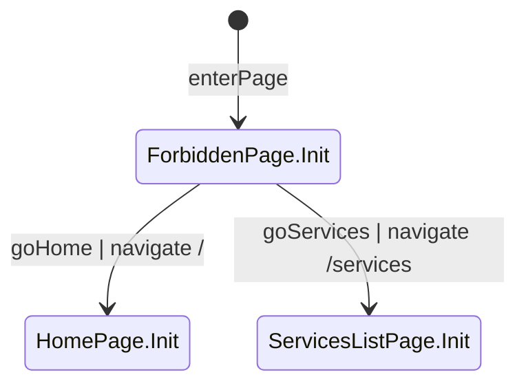

##### ⑫ Not Found Page (`/404`)
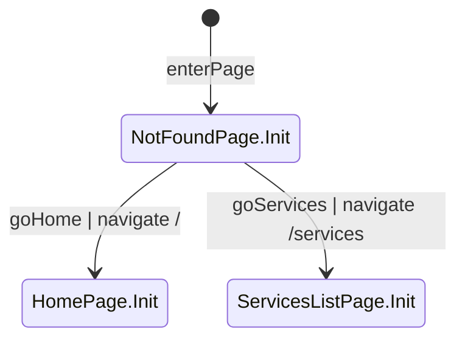

##### ⑬ Error 500 Page (`/500`)
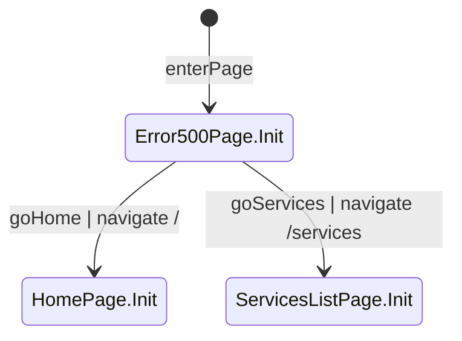

##### ⑭~⑰ HomePage role views
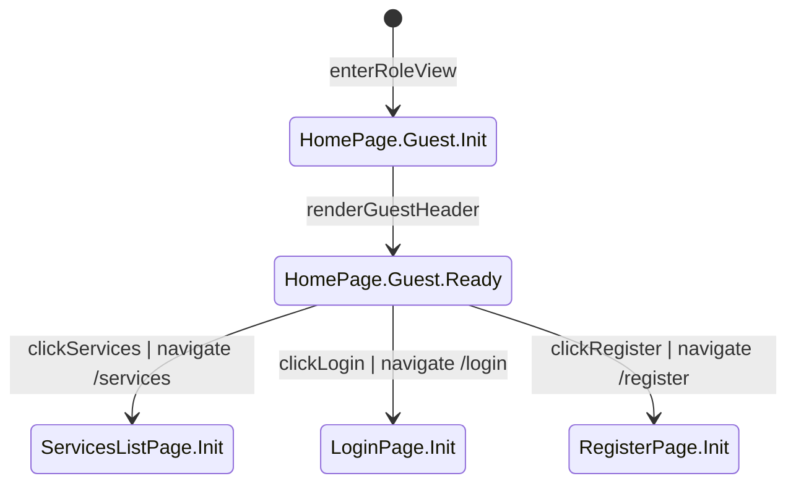

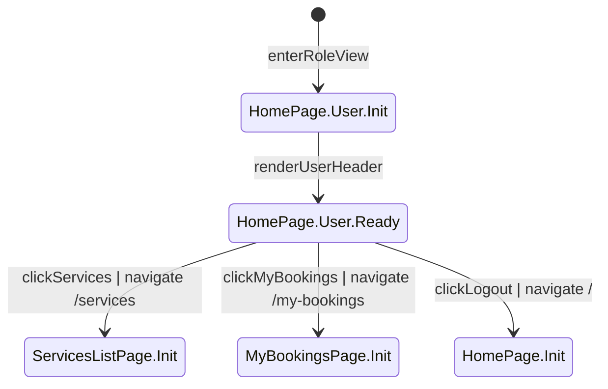

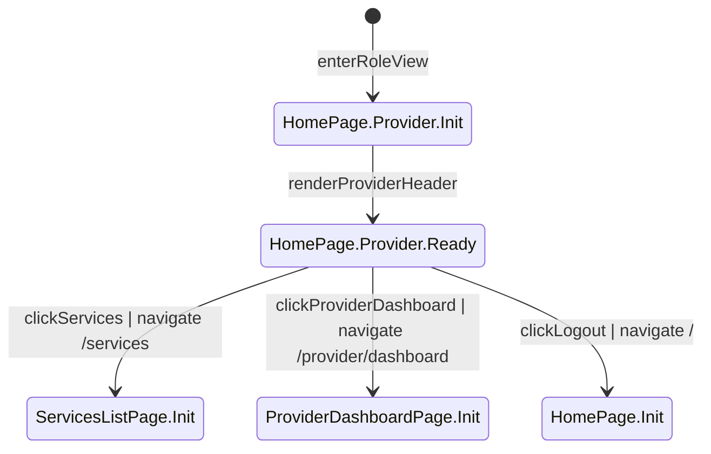

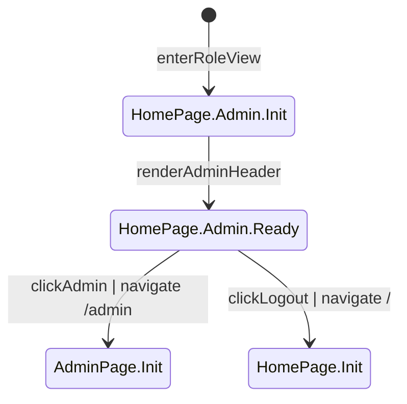

##### ⑱~㉑ ServicesListPage role views
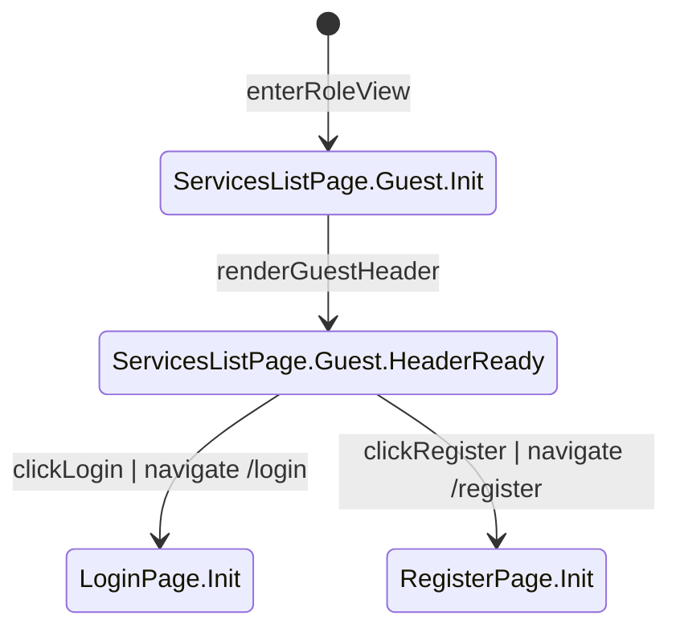

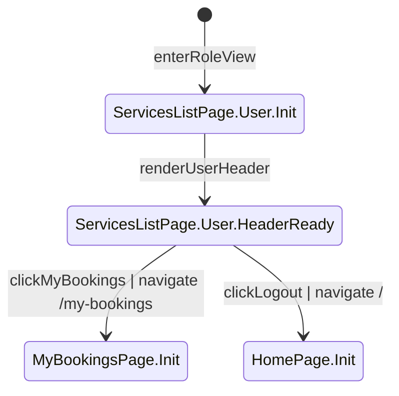

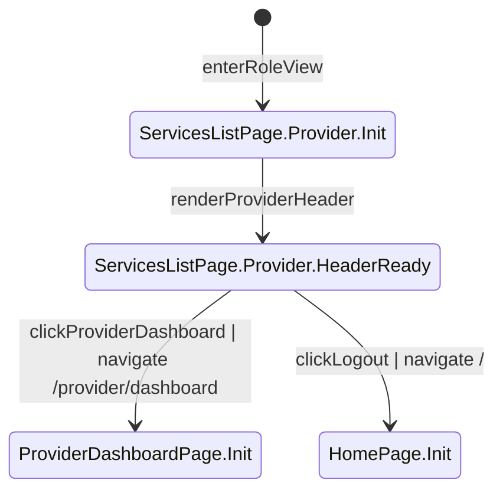

```mermaid
%% role: Admin
%% extends: ServicesListPage
stateDiagram-v2
  [*] --> ServicesListPage.Admin.Init : enterRoleView
  ServicesListPage.Admin.Init --> ServicesListPage.Admin.HeaderReady : renderAdminHeader
  ServicesListPage.Admin.HeaderReady --> AdminPage.Init : clickAdmin | navigate /admin
  ServicesListPage.Admin.HeaderReady --> HomePage.Init : clickLogout | navigate /
```

##### ㉒~㉕ ServiceDetailPage role views
```mermaid
%% role: Guest
%% extends: ServiceDetailPage
stateDiagram-v2
  [*] --> ServiceDetailPage.Guest.Init : enterRoleView
  ServiceDetailPage.Guest.Init --> ServiceDetailPage.Guest.Ready : renderGuestView
  ServiceDetailPage.Guest.Ready --> ServicesListPage.Init : clickServices | navigate /services
  ServiceDetailPage.Guest.Ready --> LoginPage.Init : clickLoginToBook | navigate /login
  ServiceDetailPage.Guest.Ready --> RegisterPage.Init : clickRegisterToBook | navigate /register
```

```mermaid
%% role: User
%% extends: ServiceDetailPage
stateDiagram-v2
  [*] --> ServiceDetailPage.User.Init : enterRoleView
  ServiceDetailPage.User.Init --> ServiceDetailPage.User.Ready : renderUserView
  ServiceDetailPage.User.Ready --> BookingCreateFeature.Init : clickBookNow | navigate BookingCreateFeature
  ServiceDetailPage.User.Ready --> ServicesListPage.Init : clickServices | navigate /services
  ServiceDetailPage.User.Ready --> MyBookingsPage.Init : clickMyBookings | navigate /my-bookings
  ServiceDetailPage.User.Ready --> HomePage.Init : clickLogout | navigate /
```

```mermaid
%% role: Provider
%% extends: ServiceDetailPage
stateDiagram-v2
  [*] --> ServiceDetailPage.Provider.Init : enterRoleView
  ServiceDetailPage.Provider.Init --> ServiceDetailPage.Provider.Ready : renderReadOnlyView
  ServiceDetailPage.Provider.Ready --> ServicesListPage.Init : clickServices | navigate /services
  ServiceDetailPage.Provider.Ready --> ProviderDashboardPage.Init : clickProviderDashboard | navigate /provider/dashboard
  ServiceDetailPage.Provider.Ready --> HomePage.Init : clickLogout | navigate /
```

```mermaid
%% role: Admin
%% extends: ServiceDetailPage
stateDiagram-v2
  [*] --> ServiceDetailPage.Admin.Init : enterRoleView
  ServiceDetailPage.Admin.Init --> ServiceDetailPage.Admin.Ready : renderReadOnlyView
  ServiceDetailPage.Admin.Ready --> AdminPage.Init : clickAdmin | navigate /admin
  ServiceDetailPage.Admin.Ready --> HomePage.Init : clickLogout | navigate /
```

##### ㉖~㊱ Feature state machines
```mermaid
%% role: none
stateDiagram-v2
  [*] --> AuthLoginFeature.Init : enterFeature
  AuthLoginFeature.Init --> AuthLoginFeature.Submitting : submitCredentials
  AuthLoginFeature.Submitting --> AuthLoginFeature.Failed : authFailed
  AuthLoginFeature.Submitting --> AuthLoginFeature.SucceededUser : authSucceededUser
  AuthLoginFeature.Submitting --> AuthLoginFeature.SucceededProvider : authSucceededProvider
  AuthLoginFeature.Submitting --> AuthLoginFeature.SucceededAdmin : authSucceededAdmin
  AuthLoginFeature.Failed --> LoginPage.Init : returnToLogin | navigate /login
  AuthLoginFeature.SucceededUser --> ServicesListPage.Init : loginDoneDefault | navigate /services
  AuthLoginFeature.SucceededUser --> MyBookingsPage.Init : loginDoneReturnToMyBookings | navigate /my-bookings
  AuthLoginFeature.SucceededProvider --> ProviderDashboardPage.Init : loginDoneDefault | navigate /provider/dashboard
  AuthLoginFeature.SucceededAdmin --> AdminPage.Init : loginDoneDefault | navigate /admin
```

```mermaid
%% role: none
stateDiagram-v2
  [*] --> AuthRegisterFeature.Init : enterFeature
  AuthRegisterFeature.Init --> AuthRegisterFeature.Validating : validateInputsAndRoleSelection
  AuthRegisterFeature.Validating --> AuthRegisterFeature.Submitting : submitRegistration
  AuthRegisterFeature.Submitting --> AuthRegisterFeature.Failed : registerFailed
  AuthRegisterFeature.Submitting --> AuthRegisterFeature.SucceededUser : registerSucceededUser
  AuthRegisterFeature.Submitting --> AuthRegisterFeature.SucceededProvider : registerSucceededProvider
  AuthRegisterFeature.Failed --> RegisterPage.Init : returnToRegister | navigate /register
  AuthRegisterFeature.SucceededUser --> ServicesListPage.Init : registerDone | navigate /services
  AuthRegisterFeature.SucceededProvider --> ProviderDashboardPage.Init : registerDone | navigate /provider/dashboard
```

```mermaid
%% role: none
stateDiagram-v2
  [*] --> PasswordResetRequestFeature.Init : enterFeature
  PasswordResetRequestFeature.Init --> PasswordResetRequestFeature.Validating : validateEmail
  PasswordResetRequestFeature.Validating --> PasswordResetRequestFeature.Submitting : submitResetRequest
  PasswordResetRequestFeature.Submitting --> PasswordResetRequestFeature.Done : requestAccepted
  PasswordResetRequestFeature.Done --> LoginPage.Init : backToLogin | navigate /login
```

```mermaid
%% role: none
stateDiagram-v2
  [*] --> PasswordResetConfirmFeature.Init : enterFeature
  PasswordResetConfirmFeature.Init --> PasswordResetConfirmFeature.Validating : validateResetToken
  PasswordResetConfirmFeature.Validating --> PasswordResetConfirmFeature.Submitting : submitNewPassword
  PasswordResetConfirmFeature.Submitting --> PasswordResetConfirmFeature.Failed : resetFailed
  PasswordResetConfirmFeature.Submitting --> PasswordResetConfirmFeature.Done : resetSucceeded
  PasswordResetConfirmFeature.Failed --> LoginPage.Init : backToLogin | navigate /login
  PasswordResetConfirmFeature.Done --> LoginPage.Init : resetDoneReturn | navigate /login
```

```mermaid
%% role: User
stateDiagram-v2
  [*] --> BookingCreateFeature.Init : enterFeature
  BookingCreateFeature.Init --> BookingCreateFeature.Validating : validateJwtRoleAndTimeSlot
  BookingCreateFeature.Validating --> BookingCreateFeature.Submitting : createBookingAndReserveSeat
  BookingCreateFeature.Submitting --> BookingCreateFeature.Failed : createFailed
  BookingCreateFeature.Submitting --> BookingCreateFeature.Done : createSucceeded
  BookingCreateFeature.Failed --> ServiceDetailPage.Init : backToServiceDetail | navigate /services/:id
  BookingCreateFeature.Done --> MyBookingsPage.Init : goMyBookings | navigate /my-bookings
```

```mermaid
%% role: User
stateDiagram-v2
  [*] --> BookingCancelFeature.Init : enterFeature
  BookingCancelFeature.Init --> BookingCancelFeature.Validating : validateOwnershipAndCancelDeadline
  BookingCancelFeature.Validating --> BookingCancelFeature.Submitting : cancelBookingAndReleaseSeat
  BookingCancelFeature.Submitting --> BookingCancelFeature.Failed : cancelFailed
  BookingCancelFeature.Submitting --> BookingCancelFeature.Done : cancelSucceeded
  BookingCancelFeature.Failed --> MyBookingsPage.Init : backToMyBookings | navigate /my-bookings
  BookingCancelFeature.Done --> MyBookingsPage.Init : returnToMyBookings | navigate /my-bookings
```

```mermaid
%% role: Provider
stateDiagram-v2
  [*] --> ProviderServiceManageFeature.Init : enterFeature
  ProviderServiceManageFeature.Init --> ProviderServiceManageFeature.Editing : openCreateOrEditForm
  ProviderServiceManageFeature.Editing --> ProviderServiceManageFeature.Submitting : submitServiceChanges
  ProviderServiceManageFeature.Submitting --> ProviderServiceManageFeature.Failed : saveFailed
  ProviderServiceManageFeature.Submitting --> ProviderServiceManageFeature.Done : saveSucceeded
  ProviderServiceManageFeature.Done --> ProviderDashboardPage.Init : returnToDashboard | navigate /provider/dashboard
  ProviderServiceManageFeature.Failed --> ProviderDashboardPage.Init : backToDashboard | navigate /provider/dashboard
```

```mermaid
%% role: Provider
stateDiagram-v2
  [*] --> ProviderTimeSlotManageFeature.Init : enterFeature
  ProviderTimeSlotManageFeature.Init --> ProviderTimeSlotManageFeature.Editing : openCreateOrEditTimeSlot
  ProviderTimeSlotManageFeature.Editing --> ProviderTimeSlotManageFeature.Submitting : submitTimeSlotChanges
  ProviderTimeSlotManageFeature.Submitting --> ProviderTimeSlotManageFeature.Failed : saveFailed
  ProviderTimeSlotManageFeature.Submitting --> ProviderTimeSlotManageFeature.Done : saveSucceeded
  ProviderTimeSlotManageFeature.Done --> ProviderDashboardPage.Init : returnToDashboard | navigate /provider/dashboard
  ProviderTimeSlotManageFeature.Failed --> ProviderDashboardPage.Init : backToDashboard | navigate /provider/dashboard
```

```mermaid
%% role: Provider
stateDiagram-v2
  [*] --> ProviderBookingStatusUpdateFeature.Init : enterFeature
  ProviderBookingStatusUpdateFeature.Init --> ProviderBookingStatusUpdateFeature.Validating : validateServiceOwnershipAndCurrentStatus
  ProviderBookingStatusUpdateFeature.Validating --> ProviderBookingStatusUpdateFeature.Submitting : submitStatusChange
  ProviderBookingStatusUpdateFeature.Submitting --> ProviderBookingStatusUpdateFeature.Failed : updateFailed
  ProviderBookingStatusUpdateFeature.Submitting --> ProviderBookingStatusUpdateFeature.Done : updateSucceeded
  ProviderBookingStatusUpdateFeature.Done --> ProviderDashboardPage.Init : returnToDashboard | navigate /provider/dashboard
  ProviderBookingStatusUpdateFeature.Failed --> ProviderDashboardPage.Init : backToDashboard | navigate /provider/dashboard
```

```mermaid
%% role: Admin
stateDiagram-v2
  [*] --> AdminUserStatusManageFeature.Init : enterFeature
  AdminUserStatusManageFeature.Init --> AdminUserStatusManageFeature.Validating : validateTargetUser
  AdminUserStatusManageFeature.Validating --> AdminUserStatusManageFeature.Submitting : submitStatusChange
  AdminUserStatusManageFeature.Submitting --> AdminUserStatusManageFeature.Failed : updateFailed
  AdminUserStatusManageFeature.Submitting --> AdminUserStatusManageFeature.Done : updateSucceeded
  AdminUserStatusManageFeature.Done --> AdminPage.Init : returnToAdmin | navigate /admin
  AdminUserStatusManageFeature.Failed --> AdminPage.Init : backToAdmin | navigate /admin
```

```mermaid
%% role: Admin
stateDiagram-v2
  [*] --> AdminServiceStatusManageFeature.Init : enterFeature
  AdminServiceStatusManageFeature.Init --> AdminServiceStatusManageFeature.Validating : validateTargetService
  AdminServiceStatusManageFeature.Validating --> AdminServiceStatusManageFeature.Submitting : submitStatusChange
  AdminServiceStatusManageFeature.Submitting --> AdminServiceStatusManageFeature.Failed : updateFailed
  AdminServiceStatusManageFeature.Submitting --> AdminServiceStatusManageFeature.Done : updateSucceeded
  AdminServiceStatusManageFeature.Done --> AdminPage.Init : returnToAdmin | navigate /admin
  AdminServiceStatusManageFeature.Failed --> AdminPage.Init : backToAdmin | navigate /admin
```

### 失敗模式與復原（必填）

- **失敗模式**: 名額保留發生併發衝突（大量使用者同時預約同一 TimeSlot）。
- **復原策略**: 交易必須以原子方式失敗：不得建立 Booking、不得遞增 booked_count；客戶端顯示「名額不足/搶位失敗」並刷新可用性。

- **失敗模式**: 建立/取消請求重複送出（使用者重試、網路重送）。
- **復原策略**: 伺服器必須強制「防重複預約」與「取消冪等」；透過重複送出請求驗證 booked_count 只改變一次。

- **失敗模式**: 憑證無效/過期或帳號被停權。
- **復原策略**: 依路由守衛視為未授權/禁止；不得回傳任何受保護資料。

- **失敗模式**: 忘記密碼 token 重放。
- **復原策略**: token 成功使用後需標記為已使用；後續再次使用必須失敗；以同一連結嘗試兩次驗證。

### 安全與權限（必填）

- **身份驗證**: 任何受保護路由與任何寫入操作都必須驗證；公開讀取僅限於 services/timeSlots 瀏覽。
- **授權**: RBAC + ownership 檢查必須於伺服器端對每個請求強制；UI 可見性不等於授權。
- **敏感資料**:
  - password_hash 與 reset token hash 不得回傳給客戶端。
  - access credential 必須驗證簽章與有效期。
  - AuditLog 可能含 before/after 資料，必須限制給授權角色（至少 Admin；若對 Provider/User 曝露也只能限於自己的範圍）。

### 可觀測性（必填）

- **日誌（Logging）**: 所有 auth 失敗、授權失敗、booking 建立/取消結果、provider/admin 管理操作、以及交易衝突結果都必須記錄。
- **追蹤（Tracing）**: 每個請求應帶 correlation id，並與相關 AuditLog 一起記錄。
- **使用者錯誤訊息**: 必須符合角色且不含敏感資訊（例：忘記密碼回應不得洩漏 email 是否存在）。
- **開發者診斷**: 回應應包含穩定的內部錯誤代碼（不得回傳 stack trace）以利支援/除錯。

### 向下相容與變更風險（必填）

- **破壞性變更？**: 否（新產品功能面）。
- **遷移計畫**: 初版不適用；若從人工排程系統遷移，資料匯入不在本功能範圍內。
- **回滾計畫**: 需能全域停用「建立預約」（例如營運開關），但仍保留只讀瀏覽與既有預約查詢；不應需要硬刪除。

### 效能與規模假設（必填）

- **成長假設**: 至少支援數萬註冊使用者、數千服務，以及尖峰時數百使用者同時搶同一 TimeSlot 的情境。
- **限制**: 使用者操作（瀏覽服務、建立預約、取消預約）應足夠快速，避免使用者因等待而重複重試；在正常狀況下，主要 API 平均回應時間目標 < 500ms。

### 主要實體（若功能涉及資料則建議包含）

- **User**: 帳號實體（email、role=USER/PROVIDER/ADMIN、status=ACTIVE/SUSPENDED）。
- **Service**: Provider 名下的服務項目（name/description/duration），並具狀態（ACTIVE/INACTIVE）。
- **TimeSlot**: Service 底下可預約的時段（capacity、booked_count、status=OPEN/CLOSED、cancel deadline）。
- **Booking**: User 對 TimeSlot 的預約（嚴格狀態機），並包含取消/完成時間戳。
- **PasswordResetToken**: 一次性且會過期的重設 token（以雜湊保存），包含 used_at。
- **AuditLog**: 關鍵操作的不可變稽核紀錄（actor/target、before/after、timestamp）。

## 成功準則（必填）

### 可量測成果

- **SC-001**: 新使用者從首次開啟 `/register` 起，能在 2 分鐘內完成註冊並抵達其角色預設首頁。
- **SC-002**: 任何包含高併發搶位的測試期間，超賣事件為 0：booked_count 永遠不得超過 capacity。
- **SC-003**: 當名額充足時，至少 95% 的建立預約嘗試可在不需重試的情況下成功完成。
- **SC-004**: 至少 90% 的使用者能從開啟 `/my-bookings` 起 30 秒內完成「找到並取消一筆仍可取消（未超過 deadline）的預約」。

## 假設

- 建立 Booking 的初始狀態為 PENDING；後續轉移到 CONFIRMED/COMPLETED 由 Provider 依狀態機執行。
- 從有效預約狀態（PENDING/CONFIRMED）轉移到 CANCELLED 時，必須釋放 1 個名額（booked_count -1）且必須稽核。
- Admin 角色由系統政策指派，且不可由一般註冊取得。

## 不在範圍內

- 付款、退款、發票與任何金流相關流程。
- 外部行事曆同步（Google Calendar、iCal）與超出忘記密碼 email 之外的推播通知。
- Provider 代替使用者建立預約。
- 核心實體（Users, Services, TimeSlots, Bookings）的硬刪除。

## 依賴

- 平台能可靠送達忘記密碼 email（供應商選擇屬實作細節）。
- 伺服器端有一致且可信的時間來源，用於強制 `cancel_deadline_at` 與 token 過期。

## 名詞表

- **Guest**: 未登入訪客。
- **User**: 已登入的消費者，能建立與管理自己的 bookings。
- **Provider**: 已登入的服務提供者，管理自己的 services/time slots 並履約。
- **Admin**: 特權角色，管理全系統帳號/服務狀態與報表。
- **TimeSlot**: 具名額上限的可預約時間窗。
- **capacity / booked_count**: TimeSlot 的總名額 vs 已保留名額；剩餘名額 = capacity - booked_count。
