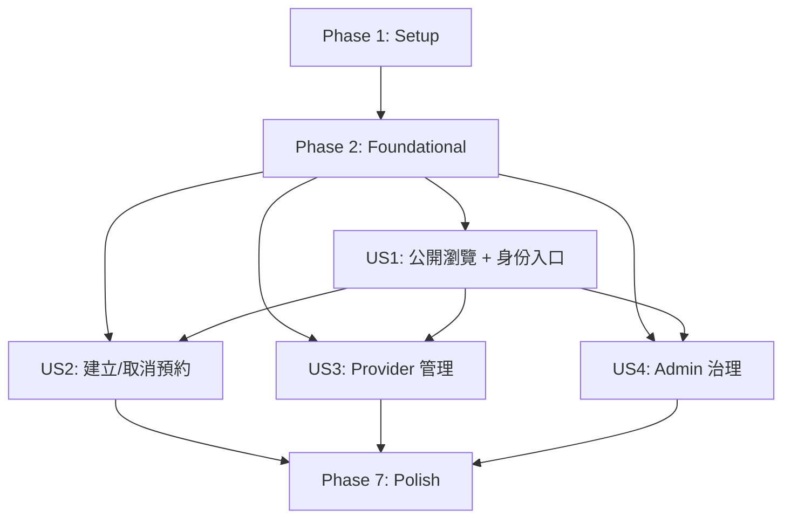

---

description: "Task list for SmartBooking implementation"
---

# Tasks: SmartBooking 預約與排程平台

**Input**: 設計文件位於 `specs/001-smartbooking-scheduling/`
- 必讀：`plan.md`, `spec.md`
- 參考：`research.md`, `data-model.md`, `contracts/openapi.yaml`, `quickstart.md`

**Tech Stack（依 plan.md）**
- Frontend：React + TypeScript + Tailwind + React Router + TanStack Query + React Hook Form + Zod
- Backend：NestJS + TypeScript + REST + JWT + Zod
- DB：SQLite single-file + Prisma Migrate
- Testing：Vitest（unit/integration）+ Playwright（E2E）
- Tooling：ESLint + Prettier

**Tests（必做）**
- 核心商業規則必須有測試（happy path / edge / failure），特別是：
  - 名額不可超賣（交易 + 條件更新）
  - Booking 狀態機合法轉移
  - 取消截止與冪等
  - RBAC + ownership（IDOR 防護）
  - 停權即刻生效（每次受保護請求查 DB）

**Organization**: 任務以使用者故事（US1~US4）分期，確保每個故事可獨立完成與驗證。

## Format（嚴格）

每個 task 必須使用以下格式：

- [ ] `T###`（必填，遞增）
- [ ] `T### [P]`（可平行）
- [ ] `T### [USn]`（使用者故事任務必填）
- [ ] `T### [P] [USn]`（可平行且屬於某故事）

> 注意：Setup/Foundational/Polish 不要加 [USn]；使用者故事 phase 內每一條都必須加 [USn]。

---

## Phase 1: Setup（Shared Infrastructure）

**Purpose**：建立前後端專案骨架、工具鏈與基本 scripts。

- [x] T001 建立前後端目錄結構（backend/, frontend/）與基礎 README（README.md）
- [x] T002 初始化後端 NestJS 專案骨架與 TypeScript 設定（backend/package.json, backend/tsconfig.json, backend/src/main.ts）
- [x] T003 初始化前端 Vite + React + TS 專案骨架（frontend/package.json, frontend/vite.config.ts, frontend/src/main.tsx）
- [x] T004 [P] 設定 ESLint + Prettier（backend/.eslintrc.cjs, backend/.prettierrc, frontend/.eslintrc.cjs, frontend/.prettierrc）
- [x] T005 [P] 設定 Tailwind（frontend/tailwind.config.ts, frontend/postcss.config.js, frontend/src/index.css）
- [x] T006 [P] 建立共用環境變數範本（backend/.env.example, frontend/.env.example）
- [x] T007 建立 workspace-level scripts 指引（docs/dev-scripts.md）

---

## Phase 2: Foundational（Blocking Prerequisites）

**Purpose**：所有 user stories 共用且會阻塞開發的基礎能力（DB、Auth、Error/Observability、契約對齊）。

**⚠️ CRITICAL**：本 phase 完成前，不開始任何 US1~US4 的頁面/功能實作。

### 2.1 Contract-first 對齊（補齊 OpenAPI 缺口）

- [x] T008 補齊公開服務清單與服務詳情端點到契約（specs/001-smartbooking-scheduling/contracts/openapi.yaml）
- [x] T009 補齊 Provider 查詢/更新 booking 狀態端點到契約（specs/001-smartbooking-scheduling/contracts/openapi.yaml）
- [x] T010 補齊 Admin 服務狀態管理與報表摘要端點到契約（specs/001-smartbooking-scheduling/contracts/openapi.yaml）
- [x] T011 更新契約 schemas（ServiceDetailResponse/ReportSummary 等）並維持 ErrorResponse 一致（specs/001-smartbooking-scheduling/contracts/openapi.yaml）

### 2.2 Database / Prisma 基礎

- [x] T012 建立 Prisma schema（依 data-model.md）並設定 SQLite DATABASE_URL（backend/prisma/schema.prisma, backend/.env.example）
- [x] T013 建立 Prisma migrations 與產生 Prisma Client（backend/prisma/migrations/, backend/package.json）
- [x] T014 建立 DB seed（最小可用資料：Admin + Provider + Service + TimeSlot）供 E2E 使用（backend/prisma/seed.ts）

### 2.3 後端共用：錯誤格式、requestId、驗證

- [x] T015 實作 requestId middleware（每個 request 產生/傳遞 requestId）（backend/src/common/middleware/request-id.middleware.ts）
- [x] T016 實作統一錯誤 envelope 與 Exception Filter（對齊 ErrorResponse）（backend/src/common/filters/http-exception.filter.ts）
- [x] T017 實作 Zod 驗證 pipe（request body/query/params runtime validation）（backend/src/common/pipes/zod-validation.pipe.ts）
- [x] T018 建立錯誤碼列舉/常數（BOOKING_SEAT_FULL 等）並統一映射 HTTP status（backend/src/common/errors/error-codes.ts）

### 2.4 後端共用：Authn/Authz（JWT + RBAC + status check）

- [x] T019 建立 Auth 模組（JWT sign/verify、密碼 hash、登入/註冊流程骨架）（backend/src/auth/auth.module.ts, backend/src/auth/auth.service.ts）
- [x] T020 實作 JWT Guard（驗簽 + 取出 userId/role）（backend/src/auth/guards/jwt-auth.guard.ts）
- [x] T021 實作 Roles Guard（RBAC：USER/PROVIDER/ADMIN）（backend/src/auth/guards/roles.guard.ts）
- [x] T022 實作「每次受保護請求查 DB 確認 user.status=ACTIVE」策略（backend/src/auth/guards/active-user.guard.ts）
- [x] T023 建立 Decorators：@CurrentUser、@Roles（backend/src/auth/decorators/current-user.decorator.ts, backend/src/auth/decorators/roles.decorator.ts）

### 2.5 後端共用：AuditLog

- [x] T024 建立 AuditLog Prisma model 與 migration（backend/prisma/schema.prisma）
- [x] T025 實作 AuditLogService（支援 before/after JSON、與交易同寫）（backend/src/audit-logs/audit-logs.service.ts）

### 2.6 前端共用：路由守衛、導覽列、API client

- [x] T026 建立 React Router 路由骨架與受保護路由守衛（含 returnTo /401 /403）（frontend/src/routes/router.tsx, frontend/src/routes/guards.tsx）
- [x] T027 實作 Auth state（存取 token、目前 user、登出清除）（frontend/src/state/auth.store.ts）
- [x] T028 實作 API client（自動附加 Authorization header、處理 ErrorResponse）（frontend/src/api/http.ts）
- [x] T029 實作 Zod schemas（前端 runtime 驗證 response；後端為準）（frontend/src/api/schemas.ts）
- [x] T030 實作 Header 導覽列（依角色顯示連結；符合 spec FR-027）（frontend/src/components/Header.tsx）

### 2.7 測試框架基礎

- [x] T031 設定後端 Vitest 測試環境（含 tsconfig/paths、test runner script）（backend/vitest.config.ts, backend/package.json）
- [x] T032 [P] 設定前端 Vitest（React Testing Library 若需要）與基本 smoke test（frontend/vitest.config.ts, frontend/package.json）
- [x] T033 設定 Playwright（baseURL、啟動前後端、使用 seed 資料）（frontend/tests/e2e/playwright.config.ts）

**Checkpoint**：Foundation ready（可開始 US1~US4）。

---

## Phase 3: 使用者故事 1（US1）- 公開瀏覽 + 身份入口（Priority: P1）

**Goal**：Guest 能瀏覽公開服務/時段；可註冊/登入/忘記密碼；登入後依角色導向與導覽顯示。

**Independent Test**：以 seed 資料 + 一組 Guest→Register/Login→導向驗證；不需要 Booking/Provider/Admin 功能。

### Tests（US1）

- [x] T034 [P] [US1] 後端：Auth 註冊/登入/停權拒絕的單元測試（backend/test/unit/auth.service.test.ts）
- [x] T035 [P] [US1] 後端：forgot/reset token 一次性 + 過期的單元測試（backend/test/unit/password-reset.test.ts）
- [x] T036 [P] [US1] E2E：Guest 瀏覽 services → 前往 login/register → 依角色導向（frontend/tests/e2e/us1-auth-and-browse.spec.ts）

### Backend implementation（US1）

- [x] T037 [US1] 實作 Register（email unique、password hash、回傳 accessToken）（backend/src/auth/auth.controller.ts）
- [x] T038 [US1] 實作 Login（帳密驗證、SUSPENDED 拒絕、回傳 accessToken）（backend/src/auth/auth.controller.ts）
- [x] T039 [US1] 實作 Me（回傳 current user 基本資料）（backend/src/auth/auth.controller.ts）
- [x] T040 [US1] 實作 Logout（stateless；回 204）（backend/src/auth/auth.controller.ts）
- [x] T041 [US1] 實作 Forgot password（永遠回 202/accepted；建立 token_hash + expires）（backend/src/auth/password-reset.service.ts, backend/src/auth/auth.controller.ts）
- [x] T042 [US1] 實作 Reset password（驗證 token_hash + used_at + expires；同交易更新 password_hash + used_at）（backend/src/auth/password-reset.service.ts）
- [x] T043 [US1] 實作 Public services list / service detail（含時段資訊，符合補齊後 OpenAPI）（backend/src/services/services.controller.ts）
- [x] T044 [US1] 實作 Public open timeslots list（已存在於 OpenAPI；供 /services/:id 顯示）（backend/src/timeslots/timeslots.controller.ts）

### Frontend implementation（US1）

- [x] T045 [US1] 建立首頁（/）與 CTA（避免 CTA 去重；符合 HomePage state machine）（frontend/src/pages/HomePage.tsx）
- [x] T046 [US1] 建立服務清單頁（/services）含 Loading/Empty/Error（frontend/src/pages/ServicesListPage.tsx）
- [x] T047 [US1] 建立服務詳情頁（/services/:id）含時段列表與剩餘名額顯示（frontend/src/pages/ServiceDetailPage.tsx）
- [x] T048 [US1] 建立 Login 頁（/login）含 returnTo、Submitting、防重送（frontend/src/pages/LoginPage.tsx）
- [x] T049 [US1] 建立 Register 頁（/register）含 role 選擇互斥、Submitting、防重送（frontend/src/pages/RegisterPage.tsx）
- [x] T050 [US1] 建立忘記密碼請求與重設表單（依 spec：在 /login 流程呈現）（frontend/src/features/password-reset/）
- [x] T051 [US1] 導覽列依角色顯示連結（Guest/User/Provider/Admin）（frontend/src/components/Header.tsx）
- [x] T052 [US1] 建立錯誤頁（/401 /403 /404 /500）與導向入口（frontend/src/pages/errors/）

**Checkpoint**：US1 可獨立跑完（Guest 瀏覽 → 註冊/登入 → 依角色導向與導覽顯示）。

---

## Phase 4: 使用者故事 2（US2）- User 安全建立與取消預約（Priority: P2）

**Goal**：User 可建立/查詢/取消自己的預約；取消截止與冪等；高併發下不可超賣。

**Independent Test**：用 seed 建立一個 OPEN timeslot，跑 create/cancel + 不變量測試；不依賴 Provider/Admin UI。

### Tests（US2）

- [x] T053 [P] [US2] 後端：createBooking 交易 + 條件更新防超賣測試（backend/test/integration/booking-create.transaction.test.ts）
- [x] T054 [P] [US2] 後端：cancelBooking 截止時間/冪等/不得為負測試（backend/test/integration/booking-cancel.transaction.test.ts）
- [x] T055 [P] [US2] 後端：ownership（IDOR）測試：不可讀/取消他人 booking（backend/test/integration/booking-ownership.test.ts）
- [x] T056 [P] [US2] E2E：User 在服務詳情預約 → /my-bookings 檢視 → 取消（frontend/tests/e2e/us2-booking-flow.spec.ts）

### Backend implementation（US2）

- [x] T057 [US2] 建立 Booking/TimeSlot Prisma models（含 booked_count、不變量欄位）（backend/prisma/schema.prisma）
- [x] T058 [US2] 實作 createBooking：交易 + `UPDATE ... booked_count < capacity` + 建立 booking（backend/src/bookings/bookings.service.ts）
- [x] T059 [US2] 實作 listMyBookings：只回傳 user_id=自己（backend/src/bookings/bookings.controller.ts）
- [x] T060 [US2] 實作 cancelBooking：截止時間 + 冪等（已取消回 409）+ seat release 同交易（backend/src/bookings/bookings.service.ts）
- [x] T061 [US2] 實作 AuditLog：booking create/cancel（同交易寫入）（backend/src/bookings/bookings.service.ts）

### Frontend implementation（US2）

- [x] T062 [US2] 在服務詳情頁加入「立即預約」CTA（只對 User 顯示；符合 state machine）（frontend/src/pages/ServiceDetailPage.tsx）
- [x] T063 [US2] 實作 BookingCreateFeature（Submitting/Failed/Done 狀態；衝突錯誤處理）（frontend/src/features/booking-create/）
- [x] T064 [US2] 建立 /my-bookings 頁（Loading/Empty/Error；依狀態顯示）（frontend/src/pages/MyBookingsPage.tsx）
- [x] T065 [US2] 實作 BookingCancelFeature（截止時間提示、Submitting、防重送、成功後刷新）（frontend/src/features/booking-cancel/）

**Checkpoint**：US2 可獨立驗證 `0 <= booked_count <= capacity`、不可重複預約、取消冪等與截止。

---

## Phase 5: 使用者故事 3（US3）- Provider 管理供給與履約（Priority: P3）

**Goal**：Provider 管理自己的服務/時段/預約名單；更新 booking 狀態必須符合狀態機；越權阻擋且可稽核。

**Independent Test**：用 Provider seed 帳號建立/更新 service/timeslot、列出 bookings、更新狀態並驗證 AuditLog；不依賴 Admin。

### Tests（US3）

- [x] T066 [P] [US3] 後端：provider ownership 測試（不可操作他人 service/timeslot/booking）（backend/test/integration/provider-ownership.test.ts）
- [x] T067 [P] [US3] 後端：timeslot overlap/capacity 調降規則測試（backend/test/integration/timeslot-rules.test.ts）
- [x] T068 [P] [US3] 後端：booking 狀態機合法/非法轉移測試（backend/test/unit/booking-state-machine.test.ts）
- [x] T069 [P] [US3] E2E：Provider Dashboard 建立 service/timeslot、更新 booking 狀態（frontend/tests/e2e/us3-provider-dashboard.spec.ts）

### Backend implementation（US3）

- [x] T070 [US3] 實作 Provider service CRUD（含 status=ACTIVE/INACTIVE、寫 AuditLog）（backend/src/provider/provider-services.controller.ts, backend/src/services/services.service.ts）
- [x] T071 [US3] 實作 Provider timeslot CRUD（overlap 檢查、capacity 不可小於 booked_count、寫 AuditLog）（backend/src/provider/provider-timeslots.controller.ts）
- [x] T072 [US3] 補齊 Provider bookings list 端點（只回自己 service 的 bookings）（backend/src/provider/provider-bookings.controller.ts）
- [x] T073 [US3] 補齊 Provider booking status update（符合狀態機；寫 completed_at/cancelled_at；寫 AuditLog）（backend/src/provider/provider-bookings.service.ts）

### Frontend implementation（US3）

- [x] T074 [US3] 建立 /provider/dashboard 頁面骨架（Loading/Empty/Error；符合 state machine）（frontend/src/pages/ProviderDashboardPage.tsx）
- [x] T075 [US3] ProviderServiceManageFeature：建立/更新/停用服務（frontend/src/features/provider-service-manage/）
- [x] T076 [US3] ProviderTimeSlotManageFeature：建立/更新/關閉時段（frontend/src/features/provider-timeslot-manage/）
- [x] T077 [US3] ProviderBookingStatusUpdateFeature：查看 bookings 並更新狀態（frontend/src/features/provider-booking-status-update/）

**Checkpoint**：US3 可獨立驗證：只能操作自己資料、capacity/overlap 規則、狀態機合法轉移、AuditLog 完整。

---

## Phase 6: 使用者故事 4（US4）- Admin 治理與營運控管（Priority: P4）

**Goal**：Admin 管理 user status、service status；查看報表摘要；所有操作稽核。

**Independent Test**：用 Admin seed 帳號呼叫管理 API + 前端 /admin 三分頁驗證；不依賴 Provider。

### Tests（US4）

- [x] T078 [P] [US4] 後端：Admin RBAC 測試（非 Admin 不可存取）（backend/test/integration/admin-rbac.test.ts）
- [x] T079 [P] [US4] 後端：suspend/activate 立即生效測試（被停權後受保護請求拒絕）（backend/test/integration/user-suspend-immediate.test.ts）
- [x] T080 [P] [US4] 後端：service status 切換影響 booking create（INACTIVE 禁止新 booking）（backend/test/integration/admin-service-status.test.ts）
- [x] T081 [P] [US4] E2E：Admin /admin 分頁切換 + 停權 + 服務停用 + 報表顯示（frontend/tests/e2e/us4-admin.spec.ts）

### Backend implementation（US4）

- [x] T082 [US4] 實作 Admin list users（backend/src/admin/admin.controller.ts）
- [x] T083 [US4] 實作 Admin suspend/activate user（寫 AuditLog）（backend/src/admin/admin.controller.ts, backend/src/admin/admin.service.ts）
- [x] T084 [US4] 實作 Admin service status update（寫 AuditLog）（backend/src/admin/admin.service.ts）
- [x] T085 [US4] 實作 Report summary（bookings/取消率/active services；只讀）（backend/src/admin/reports.controller.ts）

### Frontend implementation（US4）

- [x] T086 [US4] 建立 /admin 頁面骨架與 Tabs（Accounts/Services/Reports；符合 state machine）（frontend/src/pages/AdminPage.tsx）
- [x] T087 [US4] AdminUserStatusManageFeature：停權/啟用（frontend/src/features/admin-user-status-manage/）
- [x] T088 [US4] AdminServiceStatusManageFeature：切換 ACTIVE/INACTIVE（frontend/src/features/admin-service-status-manage/）
- [x] T089 [US4] ReportsTab：顯示報表摘要（frontend/src/features/admin-reports/）

**Checkpoint**：US4 可獨立驗證：管理操作被稽核、停權即刻生效、INACTIVE service 禁止新 booking、報表一致。

---

## Phase 7: Polish & Cross-Cutting Concerns

**Purpose**：跨故事品質提升與交付收尾。

- [x] T090 [P] 補齊 Quickstart 實際可執行步驟（依實作 scripts 調整）（specs/001-smartbooking-scheduling/quickstart.md）
- [x] T091 [P] 增補 API 錯誤碼對照表（code→HTTP status→UI 行為）（docs/error-codes.md）
- [x] T092 安全性檢核：避免 user enumeration、敏感資訊不回傳（backend/src/common/filters/http-exception.filter.ts）
- [x] T093 觀測性檢核：所有錯誤回應都含 requestId；AuditLog actions 完整覆蓋（backend/src/common/middleware/request-id.middleware.ts, backend/src/audit-logs/）
- [x] T094 效能/併發檢核：create/cancel booking 交易範圍最小化（backend/src/bookings/bookings.service.ts）
- [x] T095 建立最小 smoke test：前後端啟動 + health check（backend/src/app.module.ts, frontend/tests/e2e/smoke.spec.ts）

---

## Dependencies & Execution Order

### Phase Dependencies

- Phase 1（Setup）→ Phase 2（Foundational）→ Phase 3~6（US1~US4）→ Phase 7（Polish）

### Dependency Graph（User Story Completion Order）

### User Story Completion Order（建議）

- US1（P1）→ US2（P2）→ US3（P3）→ US4（P4）

> 備註：US2/US3/US4 在工程上都依賴 Foundational（Auth/DB/Error/Audit）。US2 也需要「公開服務/時段 API」可供前端操作（可由 US1 一併完成）。

---

## Parallel Opportunities（Examples）

### Setup

- T004（lint/format）與 T005（Tailwind）可平行

### Foundational

- T015~T018（後端 error/validation）可與 T026~T030（前端 guards/header/api client）平行
- 測試框架 T031~T033 可與 DB schema T012~T014 平行（只要先決定最小 scripts）

### Per User Story

- 每個 story 的 backend tests（unit/integration）可與 frontend pages/features 平行（契約與基礎共用已完成前提）

---

## Implementation Strategy（完整交付導向）

1. 先完成 Setup + Foundational（特別是：契約補齊、DB、Auth、Error/Audit、前端 guards）
2. 依優先級逐步交付 US1→US4，每個故事都必須「可獨立驗證 + 有測試」
3. 最後集中處理 Polish（文件、觀測性、安全性、效能）
