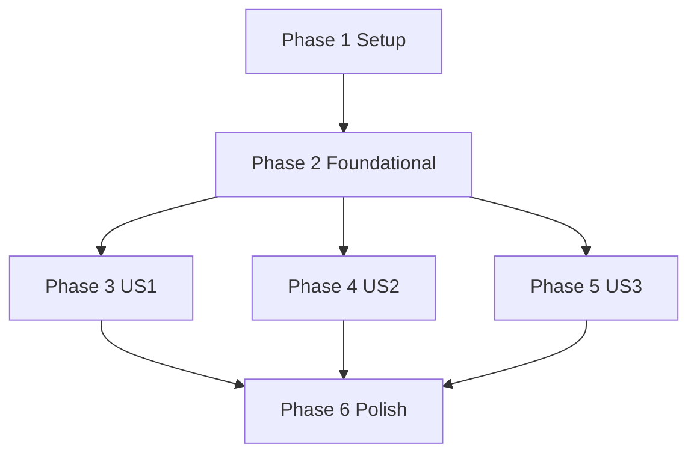

# Tasks: SmartBooking 預約型服務平台

**Input**: Design documents from specs/001-smartbooking-platform/

- plan.md: specs/001-smartbooking-platform/plan.md
- spec.md: specs/001-smartbooking-platform/spec.md
- research.md: specs/001-smartbooking-platform/research.md
- data-model.md: specs/001-smartbooking-platform/data-model.md
- contracts: specs/001-smartbooking-platform/contracts/openapi.yaml
- quickstart.md: specs/001-smartbooking-platform/quickstart.md

**測試要求（憲章 Gate）**：核心商業規則必須有測試（happy path、edge cases、failures）。若任何測試被省略，必須在本清單明確寫出風險、替代驗證方式與回滾方案（本清單不省略核心測試）。

**組織原則**：任務依 User Story 分組，確保每個故事都能獨立完成與驗證。

## 任務格式

每個任務必須嚴格使用：

- [ ] T### [P?] [US#?] 描述（必須包含檔案路徑）

- [P]：可平行（不同檔案、無未完成依賴）
- [US#]：僅出現在 User Story phase 的任務（Setup/Foundational/Polish 不加）

---

## Phase 1: Setup（Shared Infrastructure）

**目的**：建立完整專案骨架（frontend/backend），初始化工具鏈與基本可執行環境。

- [ ] T001 建立 repo 目錄結構：backend/ frontend/（在 repo root 建立資料夾；對應 plan.md 的 Project Structure）
- [x] T001 建立 repo 目錄結構：backend/ frontend/（在 repo root 建立資料夾；對應 plan.md 的 Project Structure）
- [x] T002 初始化 NestJS 專案到 backend/（產生 backend/package.json、backend/src/main.ts、backend/tsconfig.json）
- [x] T003 初始化 Prisma 到 backend/prisma/（建立 backend/prisma/schema.prisma、backend/.env.example，DATABASE_URL=file:./dev.db）
- [x] T004 初始化前端 React+TS（Vite）到 frontend/（產生 frontend/package.json、frontend/src/main.tsx、frontend/vite.config.ts）
- [x] T005 設定 Tailwind CSS（建立 frontend/tailwind.config.ts、frontend/postcss.config.cjs、frontend/src/index.css）
- [x] T006 [P] 設定前端路由框架（建立 frontend/src/routes/router.tsx、frontend/src/routes/ProtectedRoute.tsx）
- [x] T007 [P] 設定 TanStack Query 基礎（建立 frontend/src/api/queryClient.ts、frontend/src/api/http.ts）
- [x] T008 [P] 設定前端表單基礎（RHF+Zod）（建立 frontend/src/forms/zod.ts、frontend/src/forms/fields.tsx）
- [x] T009 設定前端環境變數範本（建立 frontend/.env.example，VITE_API_BASE_URL=http://localhost:3000）
- [x] T010 [P] 設定 ESLint/Prettier（backend/.eslintrc.cjs、backend/.prettierrc、frontend/.eslintrc.cjs、frontend/.prettierrc）
- [x] T011 [P] 設定 editor/formatter（建立 .editorconfig、更新 .vscode/settings.json）
- [x] T012 建立根目錄 README（建立 README.md，包含 Quickstart 指向 specs/001-smartbooking-platform/quickstart.md）
- [x] T013 建立後端啟動腳本與 npm scripts（更新 backend/package.json scripts: start:dev, test, lint）
- [x] T014 建立前端啟動腳本與 npm scripts（更新 frontend/package.json scripts: dev, test, lint）
- [x] T015 建立基礎 CI 本機驗證任務文件（建立 docs/dev-checklist.md：lint/test/build 步驟）

---

## Phase 2: Foundational（Blocking Prerequisites）

**目的**：所有 User Story 的共用基礎（DB、Auth/RBAC、錯誤格式、requestId、審計、測試基礎）。

**⚠️ CRITICAL**：本 Phase 未完成前，不開始任何 US1/US2/US3 端點與 UI。

### Backend 基礎（NestJS + Prisma + SQLite）

- [ ] T016 建立 Prisma 資料模型（User/Service/TimeSlot/Booking/PasswordResetToken/AuditLog）於 backend/prisma/schema.prisma（對齊 data-model.md）
- [x] T016 建立 Prisma 資料模型（User/Service/TimeSlot/Booking/PasswordResetToken/AuditLog）於 backend/prisma/schema.prisma（對齊 data-model.md）
- [x] T017 建立 Prisma migration 與本機 DB（執行 prisma migrate dev；提交 backend/prisma/migrations/）
- [x] T018 建立 seed（含一個 Admin、一個 Provider、幾個 Services/TimeSlots）於 backend/prisma/seed.ts
- [x] T019 設定 Config 讀取與驗證（建立 backend/src/common/config/env.ts、backend/src/common/config/validate.ts）
- [x] T020 [P] 建立 requestId middleware（建立 backend/src/common/http/request-id.middleware.ts，產生/傳遞 X-Request-Id）
- [x] T021 [P] 建立統一成功/錯誤回應策略（建立 backend/src/common/http/response.ts：設定 response header x-request-id）
- [x] T022 建立全域 Exception Filter 回傳 ErrorResponse（backend/src/common/http/http-exception.filter.ts；對齊 openapi.yaml 的 ErrorResponse）
- [x] T023 建立穩定錯誤代碼表（backend/src/common/errors/error-codes.ts：CAPACITY_FULL、DUPLICATE_BOOKING、DEADLINE_PASSED、INVALID_TRANSITION、NOT_ACCESSIBLE…）
- [x] T024 建立 RBAC 裝飾器/Guard（backend/src/auth/roles.decorator.ts、backend/src/auth/roles.guard.ts）
- [x] T025 建立 JWT Auth Guard（backend/src/auth/jwt-auth.guard.ts）
- [x] T026 建立 UserStatus 檢查 Guard（backend/src/auth/user-status.guard.ts：SUSPENDED 視為未授權）
- [x] T027 建立 Password hashing/verify 工具（backend/src/auth/password.ts：bcrypt hash/compare）
- [x] T028 建立 AuditLog Prisma service 與寫入 API（backend/src/audit/audit.service.ts、backend/src/audit/audit.types.ts）
- [x] T029 建立交易工具封裝（backend/src/common/db/tx.ts：Prisma transaction helper + requestId/actor 傳遞）
- [x] T030 建立時間工具與時區策略（backend/src/common/time/clock.ts、backend/src/common/time/timezone.ts；遵循 research.md 決策）
- [x] T031 建立認證模組骨架（backend/src/auth/auth.module.ts、backend/src/auth/auth.service.ts、backend/src/auth/auth.controller.ts）
- [x] T032 建立 users 模組骨架（backend/src/users/users.module.ts、backend/src/users/users.service.ts）
- [x] T033 建立 services/timeslots/bookings 模組骨架（backend/src/services/services.module.ts、backend/src/timeslots/timeslots.module.ts、backend/src/bookings/bookings.module.ts）
- [x] T034 建立 provider/admin API 模組骨架（backend/src/provider/provider.module.ts、backend/src/admin/admin.module.ts）

### Backend 測試基礎（Vitest / Integration）

- [x] T035 建立 backend 測試工具鏈（更新 backend/package.json + vitest config；建立 backend/vitest.config.ts）
- [x] T036 [P] 建立測試用 TestApp 工具（backend/test/utils/create-test-app.ts：啟動 Nest app + 全域 filter/middleware）
- [x] T037 [P] 建立測試用資料庫隔離策略（backend/test/utils/test-db.ts：每個測試 suite 使用獨立 SQLite 檔）
- [x] T038 [P] 建立 API 請求 helper（backend/test/utils/http.ts：supertest wrapper + token helper）

### Frontend 基礎（React + Router + Query + Auth）

- [x] T039 建立前端 API client 與錯誤對應（frontend/src/api/http.ts：帶 Authorization、解析 ErrorResponse、顯示 requestId）
- [x] T040 建立前端型別定義（frontend/src/api/types.ts：User/Service/TimeSlot/Booking/ErrorResponse 對齊 openapi.yaml）
- [x] T041 [P] 建立 Auth 狀態管理（frontend/src/auth/authStore.ts：token/user；localStorage 持久化）
- [x] T042 [P] 建立 Router layout 與 role-based navigation（frontend/src/components/NavBar.tsx、frontend/src/layouts/AppLayout.tsx）
- [x] T043 建立受保護路由與 403/404 頁（frontend/src/routes/ProtectedRoute.tsx、frontend/src/pages/ForbiddenPage.tsx、frontend/src/pages/NotFoundPage.tsx）
- [x] T044 [P] 建立通用 UI 元件（frontend/src/components/Button.tsx、frontend/src/components/Input.tsx、frontend/src/components/Alert.tsx、frontend/src/components/Spinner.tsx）
- [x] T045 [P] 建立日期時間格式化工具（frontend/src/common/datetime.ts：dayjs；顯示平台時區）

**Checkpoint**：完成 Phase 2 後，才開始 US1/US2/US3。

---

## Phase 3: User Story 1 - 建立/查看/取消預約（Priority: P1）

**Goal**：User 可完成註冊/登入、瀏覽服務/時段、建立預約、查看我的預約、在截止前取消；同時保證不超賣、冪等、錯誤語意清晰。

**Independent Test**：使用 seed 的 Service/TimeSlot + 單一 USER 帳號，完成端到端（含 UI）驗證：瀏覽→預約→列表→取消；並以併發測試驗證不超賣。

### US1 測試（先寫測試，至少在後端維度）

- [x] T046 [P] [US1] Auth 契約測試：/auth/register,/auth/login（backend/test/contract/auth.contract.test.ts）
- [x] T047 [P] [US1] Public 契約測試：/services,/services/{id}（backend/test/contract/public.contract.test.ts）
- [x] T048 [P] [US1] Bookings 契約測試：/bookings,/me/bookings,/bookings/{id}/cancel（backend/test/contract/bookings.contract.test.ts）
- [x] T049 [P] [US1] 併發不超賣整合測試（backend/test/integration/booking-concurrency.test.ts：多請求搶最後名額）
- [x] T050 [P] [US1] 取消截止時間測試（backend/test/integration/cancel-deadline.test.ts）
- [x] T051 [P] [US1] 冪等取消測試（backend/test/integration/cancel-idempotency.test.ts）
- [x] T052 [P] [US1] 越權/IDOR 測試：只能看/取消自己的 booking（backend/test/integration/booking-authorization.test.ts）
- [x] T053 [P] [US1] 角色限制測試：Guest/Provider 對 /bookings 必須被拒（backend/test/integration/booking-role-guard.test.ts）
- [x] T054 [US1] 前端限制：Guest/Provider 不顯示或禁用「建立預約」操作（frontend/src/pages/ServiceDetailsPage.tsx、frontend/src/components/NavBar.tsx）

### US1 後端實作（對齊 openapi.yaml）

- [x] T055 [US1] 實作註冊/登入/登出（backend/src/auth/auth.controller.ts、backend/src/auth/auth.service.ts）
- [x] T056 [US1] 實作忘記密碼 request/confirm（backend/src/auth/password-reset.service.ts、backend/src/auth/auth.controller.ts）
- [x] T057 [US1] 建立 PasswordResetToken 資料存取（backend/src/auth/password-reset.repo.ts：Prisma）
- [x] T058 [US1] 建立 Email sender 抽象（dev 模式 log）於 backend/src/auth/email-sender.ts
- [x] T059 [US1] 實作公開服務列表（僅 ACTIVE）與服務詳情 + 時段（backend/src/services/public-services.controller.ts、backend/src/services/services.service.ts）
- [x] T060 [US1] 實作 remainingCapacity 派生欄位（backend/src/timeslots/timeslots.presenter.ts：capacity - bookedCount）
- [x] T061 [US1] 實作建立 booking（交易 + raw SQL 條件更新防超賣）（backend/src/bookings/bookings.service.ts）
- [x] T062 [US1] 實作我的 booking 列表（backend/src/bookings/bookings.controller.ts：GET /me/bookings）
- [x] T063 [US1] 實作取消 booking（交易 + 狀態條件更新 + booked_count 釋放 + deadline 檢查）（backend/src/bookings/bookings.service.ts）
- [x] T064 [US1] 實作 booking 狀態機驗證（backend/src/bookings/booking-state.ts：允許轉移表）
- [x] T065 [US1] 實作 AuditLog：註冊/登入（可選）、建立/取消 booking（backend/src/audit/audit.service.ts 呼叫點補齊）
- [x] T066 [US1] 統一回應錯誤代碼與 message（backend/src/common/http/http-exception.filter.ts：對應 409/403/404）

### US1 前端 UI/流程

- [x] T067 [P] [US1] 建立登入頁（frontend/src/pages/LoginPage.tsx）
- [x] T068 [P] [US1] 建立註冊頁（frontend/src/pages/RegisterPage.tsx：role USER/PROVIDER）
- [x] T069 [P] [US1] 建立忘記密碼頁（frontend/src/pages/ForgotPasswordPage.tsx：永遠顯示成功提示避免枚舉）
- [x] T070 [P] [US1] 建立重設密碼頁（frontend/src/pages/ResetPasswordPage.tsx：token + newPassword）
- [x] T071 [P] [US1] 建立服務列表頁（frontend/src/pages/ServiceListPage.tsx：GET /services）
- [x] T072 [P] [US1] 建立服務詳情頁（frontend/src/pages/ServiceDetailsPage.tsx：GET /services/{id} 顯示時段與剩餘名額）
- [x] T073 [US1] 實作建立預約 UI（frontend/src/pages/ServiceDetailsPage.tsx：POST /bookings；處理 409 CAPACITY_FULL/DUPLICATE_BOOKING）
- [x] T074 [P] [US1] 建立我的預約頁（frontend/src/pages/MyBookingsPage.tsx：GET /me/bookings）
- [x] T075 [US1] 實作取消預約 UI（frontend/src/pages/MyBookingsPage.tsx：POST /bookings/{id}/cancel；截止錯誤顯示）
- [x] T076 [US1] 實作 role-based header navigation（frontend/src/components/NavBar.tsx：Guest/User/Provider/Admin 顯示不同入口；符合 FR-035）

**Checkpoint**：US1 完成後，可在不依賴 Provider/Admin UI 的情況下，完成完整 User booking 流程並通過測試。

---

## Phase 4: User Story 2 - Provider 管理供給與履約（Priority: P2）

**Goal**：Provider 可建立/更新/停用服務、建立/更新/關閉時段（含不重疊與 capacity 規則）、查看預約名單、將預約標記完成或服務方取消。

**Independent Test**：使用 seed Provider 登入，建立服務/時段，讓一個 User 建立 booking 後，Provider 查看名單並完成；並驗證 overlap/capacity 規則。

### US2 測試

- [x] T077 [P] [US2] Provider 契約測試：/provider/services,/provider/services/{id}（backend/test/contract/provider-services.contract.test.ts）
- [x] T078 [P] [US2] TimeSlot 契約測試：/provider/services/{id}/time-slots,/provider/time-slots/{id}（backend/test/contract/provider-timeslots.contract.test.ts）
- [x] T079 [P] [US2] Provider booking 操作契約測試：list/complete/cancel（backend/test/contract/provider-bookings.contract.test.ts）
- [x] T080 [P] [US2] 時段重疊規則整合測試（backend/test/integration/timeslot-overlap.test.ts）
- [x] T081 [P] [US2] capacity 調降不得低於已預約數測試（backend/test/integration/timeslot-capacity-guard.test.ts）
- [x] T082 [P] [US2] Provider 所有權/越權測試（backend/test/integration/provider-ownership.test.ts）
- [x] T083 [P] [US2] 完成後不可取消（User cancel 被拒）測試（backend/test/integration/completed-cannot-cancel.test.ts）

### US2 後端實作

- [x] T084 [US2] 實作 Provider 建立服務（backend/src/provider/provider-services.controller.ts、backend/src/provider/provider-services.service.ts）
- [x] T085 [US2] 實作 Provider 更新/停用服務（backend/src/provider/provider-services.controller.ts）
- [x] T086 [US2] 實作 Provider 建立時段（backend/src/provider/provider-timeslots.controller.ts、backend/src/provider/provider-timeslots.service.ts）
- [x] T087 [US2] 實作時段重疊檢查（backend/src/provider/timeslot-overlap.ts：依 data-model.md 重疊判定）
- [x] T088 [US2] 實作 Provider 更新/關閉時段（含 capacity 不能低於 booked_count）（backend/src/provider/provider-timeslots.controller.ts）
- [x] T089 [US2] 實作 Provider 查看時段預約名單（backend/src/provider/provider-bookings.controller.ts：GET /provider/time-slots/{id}/bookings）
- [x] T090 [US2] 實作 Provider 標記完成/取消 booking（backend/src/provider/provider-bookings.controller.ts、backend/src/provider/provider-bookings.service.ts）
- [x] T091 [US2] 補齊狀態機限制（backend/src/bookings/booking-state.ts：Provider 操作合法轉移）
- [x] T092 [US2] 補齊 AuditLog：Provider 服務/時段 CRUD、完成/取消 booking（backend/src/audit/audit.service.ts 呼叫點）

### US2 前端 UI/流程

- [x] T093 [P] [US2] 建立 Provider Dashboard（frontend/src/pages/provider/ProviderHomePage.tsx）
- [x] T094 [P] [US2] 建立 Provider 服務列表/建立頁（frontend/src/pages/provider/ProviderServicesPage.tsx）
- [x] T095 [US2] 建立 Provider 編輯/停用服務功能（frontend/src/pages/provider/ProviderServiceEditPage.tsx：PATCH /provider/services/{id}）
- [x] T096 [P] [US2] 建立 Provider 時段管理頁（frontend/src/pages/provider/ProviderTimeSlotsPage.tsx：POST /provider/services/{id}/time-slots、PATCH /provider/time-slots/{id}）
- [x] T097 [P] [US2] 建立 Provider 時段預約名單頁（frontend/src/pages/provider/ProviderSlotBookingsPage.tsx：GET /provider/time-slots/{id}/bookings）
- [x] T098 [US2] 實作 Provider 完成/取消 booking UI（frontend/src/pages/provider/ProviderSlotBookingsPage.tsx：POST /provider/bookings/{id}/complete,/cancel）

**Checkpoint**：US2 完成後，Provider 可完整管理供給並履約，且不影響 US1 的獨立可測性。

---

## Phase 5: User Story 3 - Admin 治理與可追溯（Priority: P3）

**Goal**：Admin 可管理帳號/服務狀態與查看報表摘要；關鍵操作必須寫入 AuditLog；停用後限制必須即時生效。

**Independent Test**：使用 seed Admin 登入，停用一個 User/Service，驗證該 User 無法再執行受保護操作、該 Service 無法再被預約，並確認 AuditLog 存在。

### US3 測試

- [x] T099 [P] [US3] Admin 契約測試：/admin/users,/admin/users/{id}（backend/test/contract/admin-users.contract.test.ts）
- [x] T100 [P] [US3] Admin 服務契約測試：/admin/services,/admin/services/{id}（backend/test/contract/admin-services.contract.test.ts）
- [x] T101 [P] [US3] Admin 報表契約測試：/admin/reports/summary（backend/test/contract/admin-reports.contract.test.ts）
- [x] T102 [P] [US3] SUSPENDED 後 token 仍存在但受保護請求視為未授權測試（backend/test/integration/suspended-after-login.test.ts）
- [x] T103 [P] [US3] INACTIVE service 不可建立 booking 測試（backend/test/integration/inactive-service-cannot-book.test.ts）
- [x] T104 [P] [US3] Admin AuditLog 寫入測試（backend/test/integration/admin-auditlog.test.ts）

### US3 後端實作

- [x] T105 [US3] 實作 Admin 使用者列表/更新狀態（backend/src/admin/admin.controller.ts、backend/src/admin/admin.service.ts）
- [x] T106 [US3] 實作 Admin 服務列表（含非 ACTIVE）/更新狀態（backend/src/admin/admin.controller.ts、backend/src/admin/admin.service.ts）
- [x] T107 [US3] 實作 Admin 報表摘要（backend/src/admin/admin.controller.ts、backend/src/admin/admin.service.ts：aggregate）
- [x] T108 [US3] 補齊 AuditLog：Admin 更新 user/service 狀態（backend/src/admin/admin.service.ts 呼叫點）

### US3 前端 UI/流程

- [x] T109 [P] [US3] 建立 Admin Dashboard（frontend/src/pages/admin/AdminHomePage.tsx）
- [x] T110 [P] [US3] 建立 Admin 使用者管理頁（frontend/src/pages/admin/AdminUsersPage.tsx：GET/PATCH /admin/users）
- [x] T111 [P] [US3] 建立 Admin 服務管理頁（frontend/src/pages/admin/AdminServicesPage.tsx：GET/PATCH /admin/services）
- [x] T112 [P] [US3] 建立 Admin 報表摘要頁（frontend/src/pages/admin/AdminReportsPage.tsx：GET /admin/reports/summary）

**Checkpoint**：US3 完成後，全站治理能力到位，並可用 AuditLog 完整追溯關鍵操作。

---

## Phase 6: Polish & Cross-Cutting Concerns

**目的**：跨故事的完整度補強（E2E、自動化驗證、文件、硬化與一致性）。

- [x] T113 建立 Playwright E2E 專案（frontend/tests/e2e/playwright.config.ts、frontend/tests/e2e/）
- [x] T114 [P] 建立 E2E：User 主旅程（frontend/tests/e2e/user-booking.spec.ts：登入→瀏覽→預約→取消）
- [x] T115 [P] 建立 E2E：Provider 主旅程（frontend/tests/e2e/provider-flow.spec.ts：建立服務/時段→查看名單→完成）
- [x] T116 [P] 建立 E2E：Admin 主旅程（frontend/tests/e2e/admin-governance.spec.ts：停用 user/service→限制生效）
- [x] T117 建立後端 API 日誌一致性（backend/src/common/logging/logger.ts：包含 requestId；避免敏感資料）
- [x] T118 建立後端安全性硬化檢查（backend/src/common/security/sanitize.ts：避免回傳敏感欄位；統一序列化）
- [x] T119 建立前端錯誤 UX 一致（frontend/src/components/ApiErrorBanner.tsx：顯示 message + requestId）
- [x] T120 建立防重提交 UX（frontend/src/common/useSubmitLock.ts：按鈕鎖定；避免重複 POST）
- [x] T121 更新 quickstart（補齊實際指令與路徑）（更新 specs/001-smartbooking-platform/quickstart.md）
- [x] T122 建立「全套驗收清單」文件（建立 docs/acceptance-checklist.md：對應 FR/US 驗證步驟）
- [x] T123 整理最終架構與決策連結（更新 specs/001-smartbooking-platform/plan.md：補充最終檔案路徑與驗收方式）

---

## Dependencies & Execution Order

### Phase Dependencies

- Phase 1 Setup → Phase 2 Foundational → Phase 3~5 User Stories → Phase 6 Polish

### User Story 依賴圖（完成順序）

- US1（P1）依賴 Foundational；可用 seed 供給獨立驗證
- US2（P2）依賴 Foundational；完成後提供完整供給管理與履約
- US3（P3）依賴 Foundational；完成後提供治理與報表

建議的實作順序（最小風險）：US1 → US2 → US3（符合 spec priority）。

---

## Parallel Execution Examples（每個 User Story）

### US1 可平行示例

- 先平行寫契約測試：backend/test/contract/auth.contract.test.ts、backend/test/contract/public.contract.test.ts、backend/test/contract/bookings.contract.test.ts
- 再平行寫前端頁面骨架：frontend/src/pages/LoginPage.tsx、RegisterPage.tsx、ServiceListPage.tsx、MyBookingsPage.tsx

### US2 可平行示例

- 平行寫測試：provider-services.contract / provider-timeslots.contract / provider-bookings.contract
- 平行寫 UI：ProviderServicesPage.tsx、ProviderTimeSlotsPage.tsx、ProviderSlotBookingsPage.tsx

### US3 可平行示例

- 平行寫測試：admin-users.contract / admin-services.contract / admin-reports.contract
- 平行寫 UI：AdminUsersPage.tsx、AdminServicesPage.tsx、AdminReportsPage.tsx

---

## Implementation Strategy（完整專案交付）

- 先完成 Phase 1~2，讓基礎（DB/Auth/RBAC/Error/Audit/Test）到位
- 依 P1→P2→P3 完成全套後端端點與前端 UI
- 最後用 Phase 6 的 E2E + docs/acceptance-checklist.md 做完整驗收
