# Feature Specification: API 平台與金鑰管理系統（API Platform & Key Management System）

**Feature Branch**: `001-api-key-platform`  
**Created**: 2026-03-05  
**Status**: Draft  
**Input**: User description: "$ARGUMENTS"（包含：RBAC + Scope、API Key（僅建立時顯示一次）、Rate Limit、Usage/Audit Log、Gateway/Proxy 請求流程、以及完整 Mermaid transition diagrams）

## User Scenarios & Testing *(mandatory)*

### User Story 1 - 開發者完成註冊/登入並建立可用 API Key（Show Once）(Priority: P1)

作為 Developer，我可以註冊與登入平台，進入 /keys 建立一把具備 scopes / 有效期限 / rate limit 的 API Key，且 Key 原文僅會在建立完成後顯示一次。我可以使用該 Key 透過 Gateway 呼叫受保護 API，平台會依規則回應 2xx/401/403/429，並且產生可查詢的使用紀錄（Usage Log）。

**Why this priority**: 這是平台對外提供能力的最小可用價值：安全發放憑證、可控存取、並能追蹤每次呼叫。

**Independent Test**: 以一個已啟用的服務與 endpoint（可由系統預先建立）完成註冊→登入→建立 Key→呼叫 API→查詢 usage，即可驗證核心安全/可控/可稽核能力。

**Acceptance Scenarios**:

1. **Given** 訪客尚未登入，**When** 造訪 /register 並以 email+password 註冊成功，**Then** 系統建立帳號且預設 role=developer、status=active，並導向 /login（不自動登入）。
2. **Given** Developer 帳號 status=active，**When** 以正確帳密登入，**Then** 建立 web session 並導向 /keys，Header 導覽不顯示 /admin。
3. **Given** Developer 位於 /keys 且尚未有任何 key，**When** 建立 key（設定 name/scopes/expires_at/rate_limit），**Then** 系統建立一筆 active key 並只在此回應提供 key 原文一次；後續任何 UI/API/Log 不可再取得 key 原文。
4. **Given** Developer 使用有效 key 呼叫已啟用 endpoint 且 scope 允許，**When** 呼叫 Gateway，**Then** 請求會被轉發並回傳 upstream 回應，同時寫入一筆 usage log。
5. **Given** Developer 使用 revoked/blocked/expired key 或缺少 key 呼叫受保護 API，**When** 呼叫 Gateway，**Then** 回應 401，且 usage log 仍可查到（不含 key 原文）。
6. **Given** Developer 使用有效 key 但 scope 不足呼叫受保護 endpoint，**When** 呼叫 Gateway，**Then** 回應 403 且 usage log 可查到。
7. **Given** Developer 使用有效 key 但超過 rate limit，**When** 再次呼叫 Gateway，**Then** 回應 429 且 usage log 可查到。

---

### User Story 2 - 管理員建立 API 目錄與權限規則，開發者可閱讀文件 (Priority: P2)

作為 Admin，我可以在 /admin 建立/編輯/停用 API Service、在 Service 下管理 Endpoint（method/path/status），並定義 Scope 與 Scope ↔ Endpoint 的 allow 規則。Developer 登入後可以在 /docs 看到啟用中的服務/端點與其 scope 需求標示。

**Why this priority**: 沒有可管理的 API 目錄與 scope 規則，就無法做到最小權限與可控開放；/docs 讓 Developer 能自助理解授權需求，降低溝通成本。

**Independent Test**: Admin 建立一個 service + endpoint + scope + allow rule，Developer 登入後在 /docs 可見並能依標示配置 key 的 scopes。

**Acceptance Scenarios**:

1. **Given** Admin 已登入，**When** 在 /admin 建立一個 ApiService（active）與 ApiEndpoint（GET /users，active），**Then** /docs 會顯示該 service/endpoint。
2. **Given** Admin 已建立 scope 與 allow rule 使其允許某 endpoint，**When** Developer 在 /docs 檢視該 endpoint，**Then** 能看到 scope 需求標示且與規則一致。
3. **Given** Admin 將某 service 或 endpoint 停用，**When** Developer 重新載入 /docs，**Then** 停用項不再顯示。

---

### User Story 3 - 管理員監控/稽核並即時封鎖風險（Key/使用者）(Priority: P3)

作為 Admin，我可以查詢全站 usage 與錯誤統計（401/403/429/5xx），查看 audit log 的 who/when/what；並能即時封鎖/撤銷任意 key 或停用使用者，使其所有 active keys 與既有 web sessions 立即失效。

**Why this priority**: 平台必須可被稽核且可快速止血，才能滿足「安全、可控、可追溯」。

**Independent Test**: 用一個測試使用者與 key 產生 usage，Admin 查詢並執行封鎖/停用後，立刻驗證後續請求都被拒絕且 audit log 可追溯。

**Acceptance Scenarios**:

1. **Given** Admin 已登入且存在任意使用者的 active key，**When** Admin 將該 key 設為 blocked 或 revoked，**Then** 該 key 後續呼叫受保護 API 回 401，且此操作寫入 audit log。
2. **Given** 某使用者 status=active 且已存在有效 web session 與 active keys，**When** Admin 將使用者設為 disabled，**Then** 該使用者不可再登入、既有 session 下一次請求視為無效、其所有 active keys 於 Gateway 驗證階段被拒絕（401），且寫入 audit log。
3. **Given** 平台已累積 usage/audit 資料，**When** Admin 於 /admin 查詢，**Then** 可依時間範圍與狀態碼/動作類型檢索，且資料不包含 API key 原文。

---

### Edge Cases

- Email 大小寫不同但視為同一個 email（註冊/登入）。
- 使用者被停用（disabled）後：既有 session 與 active key 是否在「下一次請求」立即被拒絕且行為一致。
- Key 已 revoked/blocked/expired 時：更新設定是否一律拒絕；Gateway 是否一律回 401。
- Authorization header 格式錯誤（非 Bearer / 空 token / 多段空白）。
- Endpoint 找不到 vs endpoint 被停用：回應碼分別為 404 與 401（依 Gateway state machine）。
- Rate limit 邊界（剛好達到上限、跨分鐘/跨小時計算窗口），以及 key 層級與 endpoint 覆寫同時存在時的優先序。
- Usage log 非同步寫入失敗時：不得影響主請求回應；但需有可追蹤的失敗與補救策略。
- /register、/login 被已登入者存取時：依角色正確導向 /keys 或 /admin。
- Developer 直接輸入 URL 造訪 /admin：必須顯示 403（不是 302 /login、也不是 404）。
- 任何 UI/API/匯出/除錯頁面：不得出現 API key 原文（即使是管理員）。

## Requirements *(mandatory)*

### Functional Requirements

- **FR-001**: 系統 MUST 提供訪客可存取的公開頁面：/（首頁）、/register、/login。
- **FR-002**: 系統 MUST 支援以 email + 密碼註冊帳號；email MUST 唯一且不分大小寫視為同一 email。
- **FR-003**: 系統 MUST 以不可逆方式儲存密碼（不得保存明文或可還原形式）。
- **FR-004**: 註冊成功後，系統 MUST 建立使用者且預設 role=developer、status=active；並 MUST 導向 /login（不得自動登入）。
- **FR-005**: 系統 MUST 支援以 email + 密碼登入建立 Web Session；登入成功 MUST 更新 last_login_at。
- **FR-006**: status=disabled 的使用者 MUST 無法登入；登入失敗回應 MUST 一致且 MUST 不建立 session。
- **FR-007**: 系統 MUST 支援登出並使該 session 立即失效（含 revoked_at 或等效機制）。
- **FR-008**: Web Session MUST 具備 expires_at；受保護頁面請求 MAY 更新 last_seen_at。

- **FR-009**: 系統 MUST 依角色（Guest/Developer/Admin）對 Web 路由做存取控制：
  - 未登入存取 /keys、/docs、/admin MUST 導向 /login，並保留 next 參數。
  - Developer 存取 /admin MUST 顯示 403（不得以 404 取代）。
  - 已登入者存取 /register、/login MUST 依角色導向 /keys 或 /admin。
- **FR-010**: Header/導航 MUST 與路由 guard 一致，且 MUST 在初次 render 前依 session/role 決定可見項（不得先顯示再隱藏）：
  - Guest：只顯示 /、/register、/login。
  - Developer：顯示 /、/keys、/docs、logout；不得顯示 /admin。
  - Admin：顯示 /、/keys、/docs、/admin、logout。

- **FR-011**: Admin MUST 能建立/編輯/停用 ApiService；ApiService.name MUST 唯一。
- **FR-012**: Admin MUST 能在每個 service 下建立/編輯/啟用/停用 ApiEndpoint（method/path/status）。
- **FR-013**: 同一 service 下，(method, path) MUST 唯一且不可重複。
- **FR-014**: /docs MUST 僅顯示 status=active 的 service 與 endpoint，並標示每個 endpoint 的 scope 需求。

- **FR-015**: Admin MUST 能建立/編輯 ApiScope；ApiScope.name MUST 唯一且命名一致且可讀（例：resource:read）。
- **FR-016**: Admin MUST 能設定 Scope ↔ Endpoint 的 allow 規則，使 Gateway 可判定某 endpoint 需要哪些 scopes。

- **FR-017**: Developer MUST 能建立屬於自己的 ApiKey，並設定 name / scopes / expires_at（可選）/ rate limit（可選，至少支援 per-minute、per-hour）。
- **FR-018**: Admin MUST 能查詢任意使用者的 ApiKey，並能撤銷（revoked）或封鎖（blocked）任意 key。
- **FR-019**: ApiKey MUST 僅在建立完成當下顯示 key 原文一次；平台 MUST 僅保存 key 的 hash；任何 UI/API/Log MUST 永不回傳 key 原文。
- **FR-020**: ApiKey.status MUST 支援 active/revoked/blocked；revoked/blocked/expired 的 key MUST 立即視為不可用。
- **FR-021**: 僅 status=active 的 ApiKey 允許更新設定（name/scopes/expires_at/rate limit）；非 active MUST 拒絕更新並提供可理解原因。

- **FR-022**: 系統 MUST 支援 Key Rotation：Developer 可建立新 key 與舊 key 並行測試；撤銷舊 key 後 MUST 立即失效；系統 MUST 能追蹤 replaced_by_key_id（若使用者選擇記錄替換關聯）。

- **FR-023**: 平台 MUST 支援 Rate Limit：至少每分鐘、每小時；超過限制 MUST 回 429；429 MUST 被寫入 usage log 並可被查詢。
- **FR-024**: 平台 MUST 定義 rate limit 的全域預設與上限；Developer 設定 MUST 不可超過上限；超過 MUST 拒絕。

- **FR-025**: Gateway 對所有受保護 API 請求 MUST 依序執行：解析 Bearer → 驗證 key hash → 檢查 key status/expiry → 檢查 owner user.status → 解析 endpoint（service+method+path）與 endpoint status → scope 驗證 → rate limit → proxy 轉發 → 寫入 usage log（非同步）。
- **FR-026**: Gateway MUST 回應符合規範的狀態碼：401（key 缺失/無效/過期/撤銷/封鎖或 owner disabled）、403（scope 不足）、429（超限）、404（endpoint 不存在）、5xx（平台錯誤/上游錯誤不應洩漏內部資訊）。

- **FR-027**: Usage Log MUST 至少記錄 api_key_id（若可解析）、http_method、path、status_code、response_time_ms、timestamp，並可選擇記錄 endpoint_id。
- **FR-028**: Usage Log 查詢 MUST 最少支援：時間範圍、status code、endpoint（或 method+path）。
- **FR-029**: Developer MUST 只能查詢自己名下 key 的 usage log；Admin MUST 能查詢全站與單一 key/使用者的歷史。

- **FR-030**: 系統 MUST 提供 Audit Log 記錄敏感操作（Developer 的 key create/update/revoke；Admin 的 service/endpoint/scope/rate limit/key/user/ip 變更），且 MUST 包含 who/when/what；metadata MUST 不包含 API key 原文。
- **FR-031**: Admin 停用使用者（status=disabled）後，系統 MUST 使該使用者後續登入失敗、既有 session 下一次請求視為無效、其名下所有 active keys 在 Gateway 驗證階段被拒絕（401）。
- **FR-032**: 系統 MUST 提供頁面層級狀態：Loading/Empty/Error/403/404/500，且 404 不可取代權限不足的 403。

### Assumptions & Dependencies

- 上游 API 服務（ApiService 對應的實際後端）在本功能範圍外視為已存在且可被轉發。
- 平台在可用狀態下，至少會有一組「啟用中的 ApiService/ApiEndpoint 與對應的 scope 規則」可供 Developer 建立 key 後進行測試；若尚未建立，需由 Admin 先完成 User Story 2。
- 本期不納入 OAuth2 / OpenID Connect、計費/收款/付費配額等能力（屬 out of scope）。
- 全站僅允許 HTTPS 存取（HTTP 不在本期支援範圍）。
- 使用紀錄/稽核紀錄的保存期間與彙整報表的精確度需求，若未另行指定，先以「滿足安全稽核與排查」為準；後續可在擴充需求中明確定義保存年限與匯出規格。

### Data Contract & API Semantics *(mandatory if feature has frontend/backend or external integration)*

- **Contract**: Web 認證
  - `POST /register` request: `{ email: string, password: string }`
  - `POST /register` response: `201 { user_id: string }`（不建立 session）
  - `POST /login` request: `{ email: string, password: string }`
  - `POST /login` response: `200 { user: { id: string, role: 'developer'|'admin', status: 'active'|'disabled' } }` + 設定 session cookie
  - `POST /logout` request: 無 body（需帶 session）
  - `POST /logout` response: `204`（session 立即失效）
  - `GET /session` response: `200 { authenticated: boolean, user?: {...} }`

- **Contract**: API Key 管理（Web 後台）
  - `GET /keys` response: `200 { keys: ApiKeySummary[], limits: RateLimitPolicy, scopes: ApiScopeSummary[] }`
  - `POST /keys` request: `{ name: string, scopes: string[], expires_at?: string, rate_limit_per_minute?: number, rate_limit_per_hour?: number }`
  - `POST /keys` response: `201 { api_key: ApiKeySummary, plain_key: string }`（plain_key 僅此一次）
  - `PATCH /keys/{key_id}` request: 可更新 `{ name?, scopes?, expires_at?, rate_limit_per_minute?, rate_limit_per_hour? }`（僅 active）
  - `PATCH /keys/{key_id}` response: `200 { api_key: ApiKeySummary }`
  - `POST /keys/{key_id}/revoke` response: `200 { api_key: ApiKeySummary }`（立即失效）
  - `POST /keys/{key_id}/rotate` request: `{ new_key_id: string }`（可選，用於回填 replaced_by_key_id）
  - `GET /keys/{key_id}/usage` query: `from,to,status_code,endpoint` response: `200 { items: UsageLogItem[], next_cursor?: string }`

- **Contract**: Admin 管理（/admin）
  - `POST /admin/services` / `PATCH /admin/services/{id}` / `POST /admin/services/{id}/disable`
  - `POST /admin/services/{id}/endpoints` / `PATCH /admin/endpoints/{id}` / `POST /admin/endpoints/{id}/toggle`
  - `POST /admin/scopes` / `PATCH /admin/scopes/{id}`
  - `POST /admin/scope-rules` / `DELETE /admin/scope-rules/{id}`
  - `PATCH /admin/rate-limits`（全域預設/上限與可選 endpoint 覆寫）
  - `POST /admin/keys/{id}/block` / `POST /admin/keys/{id}/revoke`
  - `POST /admin/users/{id}/disable`
  - `GET /admin/usage`（全站用量/錯誤統計與查詢）
  - `GET /admin/audit`（稽核查詢）

- **Contract**: Gateway（受保護 API）
  - **Routing（service 辨識）**: 預設採 path-based：`/gateway/{service}/{*path}`
    - `{service}` MUST 對應 `ApiService.name`（建議採 slug；大小寫規則需一致）。
    - `{*path}` + query string MUST 原樣保留，用於 endpoint 解析與 upstream passthrough。
  - Inbound request headers: `Authorization: Bearer {API_KEY}`（Gateway 會解析但轉發時不得改寫/移除）
  - Inbound request method/path: 原始 `method` + `/{*path}`（不含 `/gateway/{service}` 前綴）
  - Upstream resolution: 由 `{service}` 解析到對應 upstream base URL（建議：DB 儲存 `upstream_key`，實際 base URL 由環境設定 allowlist 提供；避免 SSRF）。
  - Outbound response: upstream 回應（串流透傳）或平台拒絕 `401/403/429/404/5xx`

- **Errors**: 統一錯誤回應（除非 upstream 已有既定格式）
  - `401` → 缺少/無效/過期/撤銷/封鎖 key，或 owner disabled → 使用者應重新取得有效 key（Web 受保護頁則導向 /login）
  - `403` → 權限不足（scope 不符或 Developer 存取 /admin）→ 使用者需調整 scopes 或由 Admin 調整規則
  - `429` → 超過 rate limit → 使用者需等待並重試或調整限流設定（在允許範圍內）
  - `404` → 找不到對應 endpoint → 使用者需確認 path/method 是否存在且已啟用
  - `5xx` → 平台錯誤或 upstream 失敗（例：`502/504`）→ 顯示可理解訊息與重試建議；不得洩漏敏感資訊

### State Transitions & Invariants *(mandatory if feature changes state/data)*

- **Invariant**: API Key 原文只能在建立當下被使用者看見一次；平台任何後續讀取/查詢/匯出/日誌皆不得出現 key 原文。
- **Invariant**: 當 User.status=disabled 時，該使用者不可登入；既有 session 下一次請求視為無效；其名下所有 active key 於 Gateway 驗證階段即被拒絕（401）。
- **Invariant**: 導覽可見性與路由存取控制必須一致（不得出現「先顯示再隱藏」或「顯示但點了才導登入」）。
- **Invariant**: 所有拒絕（401/403/429/404/5xx）仍需可被稽核：至少能在 usage log 或 audit log（若屬敏感操作）中追溯。

- **Transition**: Given Guest 無有效 session，when 直接存取 /keys 或 /docs 或 /admin，then 系統導向 /login 並保留 next。
- **Transition**: Given Developer 已登入，when 存取 /admin，then 顯示 403 且導覽不新增 /admin。
- **Transition**: Given ApiKey 被設為 revoked/blocked 或 expires_at 到期，when 使用該 key 呼叫 Gateway，then 回 401 且寫入 usage log。
- **Transition**: Given Key scopes 不足，when 呼叫需要 scope 的 endpoint，then 回 403 且寫入 usage log。
- **Transition**: Given rate limit 超限，when 再次呼叫，then 回 429 且寫入 usage log。

#### Reference: Transition Diagrams（必須遵守）

> 以下 Mermaid state machines 為此功能的規範依據（驗證點見圖內 `%% verify:` 註解）。

##### ① Global App Page State Machine
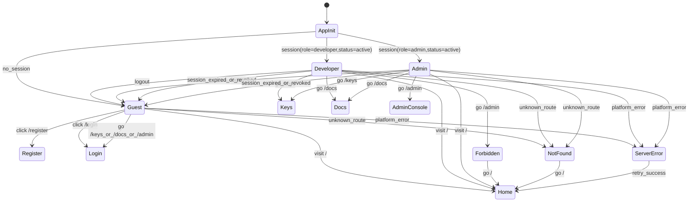

##### ⑳ Feature: Global Navigation Rendering
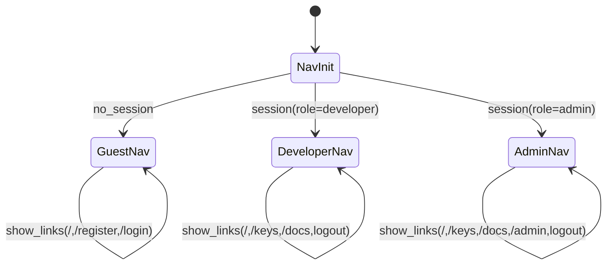

##### ㉑ Feature: Web Session（Login / Logout / Session Revocation）
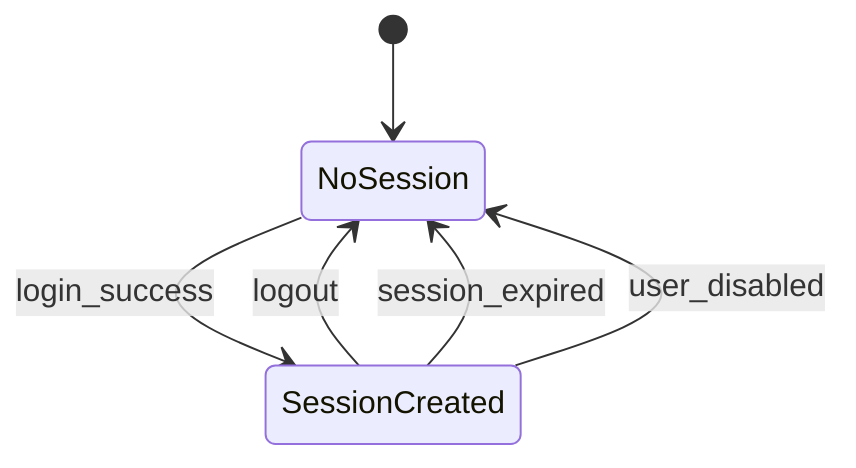

##### ㉒ Feature: API Key 建立（Show Once）
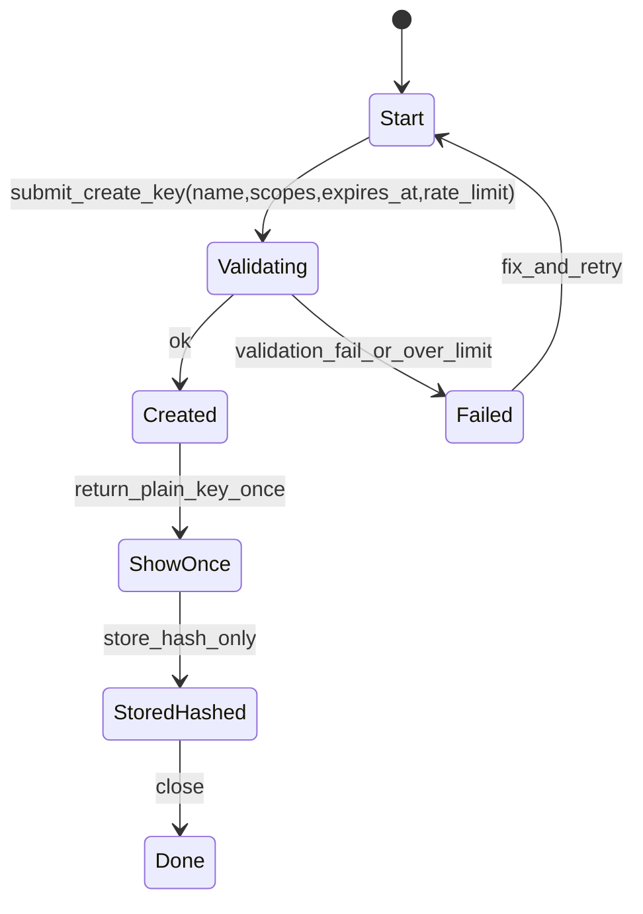

##### ㉓ Feature: API Key 更新設定（Active Only）
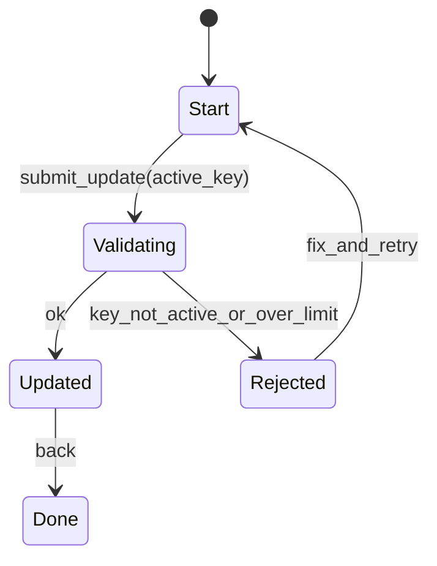

##### ㉔ Feature: API Key 撤銷 / 封鎖（Immediate Invalidate）
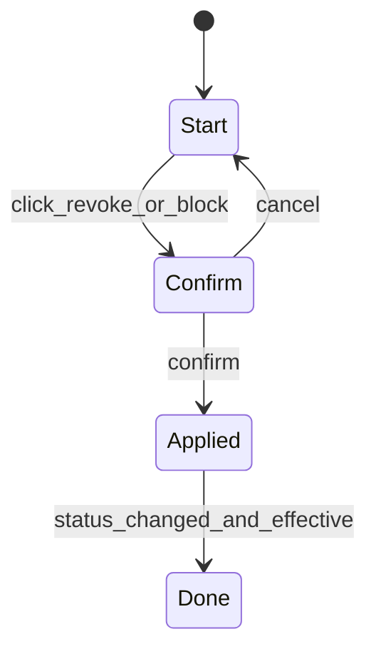

##### ㉕ Feature: Key Rotation（New → Switch → Revoke Old）
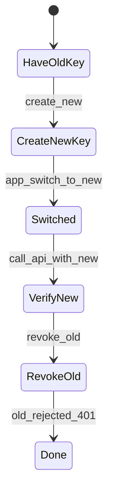

##### ㉖ Feature: API Service 管理（Admin CRUD）
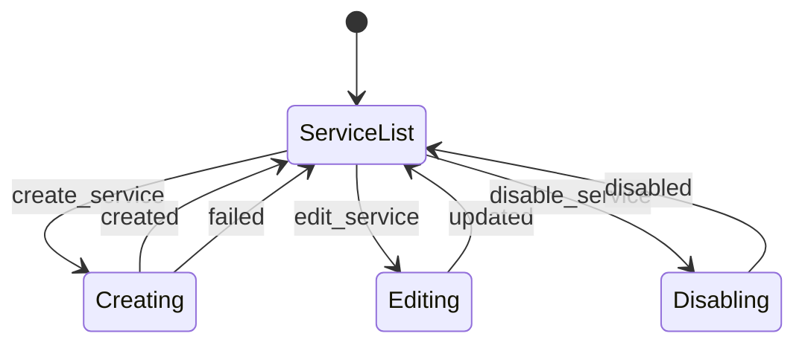

##### ㉗ Feature: Endpoint 管理（Admin CRUD / Enable/Disable）
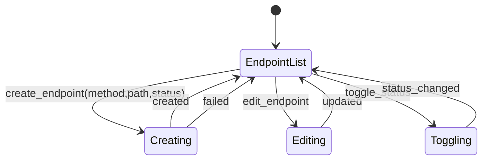

##### ㉘ Feature: Scope 管理（Admin CRUD）
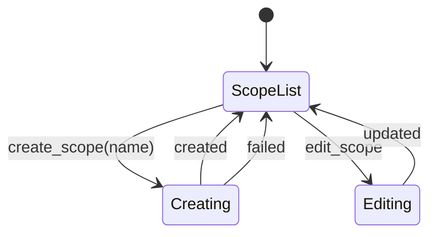

##### ㉙ Feature: Scope ↔ Endpoint 規則設定（Allow Rules）
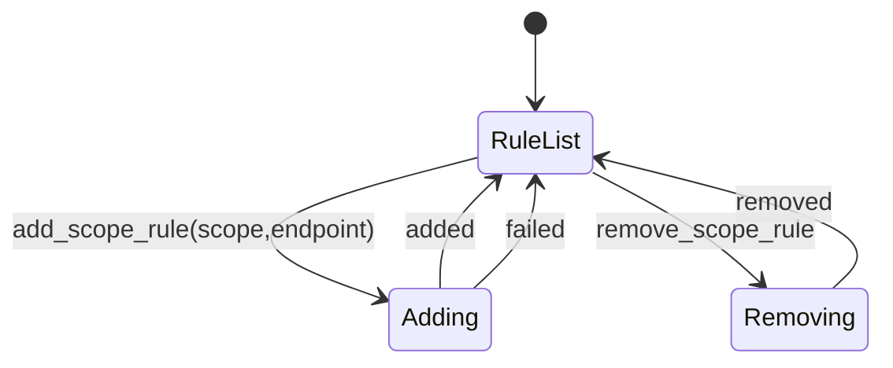

##### ㉚ Feature: Rate Limit 規則（Default / Max / Override）
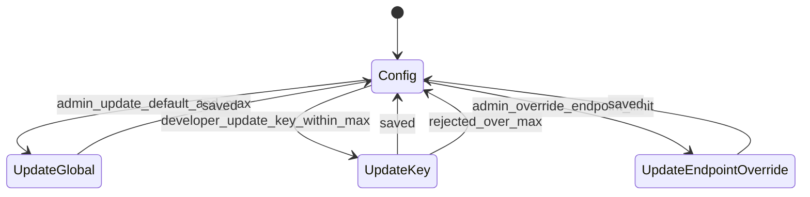

##### ㉛ Feature: Gateway 受保護 API 請求流程（Auth / Scope / Rate Limit / Proxy）
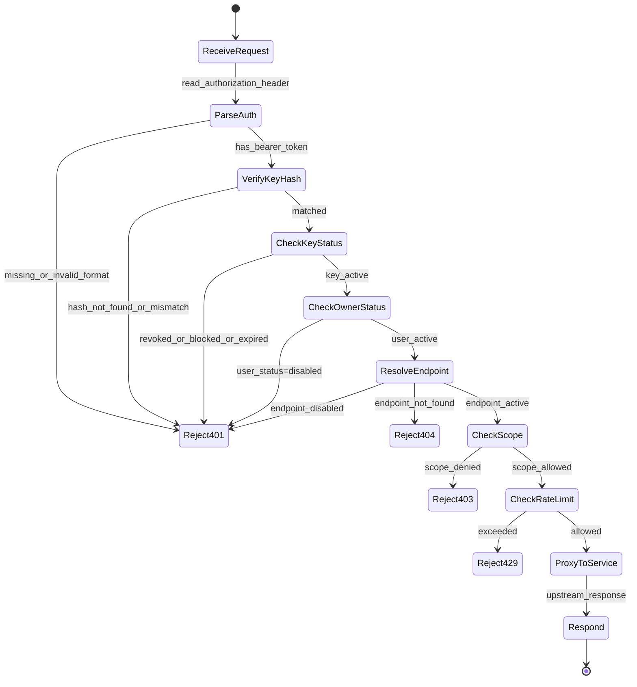

##### ㉜ Feature: Usage Log 寫入與查詢
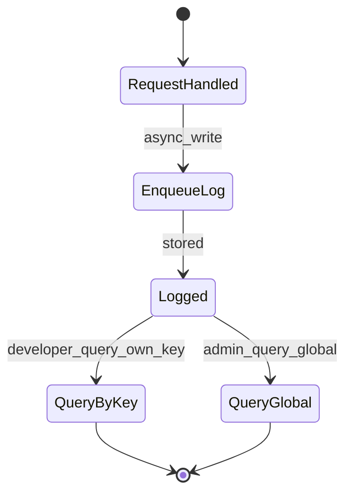

##### ㉝ Feature: Audit Log（敏感操作紀錄）
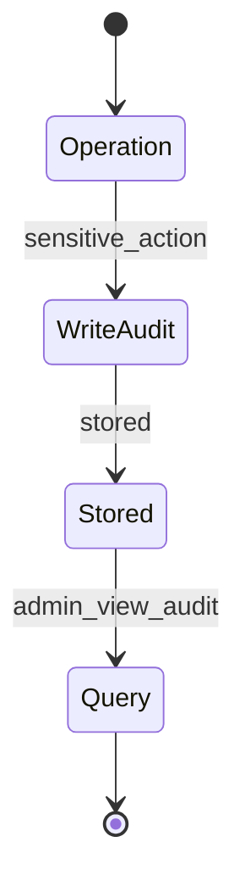

##### ㉞ Feature: 使用者停用（Disable User）
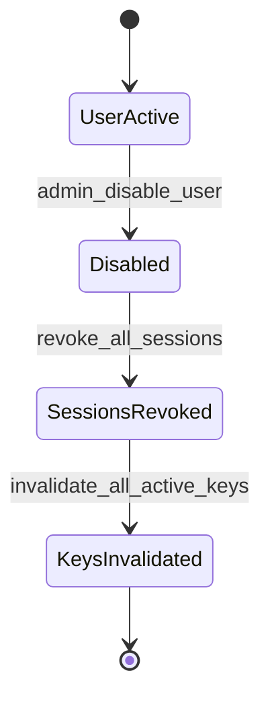

##### ㉟ Feature: 黑名單 IP（選擇性）
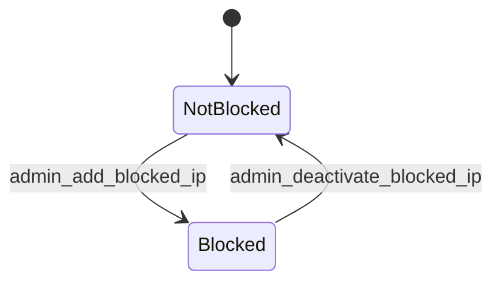

##### ㊱ 全站錯誤與權限
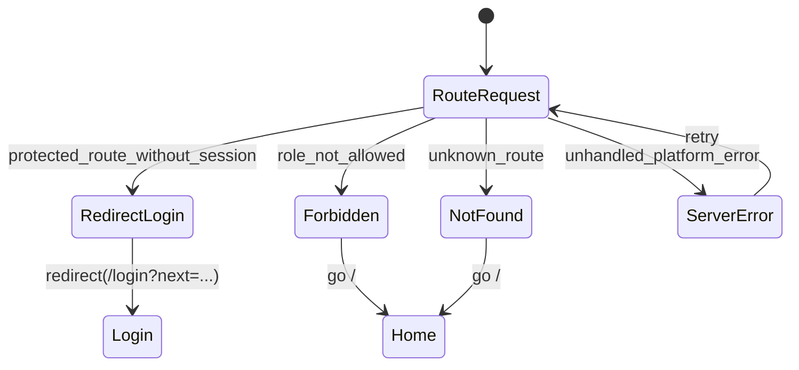

### Failure Modes & Recovery *(mandatory)*

- **Failure mode**: 註冊/登入輸入驗證失敗或 email 重複
  - **Recovery**: 不建立帳號/不建立 session；回傳可理解錯誤；可重試；可驗證不產生重複資料。
- **Failure mode**: Session 驗證或讀取失敗（暫時性錯誤）
  - **Recovery**: 顯示 Error + Retry；不得誤判為已登入；重試成功後回到正確狀態。
- **Failure mode**: Gateway 無法解析 endpoint（資料未同步/設定錯誤）
  - **Recovery**: 回 404（或依規格拒絕）；仍寫入 usage log（endpoint_id 可空）；Admin 可在 /admin 修正設定。
- **Failure mode**: Rate limit 計數系統不可用或超時
  - **Recovery**: 需採取保守策略（可配置為拒絕或允許但記錄風險事件）；不得造成系統崩潰；可於監控中觀測並修復。
- **Failure mode**: Usage/Audit log 非同步寫入失敗
  - **Recovery**: 不阻塞主回應；記錄內部錯誤並支援重試；可驗證主流程仍可用且後續能補齊或至少可追蹤失敗率。
- **Failure mode**: 上游服務 5xx 或 timeout
  - **Recovery**: 對外回傳不洩漏內部資訊的 5xx；usage log 記錄狀態碼與延遲；可由 Admin 觀測趨勢。

### Security & Permissions *(mandatory)*

- **Authentication**: Web 後台（/keys、/docs、/admin）必須要求有效 Web Session；受保護 API 必須要求 `Authorization: Bearer {API_KEY}`。
- **Authorization**: 
  - Web：RBAC（Guest/Developer/Admin）與路由 guard；Developer 不可存取 /admin（403）。
  - API：API Key 綁定 owner user；以 scopes + scope rules 判定 endpoint 存取；Admin 可覆寫管理操作。
- **Sensitive data**:
  - API key 原文屬最高敏感資料：只在建立時顯示一次；後續不得回傳；usage/audit 亦不得記錄原文。
  - 密碼：不可逆儲存。
  - Session：需可撤銷且可過期；使用者停用後既有 session 必須無效。
- **Abuse controls**: Rate limit（per minute/hour）與 key revoke/block；可選配 IP 黑名單。

### Observability *(mandatory)*

- **Logging**:
  - Usage log：所有受保護 API 呼叫（含 401/403/429/404/5xx）
  - Audit log：所有敏感操作（見 FR-030）
- **Tracing**: 每次請求應可關聯一個 request_id（或等效識別），使 usage/audit 與錯誤可交叉追蹤。
- **User-facing errors**:
  - Web：401 導向 /login；403 顯示 /403；429 顯示節流提示與重試建議；5xx 顯示 /500 與 Retry。
  - API：錯誤回應應提供可理解訊息（不洩漏內部）；429 應提供重試建議。
- **Developer diagnostics**: 內部可用錯誤代碼/分類（例如 auth_invalid、scope_denied、rate_limited）以利排查，但不得包含 key 原文。

### Backward Compatibility & Change Risk *(mandatory)*

- **Breaking change?**: No（新系統/新平台，不假設已有既有對外 API 合約）。
- **Migration plan**: 若未來導入既有服務，需：
  1) 建立 service/endpoint 與 scope 規則 → 2) 讓開發者建立 key 並測試 → 3) 逐步切換流量。
- **Rollback plan**: 發生重大故障時可：
  1) 暫停/停用特定 service 或 endpoint（避免誤授權）→ 2) 解除有問題的 scope rule → 3) 封鎖可疑 keys。

### Performance & Scale Assumptions *(mandatory)*

- **Growth assumption**: 支援多個內部/第三方開發者、每位開發者可擁有多把 keys；受保護 API 可能具高併發流量與尖峰。
- **Constraints**:
  - Gateway 的授權判定（key 驗證 + scope + rate limit）對單次請求的平均額外延遲目標 < 10ms（同一服務內）。
  - Usage/Audit log 寫入必須為非同步，主請求不得被阻塞。
  - Rate limit 與 log 寫入不可成為單點瓶頸；需可水平擴展或具備等效擴展策略。

### Key Entities *(include if feature involves data)*

- **User**: 平台帳號；具備 `email`、`role`（developer/admin）、`status`（active/disabled）、`last_login_at`。
- **UserSession**: Web 後台 session；具備 `expires_at`、`revoked_at`、`last_seen_at`；可被撤銷並在 user disabled 時失效。
- **ApiService**: 對外提供的服務目錄項；具備 `name`、`status`（active/disabled）。
- **ApiEndpoint**: 服務下的端點定義；具備 `method`、`path`、`status`（active/disabled）。
- **ApiScope**: 權限名稱（例：resource:read）；具備唯一 `name`。
- **ApiScopeRule**: scope 與 endpoint 的 allow 規則；用於 Gateway 授權判定。
- **ApiKey**: API 呼叫憑證；具備 `name`、`hash`、`status`（active/revoked/blocked）、`expires_at`、`rate_limit_per_minute/hour`、`replaced_by_key_id`。
- **ApiKeyScope**: key 與 scope 的關聯（多對多）。
- **ApiUsageLog**: API 使用紀錄；至少含 `api_key_id`、`method`、`path`、`status_code`、`response_time_ms`、`timestamp`。
- **AuditLog**: 敏感操作稽核；至少含 `actor`、`action`、`target`、`created_at`。
- **BlockedIp（選配）**: 黑名單 IP/CIDR 與狀態。

## Success Criteria *(mandatory)*

### Measurable Outcomes

- **SC-001**: 受保護 API 呼叫在 Gateway 端能正確回應 401/403/429/5xx（及 404 若 endpoint 不存在），且對應 usage（與 audit（若適用））可被查詢。
- **SC-002**: Key 建立後原文僅顯示一次；之後任何 UI/API/Log/匯出/除錯資訊均不可取得 Key 原文（抽樣檢查與自動化測試皆應通過）。
- **SC-003**: Web 後台頁面與路由對角色顯示/存取一致：
  - 不該出現的導航不顯示（Guest 不顯示 /keys,/docs,/admin；Developer 不顯示 /admin）。
  - 未登入存取受保護頁會導向 /login（帶 next）；權限不足顯示 403。
- **SC-004**: Developer 從註冊→登入→建立 key→成功呼叫一個受保護 endpoint 的完整流程，在正常網路下可於 3 分鐘內完成（不含外部系統切換時間）。
- **SC-005**: 在負載測試下，Gateway 授權判定帶來的平均額外延遲 < 10ms，且 95% 的請求不因記錄 usage/audit 而被阻塞。
- **SC-006**: Admin 對 key 進行 revoke/block、或停用使用者後，後續使用該 key/使用者的受保護 API 請求在下一次請求起 100% 被拒絕（401），且 audit log 可追溯 who/when/what。
