# Feature Specification: 多使用者協作待辦系統（Trello Lite）

**Feature Branch**: `[001-collab-task-board]`  
**Created**: 2026-02-05  
**Status**: Draft  
**Input**: User description: "Multi-user Collaborative Task Board (Trello Lite)；含 RBAC、Activity Log（append-only）、即時同步、WIP 限制/override、封存唯讀、斷線重連回補，以及提供之狀態機/轉移圖（Mermaid）作為規格依據。"

## User Scenarios & Testing *(mandatory)*

### User Story 1 - 註冊/登入與專案列表（基礎進入點）(Priority: P1)

Visitor 可註冊或登入成為 User；User 能看到自己的專案清單並可登出。任何需要登入的頁面/資源在未登入時被拒絕並導向登入。

**Why this priority**: 所有後續協作功能都依賴身份與安全邊界；沒有此故事就無法驗證授權與資料隔離。

**Independent Test**: 僅實作註冊/登入/登出 + 專案列表讀取，就能獨立驗證 session、401 導向與 Visitor/User 導覽差異。

**Acceptance Scenarios**:

1. **Given** 未登入狀態，**When** 使用者存取 `/projects`，**Then** 伺服端回 401，且前端導向 `/login` 並保留返回路徑。
2. **Given** Visitor 在 `/register` 完成註冊，**When** 註冊成功，**Then** 會建立登入狀態並導向 `/projects`。
3. **Given** User 已登入且在 `/projects`，**When** 按下登出，**Then** session 失效並導向 `/`，再次存取 `/projects` 需回 401。

---

### User Story 2 - 建立專案與成員邀請/角色（RBAC 與專案隔離）(Priority: P1)

User 可建立專案（預設 private/active）。Owner/Admin 可邀請專案成員並指定專案角色（Owner/Admin/Member/Viewer）；受邀者可在專案列表頁接受或拒絕。非成員不得看到或存取該專案資料（403）。

**Why this priority**: 多使用者協作的前提是「誰能看到/做什麼」一致且可驗證；錯誤授權會造成重大資料外洩風險。

**Independent Test**: 只要能建立專案、邀請、接受邀請、角色變更與 403/404 分流，就能在不做看板功能下驗證 RBAC 與隔離。

**Acceptance Scenarios**:

1. **Given** User 建立新專案，**When** 建立成功，**Then** 該 User 成為該專案唯一 Owner，且專案出現在自己的 `/projects`。
2. **Given** Owner 邀請 `email=X` 為 Member，**When** 受邀者接受邀請，**Then** 會建立 membership 並可進入 `/projects/:projectId/board`。
3. **Given** 已登入但非成員，**When** 存取 `/projects/:projectId/board`，**Then** 顯示 `/403` 且不洩露任何專案內容。
4. **Given** Owner 將成員角色從 Viewer 改為 Member，**When** 角色更新成功，**Then** 該成員後續可看到原本不可見的寫入入口（例如新增 Task）。

---

### User Story 3 - 看板結構（Board/List）與唯讀封存範圍 (Priority: P1)

Owner/Admin 可在專案內建立 Board 與 List、重排順序、設定 List 的 WIP 限制，並可封存 Board 或 List 使其範圍內資料唯讀。Viewer 只能檢視。

**Why this priority**: 這定義了協作的「容器」與操作邊界；沒有 Board/List 就無法進行任務的狀態與排序一致性。

**Independent Test**: 僅做 Board/List CRUD + reorder + archive + 權限控制，就能驗證結構一致與唯讀行為。

**Acceptance Scenarios**:

1. **Given** Owner 在看板頁，**When** 建立 Board 與 List，**Then** 所有成員在同一專案下看到一致的結構與順序。
2. **Given** Owner/Admin 重排 List，**When** 成功，**Then** 成員端顯示順序與伺服端一致且不重複/不缺漏。
3. **Given** List 已封存，**When** Member 嘗試拖入/拖出 Task 或新增 Task，**Then** 伺服端拒絕且 UI 顯示唯讀提示。

---

### User Story 4 - 任務協作（Task 建立/編輯/指派/狀態）與稽核 (Priority: P1)

Owner/Admin/Member 可在 List 建立 Task、編輯欄位、指派專案成員、依狀態機切換狀態並封存 Task；所有關鍵操作都必須追加 Activity Log（append-only）。

**Why this priority**: 這是產品的核心價值；同時也是「可追溯」的最小可行切面。

**Independent Test**: 單機（無即時）也能驗證 CRUD、狀態機限制、指派限制與 Activity Log 追加。

**Acceptance Scenarios**:

1. **Given** Member 在 List 下建立 Task，**When** 成功，**Then** Task 出現在該 List 且 Activity Log 追加 `task:create`。
2. **Given** Task 狀態為 done，**When** Member 嘗試改回 in_progress/open/blocked，**Then** 伺服端拒絕並回傳可顯示的錯誤原因。
3. **Given** Task 已 archived，**When** Member 嘗試編輯/拖拉/指派，**Then** 必須被拒絕，且 UI 顯示唯讀標示。
4. **Given** 非專案成員，**When** 嘗試被指派到 Task，**Then** 伺服端拒絕（不產生部分成功）。

---

### User Story 5 - 即時同步、權威排序、重連回補與衝突處理 (Priority: P2)

同一專案的成員對 Board/List/Task/Comment/Activity 的更新需即時同步；拖拉排序由伺服端產生權威結果並廣播；斷線重連後需重新取得最新快照並回補本地未送出變更，遇到版本衝突需提示並以伺服端最新為準。

**Why this priority**: 多使用者同時操作時若缺少一致性，會造成卡片順序混亂、資料覆寫與信任崩壞。

**Independent Test**: 只做「快照 + 即時事件 + 重連再對齊」就能驗證一致性；Task/Comment 可用最小欄位即可。

**Acceptance Scenarios**:

1. **Given** 兩位成員同時開啟同一看板，**When** 一方拖拉 Task，**Then** 另一方在短時間內看到相同 list_id/position 與一致排序。
2. **Given** 使用者離線期間做了變更（在本地排隊），**When** 重連並重送，**Then** 伺服端逐筆處理並在衝突時回傳最新版本且不悄悄覆寫。
3. **Given** 同一 Task 兩人同時編輯，**When** 後送出的帶舊版 version，**Then** 伺服端回 409 並附上最新 Task，客戶端提示重新套用。

---

### Edge Cases

- 專案/Board/List 被封存後，任何寫入操作（新增/編輯/拖拉/指派/留言/封存）都必須一致地被拒絕，且 UI 必須顯示唯讀提示。
- Member 嘗試拖入已達 WIP 上限的 List：必須被拒絕且 Task 回到原位置；Admin/Owner 可 override 並要求理由，且 Activity Log 必須記錄。
- 成員被移除：其在該專案內的 Task 指派需自動解除（或標記失效）且所有成員端一致。
- 同時拖拉同一張卡：最終排序以伺服端權威結果為準，避免重複/缺漏。
- 401/403/404/5xx 分流不可洩露敏感資訊（例如 403 不應透露資源是否存在的額外細節）。

## Requirements *(mandatory)*

### Functional Requirements

**認證與帳號**

- **FR-001**: 系統 MUST 允許 Visitor 以 email + password 註冊成為 User。
- **FR-002**: 系統 MUST 允許 User 登入並取得可用於後續授權的 session（短效 access + 可續期機制，或等效方案）。
- **FR-003**: 系統 MUST 支援 User 登出，且登出後伺服端 MUST 能拒絕登出前簽發之續期憑證（等效於 refresh 失效）。
- **FR-004**: 未登入存取受保護資源 MUST 回 401；前端 MUST 導向 `/login` 並保留返回路徑。

**專案（Project）**

- **FR-005**: User MUST 能建立專案，且 `name` 必填。
- **FR-006**: 專案建立成功時，建立者 MUST 成為該專案唯一 Owner，且建立事件 MUST 追加到 Activity Log。
- **FR-007**: 專案預設 MUST 為 `visibility=private`、`status=active`。
- **FR-008**: Owner MUST 能將專案封存（`status=archived`），且封存事件 MUST 追加 Activity Log。
- **FR-009**: 專案封存後，該專案下所有寫入操作 MUST 被拒絕，且 UI MUST 顯示唯讀提示。
- **FR-010**: 專案 `visibility` MUST 支援 `private|shared`，且不提供匿名公開瀏覽。

**成員與角色（Membership / Invitation）**

- **FR-011**: 專案角色 MUST 支援 `owner|admin|member|viewer`。
- **FR-012**: 每個專案 MUST 恆有且僅有 1 位 Owner。
- **FR-013**: Owner/Admin MUST 能邀請成員（以 email）並指定 `invited_role in {admin,member,viewer}`。
- **FR-014**: 受邀者 MUST 能在 `/projects` 的邀請匣中接受或拒絕邀請（不新增獨立頁）。
- **FR-015**: 邀請被接受後才 MUST 建立 membership；拒絕則 MUST 不建立 membership。
- **FR-016**: Owner/Admin MUST 能調整成員角色；每次角色調整 MUST 追加 Activity Log。
- **FR-017**: Owner MUST 能移除成員；移除事件 MUST 追加 Activity Log。
- **FR-018**: 成員被移除時，系統 MUST 解除其在該專案內所有 Task 的指派（或將指派標記為失效），並 MUST 追加 Activity Log。

**Board / List（結構與封存）**

- **FR-019**: Owner/Admin MUST 能建立 Board，並可重排 Board 的順序（`order`）。
- **FR-020**: Owner/Admin MUST 能封存 Board（`status=archived`），封存事件 MUST 追加 Activity Log。
- **FR-021**: Board 封存後，其下所有 List/Task MUST 進入唯讀（禁止新增/編輯/拖拉/指派/封存/留言）。
- **FR-022**: Owner/Admin MUST 能建立 List，並可重排 List 的順序（`order`）。
- **FR-023**: Owner/Admin MUST 能封存 List（`status=archived`），封存事件 MUST 追加 Activity Log。
- **FR-024**: List 封存後，該 List 內 Task MUST 進入唯讀，且 Task MUST NOT 被拖出或拖入該 List。

**WIP 限制與 override**

- **FR-025**: List MUST 支援 WIP 限制設定：`is_wip_limited=true` 時 `wip_limit` MUST 為正整數。
- **FR-026**: WIP 計數 MUST 以「該 List 中未 archived 的 Task」為準。
- **FR-027**: 當超過 WIP 上限時，Member 的建立/拖入 MUST 被拒絕並回傳可顯示的錯誤。
- **FR-028**: 當超過 WIP 上限時，Admin/Owner MAY override；若 override，系統 MUST 記錄 override 理由與結果至 Activity Log。

**Task（建立/編輯/指派/狀態/封存）**

- **FR-029**: Owner/Admin/Member MUST 能建立 Task；`title` 必填。
- **FR-030**: Task MUST 支援欄位：title、description、due_date、priority。
- **FR-031**: Viewer MUST NOT 能建立/編輯/拖拉/指派/封存 Task。
- **FR-032**: Task MUST 支援狀態集合：`open|in_progress|blocked|done|archived`。
- **FR-033**: Task 狀態轉換 MUST 僅允許：
  - open → in_progress | blocked | done | archived
  - in_progress → blocked | done | archived
  - blocked → in_progress | done | archived
  - done → archived
  - archived：終態，不可再轉換
- **FR-034**: `done` MUST NOT 被拖回或轉回 `in_progress/open/blocked`。
- **FR-035**: `archived` MUST NOT 可再編輯/拖拉/指派。
- **FR-036**: Task MUST 支援多選指派（assignee_ids），且僅能指派專案成員。

**拖拉與排序一致性（權威排序）**

- **FR-037**: 任何 Task 拖拉/重排操作 MUST 由伺服端計算並回傳「權威排序結果」，並同步給所有成員。
- **FR-038**: Task MUST 具備可用於高頻插入的 `position`（字串或數值皆可），以確保密集拖拉下仍能穩定排序。
- **FR-039**: 同時拖拉同一資源時，伺服端 MUST 以最後寫入為準並重新計算 position，且廣播最終排序。

> Sortable key（position）演算法研究與決策見 [research.md](./research.md)（建議：fractional indexing / lexicographic order key；搭配交易、唯一約束與重試；必要時 list 內 rebalance）。

**衝突檢測（版本）**

- **FR-040**: 可編輯實體（至少 Task、Project、Board、List、Membership）MUST 具備 `version`（或等效機制）用於衝突檢測。
- **FR-041**: 當寫入請求的版本與伺服端不一致時，伺服端 MUST 拒絕寫入並回 409，且 MUST 回傳最新資料供客戶端提示重新套用。

**Comment（不可編輯/刪除）**

- **FR-042**: Owner/Admin/Member MUST 能在 Task 下新增 Comment；Viewer MUST NOT。
- **FR-043**: Comment MUST NOT 提供編輯/刪除；每次建立 MUST 追加 Activity Log（comment:create）。

**Activity Log（append-only）**

- **FR-044**: 系統 MUST 為所有關鍵操作追加 Activity Log，且 Activity Log MUST 為 append-only（不可修改/刪除）。
- **FR-045**: Activity Log MUST 至少涵蓋：Project/Board/List/Task/Comment/Membership/Invitation 的建立、更新、封存、角色調整、WIP override、拖拉重排。
- **FR-046**: Activity Log MUST 可依專案查詢並以時間排序顯示。

**即時同步與重連回補**

- **FR-047**: 專案內 Task 狀態、排序、拖拉結果 MUST 即時同步給同專案成員。
- **FR-048**: Comment 與 Activity Log MUST 即時更新。
- **FR-049**: 客戶端重連後 MUST 能取得最新 Board 快照（含 List/Task 與排序）。
- **FR-050**: 若客戶端有未送出的本地變更，重連後 MUST 逐筆重送；遇到衝突 MUST 顯示伺服端最新並提示使用者重新套用。

**頁面與導覽（資訊架構）**

- **FR-051**: 系統 MUST 提供指定頁面路由清單：`/`、`/register`、`/login`、`/projects`、`/projects/:projectId/board`、`/projects/:projectId/members`、`/projects/:projectId/settings`、`/projects/:projectId/activity`、`/projects/:projectId/archived`、`/401`、`/403`、`/404`、`/5xx`。
- **FR-052**: User 進入 `/` 時 MAY 導向 `/projects`；Visitor Header 僅顯示登入/註冊；User Header 僅顯示專案列表/登出。
- **FR-053**: 專案內頁僅限專案成員；非成員 MUST 顯示 403；不存在 MUST 顯示 404。
- **FR-054**: `/projects/:projectId/settings` 僅 Owner 可存取；其他成員 MUST 403。
- **FR-055**: UI MUST 不顯示無權限入口（例如 Viewer 不顯示新增 Task/留言/管理成員按鈕）。

**需求可驗證性（Traceability）**

> 目的：確保每一組需求都能被獨立驗收。下列對應可作為測試規劃的起點；更細的「FR×測試案例矩陣」在 planning 階段補齊。

- **Auth / 401 / 導覽**: User Story 1；狀態機 ①、②、③、④、⑤、㉑、㉛；涵蓋 FR-001～FR-004、FR-051～FR-052。
- **專案隔離與 RBAC**: User Story 2；狀態機 ①、⑤、⑥、⑧、⑨、⑬、⑭、㉛；涵蓋 FR-005～FR-018、FR-053～FR-054。
- **Board/List 結構與封存唯讀**: User Story 3；狀態機 ⑥、⑯、㉔；涵蓋 FR-019～FR-024。
- **WIP 限制與 override**: User Story 3/5；狀態機 ⑯、⑰、㉕；涵蓋 FR-025～FR-028。
- **Task（狀態機/指派/封存/衝突）**: User Story 4/5；狀態機 ⑦、⑰、㉖、㉗；涵蓋 FR-029～FR-041。
- **Comment 與 Activity（append-only + 即時）**: User Story 4/5；狀態機 ⑦、⑩、㉘、㉙；涵蓋 FR-042～FR-046、FR-048。
- **即時同步與重連回補**: User Story 5；狀態機 ⑥、⑩、㉚；涵蓋 FR-047～FR-050。

### Data Contract & API Semantics *(mandatory if feature has frontend/backend or external integration)*

> 目標：先定義「合約與語意」，不綁定任何實作框架或傳輸協定；錯誤以通用語意表達（可映射到 HTTP/RPC 等）。

**通用回應規格**

- 所有成功回應 MUST 回傳 `request_id`（或等效）以便追蹤。
- 所有錯誤回應 MUST 回傳 `error.code`、`error.message`、`error.details`（可選）供 UI 顯示與除錯。

**Auth**

- **Contract**: `RegisterUser` request: `{ email, password, display_name }` → response: `{ user: { id, email, display_name, created_at }, session: { access_token, expires_at, refresh_token? } }`
- **Contract**: `LoginUser` request: `{ email, password }` → response: `{ user, session }`
- **Contract**: `LogoutUser` request: `{}` → response: `{ ok: true }`
- **Contract**: `RefreshSession` request: `{ refresh_token }` → response: `{ session: { access_token, expires_at } }`
- **Errors**:
  - `Unauthorized` → 未登入/憑證無效 → 導向登入並保留返回路徑
  - `RateLimited` → 請求過多 → 顯示稍後再試

**Projects & Membership**

- **Contract**: `ListAccessibleProjects` response: `{ projects: [ { id, name, visibility, status, owner_id, updated_at } ], invitations: [ ... ] }`
- **Contract**: `CreateProject` request: `{ name, description? }` → response: `{ project }`
- **Contract**: `UpdateProject` request: `{ project_id, name?, description?, visibility?, version }` → response: `{ project }`
- **Contract**: `ArchiveProject` request: `{ project_id, version }` → response: `{ project }`
- **Contract**: `CreateInvitation` request: `{ project_id, email, invited_role }` → response: `{ invitation }`
- **Contract**: `AcceptInvitation` request: `{ project_id, invitation_id }` → response: `{ membership }`
- **Contract**: `RejectInvitation` request: `{ project_id, invitation_id }` → response: `{ invitation }`
- **Contract**: `UpdateMemberRole` request: `{ project_id, user_id, role, version }` → response: `{ membership }`
- **Contract**: `RemoveMember` request: `{ project_id, user_id }` → response: `{ ok: true }`
- **Errors**:
  - `Forbidden` → 非成員或無權限 → 顯示無權限
  - `NotFound` → 專案不存在或 invitation 不存在/不屬於此專案 → 顯示找不到

**Board Snapshot（看板權威快照）**

- **Contract**: `GetBoardSnapshot` request: `{ project_id }` → response: `{ project, boards: [...], lists: [...], tasks: [...], memberships: [...], server_time }`
- **Errors**:
  - `Conflict` → 客戶端本地狀態基準不相容（若有）→ 重新拉全量快照

**Board / List**

- **Contract**: `CreateBoard` request: `{ project_id, name }` → response: `{ board }`
- **Contract**: `ReorderBoard` request: `{ project_id, board_id, order }` → response: `{ board }`
- **Contract**: `ArchiveBoard` request: `{ project_id, board_id }` → response: `{ board }`
- **Contract**: `CreateList` request: `{ project_id, board_id, title }` → response: `{ list }`
- **Contract**: `ReorderList` request: `{ project_id, list_id, order }` → response: `{ list }`
- **Contract**: `SetListWipPolicy` request: `{ project_id, list_id, is_wip_limited, wip_limit?, version }` → response: `{ list }`
- **Contract**: `ArchiveList` request: `{ project_id, list_id }` → response: `{ list }`

**Task（含拖拉）**

- **Contract**: `CreateTask` request: `{ project_id, list_id, title, description?, due_date?, priority?, position? }` → response: `{ task, authoritative_list_order: [ { task_id, position } ] }`
- **Contract**: `GetTaskDetail` request: `{ project_id, task_id }` → response: `{ task, comments: [...], memberships: [...], server_time }`
- **Contract**: `UpdateTask` request: `{ project_id, task_id, title?, description?, due_date?, priority?, version }` → response: `{ task }`
- **Contract**: `MoveTask` request: `{ project_id, task_id, to_list_id, to_position_hint?, version }` → response: `{ task, authoritative_source_list_order: [...], authoritative_target_list_order: [...] }`
- **Contract**: `SetTaskAssignees` request: `{ project_id, task_id, assignee_ids: [user_id...], version }` → response: `{ task }`
- **Contract**: `ChangeTaskStatus` request: `{ project_id, task_id, to_status, version }` → response: `{ task }`
- **Contract**: `ArchiveTask` request: `{ project_id, task_id, version }` → response: `{ task }`
- **Errors**:
  - `InvalidTransition` → 無效狀態轉換 → 顯示原因
  - `Conflict` → 版本衝突或 WIP 超限（若採同一語意）→ 顯示並回復 UI
  - `Forbidden` → 權限不足/唯讀範圍 → 顯示唯讀或無權限

**Comment**

- **Contract**: `CreateComment` request: `{ project_id, task_id, content }` → response: `{ comment }`
- **Errors**: `Forbidden` → Viewer 或唯讀範圍 → 禁止留言

**Activity**

- **Contract**: `ListActivityEvents` request: `{ project_id, cursor? }` → response: `{ events: [ { id, actor_id, entity_type, entity_id, action, timestamp, metadata } ], next_cursor? }`

**Realtime（事件語意）**

- **Contract**: `Event: board_snapshot_updated` payload: `{ project_id, snapshot_version, changed_entities_summary }`
- **Contract**: `Event: task_moved` payload: `{ project_id, task_id, from_list_id, to_list_id, authoritative_orders }`
- **Contract**: `Event: comment_created` payload: `{ project_id, task_id, comment }`
- **Contract**: `Event: activity_appended` payload: `{ project_id, event }`

### State Transitions & Invariants *(mandatory if feature changes state/data)*

**核心不變量（Invariants）**

- **Invariant**: 專案資料隔離：User 只能讀寫其具 membership 的專案；非成員一律 403（不洩露內容）。
- **Invariant**: RBAC 伺服端強制：UI 隱藏按鈕不等於授權；所有寫入必須再次驗權。
- **Invariant**: Activity Log 為 append-only：既有事件不可被修改或刪除。
- **Invariant**: `archived` 代表終態唯讀：
  - Project.archived → 專案下所有資料唯讀
  - Board.archived → Board 範圍唯讀
  - List.archived → List 範圍唯讀，且 Task 不可拖入/拖出
  - Task.archived → Task 本身唯讀
- **Invariant**: Task 狀態機必須被強制（見 FR-033～FR-035）。
- **Invariant**: WIP 計數只包含未 archived 的 Task。
- **Invariant**: 拖拉排序由伺服端提供權威結果；客戶端僅暫時呈現，最終必須以權威排序對齊。

**關鍵轉移（Transitions）**

- **Transition**: Given 專案或其上層範圍（Project/Board/List）為 archived，when 任一寫入請求發生，then 必須拒絕並回傳可顯示的唯讀原因，且不得追加非必要的 Activity Log。
- **Transition**: Given List WIP 超限，when Member 建立/拖入 Task，then 拒絕且 UI 應回復原狀；when Admin/Owner override 並提供理由，then 允許且 Activity Log 追加 override_wip。
- **Transition**: Given Task.version 不一致，when 客戶端寫入，then 409 並回傳最新 Task（不得靜默覆寫）。

**狀態機參考（Normative Mermaid Diagrams）**

以下 Mermaid 圖為規格的一部分（視為規範性參考），其 verify 註解可直接轉為驗收測試。

#### ① Global App Page State Machine

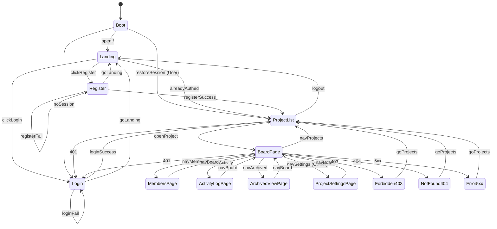

#### ② 產品介紹頁（Landing） Page

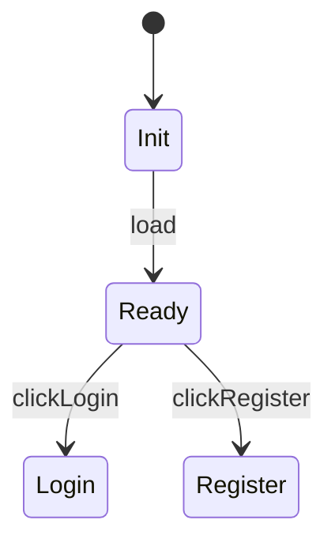

#### ③ 註冊頁 Page

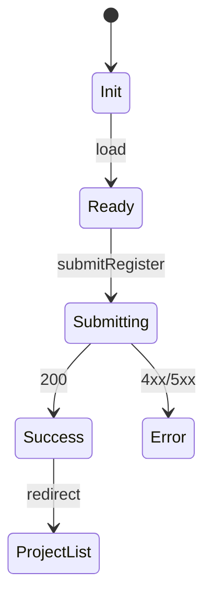

#### ④ 登入頁 Page

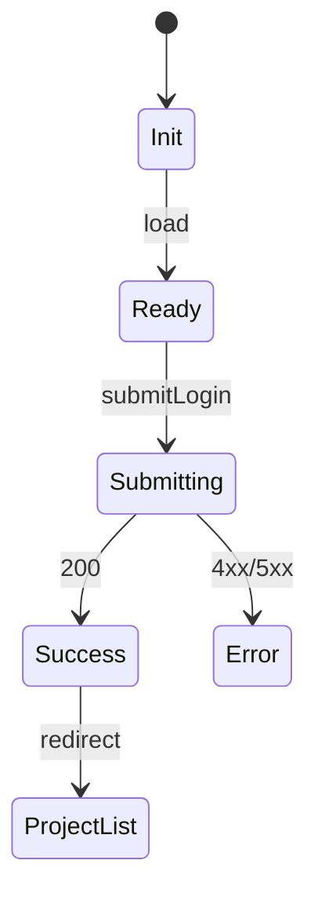

#### ⑤ 專案列表頁 Page

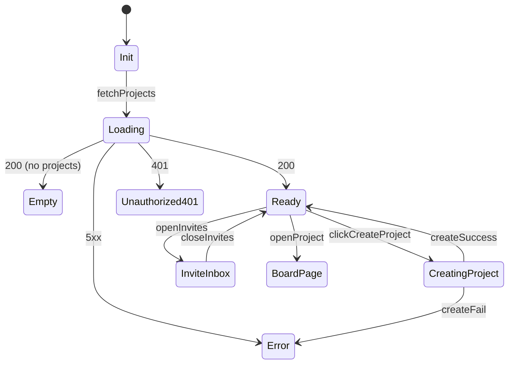

#### ⑥ 專案總覽/看板頁（Board + List + Task） Page

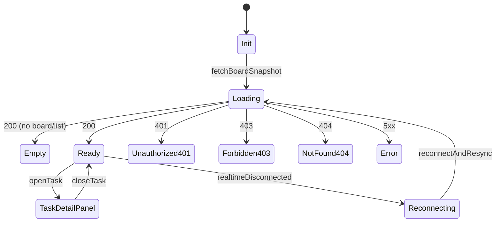

#### ⑦ 任務詳情（側邊欄/彈窗） Page

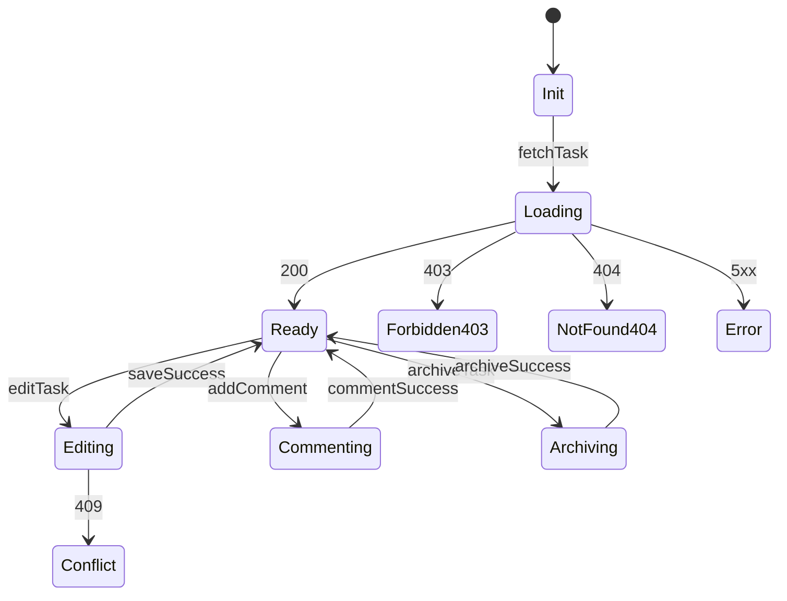

#### ⑧ 成員管理頁（Project Members） Page

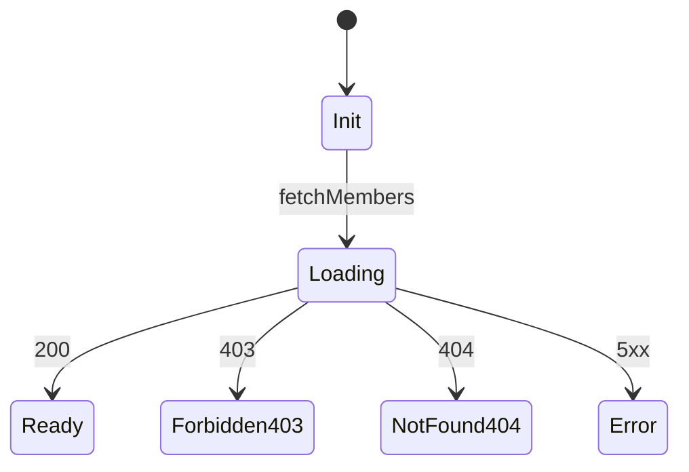

#### ⑨ 專案設定頁（Project Settings） Page

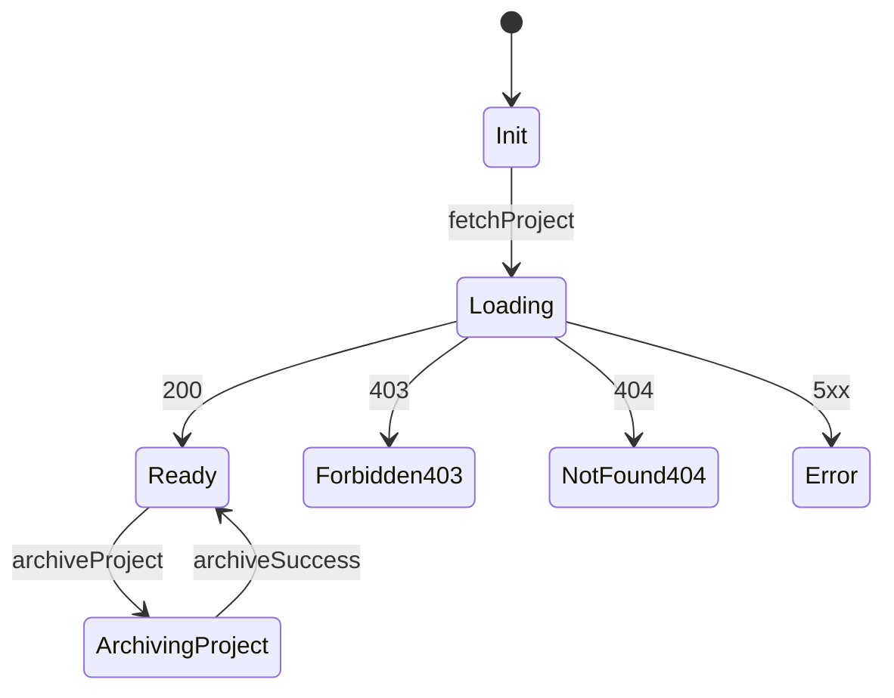

#### ⑩ Activity Log 頁 Page

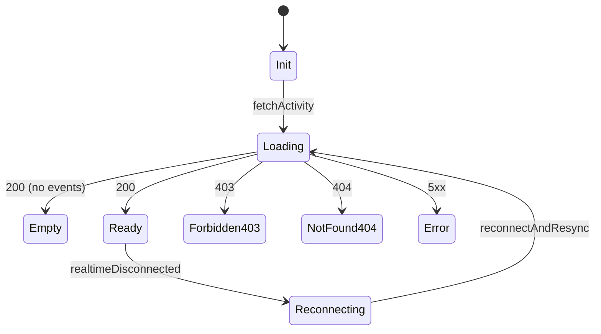

#### ⑪ 封存專案/封存任務檢視頁 Page

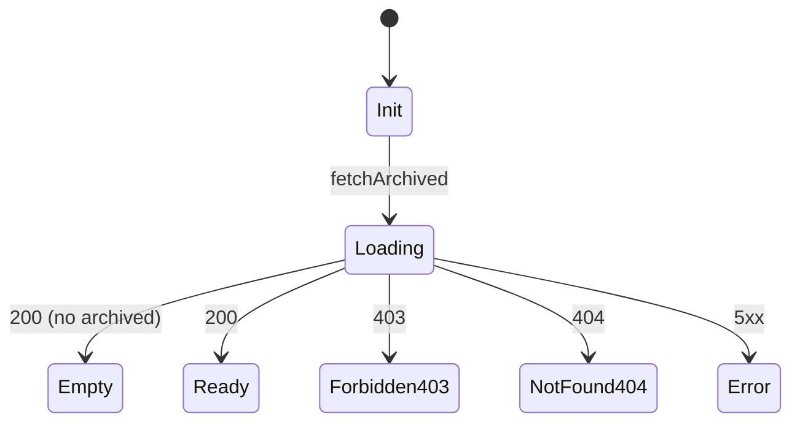

#### ⑫ 401 未登入頁 Page

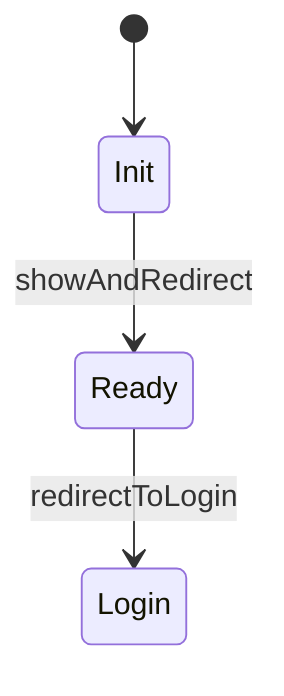

#### ⑬ 403 無權限頁 Page

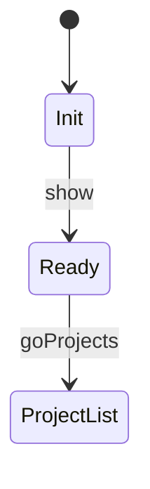

#### ⑭ 404 找不到頁 Page


#### ⑮ 5xx 系統錯誤頁 Page

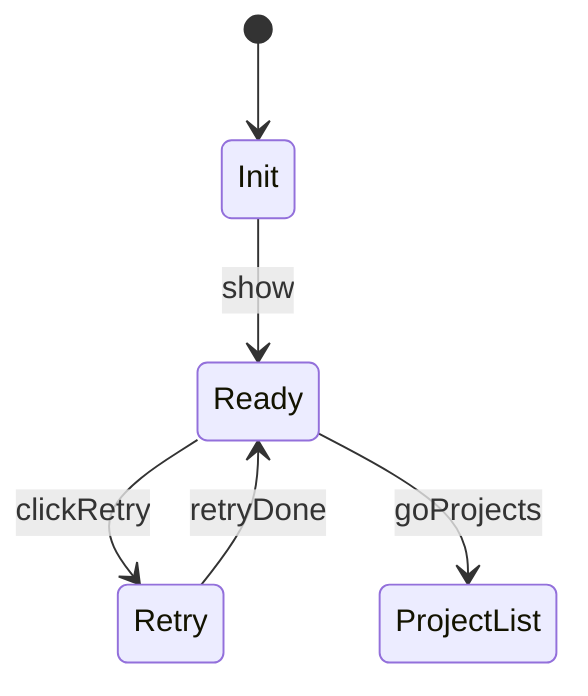

#### ⑯ 專案總覽/看板頁（Owner/Admin 視角）

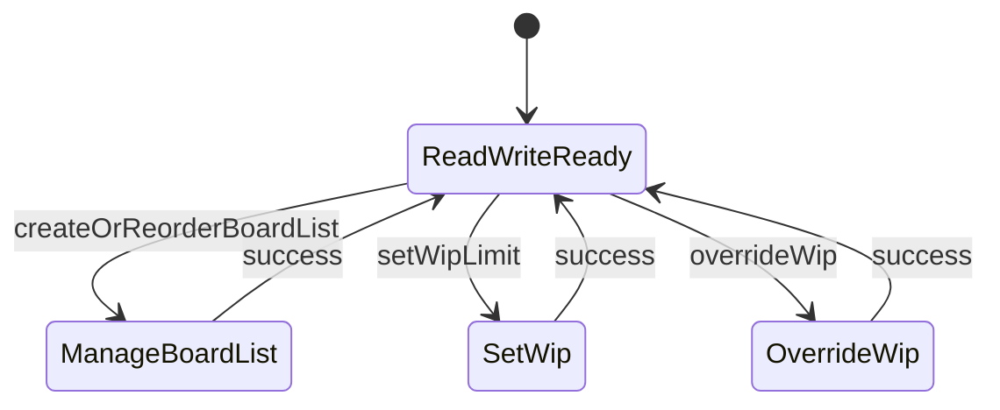

#### ⑰ 專案總覽/看板頁（Member 視角）

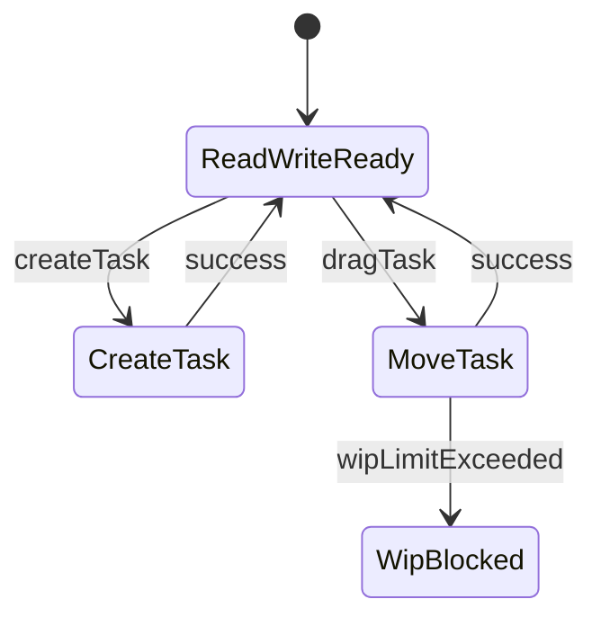

#### ⑱ 專案總覽/看板頁（Viewer 視角）

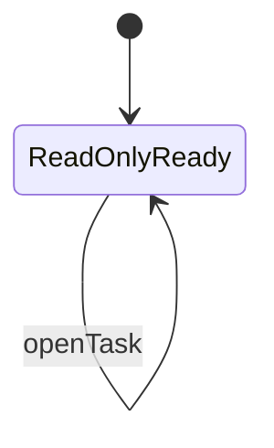

#### ⑲ 成員管理頁（Owner/Admin 視角）

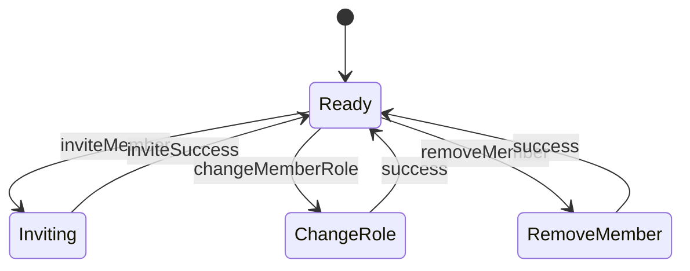

#### ⑳ 成員管理頁（Member/Viewer 視角）

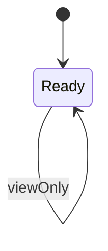

#### ㉑ Feature: Global Navigation Rendering

```mermaid
stateDiagram-v2
  [*] --> DetectAuth

  DetectAuth --> NavVisitor : Visitor
  %% verify: 未登入狀態；導覽僅顯示登入/註冊；不可見專案入口

  DetectAuth --> NavUser : User
  %% verify: 已登入狀態；導覽顯示專案列表/登出；不顯示登入/註冊

  NavVisitor --> NavVisitor : showLoginRegister
  %% verify: Header 只存在一組登入/註冊入口；不在頁面內重複顯示同動作入口

  NavUser --> NavUser : showProjectsLogout
  %% verify: Header 只存在一組專案列表/登出入口；不顯示未授權頁面入口
```

#### ㉒ Feature: Project Create / Archive / Visibility

```mermaid
stateDiagram-v2
  [*] --> Idle

  Idle --> Creating : createProject
  %% verify: User 才能建立；回應 200；Project 出現在 `/projects`；寫入 Activity Log（project:create）

  Creating --> Idle : success
  %% verify: 清單與導覽更新；可開啟新專案看板

  Idle --> UpdatingVisibility : updateVisibility
  %% verify: 只有 Owner 可調整；回應 200；Project.visibility 更新；寫入 Activity Log（project:update_visibility）

  UpdatingVisibility --> Idle : success
  %% verify: UI 顯示新 visibility；不影響 membership 存取控制

  Idle --> Archiving : archiveProject (Owner)
  %% verify: 僅 Owner；回應 200；Project.status=archived；寫入 Activity Log（project:archive）

  Archiving --> Idle : success
  %% verify: 專案進入唯讀；所有寫入操作回拒絕（例如 403/409）；UI 顯示唯讀提示
```

#### ㉓ Feature: Invitation Accept / Reject

```mermaid
stateDiagram-v2
  [*] --> Inbox

  Inbox --> Accepting : acceptInvite
  %% verify: 接受後建立 ProjectMembership；回應 200；邀請狀態變 accepted；寫入 Activity Log（invitation:accept / membership:create）

  Accepting --> Inbox : success
  %% verify: 邀請從清單移除或標示已接受；專案出現在 `/projects`

  Inbox --> Rejecting : rejectInvite
  %% verify: 回應 200；邀請狀態變 rejected；不建立 membership；寫入 Activity Log（invitation:reject）

  Rejecting --> Inbox : success
  %% verify: 邀請從清單移除或標示已拒絕；專案不會出現在 `/projects`
```

#### ㉔ Feature: Board / List Create / Reorder / Archive

```mermaid
stateDiagram-v2
  [*] --> Idle

  Idle --> CreateBoard : createBoard
  %% verify: Owner/Admin 才可；回應 200；Board 出現且 order 正確；Activity Log（board:create）

  CreateBoard --> Idle : success
  %% verify: 所有成員即時看到 Board；排序一致

  Idle --> CreateList : createList
  %% verify: Owner/Admin 才可；回應 200；List 出現在正確 Board 並有 order；Activity Log（list:create）

  CreateList --> Idle : success
  %% verify: 所有成員即時看到 List；WIP 預設關閉

  Idle --> Reorder : reorder
  %% verify: Owner/Admin 才可；回應 200；Board.order 或 List.order 更新；realtime 廣播後一致

  Reorder --> Idle : success
  %% verify: 客戶端排序與伺服端權威排序一致；不出現重複/遺失項目

  Idle --> ArchiveBoardOrList : archive
  %% verify: Owner/Admin 才可；回應 200；status=archived；其範圍內資料變唯讀；Activity Log（archive）

  ArchiveBoardOrList --> Idle : success
  %% verify: UI 顯示封存結果；封存範圍內 Task 不可拖拉/編輯/指派
```

#### ㉕ Feature: WIP Limit & Override

```mermaid
stateDiagram-v2
  [*] --> Idle

  Idle --> SetLimit : setWipLimit
  %% verify: Owner/Admin 才可；回應 200；List.is_wip_limited/wip_limit 正確；Activity Log（list:update）

  SetLimit --> Idle : success
  %% verify: WIP 規則立即生效；拖入/建立時會被檢查

  Idle --> CheckLimit : moveIntoList
  %% verify: 送出 move/create 需包含目標 list_id；伺服端以未 archived 的 Task 計數檢查

  CheckLimit --> Allowed : underLimit
  %% verify: 未超限；允許操作；回應 200；排序與 list_id/position 一致

  CheckLimit --> Blocked : overLimit (Member)
  %% verify: Member 超限被拒絕（例如 400/409）；UI 顯示超限原因；不寫入 override_wip

  CheckLimit --> Overridden : overLimit (Admin/Owner)
  %% verify: Admin/Owner 可 override；必寫 Activity Log（action=override_wip）含理由與超限資訊

  Allowed --> Idle : applyMove
  %% verify: move/create 套用成功；realtime 廣播；所有成員看到相同結果

  Overridden --> Idle : applyMove
  %% verify: 超限仍成功；WIP 計數正確；Activity Log 可在 Activity 頁看到該筆 override

  state Blocked
```

#### ㉖ Feature: Task Create / Edit / Assign / Status / Archive

```mermaid
stateDiagram-v2
  [*] --> Idle

  Idle --> Creating : createTask
  %% verify: Owner/Admin/Member 才可；若專案或目標 List/Board 封存則拒絕；成功回應 200 並寫 Activity Log（task:create）

  Creating --> Idle : success
  %% verify: Task 出現在正確 List；position 正確；realtime 廣播一致

  Idle --> Editing : editTask
  %% verify: Viewer 或 archived 任務不可編輯；可編輯者送出需帶 version；成功回應 200

  Editing --> Idle : saveSuccess
  %% verify: 欄位更新正確；version 遞增；realtime 廣播；Activity Log（task:update）追加

  Editing --> Conflict : 409
  %% verify: 版本衝突；回傳最新 Task；UI 顯示衝突與更新內容；不覆寫最新版本

  Idle --> Assigning : assignOrUnassign
  %% verify: 只能指派專案成員；非成員拒絕；成功回應 200；Activity Log（task:assign/unassign）

  Assigning --> Idle : success
  %% verify: assignee_ids 更新；看板卡片同步顯示；所有成員即時一致

  Idle --> ChangingStatus : changeStatus
  %% verify: archived 任務拒絕；done 不可回 in_progress/open/blocked；成功回應 200 並寫 Activity Log（task:status_change）

  ChangingStatus --> Idle : success
  %% verify: status 更新；若 status=done 則 UI 顯示完成；拖拉回 in_progress 的入口不可用

  ChangingStatus --> Rejected : invalidTransition
  %% verify: 回應 400；UI 顯示不可轉換原因；狀態不變

  Idle --> Archiving : archiveTask
  %% verify: 可封存者執行；成功回應 200；status=archived；Activity Log（task:archive）

  Archiving --> Idle : success
  %% verify: archived 任務在看板顯示為唯讀或移出；封存檢視頁可看到

  state Conflict
  state Rejected
```

#### ㉗ Feature: Drag & Drop Ordering Consistency

```mermaid
stateDiagram-v2
  [*] --> Idle

  Idle --> Dragging : startDrag
  %% verify: 僅 Owner/Admin/Member 可拖拉；Viewer 或唯讀狀態下拖拉手勢被禁用

  Dragging --> Committing : drop
  %% verify: 送出 move 請求含來源/目標 list_id 與新 position；同時套用 WIP 與狀態機限制

  Committing --> Idle : serverBroadcastApplied
  %% verify: 伺服端回傳權威排序；realtime 廣播後所有成員看到相同順序；不重複/不缺漏
```

#### ㉘ Feature: Comment Realtime

```mermaid
stateDiagram-v2
  [*] --> Idle

  Idle --> Sending : addComment
  %% verify: Owner/Admin/Member 才可；送出後按鈕 disabled；內容需防 XSS（輸出轉義或清理）

  Sending --> Idle : success
  %% verify: 回應 200；Comment 出現在串列；其他成員即時收到；Activity Log（comment:create）追加

  Sending --> Error : fail
  %% verify: 顯示錯誤並可重試；不得產生重複留言
```

#### ㉙ Feature: Activity Log Append & Realtime

```mermaid
stateDiagram-v2
  [*] --> Idle

  Idle --> Appending : keyAction
  %% verify: 任一關鍵操作完成後必追加 ActivityLog；包含 actor_id/entity_type/action/timestamp/metadata

  Appending --> Idle : appended
  %% verify: ActivityLog API/即時事件不可修改既有紀錄；只能新增；Activity 頁即時顯示新事件
```

#### ㉚ Feature: Reconnect & Resync

```mermaid
stateDiagram-v2
  [*] --> Connected

  Connected --> Disconnected : networkLost
  %% verify: 偵測斷線；UI 顯示離線提示；暫停即時更新

  Disconnected --> Reconnecting : retry
  %% verify: 觸發重連；重連期間顯示同步中狀態

  Reconnecting --> Connected : resynced
  %% verify: 重連成功後拉取最新快照；本地狀態對齊；若有衝突則提示並套用伺服端最新
```

#### ㉛ 全站錯誤與權限

```mermaid
stateDiagram-v2
  [*] --> Request

  Request --> Unauthorized401 : 401
  %% verify: 未登入存取受保護資源回 401；前端導向登入並保留返回路徑

  Request --> Forbidden403 : 403
  %% verify: 已登入但無權限回 403；不洩露敏感內容；UI 顯示無權限

  Request --> NotFound404 : 404
  %% verify: 資源不存在回 404；UI 顯示找不到並提供返回

  Request --> Error5xx : 5xx
  %% verify: 系統錯誤回 5xx；UI 顯示錯誤與重試；不顯示內部細節

  Request --> Ok : 200
  %% verify: 回應成功；UI 顯示對應頁面 Ready/Empty 狀態

  Unauthorized401 --> Login : redirectToLogin
  %% verify: 導向 `/login`；登入成功後可返回原頁

  Forbidden403 --> Forbidden403 : show
  %% verify: 顯示 403 頁；提供返回 `/projects`

  NotFound404 --> NotFound404 : show
  %% verify: 顯示 404 頁；提供返回 `/projects`

  Error5xx --> Error5xx : showRetry
  %% verify: 顯示 5xx 頁；重試可重新發出請求；不產生重複寫入
```

### Failure Modes & Recovery *(mandatory)*

- **Failure mode**: 網路中斷導致即時事件遺失或狀態不同步。
  - **Recovery**: 重連後必拉取最新快照並對齊權威排序；若本地有排隊變更，逐筆重送並以 409 觸發使用者重新套用。
- **Failure mode**: 版本衝突（同一 Task 同時編輯）。
  - **Recovery**: 伺服端回 409 + 最新資料；客戶端顯示衝突並禁止靜默覆寫。
- **Failure mode**: WIP 超限或唯讀範圍寫入被拒。
  - **Recovery**: 回傳可顯示的錯誤（含原因類別）；UI 回復原狀且不重複提交。
- **Failure mode**: 401（session 過期/無效）。
  - **Recovery**: 前端導向 `/login` 並保留返回路徑；不得以快取資料呈現可寫入 UI。

### Security & Permissions *(mandatory)*

- **Authentication**: 所有 `/projects` 與專案內資源皆為「需要登入」。
- **Authorization**:
  - 系統層級：Visitor vs User。
  - 專案層級：Owner/Admin/Member/Viewer。
  - 伺服端 MUST 驗證每次請求對該 `projectId` 的 membership 與 role；避免 IDOR（不可用猜測 id 讀取他人專案）。
- **Sensitive data**:
  - 密碼雜湊與任何可用於續期的憑證不得回傳給客戶端以外的地方。
  - Comment/Task/Project 等文字欄位在顯示時 MUST 防 XSS（輸出轉義或等效）。

### Observability *(mandatory)*

- **Logging**: 伺服端 MUST 記錄認證失敗、授權拒絕（403）、資源不存在（404）、版本衝突（409）、WIP 拒絕/override、realtime 斷線重連事件（若可）。
- **Tracing**: 每個請求 SHOULD 具備 `request_id` 並在錯誤回應中回傳。
- **User-facing errors**: 錯誤訊息需可理解、可行動（例如「WIP 已達上限」「此專案已封存為唯讀」「資料已被他人更新，請重新套用」）。
- **Developer diagnostics**: 錯誤碼與最小必要的 details（不含敏感資訊）。

### Backward Compatibility & Change Risk *(mandatory)*

- **Breaking change?**: No（新產品/新模組規格）。
- **Migration plan**: 無。
- **Rollback plan**: 若導入後造成嚴重錯誤，應可停用寫入端點並保留唯讀瀏覽與 Activity 檢視以降低營運衝擊。

**Assumptions（合理預設）**

- 邀請可先以 email 建立 pending，受邀者可先註冊後再接受邀請。
- 專案 `shared` 僅影響被邀請/發現的便利性，不提供公開匿名瀏覽。
- Owner 轉移所有權屬選配；若未實作，Owner 仍需維持唯一性。

### Performance & Scale Assumptions *(mandatory)*

- **Growth assumption**: 單一專案可達 50 位成員、每個 Board 可達 20 個 List、每個 List 可達 500 張 Task。
- **Constraints**:
  - 使用者開啟看板頁時，對於 1,000 張 Task 的快照載入，使用者可在 2 秒內開始瀏覽與操作（含 loading/empty/error 清楚呈現）。
  - 拖拉後其他成員在 1 秒內看到一致的權威排序（在一般網路條件下）。
  - Activity Log 可在 2 秒內載入最近 100 筆事件並可持續即時追加。

### Key Entities *(include if feature involves data)*

- **User**: 使用者帳號（email 唯一、display_name）。
- **Project**: 專案容器（visibility、status、owner）。
- **ProjectMembership**: 專案成員與角色（owner/admin/member/viewer）。
- **ProjectInvitation**: 以 email 發出的邀請（pending/accepted/rejected/revoked）。
- **Board**: 專案內看板（order、status）。
- **List**: Board 內的欄（order、status、WIP 設定）。
- **Task**: 任務卡（list_id、position、status、version、assignees）。
- **Comment**: 任務留言（不可編輯/刪除）。
- **ActivityLog**: 稽核事件流（append-only；含 metadata）。

## Success Criteria *(mandatory)*

### Measurable Outcomes

- **SC-001**: 新使用者可在 2 分鐘內完成註冊→建立專案→進入看板頁（不需教學）。
- **SC-002**: 非成員對專案內頁面與資料的存取成功率為 0%（所有請求被拒絕且不洩露內容）。
- **SC-003**: 任務拖拉後，所有同專案的在線成員在 1 秒內看到一致的最終排序（同一份權威結果）。
- **SC-004**: 100% 的關鍵操作（建立/更新/封存/拖拉/角色調整/WIP override/留言）都能在 Activity Log 中找到對應事件，且事件不可被修改或刪除。
- **SC-005**: 版本衝突時不會發生靜默覆寫：任何帶舊版本的寫入都會被拒絕並提示使用者重新套用。
- **SC-006**: 專案封存後，所有寫入入口在 UI 被隱藏或禁用，且伺服端對所有寫入請求一致拒絕。
