# Feature Specification: 問卷／表單系統（動態邏輯）

**Feature Branch**: `001-dynamic-survey-logic`  
**Created**: 2026-02-06  
**Status**: Draft  
**Input**: Logic-driven Dynamic Survey/Form System（支援分支/跳題的非線性流程、前後端一致的可見題目計算、Published 結構不可變與 Response 不可竄改稽核）

## User Scenarios & Testing *(mandatory)*

### User Story 1 - 受訪者以動態流程完成填答並送出（Priority: P1）

受訪者（Guest 或已登入 User）開啟公開連結 `/s/:slug`，依目前草稿答案即時計算可見題目集合並逐題作答；可回上一題修改答案並觸發後續題目可見性更新；提交時伺服端以同一份已發佈結構重算可見性、拒收 hidden 題目答案並執行必填與題型驗證；成功後顯示完成頁，且已送出回覆不可再修改。

**Why this priority**: 這是系統的核心價值（動態邏輯 + 非線性流程 + 送出不可竄改）。

**Independent Test**: 以一份含分支規則的 Published 問卷，從開啟、改答、回上一題到提交，驗證「畫面可見集合」與「伺服端重算可見集合」一致，且成功產生不可修改的回覆。

**Acceptance Scenarios**:

1. **Given** 一份 `Published` 且可公開填寫的 Survey，且其規則會依第 1 題答案隱藏第 3 題，**When** 受訪者改變第 1 題答案使第 3 題由 visible→hidden，**Then** UI 立即隱藏第 3 題且清除其草稿答案，提交 payload 不包含第 3 題。
2. **Given** 一份 `Published` Survey 且 `is_anonymous=false`，**When** Guest 嘗試提交回覆，**Then** 伺服端回應 401，UI 導向 `/login` 並保留草稿答案，登入成功後回到同一 `/s/:slug` 可續填並提交。
3. **Given** 一份 `Published` Survey，**When** 受訪者提交包含 hidden 題目的答案，**Then** 伺服端回應 400 並指出對應 `question_id`，且不寫入任何 Response/Answer。
4. **Given** 一份 `Published` Survey，**When** 受訪者提交時有 visible 且 required 的題目未填，**Then** 回應 400 並精準指出缺漏題目，且不寫入任何 Response/Answer。

---

### User Story 2 - 管理者建立 Draft、編輯題目與規則並可預覽（Priority: P2）

管理者（Survey Owner）登入後進入 `/surveys` 建立 Draft，於 `/surveys/:id/edit` 新增題目/選項/邏輯規則並保存；保存時系統會驗證規則僅能控制「往後題目」且無循環依賴，錯誤可定位；管理者可在 `/surveys/:id/preview` 用同一套邏輯引擎模擬填答流程，但不產生任何回覆資料。

**Why this priority**: 沒有可用的規則編輯與驗證，就無法產生正確的動態流程。

**Independent Test**: 管理者可獨立完成：建立 Draft → 新增題目/規則 → 保存成功 → 預覽中變更答案觸發可見集合更新（且不新增 Response）。

**Acceptance Scenarios**:

1. **Given** Draft 問卷含題目 order 1、2、3，**When** 管理者建立一條規則讓 order 3 控制 order 2（target 在 source 之前），**Then** 保存 Draft 失敗並回傳可定位錯誤（包含 source/target 的 `question_id` 與 order 違規資訊）。
2. **Given** Draft 問卷存在規則形成循環依賴，**When** 管理者保存 Draft，**Then** 保存失敗並回傳 cycle path（`question_id` 序列），UI 可定位顯示。
3. **Given** 管理者進入預覽並在第 1 題改答導致後續題目隱藏，**When** 可見集合重算，**Then** 預覽 UI 隱藏相應題目並清除預覽草稿答案，且不會建立 Response/Answer。

---

### User Story 3 - 管理者發佈/關閉問卷並查看統計與匯出（Priority: P3）

管理者在 Draft 完成設計後發佈問卷，系統寫入 `publish_hash` 並鎖定結構（Schema Stability）；問卷可多次對外收集回覆；管理者可在 `/surveys/:id/results` 查看回覆數與彙總統計並匯出回覆資料；管理者可將 Published 問卷關閉為 Closed，關閉後不可再開啟且對外填答連結需回 404（避免洩漏存在）。

**Why this priority**: 發佈後結構不可變與回覆稽核，是不可退讓的核心能力；結果分析/匯出是管理者主要價值。

**Independent Test**: 以一份問卷完成：發佈→填答產生回覆→結果頁可見統計與匯出→關閉後對外不可填且資料仍可稽核。

**Acceptance Scenarios**:

1. **Given** Draft Survey，**When** 管理者發佈成功，**Then** Survey 狀態變更為 Published，且產生非空的 `publish_hash`，並且後續任何結構性修改都被拒絕。
2. **Given** Published Survey 已存在回覆，**When** 管理者嘗試刪除 Survey，**Then** 系統拒絕且保留所有既有資料（可改以 Closed/封存顯示）。
3. **Given** Published Survey 已關閉為 Closed，**When** 任何人開啟 `/s/:slug`，**Then** 系統回應 404（不洩漏是否存在）。

---

### Edge Cases

- 同一 `target_question` 同時存在 show 與 hide RuleGroup 時：hide 優先，且結果前後端一致。
- 多個 show RuleGroup 同時存在但全不成立：`target_question` 必須 hidden。
- 受訪者回上一題修改導致後續題目隱藏：後續題目草稿答案需被清除且 required 驗證只針對「最終 visible」題目。
- `/s/:slug` 在 Survey 為 Draft/Closed 或 slug 不存在時：一律 404（避免資源枚舉）。
- 後台路由在未登入：401；已登入但非 owner：403（不回 404）。
- 保存 Draft 時偵測到循環依賴：錯誤需包含 cycle path（question_id 序列）以便修正。
- 提交時 payload 體積過大或 Answer.value 結構不符：回應 400 並指明題目與原因。
- 提交失敗（5xx 或網路）：UI 可重試且保留草稿答案不丟失。

## Requirements *(mandatory)*

### Functional Requirements

**身份/存取與導覽**

- **FR-001**: 系統 MUST 提供登入頁 `/login`，並支援登入成功後依 `return_to` 導回原頁，否則導向 `/surveys`。
- **FR-002**: 系統 MUST 對 `/surveys*` 後台路由做登入保護：未登入一律回應 401。
- **FR-003**: 系統 MUST 對 `/surveys/:id/*` 做 owner 權限保護：已登入但非 owner 一律回應 403。
- **FR-004**: 系統 MUST 允許 Guest/User/Admin 開啟 `/s/:slug`，但僅在 Survey 狀態為 Published 時可載入可填結構；Draft/Closed/不存在一律回 404。
- **FR-005**: 系統 MUST 依登入狀態切換導覽呈現：Guest 僅顯示登入入口；User/Admin 顯示「我的問卷」與「登出」，且不可顯示非 owner 的管理入口。

**Survey 管理與狀態機**

- **FR-006**: 系統 MUST 支援 Survey 狀態：Draft / Published / Closed，且僅允許 Draft→Published、Published→Closed 的單向轉換。
- **FR-007**: 系統 MUST 在 Draft 狀態允許管理者新增/刪除/重排 Question，並可編輯題目必要欄位（題型、文案、required、順序）。
- **FR-008**: 系統 MUST 支援題型：Single Choice、Multiple Choice、Text、Number、Rating、Matrix。
- **FR-009**: 系統 MUST 在 Draft 狀態允許管理者新增/刪除/編輯 Option（僅適用 Single Choice / Multiple Choice / Matrix），且同一 Question 下 `Option.value` 必須唯一。
- **FR-010**: 系統 MUST 支援管理者在 Draft 狀態設定 `Survey.is_anonymous`（是否允許匿名提交）。
- **FR-011**: 系統 MUST 使 `Survey.slug` 建立後不可變且全系統唯一；任何重複 slug 建立/更新 MUST 失敗且回傳可理解錯誤。

**Schema Stability（發佈後結構不可變）**

- **FR-012**: 當 Survey 為 Published 或 Closed 時，系統 MUST 禁止任何結構性變更（Questions/Options/RuleGroups/LogicRules 的新增、刪除、重排、題型/required/選項集合/規則條件與對應關係變更）。
- **FR-013**: 當 Survey 為 Published 或 Closed 時，系統 MUST 僅允許更新白名單非結構欄位：`Survey.title`、`Survey.description`。
- **FR-014**: 系統 MUST 在 Draft→Published 成功時，基於該 Survey 結構的 canonical 表示計算並寫入 `Survey.publish_hash`；Published/Closed 時 `publish_hash` MUST 非空且不可變。

  - canonicalization: MUST 使用 RFC 8785 JSON Canonicalization Scheme（JCS）產生 canonical JSON（不得輸出 whitespace；遞迴排序 object properties；以 UTF-8 bytes 作為雜湊輸入）。
  - hashing: MUST 使用 SHA-256 對 canonical JSON 的 UTF-8 bytes 計算雜湊。
  - output encoding: `publish_hash` 建議採固定可比較格式（例如小寫 hex，並可加上 `sha256:` 前綴）；系統內需固定一種格式並在全系統一致。

**Rule Authoring（規則編輯與驗證）**

- **FR-015**: 系統 MUST 支援管理者針對每個 `target_question` 建立 0..N 個 RuleGroup。
- **FR-016**: RuleGroup MUST 具備：`action`（show/hide）、`group_operator`（AND/OR）、以及 1..N 條 LogicRule。
- **FR-017**: LogicRule MUST 具備：`source_question_id`、`operator`（equals/not_equals/contains）、`value`、且其 effect 必須作用於 RuleGroup 所屬的 `target_question_id`。
- **FR-018**: 系統 MUST 在保存 Draft 時驗證 forward-only：任一規則的 `target_question.order` MUST 大於 `source_question.order`；違反時保存 MUST 失敗並回傳可定位錯誤（包含 source/target `question_id` 與 order）。
- **FR-019**: 系統 MUST 在保存 Draft 時驗證無循環依賴：以 Question 為節點、每條規則的 source→target 為邊建圖，不得形成 cycle；偵測到 cycle 時保存 MUST 失敗並回傳 cycle path（question_id 序列）。

**Dynamic Logic Engine（可見題目集合計算；前後端一致）**

- **FR-020**: 邏輯引擎 MUST 接受輸入：Survey 結構 + `draft_answers`，輸出：`Visible Questions`（可顯示、可回答、需驗證的題目集合）。
- **FR-021**: 邏輯引擎 MUST 採用固定合併策略：所有題目預設 visible=true；對每個 target_question，hide 規則優先；若存在 show RuleGroup 且全不成立則 hidden；同時存在 show/hide 時 hide 優先。
- **FR-022**: `group_operator=AND` 時 RuleGroup 僅在其所有 LogicRule 為 true 時成立；`group_operator=OR` 時任一 LogicRule true 則成立。
- **FR-023**: operator 語意 MUST 一致：
  - equals：source 答案 canonical 值等於 `value`
  - not_equals：source 答案 canonical 值不等於 `value`
  - contains：source 答案為陣列時需包含 `value`；為字串時需子字串包含 `value`
- **FR-024**: 當題目從 visible→hidden 時，系統 MUST 使該題目的草稿答案不再被提交（可採「清除」或「標記無效」的等價效果），且 UI 不再顯示該題。

**非線性流程與驗證**

- **FR-025**: 填答 UI MUST 支援「上一題」回溯；回溯後修改答案 MUST 重新計算可見題目集合並套用清除 hidden 答案規則。
- **FR-026**: required 驗證 MUST 僅對「最終 visible」題目生效；hidden 題目不得因 required 而阻擋提交。
- **FR-027**: 填答 UI MUST 僅允許回到「已回答過且目前仍可見」的題目；不得導航到 hidden 題目。

**Response/Answer 不可變與稽核**

- **FR-028**: 系統 MUST 允許同一份 Survey（Published）被多次對外收集回覆（多筆 Response）。
- **FR-029**: 系統 MUST 保證 Response/Answer 一旦提交成功即不可修改（不提供更新既有 Response/Answer 的能力）。
- **FR-030**: 系統 MUST 在提交時由伺服端重算可見集合：以該 Survey 的 `publish_hash` 對應之結構重算 Visible Questions，且不得信任前端聲稱。
- **FR-031**: 伺服端提交處理 MUST 拒絕 hidden 題目的答案；若 payload 含 hidden 題目答案，回應 MUST 為 400 且指出 `question_id`。
- **FR-032**: 伺服端提交處理 MUST 對 visible 且 required 的題目做必填驗證；不通過時回應 400 且不寫入任何資料。
- **FR-033**: 伺服端提交處理 MUST 依題型驗證 `Answer.value` 的結構與值域，並施加大小限制；不通過回應 400 且不寫入任何資料。
- **FR-034**: 系統 MUST 在成功提交時寫入 `Response.publish_hash`（必須等於 Survey.publish_hash）與 `Response.response_hash`；`response_hash` MUST 由提交 payload 的 canonical 表示計算，且可被重算驗證一致。

  - canonicalization & hashing: `response_hash` MUST 使用與 `publish_hash` 相同的 canonicalization 與 hashing 規則（RFC 8785 JCS + SHA-256(UTF-8(bytes)))。
  - normalization before hashing: 伺服端 MUST 以「驗證後接受的內容」作為 `response_hash` 輸入（僅包含最終 visible 且通過驗證的答案；hidden 題目答案不得被納入）。
  - order independence: 由於 JCS 不會改變 array 順序，為避免客戶端送出不同 `answers` 排序導致雜湊不一致，伺服端在計算 `response_hash` 前 MUST 將答案正規化為具決定性結構（例如以 `question_id` 為 key 的 map/object）。
  - scope: `response_hash` SHOULD 只涵蓋與稽核相關的不可變內容（例如 `publish_hash` + answers），避免納入可能需日後匿名化/搬移重建的 metadata（例如 `respondent_id`、`submitted_at`）。
- **FR-035**: 匿名規則 MUST 被嚴格執行：
  - 若 `Survey.is_anonymous=true`，提交成功後 `respondent_id` MUST 為 null
  - 若 `Survey.is_anonymous=false`，未登入提交 MUST 回應 401；已登入提交成功後 `respondent_id` MUST 為 User.id

**結果分析與匯出**

- **FR-036**: 系統 MUST 提供管理者查看 `/surveys/:id/results` 的即時回收狀況與彙總統計，且統計結果 MUST 可由原始 Response/Answer 重現。
- **FR-037**: 系統 MUST 提供管理者匯出回覆資料（以 Response/Answer 為單位），匯出內容 MUST 包含對應的 `publish_hash` 與 `response_hash` 以供稽核。
- **FR-038**: 非 owner MUST 無法存取結果分析或匯出（403）。

**刪除與保留**

- **FR-039**: 若 Survey 已存在任何 Response，系統 MUST 禁止刪除該 Survey（須保留以符合稽核與不可竄改需求）。
- **FR-040**: 若 Survey 無任何 Response，系統 MAY 提供刪除 Draft 的能力；若提供，僅能刪除 Draft（本規格採用此預設）。

**UX 狀態與可靠性**

- **FR-041**: 系統 MUST 在各主要頁面呈現一致的 page-level 狀態：Loading / Error / Empty（以及 `/s/:slug` 的 Completion），並提供可重試與不丟失草稿的行為。
- **FR-042**: 系統 MUST 對提交等關鍵動作提供最小限度濫用防護（例如短時間重複提交限制），且不得影響合法填答；觸發限制時回應 MUST 可被 UI 友善呈現。

### Assumptions

- Response 與 Survey 資料預設長期保存（未定義自動到期）；若未來加入保留政策，必須不破壞既有 `publish_hash/response_hash` 的可驗證性。
- 同一使用者可對同一 Survey 提交多次回覆（除非產品另行限制）；系統主要防範的是「不小心重複送出」而非強制單次作答。

### Data Contract & API Semantics *(mandatory if feature has frontend/backend or external integration)*

本節以「路由/端點語意」描述資料契約；不約束具體實作技術。

- **Contract**: `POST /login` request: `{ email: string, password: string, return_to?: string }`
  - response `200`: `{ user: { id: string, email: string }, return_to?: string }`
  - errors: `400/401`（憑證錯誤）→ 顯示登入錯誤並留在 `/login`；`5xx` → 顯示可重試錯誤。

- **Contract**: `POST /logout` request: none
  - response `200`: `{ ok: true }`

- **Contract**: `GET /surveys` response `200`: `{ surveys: Array<{ id: string, slug: string, title: string, status: 'Draft'|'Published'|'Closed', is_anonymous: boolean, created_at: string }> }`
  - errors: `401` → 導向 `/login`；`5xx` → 顯示 Error 可重試。

- **Contract**: `POST /surveys` request: `{ title: string, slug: string, is_anonymous: boolean, description?: string }`
  - response `200`: `{ survey: { id: string, status: 'Draft', ... } }`
  - errors: `401`、`409`（slug 重複）→ 顯示可理解訊息、不可建立；`5xx` → 可重試。

- **Contract**: `GET /surveys/:id` response `200`: `{ survey: SurveyDetail }`
  - `SurveyDetail` 包含：Survey 基本資訊、Questions/Options、RuleGroups/LogicRules。
  - errors: `401`、`403`、`404`（不存在）

- **Contract**: `PATCH /surveys/:id` request: `{ title?: string, description?: string, is_anonymous?: boolean, questions?: [...], rule_groups?: [...] }`
  - response `200`: `{ survey: SurveyDetail }`
  - errors: `400`（規則 forward-only/cycle 或資料不完整）→ 顯示可定位錯誤；`401/403/404`；`409`（slug 衝突若允許變更時，但本規格禁止變更 slug）。
  - note: Published/Closed 時若嘗試結構性更新，回應 MUST 為 `409` 或 `400`（擇一固定）並指出「結構已鎖定」。

- **Contract**: `POST /surveys/:id/publish` request: none
  - response `200`: `{ survey: { id: string, status: 'Published', publish_hash: string } }`
  - errors: `400`（驗證失敗）/`401/403/404`。

- **Contract**: `POST /surveys/:id/close` request: none
  - response `200`: `{ survey: { id: string, status: 'Closed' } }`
  - errors: `400`（非法狀態轉換）/`401/403/404`。

- **Contract**: `GET /s/:slug` response `200`: `{ survey: PublicSurvey, publish_hash: string }`
  - `PublicSurvey` 包含顯示與填答所需的結構（Questions/Options/Rules），不包含管理者專屬資料。
  - errors: `404`（slug 不存在或 Draft/Closed）→ 顯示 Empty/Not Found；`5xx` → 顯示可重試並保留草稿。

- **Contract**: `POST /s/:slug/responses` request: `{ publish_hash: string, answers: Array<{ question_id: string, value: unknown }> }`
  - response `200`: `{ response: { id: string, submitted_at: string, publish_hash: string, response_hash: string } }`
  - errors:
    - `401`（is_anonymous=false 且未登入）→ 導向 `/login?return_to=/s/:slug` 並保留草稿
    - `404`（slug 不存在或 Draft/Closed）→ 顯示 Not Found
    - `400`（hidden 題目答案、required 缺漏、schema 不符、大小限制）→ 顯示可定位錯誤（至少含 `question_id` 與原因）
    - `429`（最小限度濫用防護）→ 顯示可重試提示
    - `5xx` → 顯示可重試並保留草稿

- **Contract**: `GET /surveys/:id/results` response `200`: `{ publish_hash: string, response_count: number, aggregates: Array<QuestionAggregate> }`
  - errors: `401/403/404`、`5xx`。

- **Contract**: `GET /surveys/:id/export` response `200`: `{ export: { format: 'json'|'csv', rows: unknown } }`（或等價的檔案下載語意）
  - errors: `401/403/404`、`5xx`。

### State Transitions & Invariants *(mandatory if feature changes state/data)*

本節的狀態機與不變量是「行為規格」的一部分；後續規劃與實作必須遵守。

- **Invariant**: Survey 狀態轉換只能單向：Draft→Published→Closed；Closed 不可再開啟。
- **Invariant**: Survey 在 Published/Closed 時結構不可變（Schema Stability）；僅允許白名單非結構欄位更新。
- **Invariant**: 每筆 Response/Answer 一旦建立不可修改（Immutability）；且 Response 必須攜帶可驗證的 `publish_hash` 與 `response_hash`。
- **Invariant**: `/s/:slug` 對 Draft/Closed/不存在一律 404；`/surveys*` 未登入 401；非 owner 403。
- **Invariant**: 同一份結構與同一份草稿答案集合，前端計算的 Visible Questions MUST 等於伺服端重算結果。

- **Transition**: Given Survey 為 Draft 且規則驗證通過，when owner 發佈，then Survey 狀態變 Published，寫入 `publish_hash`，並鎖定結構；驗證失敗則不改變狀態且不產生 `publish_hash`。
- **Transition**: Given Survey 為 Published，when owner 關閉，then Survey 狀態變 Closed；Closed 後 `/s/:slug` 不可填且回 404。
- **Transition**: Given Survey 為 Published，when 受訪者提交回覆，then 伺服端重算可見性、驗證答案、計算 `response_hash`，並以不可變方式寫入 Response/Answer；任何驗證失敗則不寫入任何資料。

#### Reference: Transition Diagrams（權威；需遵守）

##### ① Global App Page State Machine
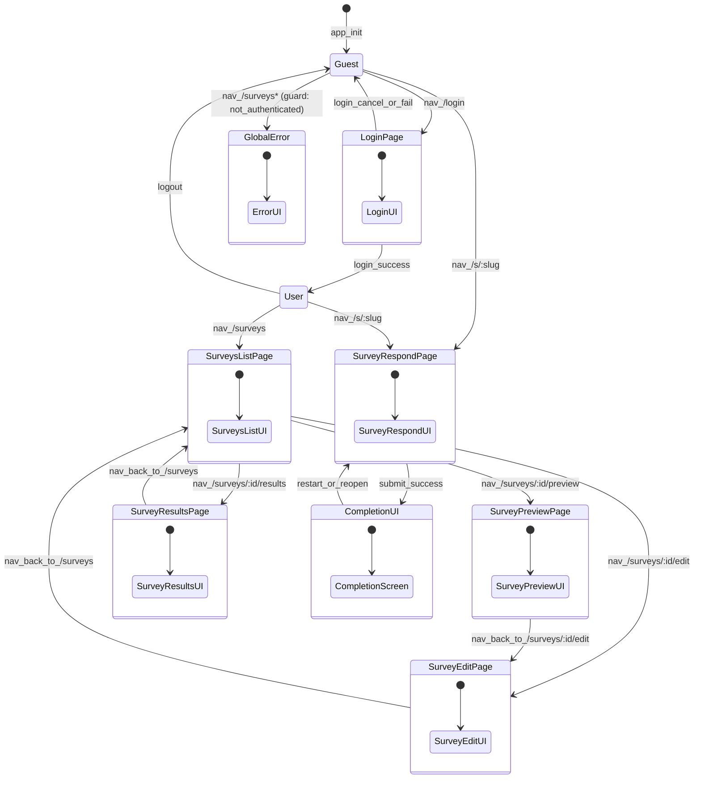
```mermaid
stateDiagram-v2
  [*] --> Guest : app_init
  %% verify: 初始為未登入狀態；Header 僅顯示 /login 入口且不顯示 /surveys* 導覽

  Guest --> LoginPage : nav_/login
  %% verify: 導向 /login；UI 進入 /login 的 Loading→Ready

  Guest --> SurveyRespondPage : nav_/s/:slug
  %% verify: 導向 /s/:slug；若 Survey.status=Published 則顯示題目；否則顯示 Empty/404

  Guest --> GlobalError : nav_/surveys* (guard: not_authenticated)
  %% verify: 後台路由被 guard；回應 401；UI 顯示需要登入並導向 /login

  LoginPage --> User : login_success
  %% verify: 回應 200；Session 建立；Header 切換為顯示 /surveys 與登出

  LoginPage --> Guest : login_cancel_or_fail
  %% verify: 登入失敗顯示錯誤訊息且維持在 /login；不建立 Session

  User --> SurveysListPage : nav_/surveys
  %% verify: 需已登入才可進入；回應 200；顯示我的問卷清單

  User --> SurveyRespondPage : nav_/s/:slug
  %% verify: 仍可開啟 /s/:slug；題目可見性由前端邏輯引擎重算

  User --> Guest : logout
  %% verify: Session 失效；Header 回到 Guest 導覽；不可再進入 /surveys*

  SurveysListPage --> SurveyEditPage : nav_/surveys/:id/edit
  %% verify: 若 Survey.owner_user_id=User.id 則 200；否則 403；UI 不洩漏他人資料

  SurveysListPage --> SurveyPreviewPage : nav_/surveys/:id/preview
  %% verify: 若 owner 才可預覽；非 owner 403；預覽不建立 Response

  SurveysListPage --> SurveyResultsPage : nav_/surveys/:id/results
  %% verify: 若 owner 才可看結果；非 owner 403；尚無回覆時顯示 Empty

  SurveyEditPage --> SurveysListPage : nav_back_to_/surveys
  %% verify: 路由返回 /surveys；清單資料維持一致（含狀態 Draft/Published/Closed）

  SurveyPreviewPage --> SurveyEditPage : nav_back_to_/surveys/:id/edit
  %% verify: 返回 edit 頁；若已發佈則結構編輯被鎖定（僅可改 title/description）

  SurveyResultsPage --> SurveysListPage : nav_back_to_/surveys
  %% verify: 返回清單；結果頁操作不影響 Response/Answer 的不可變性

  SurveyRespondPage --> CompletionUI : submit_success
  %% verify: 後端 200；Response/Answer 建立成功且不可修改；UI 進入 Completion

  CompletionUI --> SurveyRespondPage : restart_or_reopen
  %% verify: 允許重新開啟同一 /s/:slug；不會修改既有 Response/Answer

  state GlobalError {
    [*] --> ErrorUI
  }

  state LoginPage {
    [*] --> LoginUI
  }

  state SurveysListPage {
    [*] --> SurveysListUI
  }

  state SurveyEditPage {
    [*] --> SurveyEditUI
  }

  state SurveyPreviewPage {
    [*] --> SurveyPreviewUI
  }

  state SurveyResultsPage {
    [*] --> SurveyResultsUI
  }

  state SurveyRespondPage {
    [*] --> SurveyRespondUI
  }

  state CompletionUI {
    [*] --> CompletionScreen
  }
```

##### ② /login Page
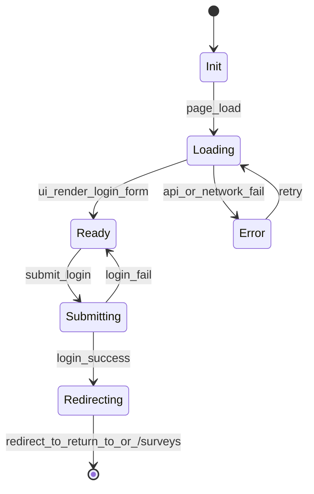
```mermaid
stateDiagram-v2
  [*] --> Init
  %% verify: 進入 /login 時建立頁面初始狀態

  Init --> Loading : page_load
  %% verify: 顯示 Loading；尚未出現可提交按鈕的 enabled 狀態

  Loading --> Ready : ui_render_login_form
  %% verify: 表單元件可互動；僅顯示單一主要「登入」提交入口

  Loading --> Error : api_or_network_fail
  %% verify: 顯示可重試的錯誤狀態；不建立 Session

  Ready --> Submitting : submit_login
  %% verify: 提交中按鈕 disabled 防重送；送出登入請求

  Submitting --> Ready : login_fail
  %% verify: 回應 401/400；顯示錯誤訊息；留在 /login

  Submitting --> Redirecting : login_success
  %% verify: 回應 200；Session 建立；取得 return_to 時導回原頁，否則導到 /surveys

  Redirecting --> [*] : redirect_to_return_to_or_/surveys
  %% verify: 路由切換完成；目標頁會重新載入並顯示對應 Loading/Ready

  Error --> Loading : retry
  %% verify: 重新請求；Error 清除並回到 Loading
```

##### ③ /surveys Page
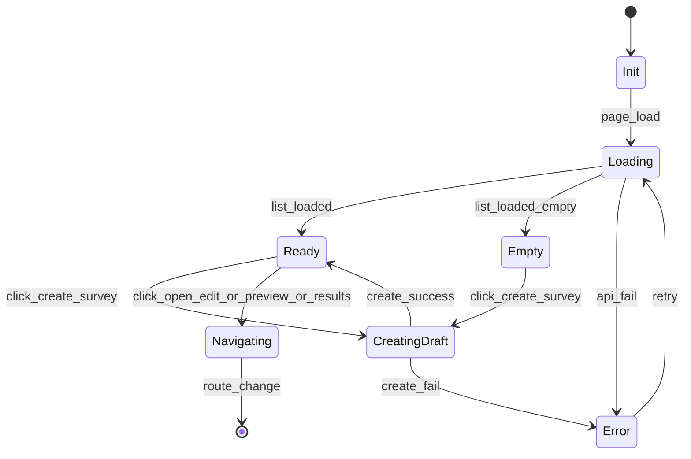
```mermaid
stateDiagram-v2
  [*] --> Init
  %% verify: 進入 /surveys 前需已登入；未登入請求會是 401

  Init --> Loading : page_load
  %% verify: 顯示 Loading；發出取得 surveys 清單請求

  Loading --> Ready : list_loaded
  %% verify: 回應 200；清單只包含 owner_user_id=User.id 的 Surveys

  Loading --> Empty : list_loaded_empty
  %% verify: 回應 200 且列表為空；顯示 Empty 狀態與建立新問卷 CTA

  Loading --> Error : api_fail
  %% verify: 回應 5xx 或網路失敗；顯示可重試 Error

  Ready --> CreatingDraft : click_create_survey
  %% verify: 觸發建立 Draft；提交中禁止重複點擊

  CreatingDraft --> Ready : create_success
  %% verify: 回應 200；新 Survey.status=Draft；清單立即出現新項目

  CreatingDraft --> Error : create_fail
  %% verify: 回應 4xx/5xx；顯示錯誤且不新增清單項目

  Ready --> Navigating : click_open_edit_or_preview_or_results
  %% verify: 點擊導向對應路由；若非 owner 會在目標頁收到 403

  Navigating --> [*] : route_change
  %% verify: 路由切換完成；來源頁無殘留 loading lock

  Empty --> CreatingDraft : click_create_survey
  %% verify: Empty 狀態下仍可建立 Draft；成功後轉為 Ready

  Error --> Loading : retry
  %% verify: 重試會重新載入清單；成功後回到 Ready/Empty
```

##### ④ /surveys/:id/edit Page
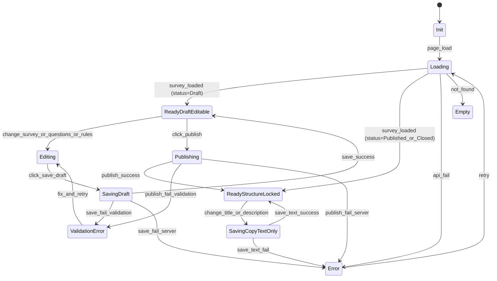
```mermaid
stateDiagram-v2
  [*] --> Init
  %% verify: 進入 edit 頁需已登入且為 owner；否則 401/403

  Init --> Loading : page_load
  %% verify: 顯示 Loading；請求 Survey 結構（含 Questions/Options/Rules）

  Loading --> ReadyDraftEditable : survey_loaded (status=Draft)
  %% verify: 回應 200 且 status=Draft；結構編輯區可互動

  Loading --> ReadyStructureLocked : survey_loaded (status=Published_or_Closed)
  %% verify: 回應 200 且 status=Published/Closed；結構編輯 disabled；僅 title/description 可改

  Loading --> Error : api_fail
  %% verify: 回應 5xx；顯示 Error 並可 retry

  Loading --> Empty : not_found
  %% verify: 回應 404（不存在或不可見）；顯示 Not Found UI

  ReadyDraftEditable --> Editing : change_survey_or_questions_or_rules
  %% verify: 變更會標記 dirty；尚未保存不會寫入 publish_hash

  Editing --> SavingDraft : click_save_draft
  %% verify: 觸發保存；後端執行 forward-only 與 cycle detection

  SavingDraft --> ReadyDraftEditable : save_success
  %% verify: 回應 200；保存成功；dirty 清除；結構仍為 Draft

  SavingDraft --> ValidationError : save_fail_validation
  %% verify: 回應 400；錯誤訊息可定位（例如 cycle path 或 order 違規）

  SavingDraft --> Error : save_fail_server
  %% verify: 回應 5xx；顯示可重試；前端保留未保存的編輯內容

  ReadyDraftEditable --> Publishing : click_publish
  %% verify: 發佈前需通過所有驗證；提交中禁止重複點擊

  Publishing --> ReadyStructureLocked : publish_success
  %% verify: 回應 200；Survey.status=Published；publish_hash 寫入且後續不可變

  Publishing --> ValidationError : publish_fail_validation
  %% verify: 回應 400；顯示具體驗證錯誤；未產生 publish_hash

  Publishing --> Error : publish_fail_server
  %% verify: 回應 5xx；不改變 status；仍維持 Draft

  ReadyStructureLocked --> SavingCopyTextOnly : change_title_or_description
  %% verify: 僅允許更新 title/description；其他結構欄位更新會被拒絕

  SavingCopyTextOnly --> ReadyStructureLocked : save_text_success
  %% verify: 回應 200；文案更新成功且不影響 publish_hash

  SavingCopyTextOnly --> Error : save_text_fail
  %% verify: 回應 4xx/5xx；顯示錯誤並保留輸入

  ValidationError --> Editing : fix_and_retry
  %% verify: 修正後可再次提交保存/發佈；錯誤提示消失

  Error --> Loading : retry
  %% verify: retry 重新載入最新資料；不會破壞已保存的 Draft
```

##### ⑤ /surveys/:id/preview Page
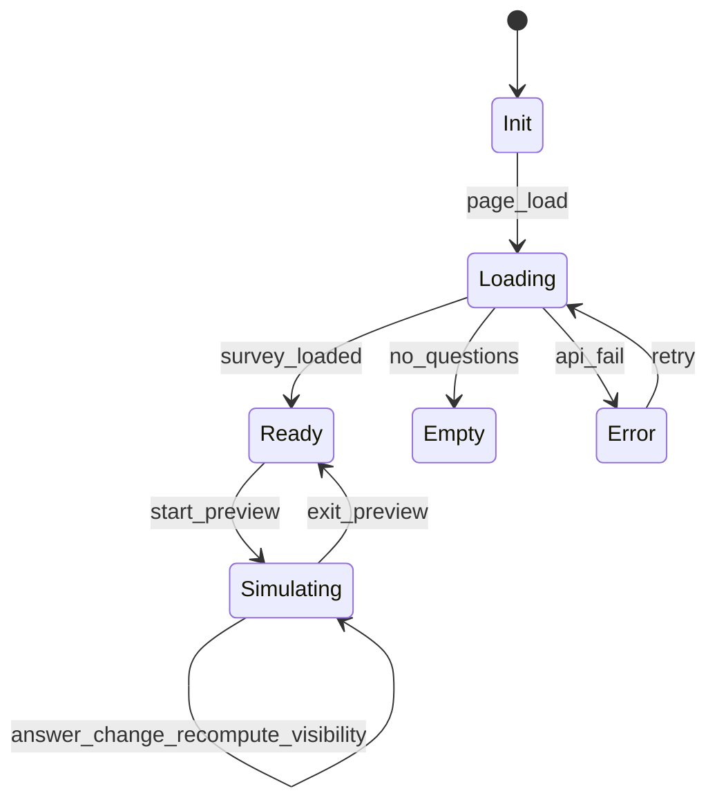
```mermaid
stateDiagram-v2
  [*] --> Init
  %% verify: 進入 preview 頁需已登入且為 owner；非 owner 403

  Init --> Loading : page_load
  %% verify: 顯示 Loading；載入 Survey 結構

  Loading --> Ready : survey_loaded
  %% verify: 回應 200；顯示可開始預覽；不建立 Response

  Loading --> Empty : no_questions
  %% verify: Survey 無題目時顯示 Empty；禁止開始預覽

  Loading --> Error : api_fail
  %% verify: 回應 5xx；顯示可重試 Error

  Ready --> Simulating : start_preview
  %% verify: 建立本地 draft answers；可見題目集合由前端邏輯引擎計算

  Simulating --> Simulating : answer_change_recompute_visibility
  %% verify: 每次變更立即重算；由 visible→hidden 的題目草稿答案會被清除

  Simulating --> Ready : exit_preview
  %% verify: 退出後清空預覽草稿；不影響任何 Response/Answer

  Error --> Loading : retry
  %% verify: retry 重新載入 Survey 結構
```

##### ⑥ /s/:slug Page
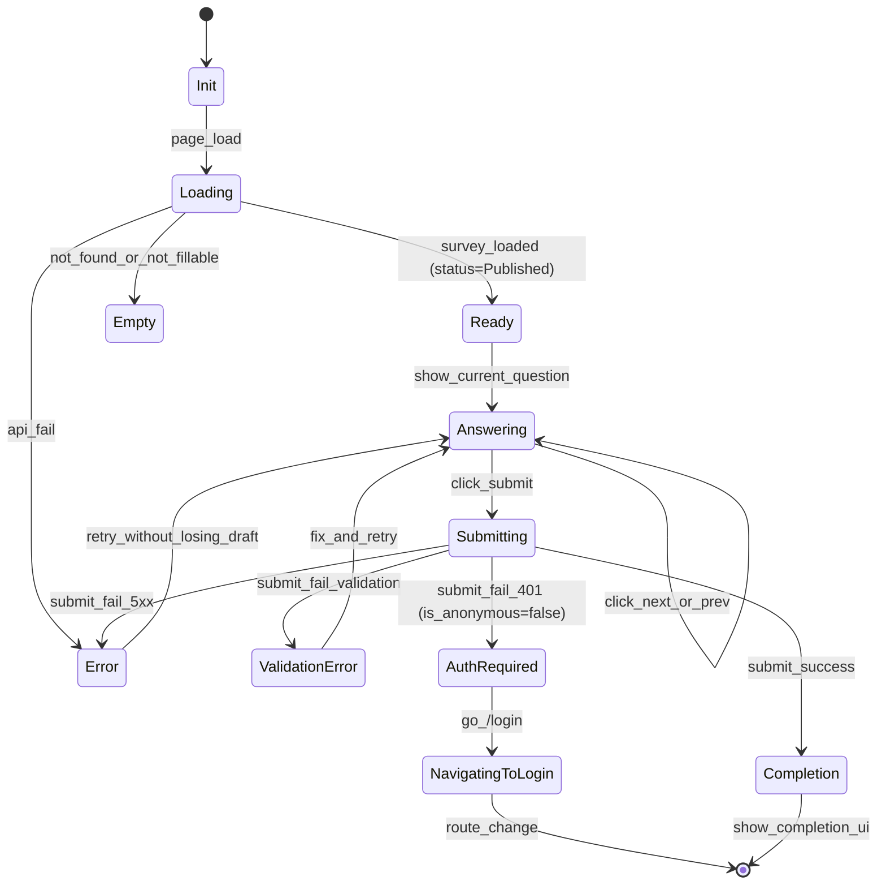
```mermaid
stateDiagram-v2
  [*] --> Init
  %% verify: 進入 /s/:slug 初始化填答狀態

  Init --> Loading : page_load
  %% verify: 顯示 Loading；請求 Survey（需為 Published 才可填）

  Loading --> Ready : survey_loaded (status=Published)
  %% verify: 回應 200 且 status=Published；建立本地 draft answers；顯示第一題

  Loading --> Empty : not_found_or_not_fillable
  %% verify: 回應 404（slug 不存在或 Draft/Closed）；顯示 Empty/Not Found

  Loading --> Error : api_fail
  %% verify: 回應 5xx；顯示可重試；若已有草稿則保留

  Ready --> Answering : show_current_question
  %% verify: 顯示當前題目；僅顯示可見題目；required 只對可見題目生效

  Answering --> Answering : answer_change_recompute_visibility
  %% verify: 前端重算 Visible Questions；hidden 題目答案立即清除且不會被提交

  Answering --> Answering : click_next_or_prev
  %% verify: 可回上一題；只能回到「已回答過且仍可見」的題目

  Answering --> Submitting : click_submit
  %% verify: 提交前進行前端驗證；提交 payload 不包含 hidden 題目答案

  Submitting --> Completion : submit_success
  %% verify: 回應 200；後端已重算可見性並驗證 required/schema；寫入 Response/Answer 且不可修改

  Submitting --> ValidationError : submit_fail_validation
  %% verify: 回應 400；顯示具體欄位/題目錯誤；停留在填答狀態

  Submitting --> AuthRequired : submit_fail_401 (is_anonymous=false)
  %% verify: 回應 401；導向 /login；保留草稿答案以便登入後繼續

  Submitting --> Error : submit_fail_5xx
  %% verify: 回應 5xx；顯示可重試；草稿答案保留不丟失

  AuthRequired --> NavigatingToLogin : go_/login
  %% verify: 路由切換到 /login；帶 return_to=/s/:slug

  NavigatingToLogin --> [*] : route_change
  %% verify: /login 顯示 Ready；登入成功後可回到 /s/:slug

  ValidationError --> Answering : fix_and_retry
  %% verify: 修正後可再次提交；錯誤訊息更新或消失

  Error --> Answering : retry_without_losing_draft
  %% verify: 重試提交或重新載入不清空草稿；可回到 Answering

  Completion --> [*] : show_completion_ui
  %% verify: Completion UI 顯示成功狀態；不提供修改已提交答案的入口
```

##### ⑦ /surveys/:id/results Page
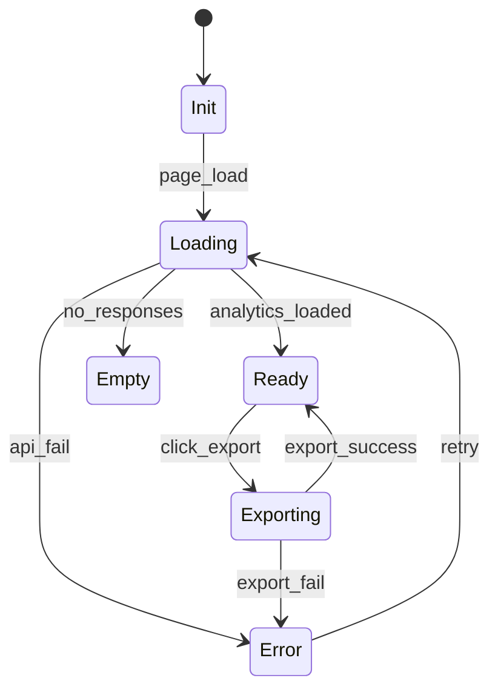
```mermaid
stateDiagram-v2
  [*] --> Init
  %% verify: 進入 results 頁需已登入且為 owner；非 owner 403

  Init --> Loading : page_load
  %% verify: 顯示 Loading；請求統計資料與回覆摘要

  Loading --> Ready : analytics_loaded
  %% verify: 回應 200；顯示回覆數與彙總統計；統計需與原始回覆一致

  Loading --> Empty : no_responses
  %% verify: 回應 200 且無回覆；顯示 Empty（0 responses）

  Loading --> Error : api_fail
  %% verify: 回應 5xx；顯示可重試 Error

  Ready --> Exporting : click_export
  %% verify: 觸發匯出；匯出範圍與當前 results 一致

  Exporting --> Ready : export_success
  %% verify: 下載成功；檔案內容包含 Response/Answer 且對應 publish_hash

  Exporting --> Error : export_fail
  %% verify: 回應 4xx/5xx；顯示錯誤且不影響頁面已載入的統計

  Error --> Loading : retry
  %% verify: retry 重新載入 results；成功後回到 Ready/Empty
```

##### ⑫ Feature: Global Navigation Rendering
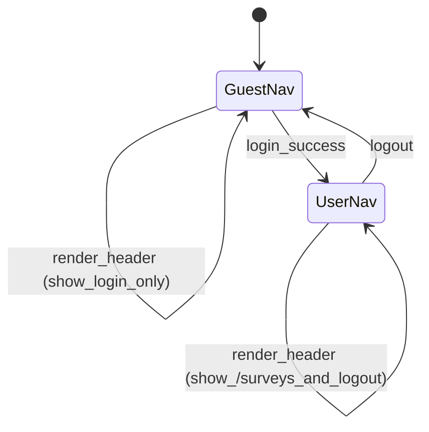
```mermaid
stateDiagram-v2
  [*] --> GuestNav
  %% verify: Guest 導覽只顯示 /login；不顯示 /surveys* 入口

  GuestNav --> GuestNav : render_header (show_login_only)
  %% verify: Header 僅有登入；不出現「我的問卷」與「登出」

  GuestNav --> UserNav : login_success
  %% verify: 登入後導覽立即更新；顯示 /surveys 與登出

  UserNav --> UserNav : render_header (show_/surveys_and_logout)
  %% verify: User/Admin 導覽不顯示 Guest-only 入口；同一動作入口不重複

  UserNav --> GuestNav : logout
  %% verify: 登出後導覽回到 Guest；/surveys* 變為不可達且會回 401
```

##### ⑬ Feature: Rule Authoring Validation (forward-only + cycle detection)
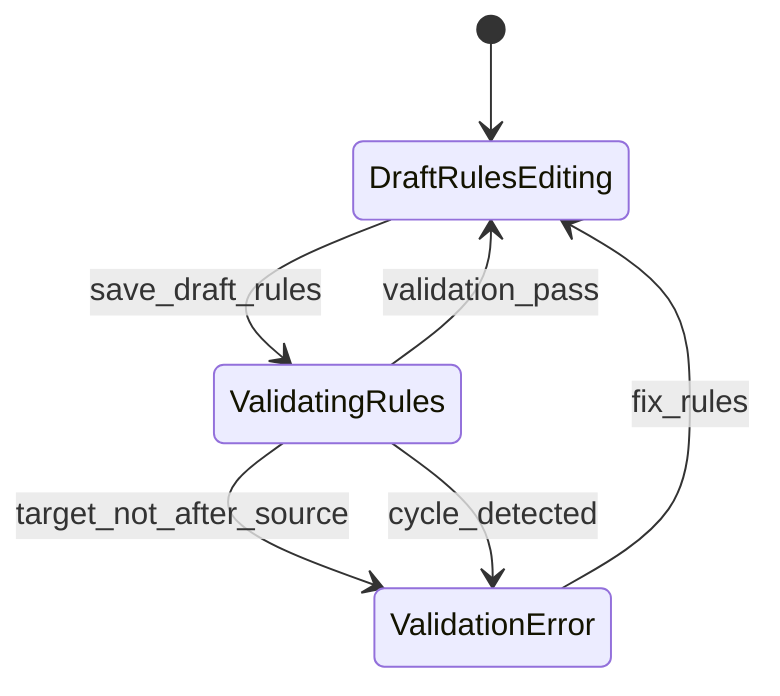
```mermaid
stateDiagram-v2
  [*] --> DraftRulesEditing
  %% verify: 規則編輯僅限 Draft；Published/Closed 結構編輯 disabled

  DraftRulesEditing --> ValidatingRules : save_draft_rules
  %% verify: 保存時後端執行 forward-only 與 cycle detection；錯誤需可定位

  ValidatingRules --> DraftRulesEditing : validation_pass
  %% verify: 回應 200；規則寫入成功；後續預覽/填答使用相同規則

  ValidatingRules --> ValidationError : target_not_after_source
  %% verify: 回應 400；指出 source/target 的 order 違規與對應 question_id

  ValidatingRules --> ValidationError : cycle_detected
  %% verify: 回應 400；回傳 cycle path（question_id 序列）可定位修正

  ValidationError --> DraftRulesEditing : fix_rules
  %% verify: 修正後可再次保存；錯誤訊息更新或消失
```

##### ⑭ Feature: Dynamic Logic Engine (Visible Questions Computation)
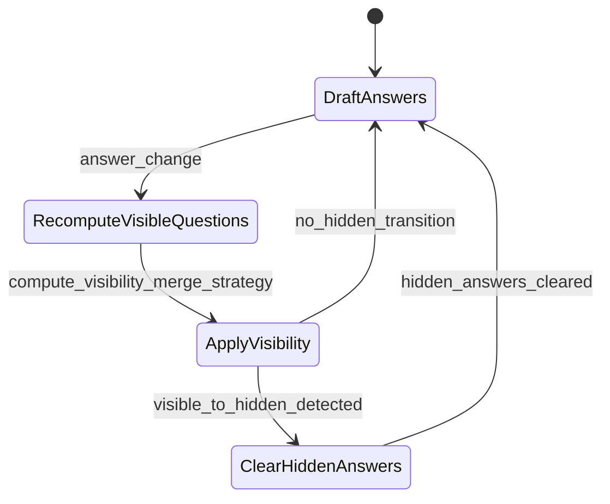
```mermaid
stateDiagram-v2
  [*] --> DraftAnswers
  %% verify: 草稿答案初始化為空；所有題目預設 visible=true 作為基準

  DraftAnswers --> RecomputeVisibleQuestions : answer_change
  %% verify: 任一答案變更觸發重算；計算使用 RuleGroup AND/OR 與合併策略

  RecomputeVisibleQuestions --> ApplyVisibility : compute_visibility_merge_strategy
  %% verify: hide 規則優先；show 群組全不成立時 target hidden；結果前後端一致

  ApplyVisibility --> ClearHiddenAnswers : visible_to_hidden_detected
  %% verify: 由 visible→hidden 的題目草稿被清除或標記無效且不送出

  ClearHiddenAnswers --> DraftAnswers : hidden_answers_cleared
  %% verify: 草稿答案集合不含 hidden 題目；UI 不顯示 hidden 題目

  ApplyVisibility --> DraftAnswers : no_hidden_transition
  %% verify: 若無新增 hidden 轉換則保留既有草稿；可見集合更新正確
```

##### ⑮ Feature: Previous Question Navigation (non-linear back)
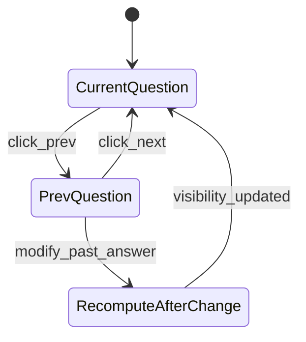
```mermaid
stateDiagram-v2
  [*] --> CurrentQuestion
  %% verify: 顯示當前可見題目；下一題/上一題可用性正確

  CurrentQuestion --> PrevQuestion : click_prev
  %% verify: 只能回到已回答過且仍可見的題目；不可跳到 hidden

  PrevQuestion --> CurrentQuestion : click_next
  %% verify: 回到後續題目時顯示與目前可見集合一致的題目序列

  PrevQuestion --> RecomputeAfterChange : modify_past_answer
  %% verify: 修改過去答案觸發重算；後續題目可見性與草稿一致更新

  RecomputeAfterChange --> CurrentQuestion : visibility_updated
  %% verify: 若後續題目變 hidden，其草稿被清除；required 僅對 visible 題目驗證
```

##### ⑯ Feature: Survey Publish (publish_hash + schema lock)
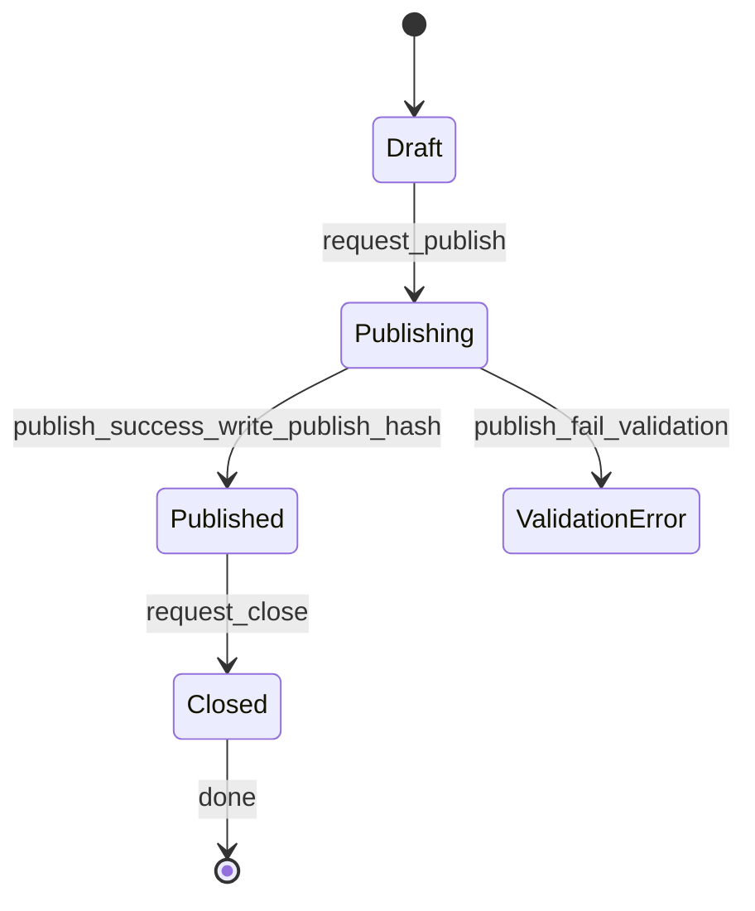
```mermaid
stateDiagram-v2
  [*] --> Draft
  %% verify: Draft 狀態允許結構變更；publish_hash 必為 null

  Draft --> Publishing : request_publish
  %% verify: 僅 owner 可觸發；後端將以 canonical JSON 計算 publish_hash

  Publishing --> Published : publish_success_write_publish_hash
  %% verify: status=Published；publish_hash 寫入且之後不可變；結構修改被拒絕

  Publishing --> ValidationError : publish_fail_validation
  %% verify: 回應 400；顯示具體驗證錯誤（含規則違規或 cycle）

  Published --> Closed : request_close
  %% verify: 僅合法轉換 Published→Closed；Closed 後不可再開啟

  Closed --> [*] : done
  %% verify: status=Closed 後不可填答；/s/:slug 回應 404（不洩漏存在）
```

##### ⑰ Feature: Response Submit (server-side recompute + immutable write)
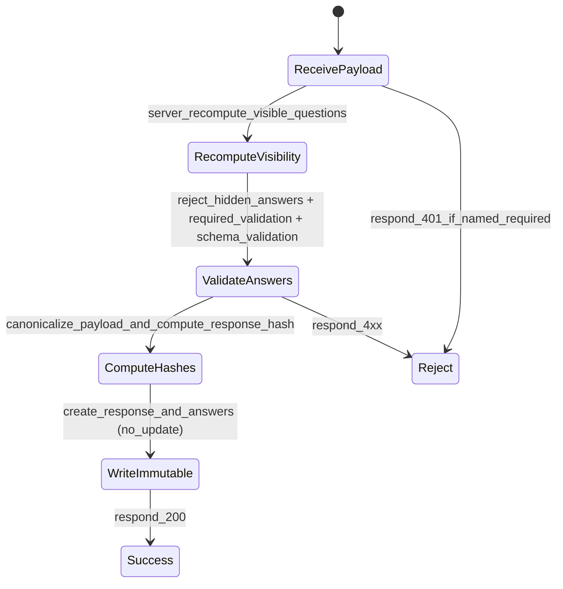
```mermaid
stateDiagram-v2
  [*] --> ReceivePayload
  %% verify: 僅允許 Published；若 is_anonymous=false 且未登入則回 401

  ReceivePayload --> RecomputeVisibility : server_recompute_visible_questions
  %% verify: 使用 publish_hash 對應結構重算可見集合；不得信任前端可見性聲稱

  RecomputeVisibility --> ValidateAnswers : reject_hidden_answers + required_validation + schema_validation
  %% verify: hidden 題目答案直接拒絕；visible required 題目必填；Answer.value 符合題型 schema 與大小限制

  ValidateAnswers --> ComputeHashes : canonicalize_payload_and_compute_response_hash
  %% verify: payload canonicalization 穩定一致；response_hash 可重算且與存檔一致

  ComputeHashes --> WriteImmutable : create_response_and_answers (no_update)
  %% verify: 只允許 create；不提供更新既有 Response/Answer 的能力

  WriteImmutable --> Success : respond_200
  %% verify: 回應 200；回傳 response id；資料庫中 Response.publish_hash 與 Survey.publish_hash 一致

  ValidateAnswers --> Reject : respond_4xx
  %% verify: 回應 400；錯誤可定位到 question_id/欄位；不寫入任何 Response/Answer

  ReceivePayload --> Reject : respond_401_if_named_required
  %% verify: 回應 401；不寫入資料；前端導向 /login 並保留草稿
```

##### ⑱ Feature: Results Analytics (realtime + summary)
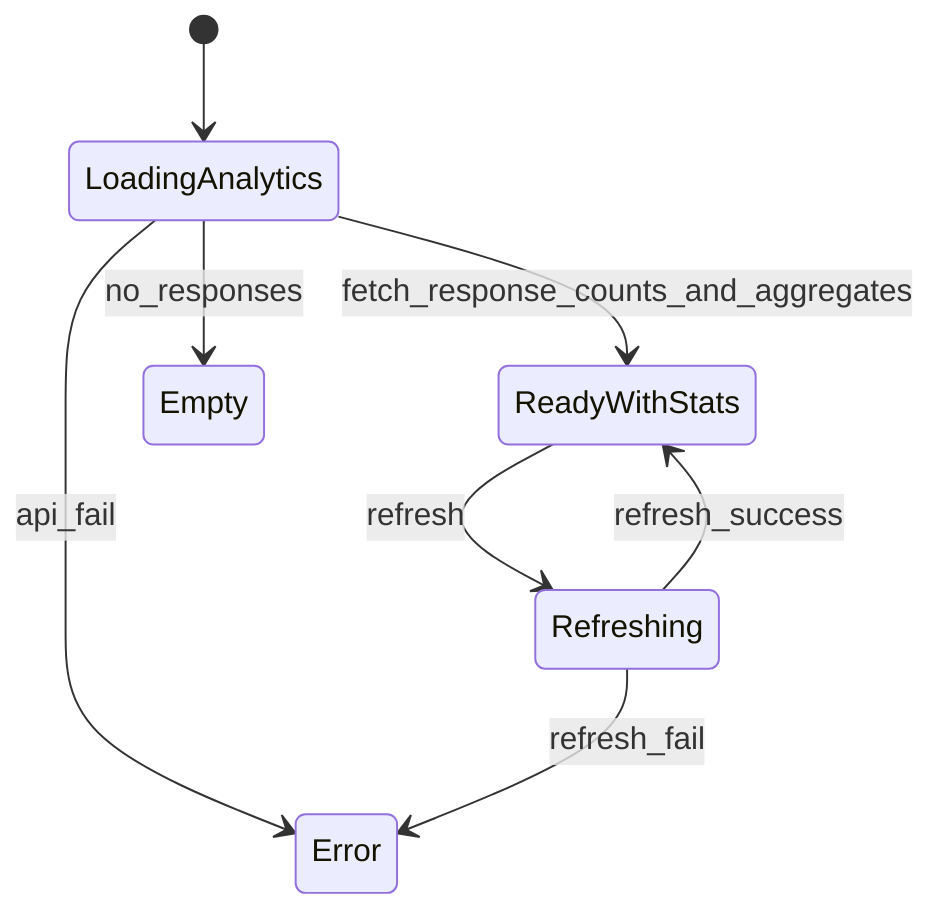
```mermaid
stateDiagram-v2
  [*] --> LoadingAnalytics
  %% verify: 僅 owner 可存取；非 owner 403；未登入 401

  LoadingAnalytics --> ReadyWithStats : fetch_response_counts_and_aggregates
  %% verify: 回應 200；回覆數與各題彙總統計可重現且與原始回覆一致

  LoadingAnalytics --> Empty : no_responses
  %% verify: 回應 200 且無回覆；顯示 Empty（0 responses）

  LoadingAnalytics --> Error : api_fail
  %% verify: 回應 5xx；顯示可重試 Error；不顯示不一致或部分統計

  ReadyWithStats --> Refreshing : refresh
  %% verify: 觸發重新取得；刷新期間顯示 loading indicator

  Refreshing --> ReadyWithStats : refresh_success
  %% verify: 回應 200；統計更新且仍一致

  Refreshing --> Error : refresh_fail
  %% verify: 回應 5xx；顯示錯誤並保留上一版已載入統計
```

##### ⑲ Feature: Export Responses
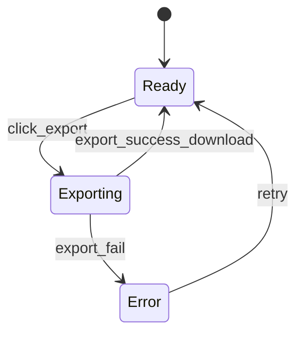
```mermaid
stateDiagram-v2
  [*] --> Ready
  %% verify: 匯出入口僅 owner 可見；非 owner 無法觸發

  Ready --> Exporting : click_export
  %% verify: 觸發匯出請求；範圍與結果頁一致

  Exporting --> Ready : export_success_download
  %% verify: 下載成功；內容包含 Response/Answer 與 publish_hash/response_hash

  Exporting --> Error : export_fail
  %% verify: 回應 4xx/5xx；顯示錯誤；不影響既有統計顯示

  Error --> Ready : retry
  %% verify: retry 可再次匯出；不會改變任何 Response/Answer
```

##### ⑳ 全站錯誤與權限
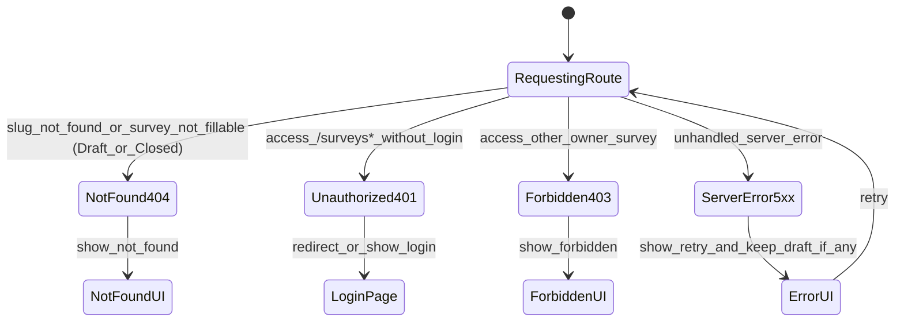
```mermaid
stateDiagram-v2
  [*] --> RequestingRoute
  %% verify: 任一路由請求進入 guard 判斷流程

  RequestingRoute --> NotFound404 : slug_not_found_or_survey_not_fillable (Draft_or_Closed)
  %% verify: /s/:slug 對不存在或 Draft/Closed 回應 404；避免洩漏是否存在

  RequestingRoute --> Unauthorized401 : access_/surveys*_without_login
  %% verify: 未登入存取 /surveys* 回應 401；UI 導向 /login

  RequestingRoute --> Forbidden403 : access_other_owner_survey
  %% verify: 已登入但非 owner 存取 /surveys/:id/* 回應 403；不回 404

  RequestingRoute --> ServerError5xx : unhandled_server_error
  %% verify: 5xx 顯示可重試；/s/:slug 若已有草稿需保留

  Unauthorized401 --> LoginPage : redirect_or_show_login
  %% verify: /login 顯示；登入成功後回到 return_to（若有）

  Forbidden403 --> ForbiddenUI : show_forbidden
  %% verify: 顯示 Forbidden UI；不顯示任何他人 Survey 內容

  NotFound404 --> NotFoundUI : show_not_found
  %% verify: 顯示 Not Found UI；不提供可推測資源存在性的訊息

  ServerError5xx --> ErrorUI : show_retry_and_keep_draft_if_any
  %% verify: 顯示 Error UI；保留草稿答案；重試能回到可操作狀態

  ErrorUI --> RequestingRoute : retry
  %% verify: retry 重新發送請求；成功後進入對應頁面 Ready/Empty
```

### Failure Modes & Recovery *(mandatory)*

- **Failure mode**: 保存 Draft 時規則驗證失敗（forward-only / cycle / 資料不完整）。
  - **Recovery**: 不寫入任何變更；回傳可定位錯誤；UI 保留未保存編輯內容並允許修正後重試。

- **Failure mode**: 填答載入 Survey 失敗（網路/5xx）。
  - **Recovery**: 顯示可重試 Error；若使用者已輸入草稿，重試不得清除草稿答案。

- **Failure mode**: 提交時伺服端驗證失敗（required、hidden 題目、schema/大小限制）。
  - **Recovery**: 回應 400 且精準指出題目/欄位；不寫入任何 Response/Answer；UI 導回可修正狀態。

- **Failure mode**: 記名問卷 Guest 提交被拒（401）。
  - **Recovery**: UI 導向 `/login` 並帶 `return_to=/s/:slug`；登入成功回到填答頁並保留草稿可續填。

- **Failure mode**: 匯出失敗（4xx/5xx）。
  - **Recovery**: 顯示錯誤並允許重試；不得影響已載入的統計畫面。

### Security & Permissions *(mandatory)*

- **Authentication**: 後台（`/surveys*`）必須登入；前台填答可允許 Guest 開啟，但是否可提交依 `Survey.is_anonymous` 決定。
- **Authorization**:
  - Survey Owner（Admin）僅能管理自己擁有的 Survey（非 owner 403）。
  - `/s/:slug` 的 Survey 可填性由 Survey 狀態決定（Draft/Closed/不存在一律 404）。
- **Sensitive data**:
  - 使用者憑證（例如密碼等價資訊）不得回傳給客戶端。
  - 回覆內容（Answers）屬敏感資料：僅 owner 可在後台檢視/匯出。
  - 防止惡意注入：對 Text 類輸出需進行安全編碼呈現（避免跨站腳本型輸出風險）。
- **Anti-forgery**: 伺服端必須重算可見性與驗證，禁止依賴前端宣告，以防偽造答案與繞過 required。

### Observability *(mandatory)*

- **Logging**: 記錄關鍵事件：Survey 發佈（含 `publish_hash`）、Survey 關閉、提交成功（含 `response_id`、`publish_hash`、`response_hash`）、提交驗證失敗（含 `question_id` 與原因）、權限拒絕（401/403）、匯出請求與結果。
- **Tracing**: 每個請求 SHOULD 具備可關聯的 request id（可由伺服端生成並回傳），以支援跨頁面錯誤追查。
- **User-facing errors**: 必須可行動（可重試/可修正）且避免洩漏資源存在性（404 訊息一致）。
- **Developer diagnostics**: 驗證錯誤需回傳機器可解析的結構（例如包含 `code`、`question_id`、`message`），以支援 UI 精準定位。

### Backward Compatibility & Change Risk *(mandatory)*

- **Breaking change?**: No（新功能/新資料，不修改既有對外契約）。
- **Migration plan**: 初次上線建立必要資料結構（User/Survey/Question/Rule/Response/Answer）並啟用 RBAC 與狀態機。
- **Rollback plan**: 若需回滾，必須保留所有已寫入的 Response/Answer 不變；可僅停用新建/提交入口或將問卷關閉（Published→Closed）以停止新增回覆。

### Performance & Scale Assumptions *(mandatory)*

- **Growth assumption**:
  - 單一 Survey 可累積 0..1,000,000 筆 Response（長期）。
  - 同時在線填答者可達 1,000 人級別。
- **Constraints**:
  - 在一般網路條件下，受訪者每次變更答案後的「可見題目更新」在 95% 情況下應於 200ms 內完成並更新畫面（以使用者體感為準）。
  - `/s/:slug` 首次載入在 95% 情況下於 2 秒內可開始作答（以可互動為準）。
  - 提交成功回應在 95% 情況下於 2 秒內完成（以完成頁顯示為準）。
  - 單次提交 payload（含 answers）大小 MUST ≤ 256KB；超過則回應 400。
  - Text 類答案長度 MUST ≤ 5,000 字元；超過則回應 400。
  - Matrix 題型在單次提交中允許的總 cell 數 MUST ≤ 200；超過則回應 400。

### Key Entities *(include if feature involves data)*

- **User**: 已登入使用者；具備可建立/管理自己 Survey 的身份。
- **Survey**: 問卷主體，具備狀態（Draft/Published/Closed）、`slug`、`is_anonymous`、`publish_hash` 與不可變的結構。
- **Question**: Survey 的題目；具備題型、順序、必填等屬性。
- **Option**: 題目選項；限定適用於 Single Choice / Multiple Choice / Matrix。
- **RuleGroup**: 針對單一 `target_question` 的規則群組，支援 show/hide 與 AND/OR 聚合。
- **LogicRule**: 規則群組內的單條規則（source 條件）。
- **Response**: 一次提交的回覆主檔；必須保存 `publish_hash` 與 `response_hash` 以支援稽核。
- **Answer**: Response 中對單一 Question 的答案（JSON 值）。
- **Visible Questions**: 在某個草稿答案集合下，經邏輯引擎計算後應顯示、可回答且需驗證的題目集合。

## Success Criteria *(mandatory)*

### Measurable Outcomes

- **SC-001**: 受訪者能在單次流程內完成並成功送出回覆，且「可見題目集合」在用戶端與伺服端重算一致（抽樣稽核一致率 100%）。
- **SC-002**: 在含分支的問卷中，受訪者變更答案後 UI 更新可見題目在 95% 情況下於 200ms 內完成（使用者體感/前端計時）。
- **SC-003**: 記名問卷的登入續填流程可用：遭 401 導向登入後回到同一問卷頁並保留草稿；使用者成功續填並提交的完成率 ≥ 90%（以產品分析事件衡量）。
- **SC-004**: 發佈後結構不可變：任何對 Published/Closed Survey 的結構性變更嘗試皆被拒絕（拒絕率 100%）。
- **SC-005**: 提交後不可竄改：成功寫入的 Response 皆具備可重算驗證一致的 `response_hash`（抽樣稽核一致率 100%）。
- **SC-006**: 管理者可在結果頁查看回覆數與題目彙總統計，且匯出資料可用於稽核（匯出成功率 ≥ 99%，以觸發匯出行為為分母）。
