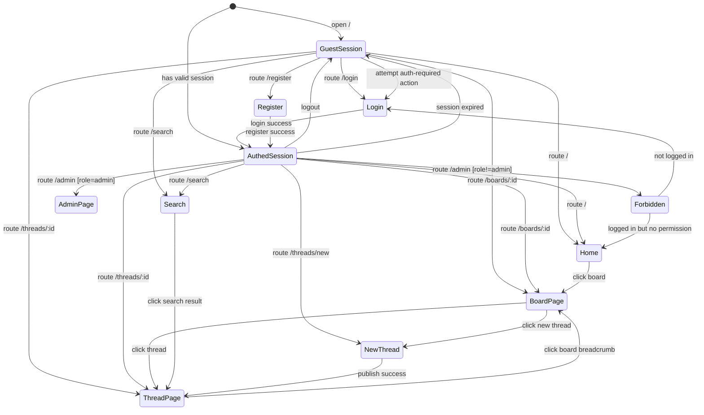
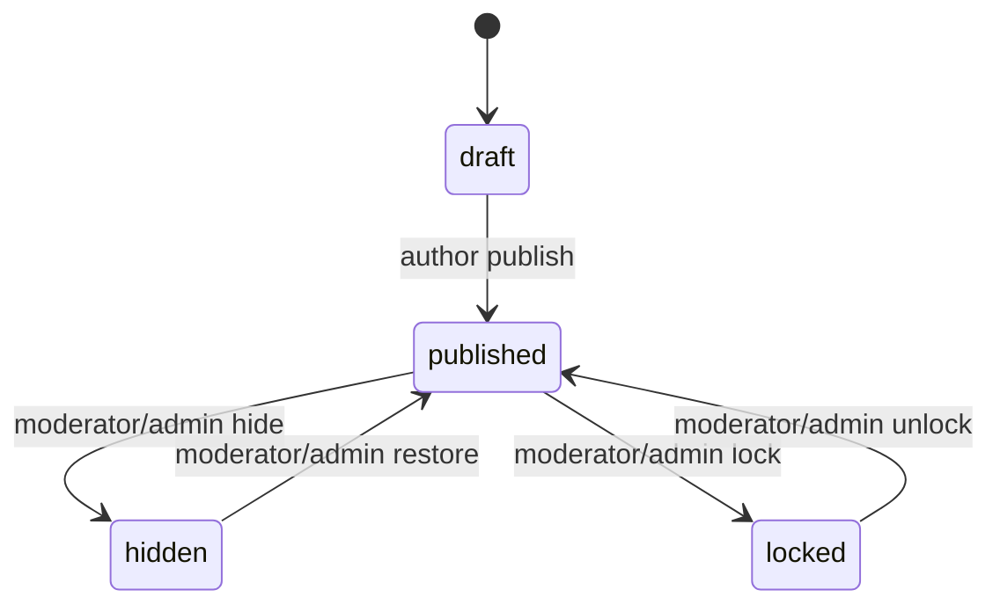
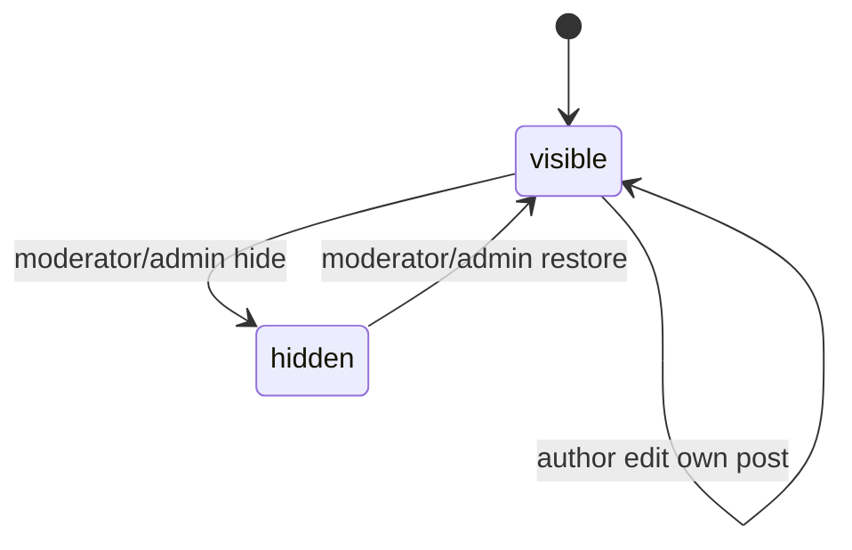
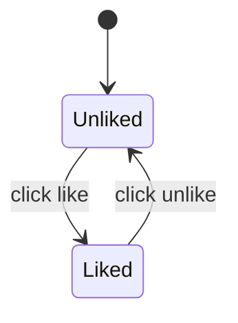
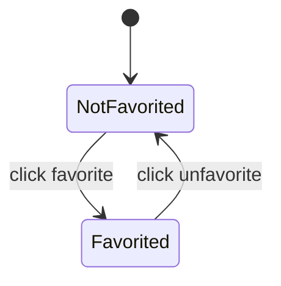
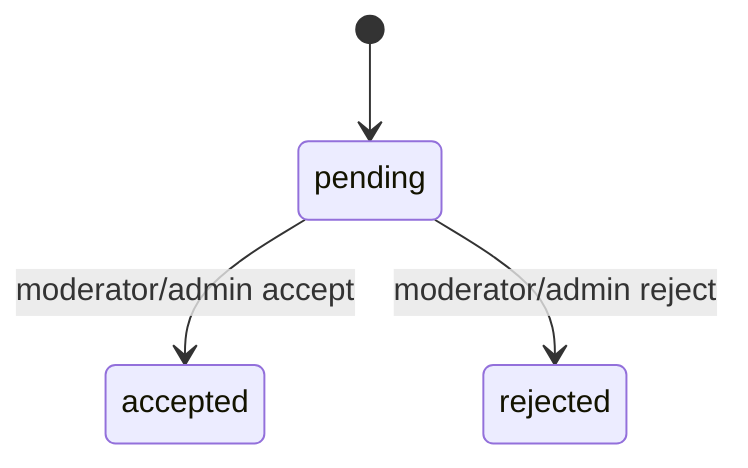
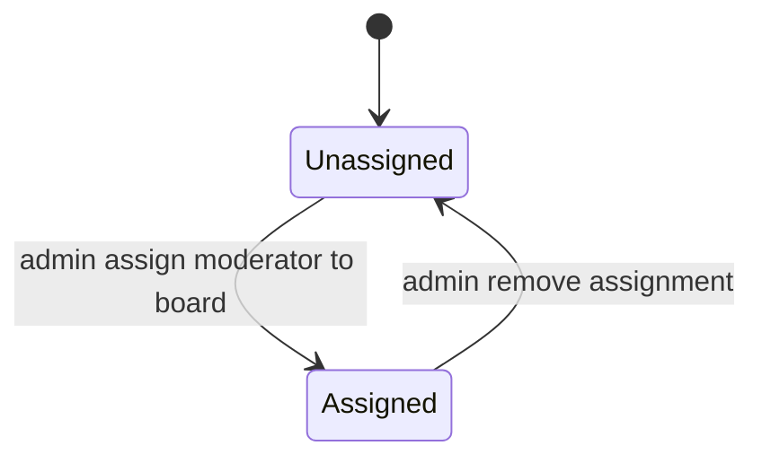
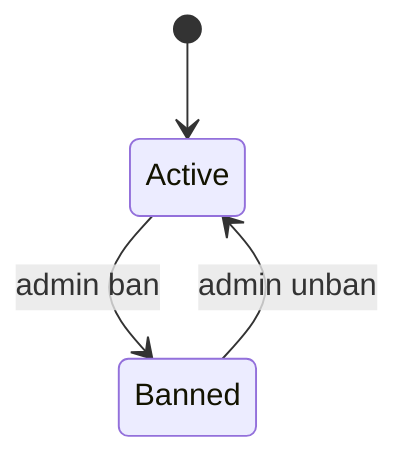
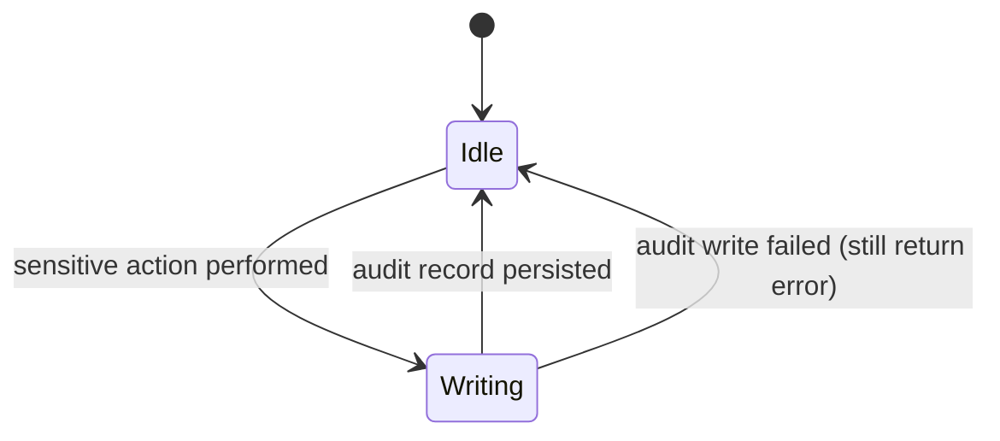
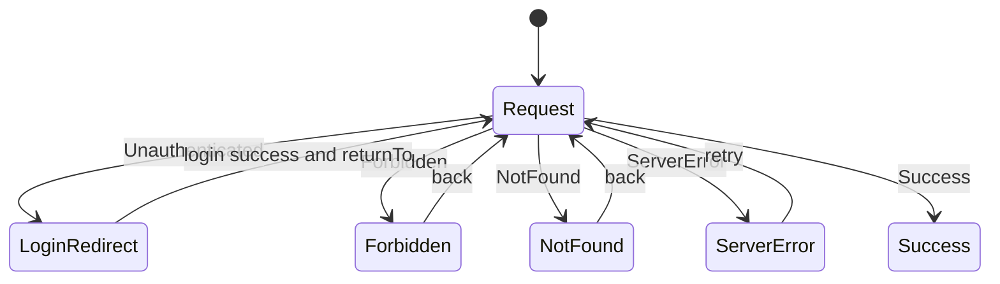

# Feature Specification: 多角色論壇／社群平台（Multi-Role Forum & Community Platform）

**Feature Branch**: `001-multi-role-forum`  
**Created**: 2026-02-10  
**Status**: Draft  
**Input**: User description: "可治理、可擴充的多看板論壇／社群系統（含：Email+密碼登入、多角色 RBAC、Moderator 具看板範圍、內容狀態機、檢舉審核、Like/Favorite、可追溯 Audit Log、以及附錄之狀態轉換圖作為權威參考）。"

## User Scenarios & Testing *(mandatory)*

<!--
  IMPORTANT: User stories should be PRIORITIZED as user journeys ordered by importance.
  Each user story/journey must be INDEPENDENTLY TESTABLE - meaning if you implement just ONE of them,
  you should still have a viable MVP (Minimum Viable Product) that delivers value.
  
  Assign priorities (P1, P2, P3, etc.) to each story, where P1 is the most critical.
  Think of each story as a standalone slice of functionality that can be:
  - Developed independently
  - Tested independently
  - Deployed independently
  - Demonstrated to users independently
-->

### User Story 1 - 訪客可瀏覽與搜尋公開內容 (Priority: P1)

訪客不需登入即可瀏覽看板列表、看板主題列表、主題內容與可見回覆，並能搜尋公開可見的主題內容。

**Why this priority**: 這是論壇最基本的內容消費能力；沒有此能力就無法形成可被探索的社群。

**Independent Test**: 不建立任何帳號即可驗證：開啟首頁→進入看板→進入主題→搜尋→點擊結果可閱讀內容。

**Acceptance Scenarios**:

1. **Given** 使用者未登入且看板存在且為啟用狀態，**When** 進入首頁並點擊任一看板，**Then** 可以看到該看板的主題列表（分頁），且互動操作（Like/Favorite/回覆/檢舉/新增主題）不可使用或會被導向登入。
2. **Given** 使用者未登入且主題為公開可見（已發布且未被隱藏），**When** 進入主題頁，**Then** 可以看到主題內容與可見回覆；若主題為隱藏，**Then** 系統不得洩漏主題存在（以「不存在」方式呈現）。
3. **Given** 使用者未登入，**When** 在搜尋頁輸入關鍵字並送出，**Then** 結果只包含公開可見的主題；點擊結果可進入主題頁閱讀。

---

### User Story 2 - 註冊/登入後可發文、回文與互動 (Priority: P1)

一般使用者可註冊與登入，並在啟用的看板中建立主題（草稿或發布）、在未鎖定的主題下回覆，且可對主題/回覆進行 Like，對主題進行 Favorite。

**Why this priority**: 內容生產與互動是社群成長的核心；草稿→發布可降低發文門檻並支援中斷續寫。

**Independent Test**: 建立一個使用者帳號後，可獨立驗證：新增主題（草稿）→發布→回覆→Like/Favorite 的狀態切換與一致性。

**Acceptance Scenarios**:

1. **Given** 使用者已登入且看板為啟用狀態，**When** 建立主題並選擇「存草稿」，**Then** 主題狀態為草稿且僅作者可見，且不出現在公開的看板列表。
2. **Given** 使用者已登入且草稿屬於本人，**When** 將草稿發布，**Then** 主題狀態變更為已發布並出現在看板主題列表，且任何訪客可閱讀。
3. **Given** 使用者已登入且主題未鎖定且看板為啟用狀態，**When** 新增回覆，**Then** 回覆立即可見並與後端最終狀態一致。
4. **Given** 使用者已登入，**When** 對同一目標重複按 Like 或重複取消 Like，**Then** 最終狀態正確且不會產生重複紀錄或錯誤（操作冪等）。

---

### User Story 3 - 看板治理：檢舉審核與內容管理（Moderator/Admin） (Priority: P2)

被指派至特定看板的管理員（Moderator）可在其範圍內處理檢舉（接受/駁回）並對主題/回覆進行隱藏/恢復、鎖定/解鎖、置頂/精華切換。系統管理員（Admin）具全站治理與指派權限。

**Why this priority**: 沒有治理就難以維持討論品質；且治理必須可追溯，避免濫權與爭議。

**Independent Test**: 以一名一般使用者 + 一名被指派的 Moderator 兩個帳號即可驗證：一般使用者檢舉→Moderator 受理→內容被隱藏→一般使用者不可見→審計紀錄可查。

**Acceptance Scenarios**:

1. **Given** 一般使用者已登入且內容可見且看板啟用，**When** 對某主題或回覆提出檢舉，**Then** 檢舉狀態為待處理且同一使用者不得對同一目標重複檢舉。
2. **Given** Moderator 已登入且已被指派到該看板，**When** 接受檢舉，**Then** 目標內容會被隱藏且檢舉被標記為已接受，並記錄處理者與時間，且產生可追溯操作紀錄。
3. **Given** Moderator 已登入但未被指派到該看板，**When** 嘗試治理操作，**Then** 必須被拒絕且不得洩漏隱藏內容。

---

### User Story 4 - 後台治理與系統管理（Admin） (Priority: P3)

Admin 可於後台建立/編輯/停用看板與排序、指派/移除 Moderator（以看板範圍）、停權/解鎖使用者、並檢視全站檢舉與操作紀錄。

**Why this priority**: 這提供平台「可治理、可成長」的管理基礎，是正式營運必備能力。

**Independent Test**: 以單一 Admin 帳號即可驗證：建立看板→排序→停用→指派 Moderator→停權使用者→檢視稽核紀錄。

**Acceptance Scenarios**:

1. **Given** 使用者為 Admin 且已登入，**When** 建立與停用看板並調整排序，**Then** 首頁看板列表反映正確排序與停用標示，且停用看板禁止一般互動操作。
2. **Given** 使用者為 Admin 且已登入，**When** 指派某使用者為特定看板 Moderator，**Then** 該使用者立刻可在該看板看到治理面板並執行治理操作。
3. **Given** 使用者被停權，**When** 嘗試登入或執行需要登入的操作，**Then** 必須被拒絕並顯示明確原因。

---

[Add more user stories as needed, each with an assigned priority]

### Edge Cases

<!--
  ACTION REQUIRED: The content in this section represents placeholders.
  Fill them out with the right edge cases.
-->

- 看板被停用時：既有內容仍可閱讀，但新增主題/回覆/Like/Favorite/檢舉皆不可操作；Moderator/Admin 仍可治理既有內容。
- 主題被鎖定時：一般使用者不可新增回覆，且作者不可編輯該主題與其回覆（避免繞過治理）。
- 隱藏內容：未具權限者不可透過任何方式得知其存在（含列表與搜尋）。
- 權限範圍：Moderator 僅能治理被指派看板；跨看板操作必須被拒絕。
- 重複操作：Like/Favorite/檢舉需避免重複建立；重複取消需維持冪等。
- 審計失敗：任何需要寫入操作紀錄的敏感操作，若紀錄寫入失敗，主操作必須失敗（避免不可追溯變更）。

## Requirements *(mandatory)*

<!--
  ACTION REQUIRED: The content in this section represents placeholders.
  Fill them out with the right functional requirements.
-->

### Functional Requirements

- **FR-001**: 系統 MUST 支援使用者以電子郵件與密碼註冊帳號，且電子郵件在系統內 MUST 唯一。
- **FR-002**: 系統 MUST 以一致規則正規化電子郵件（去除前後空白、大小寫一致化）後再做唯一性判斷。
- **FR-003**: 系統 MUST 強制密碼最小長度為 8，且不得以可逆方式儲存密碼。
- **FR-004**: 系統 MUST 支援登入、登出、與登入狀態維持；未登入者嘗試需要登入的行為 MUST 被導向登入並於成功後回到原頁（return-to）。
- **FR-005**: 系統 MUST 支援使用者停權狀態；被停權者 MUST 無法登入且無法使用需要登入的功能。

- **FR-006**: 系統 MUST 提供看板（Board）清單與單一看板檢視，且支援看板啟用/停用與排序。
- **FR-007**: 當看板為停用狀態時，系統 MUST 禁止新增主題、回覆、Like、Favorite、檢舉等互動行為，並 MUST 提供明確原因提示。
- **FR-008**: 當看板為停用狀態時，系統 MUST 仍允許閱讀既有公開可見內容，且 MUST 維持唯讀語意。

- **FR-009**: 系統 MUST 支援主題（Thread）建立、編輯、與發布流程，並 MUST 支援草稿（draft）與已發布（published）狀態。
- **FR-010**: 草稿主題 MUST 只對作者可見；不得出現在公開看板列表與公開搜尋結果。
- **FR-011**: 已發布主題 MUST 對訪客可見（除非被隱藏），且 MUST 出現在看板主題列表。

- **FR-012**: 系統 MUST 支援主題狀態：草稿/已發布/隱藏/鎖定，且 MUST 嚴格遵守允許的狀態轉換（見「State Transitions & Invariants」）。
- **FR-013**: 系統 MUST 支援回覆（Post）建立、編輯、與隱藏/恢復；且回覆狀態 MUST 支援可見/隱藏。
- **FR-014**: 當主題為鎖定狀態時，系統 MUST 禁止新增回覆。
- **FR-015**: 作者 MUST 只能編輯自己的主題/回覆；且當主題為鎖定狀態時，作者對該主題與其回覆的編輯 MUST 被拒絕。
- **FR-016**: 作者 MUST 只能刪除自己的草稿主題；系統 MUST 不提供刪除已發布或鎖定主題的能力（避免討論斷裂）。

- **FR-017**: 系統 MUST 支援 Like（對主題或回覆），且同一使用者對同一目標 MUST 至多一筆 Like；重複 Like/Unlike MUST 為冪等。
- **FR-018**: 系統 MUST 支援 Favorite（對主題），且同一使用者對同一主題 MUST 至多一筆 Favorite；重複 Favorite/Unfavorite MUST 為冪等。
- **FR-019**: 當看板為停用狀態時，Like/Favorite MUST 不可操作。

- **FR-020**: 系統 MUST 支援檢舉（Report）對象為主題或回覆，且檢舉狀態 MUST 支援待處理/已接受/已駁回。
- **FR-021**: 同一使用者對同一目標 MUST 不可重複檢舉。
- **FR-022**: 系統 MUST 僅允許對「目前對檢舉者可見」的內容提出檢舉。
- **FR-023**: 當看板為停用狀態時，檢舉 MUST 不可操作。

- **FR-024**: 系統 MUST 支援角色與權限（RBAC）：Guest、User、Moderator（具看板範圍）、Admin。
- **FR-025**: Moderator 權限 MUST 以「看板指派」表示，而非全域角色欄位。
- **FR-026**: Moderator MUST 只能治理其被指派看板內的內容與檢舉；跨看板 MUST 被拒絕。
- **FR-027**: Admin MUST 可建立/編輯/停用看板並調整排序，並可指派/移除 Moderator（針對指定看板）。
- **FR-028**: Admin MUST 可停權/解鎖使用者。

- **FR-029**: 系統 MUST 支援治理操作：主題/回覆隱藏與恢復、主題鎖定與解鎖、主題置頂與精華切換（僅影響看板內排序與標示）。
- **FR-030**: 系統 MUST 支援檢舉處理：接受（並觸發對應內容隱藏）與駁回（內容狀態不變），且 MUST 記錄處理者與處理時間。

- **FR-031**: 系統 MUST 提供公開頁面：首頁（看板列表）、搜尋頁、看板頁、主題頁、登入、註冊；並提供受限頁面：新增主題頁（需登入）與後台（僅 Admin）。
- **FR-032**: 系統 MUST 依角色顯示導覽列項目（避免顯示不該出現的入口），且 MUST 遵守 CTA 去重規則（例如登入/註冊不重複顯示）。

- **FR-033**: 系統 MUST 提供可追溯操作紀錄（Audit Log），至少涵蓋登入/登出、停權/解鎖、看板管理與指派、治理操作、與檢舉處理。
- **FR-034**: 對於需要寫入操作紀錄的敏感操作，若操作紀錄寫入失敗，主操作 MUST 失敗（避免不可追溯變更）。

### Data Contract & API Semantics *(mandatory if feature has frontend/backend or external integration)*

<!--
  ACTION REQUIRED: Define the contract BEFORE implementation.
  Provide at minimum: request schema, response schema, and error semantics.
-->

- **Contract**: Session / Me
  - request: 無
  - response: { authenticated: boolean, user?: { id, email, role, isBanned }, moderatorBoards?: [boardId] }
  - errors: 無（未登入也回 authenticated=false）

- **Contract**: Register
  - request: { email, password, returnTo? }
  - response: { authenticated: true, user: { id, email, role, isBanned }, redirectTo }
  - errors: ValidationError（格式/密碼不符）→ 顯示欄位錯誤；Conflict（email 已存在）→ 顯示「Email 已被使用」

- **Contract**: Login
  - request: { email, password, returnTo? }
  - response: { authenticated: true, user: { id, email, role, isBanned }, redirectTo }
  - errors: Unauthenticated（帳密錯誤）→ 顯示錯誤；Forbidden（已停權）→ 顯示停權訊息

- **Contract**: Logout
  - request: 無
  - response: { authenticated: false, redirectTo }

- **Contract**: List Boards
  - request: { includeInactive?: boolean }
  - response: { boards: [{ id, name, description, isActive, sortOrder }] }
  - errors: ServerError → 顯示可重試錯誤

- **Contract**: Get Board + List Threads
  - request: { boardId, page, pageSize=20 }
  - response: { board: { id, name, description, isActive }, threads: [{ id, title, status, isPinned, isFeatured, createdAt }], pageInfo }
  - errors: NotFound（看板不存在）→ 顯示 Not Found

- **Contract**: Get Thread + List Posts
  - request: { threadId, cursor? }
  - response: { thread: { id, boardId, authorId, title, content, status, isPinned, isFeatured, createdAt }, posts: [{ id, authorId, content, status, createdAt }], nextCursor? }
  - errors: NotFound（不存在或不可見）→ 顯示 Not Found；Forbidden（已登入但無權）→ 顯示 Forbidden（不洩漏隱藏內容）

- **Contract**: Create Thread Draft
  - request: { boardId, title, content? }
  - response: { thread: { id, status: "draft" } }
  - errors: Unauthenticated（未登入）→ 導向登入；Forbidden（看板停用/已停權）→ 顯示原因；ValidationError（欄位錯誤）→ 顯示欄位錯誤

- **Contract**: Publish Thread
  - request: { threadId }
  - response: { thread: { id, status: "published" } }
  - errors: Unauthenticated/Forbidden/NotFound/InvalidTransition（非法轉換）→ 顯示可理解錯誤

- **Contract**: Create Post
  - request: { threadId, content }
  - response: { post: { id, status: "visible" } }
  - errors: Unauthenticated（未登入）→ 導向登入；Forbidden（鎖定/看板停用/已停權）→ 顯示原因

- **Contract**: Toggle Like (Thread/Post)
  - request: { targetType: "thread"|"post", targetId, action: "like"|"unlike" }
  - response: { isLiked: boolean }
  - errors: Unauthenticated/Forbidden → 導向登入或顯示原因

- **Contract**: Toggle Favorite (Thread)
  - request: { threadId, action: "favorite"|"unfavorite" }
  - response: { isFavorited: boolean }
  - errors: Unauthenticated/Forbidden → 導向登入或顯示原因

- **Contract**: Create Report
  - request: { targetType: "thread"|"post", targetId, reason }
  - response: { report: { id, status: "pending" } }
  - errors: Unauthenticated（未登入）→ 導向登入；Forbidden（看板停用/不可見內容）→ 顯示原因；Conflict（重複檢舉）→ 顯示「已檢舉過」

- **Contract**: Resolve Report (Moderator/Admin)
  - request: { reportId, action: "accept"|"reject", note? }
  - response: { report: { id, status: "accepted"|"rejected", resolvedBy, resolvedAt }, sideEffects: { contentHidden?: boolean } }
  - errors: Unauthenticated/Forbidden/NotFound → 顯示原因

- **Contract**: Moderation Actions (Moderator/Admin)
  - request: { action, targetType, targetId }
  - response: { success: true, updatedState }
  - errors: Unauthenticated/Forbidden（範圍不符）/InvalidTransition（非法轉換）/NotFound → 顯示原因

### State Transitions & Invariants *(mandatory if feature changes state/data)*

<!--
  Explicitly define preconditions/postconditions.
-->

- **Invariant**: 內容可見性 MUST 與身分一致：未授權者不得透過列表/搜尋/直連取得隱藏或草稿內容。
- **Invariant**: Moderator 權限 MUST 受「看板指派範圍」限制；跨範圍治理 MUST 被拒絕。
- **Invariant**: Like/Favorite/Report MUST 具唯一性約束（同使用者 + 同目標不得重複），且操作 MUST 冪等。
- **Invariant**: 看板停用時，一般互動行為 MUST 不可用；治理行為仍可用。
- **Invariant**: 所有敏感/治理行為 MUST 可追溯；若追溯紀錄寫入失敗，主操作 MUST 失敗。

- **Transition**: Given 主題狀態為 draft 且操作者為作者，when 發布，then 狀態變更為 published 並出現在看板列表。
- **Transition**: Given 主題狀態為 published 且操作者為 Moderator(該看板) 或 Admin，when 隱藏，then 狀態變更為 hidden 且對一般使用者不可見。
- **Transition**: Given 主題狀態為 published 且操作者為 Moderator(該看板) 或 Admin，when 鎖定，then 狀態變更為 locked 且回覆行為被禁止。

#### Authoritative Transition Diagrams (MUST follow)

> 下列圖表為規格的一部分，用於定義允許的狀態與轉換，以及各頁面/功能在不同角色下的可驗證行為。

##### ① Global App Page State Machine



  ##### ② 首頁（看板列表） Page

  ```mermaid
  stateDiagram-v2
    [*] --> Init

    Init --> Loading : enter /
    Loading --> Ready : boards loaded
    Loading --> Empty : no boards
    Loading --> Error : load failed

    Error --> Loading : retry
    Ready --> Ready : click board -> /boards/:id
  ```

  ##### ③ 搜尋 Page

  ```mermaid
  stateDiagram-v2
    [*] --> Init

    Init --> Ready : enter /search
    Ready --> Loading : submit search query

    Loading --> Ready : results loaded
    Loading --> Empty : no results
    Loading --> Error : search failed

    Error --> Loading : retry
    Ready --> Ready : click result -> /threads/:id
  ```

  ##### ④ 看板 Page（/boards/:id）

  ```mermaid
  stateDiagram-v2
    [*] --> Init

    Init --> Loading : enter /boards/:id
    Loading --> NotFound : board not found
    Loading --> Ready : board + threads loaded
    Loading --> Empty : no threads
    Loading --> Error : load failed

    Ready --> Loading : change page (pagination)
    Empty --> Loading : change page (pagination)
    Error --> Loading : retry

    Ready --> Ready : click thread -> /threads/:id
    Ready --> Ready : click new thread -> /threads/new?board_id=:id
  ```

  ##### ⑤ 主題 Page（/threads/:id）

  ```mermaid
  stateDiagram-v2
    [*] --> Init

    Init --> Loading : enter /threads/:id
    Loading --> NotFound : thread not found
    Loading --> Forbidden : hidden thread without permission
    Loading --> Ready : thread loaded
    Loading --> Error : load failed

    Ready --> LoadingReplies : load more replies
    LoadingReplies --> Ready : replies appended
    LoadingReplies --> Error : replies load failed

    Error --> Loading : retry
    Ready --> Ready : click reply / like / favorite / report
  ```

  ##### ⑥ 新增主題 Page（/threads/new）

  ```mermaid
  stateDiagram-v2
    [*] --> Init

    Init --> Guard
    Guard --> LoginRedirect : not logged in
    Guard --> Forbidden : board inactive
    Guard --> Ready : logged in and board active

    Ready --> SavingDraft : click save draft
    SavingDraft --> Ready : draft saved
    SavingDraft --> Error : save failed

    Ready --> Publishing : click publish
    Publishing --> Success : publish success
    Publishing --> Error : publish failed

    Success --> [*]
    Error --> Ready : fix and retry
  ```

  ##### ⑦ 登入 Page（/login）

  ```mermaid
  stateDiagram-v2
    [*] --> Ready

    Ready --> Submitting : submit login
    Submitting --> Success : login ok
    Submitting --> Error : invalid credentials
    Submitting --> Banned : is_banned=true

    Error --> Ready : edit and retry
    Banned --> Ready : show banned message
    Success --> [*]
  ```

  ##### ⑧ 註冊 Page（/register）

  ```mermaid
  stateDiagram-v2
    [*] --> Ready

    Ready --> Submitting : submit register
    Submitting --> Success : register ok
    Submitting --> Error : email taken or invalid

    Error --> Ready : edit and retry
    Success --> [*]
  ```

  ##### ⑨ 後台 Page（/admin）

  ```mermaid
  stateDiagram-v2
    [*] --> Guard

    Guard --> LoginRedirect : not logged in
    Guard --> Forbidden : role!=admin
    Guard --> Loading : role=admin

    Loading --> Ready : admin data loaded
    Loading --> Error : load failed

    Ready --> Ready : manage boards
    Ready --> Ready : manage moderator assignments
    Ready --> Ready : manage users (ban/unban)
    Ready --> Ready : view reports
    Ready --> Ready : view audit logs

    Error --> Loading : retry
  ```

  ##### ⑩ 看板 Page（Guest 視角）

  ```mermaid
  stateDiagram-v2
    [*] --> Viewing
    Viewing --> LoginRedirect : click like / favorite / reply / report / new thread
    Viewing --> Viewing : pagination
  ```

  ##### ⑪ 看板 Page（User 視角）

  ```mermaid
  stateDiagram-v2
    [*] --> Viewing

    Viewing --> Disabled : board inactive
    Viewing --> CreatingThread : click new thread [board active]

    Disabled --> Viewing : board becomes active
    CreatingThread --> Viewing : back to board list
  ```

  ##### ⑫ 看板 Page（Moderator/Admin 視角）

  ```mermaid
  stateDiagram-v2
    [*] --> Viewing

    Viewing --> ModerationPanel : open governance panel
    ModerationPanel --> Viewing : close panel
    ModerationPanel --> ModerationPanel : resolve report
    ModerationPanel --> ModerationPanel : hide/restore thread or post
    ModerationPanel --> ModerationPanel : lock/unlock thread
    ModerationPanel --> ModerationPanel : toggle pinned/featured
  ```

  ##### ⑬ 主題 Page（User 視角）

  ```mermaid
  stateDiagram-v2
    [*] --> Viewing

    Viewing --> DisabledReply : thread locked
    Viewing --> Replying : submit reply [not locked]

    Replying --> Viewing : reply created
    Replying --> Viewing : reply failed (stay)
    DisabledReply --> Viewing : thread unlocked
  ```

  ##### ⑭ 主題 Page（Moderator/Admin 視角）

  ```mermaid
  stateDiagram-v2
    [*] --> Viewing

    Viewing --> Moderating : click governance action
    Moderating --> Viewing : action success
    Moderating --> Viewing : action failed
  ```

  ##### ⑮ Feature: 導覽顯示與 CTA 去重

  ```mermaid
  stateDiagram-v2
      [*] --> Render
      Render --> GuestNav : session=none
      Render --> UserNav : session=yes and role=user
      Render --> AdminNav : session=yes and role=admin

      GuestNav --> Render : login success
      UserNav --> Render : logout
      AdminNav --> Render : logout
  ```

  ##### ⑯ Feature: Thread 建立（draft / publish）

  ```mermaid
  stateDiagram-v2
    [*] --> Editing

    Editing --> DraftSaved : save draft
    DraftSaved --> Editing : continue editing
    Editing --> Published : publish
    DraftSaved --> Published : publish

    Published --> [*]
  ```

##### ⑰ Feature: Thread 狀態機（draft/published/hidden/locked）



##### ⑱ Feature: Post 建立與隱藏（visible/hidden）



##### ⑲ Feature: Like（Thread/Post）



##### ⑳ Feature: Favorite（Thread）



##### ㉑ Feature: Report（pending/accepted/rejected）



##### ㉒ Feature: ModeratorAssignment（Board scope）



##### ㉓ Feature: User 停權（ban/unban）



##### ㉔ Feature: Audit Log 寫入



##### ㉕ 全站錯誤與權限



### Failure Modes & Recovery *(mandatory)*

- **Failure mode**: 登入狀態過期或遺失。
  - **Recovery**: 需要登入的操作被拒絕並導向登入（保留 return-to）；登入成功後回到原頁且導覽列狀態正確。

- **Failure mode**: 互動操作重複送出（連點、網路重送）。
  - **Recovery**: 服務端以唯一性與冪等語意確保不重複建立；用戶端以最終狀態回應校正 UI。

- **Failure mode**: 非法狀態轉換（例如隱藏狀態直接鎖定、或已發布回到草稿）。
  - **Recovery**: 操作被拒絕並回傳可理解錯誤；UI 不得呈現成功狀態。

- **Failure mode**: 審計紀錄寫入失敗。
  - **Recovery**: 任何需要審計的敏感/治理操作必須整體失敗；驗證方式為「操作未生效 + 無審計紀錄」或「操作生效必有審計紀錄」。

### Security & Permissions *(mandatory)*

- **Authentication**: 登入為發文/回文/互動/檢舉/治理/後台的必要條件；瀏覽公開內容不需登入。
- **Authorization**: 所有敏感操作必須在服務端做權限與範圍檢查（包含：Moderator 之看板範圍）。
- **Content visibility**: 隱藏內容與草稿內容不得出現在未授權者的列表、搜尋、或直連結果中。
- **Account status**: 被停權帳號不得登入且不得使用需要登入的行為。
- **Abuse prevention**: 需避免 ID 直猜造成未授權存取；存取任何主題/回覆/檢舉時都需再次驗證可見性與權限。
- **Input safety**: 內容展示需避免腳本注入（以安全呈現方式顯示使用者輸入內容）。
- **Session safety**: 若使用以 cookie 維持登入狀態的機制，必須具備跨站請求防護。

### Observability *(mandatory)*

- **Logging**: 記錄重大錯誤、權限拒絕、狀態轉換失敗原因；敏感/治理操作另以「操作紀錄」提供可追溯性。
- **Tracing**: 每個請求應可被關聯到同一追蹤識別，以利追查「誰在何時對何目標做了什麼」。
- **User-facing errors**: 錯誤訊息需可理解且可行動（例如：看板停用、主題鎖定、權限不足、已停權）。
- **Developer diagnostics**: 需有一致的錯誤代碼/訊息結構以利除錯（不得在前端暴露敏感細節）。

### Backward Compatibility & Change Risk *(mandatory)*

- **Breaking change?**: No（此為新功能/新系統規格）。
- **Migration plan**: 不適用；若未來擴充更多互動與治理能力，需以向後相容方式新增欄位與狀態。
- **Rollback plan**: 若推出後需回退，至少需保留閱讀能力與操作紀錄可查；治理操作必須可追溯。

### Performance & Scale Assumptions *(mandatory)*

- **Growth assumption**: 初期預期 50–200 個看板、每看板 0–50k 主題、每主題 0–10k 回覆；日活躍使用者 1k–50k；尖峰同時在線 200–2,000。
- **Constraints**: 在上述規模假設下，使用者瀏覽看板列表/主題列表/主題內容與回覆的主要操作應維持可用且不顯著卡頓；列表採分頁（每頁 20）且回覆採分段載入。

### Key Entities *(include if feature involves data)*

- **User**: 平台使用者（email、停權狀態、全站角色：一般/系統管理員）。
- **Board**: 看板（名稱、描述、啟用/停用、排序）。
- **ModeratorAssignment**: 看板範圍的管理員指派（boardId + userId 唯一）。
- **Thread**: 主題（作者、標題/內容、狀態 draft/published/hidden/locked、置頂/精華標記、所屬看板）。
- **Post**: 回覆（作者、內容、狀態 visible/hidden、所屬主題）。
- **Report**: 檢舉（檢舉者、目標、原因、狀態 pending/accepted/rejected、處理者與時間）。
- **Like**: 讚（使用者對主題/回覆的一次性互動）。
- **Favorite**: 收藏（使用者對主題的一次性互動）。
- **AuditLog**: 操作紀錄（actor、action、target、時間、必要的附加資訊）。

## Success Criteria *(mandatory)*

<!--
  ACTION REQUIRED: Define measurable success criteria.
  These must be technology-agnostic and measurable.
-->

### Measurable Outcomes

- **SC-001**: 訪客可在不登入情況下於 3 次點擊內完成「首頁→看板→主題」閱讀公開內容。
- **SC-002**: 已登入使用者可在 2 分鐘內完成「建立草稿→發布→在主題下回覆」的完整流程（以可用性測試驗證）。
- **SC-003**: 互動冪等性：重複 Like/Unlike、Favorite/Unfavorite、與重複檢舉同一目標時，不會產生重複紀錄；且 UI 最終狀態與後端一致（抽樣測試 100 次操作，錯誤率為 0）。
- **SC-004**: 權限正確性：跨看板的 Moderator 治理操作被拒絕率為 100%，且未授權者無法取得隱藏/草稿內容（以權限測試覆蓋主要路徑）。
- **SC-005**: 可追溯性：所有治理與敏感操作（至少清單中所列）皆可在操作紀錄中查到 actor、action、target 與時間；抽樣稽核 100 筆操作，完整率為 100%。
- **SC-006**: 停用看板下的互動阻擋：新增主題/回覆/Like/Favorite/檢舉等互動被阻擋率為 100%，並對使用者顯示明確原因。
