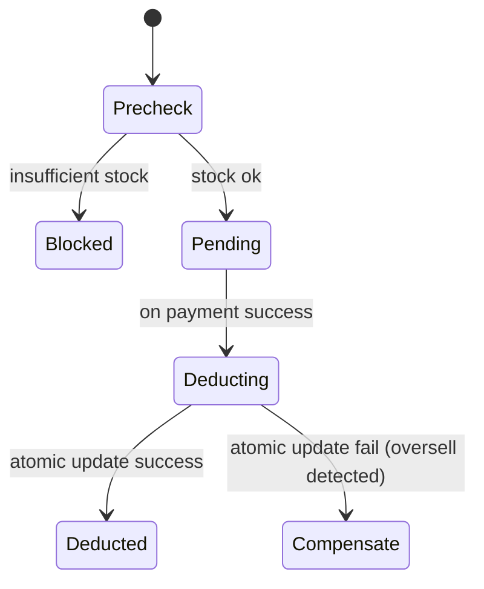
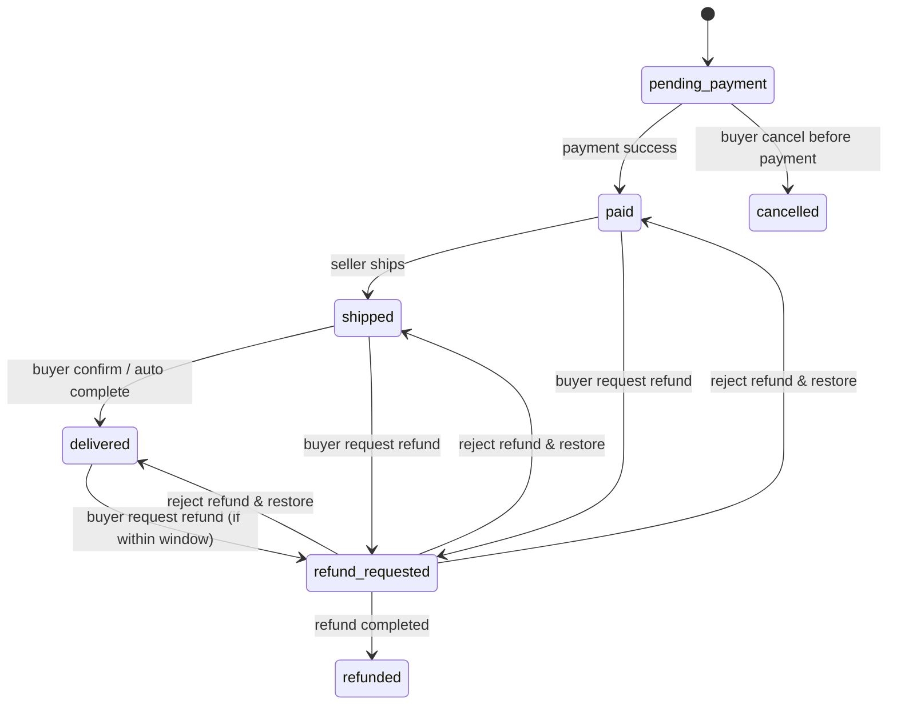
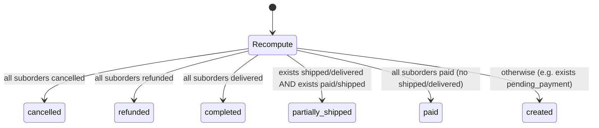
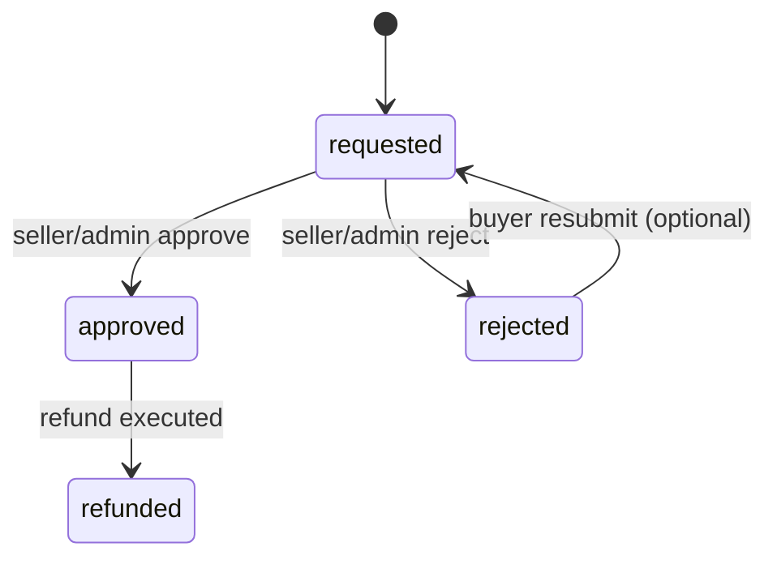
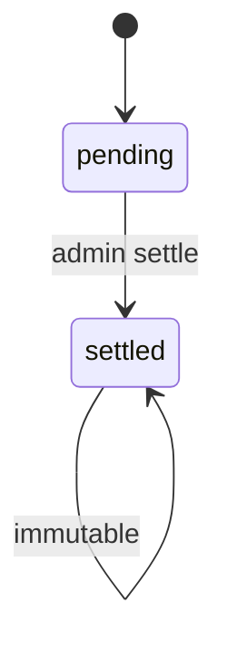
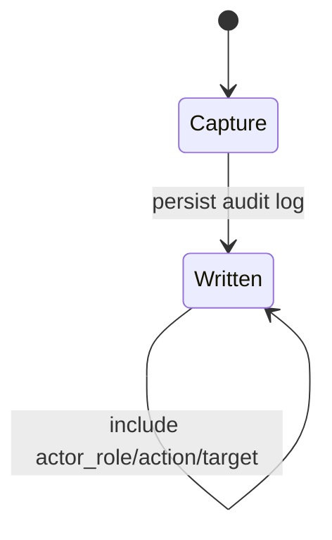

# Feature Specification: Multi-vendor Marketplace Platform（多商家電商平台 / Marketplace）

**Feature Branch**: `001-multi-vendor-marketplace`  
**Created**: 2026-02-11  
**Status**: Draft  
**Input**: User description: "Multi-vendor marketplace with RBAC (Visitor/Buyer/Seller/Admin), aggregated checkout (Order + SubOrders), payments with idempotent callbacks, anti-oversell stock deduction, refunds/cancellations/disputes, settlements, audit logging, and page-level state machines with consistent 401/403/404/5xx UX."

## User Scenarios & Testing *(mandatory)*

<!--
  IMPORTANT: User stories should be PRIORITIZED as user journeys ordered by importance.
  Each user story/journey must be INDEPENDENTLY TESTABLE - meaning if you implement just ONE of them,
  you should still have a viable MVP (Minimum Viable Product) that delivers value.
  
  Assign priorities (P1, P2, P3, etc.) to each story, where P1 is the most critical.
  Think of each story as a standalone slice of functionality that can be:
  - Developed independently
  - Tested independently
  - Deployed independently
  - Demonstrated to users independently
-->

### User Story 1 - 商品瀏覽 →（需登入）加入購物車/結帳 → 建立拆單訂單 → 付款結果可追蹤 (Priority: P1)

作為訪客或買家，我可以瀏覽/搜尋/篩選商品並查看詳情；當我嘗試加入購物車或結帳時，若尚未登入會被導向登入；登入後可完成加入購物車、結帳建立 1 筆 Order + N 筆 SubOrder、完成付款並在付款結果/訂單頁追蹤每筆子訂單狀態。

**Why this priority**: 這是平台交易閉環的核心；沒有這條路徑就無法產生訂單、付款與後續履約/售後。

**Independent Test**: 用一個 Buyer 帳號在公共商品頁完成「加入購物車 → 結帳建立拆單 → 付款成功/失敗/取消 → 付款結果頁顯示正確狀態 → 訂單頁可追蹤」即可端到端驗證，且不依賴賣家/管理員後台操作。

**Acceptance Scenarios**:

1. **Given** 使用者為 Visitor 且無登入 session，**When** 進入 `/` 或 `/search` 或 `/products/:productId`，**Then** 可以看到商品資訊（僅展示可售商品）且導覽列不顯示受保護入口。
2. **Given** 使用者為 Visitor，**When** 嘗試進入 `/cart` 或 `/checkout` 或點擊「加入購物車」，**Then** 後端回 401 且前端導向 `/login`，且不建立任何 Cart/Order/Payment。
3. **Given** 使用者為 Buyer，購物車有多個不同 seller 的 active 商品且庫存足夠，**When** 進入 `/checkout`，**Then** 系統建立 1 筆 Order(status=created) 與 N 筆 SubOrder(status=pending_payment)，並建立 Payment(status=pending)；金額計算一致。
4. **Given** Payment callback 回報成功且 idempotency key 未處理過，**When** 平台接收 callback，**Then** Payment=succeeded、Order=paid、所有 SubOrder=paid，且庫存扣減不會超賣。
5. **Given** Payment callback 重複送達（相同 transaction_id + order_id），**When** 平台再次接收 callback，**Then** 不得重複扣庫存或重複推進狀態，且回應為「已處理」。
6. **Given** 付款失敗或取消，**When** 使用者進入 `/payment/result`，**Then** 頁面清楚顯示失敗/取消並提供重試入口；Order 維持 created、SubOrder 維持 pending_payment。

---

### User Story 2 - 賣家入駐審核 → 商品上架 → 處理子訂單出貨/售後 → 查詢結算 (Priority: P2)

作為想加入平台的使用者，我可以提交 SellerApplication；通過管理員審核後，我成為 Seller 並能建立/編輯/上下架自家商品；對已付款的 SubOrder 進行出貨與售後處理，並查詢平台延遲結算結果。

**Why this priority**: 沒有賣家入駐與履約，Marketplace 無法供給商品與完成交易交付；同時結算是多商家平台的核心。

**Independent Test**: 使用一個 Seller 帳號完成「申請 → 管理員核准 → 建立商品並上架 → 看到自家子訂單並可出貨 → 可看到結算摘要」即可驗證，不必實作完整的爭議處理。

**Acceptance Scenarios**:

1. **Given** 使用者為 Buyer 且尚未具有 Seller 身分，**When** 進入 `/seller/apply` 並提交 shop_name，**Then** SellerApplication 狀態變為 submitted 且可在頁面看到提交狀態。
2. **Given** 使用者為 Platform Admin，**When** 在 `/admin/seller-applications` 核准某筆 submitted 申請，**Then** 申請狀態變為 approved、該使用者取得 Seller 身分，且寫入 AuditLog。
3. **Given** 使用者為 Seller，**When** 進入 `/seller/products` 建立或編輯商品並將 status 設為 active，**Then** 該商品會出現在公共商品列表/搜尋結果（除非被 banned）。
4. **Given** 使用者為 Seller 且有一筆 SubOrder=paid，**When** 在 `/seller/orders/:subOrderId` 執行出貨，**Then** SubOrder 由 paid 轉為 shipped（不得跳躍），且只能操作 seller_id 為自己的子訂單。
5. **Given** 使用者為 Seller，**When** 進入 `/seller/settlements`，**Then** 只看得到自己的 Settlement 列表與金額欄位（gross/platform_fee/net/status）。

---

### User Story 3 - 管理員審核/分類/介入退款與糾紛，且所有重要操作可稽核 (Priority: P3)

作為平台管理員，我可以審核賣家申請、管理分類、在必要時介入訂單糾紛或退款（含強制取消/退款），並確保所有關鍵管理操作與強制操作都會寫入稽核紀錄，供日後追溯。

**Why this priority**: 這是平台治理能力；能降低風險、支援客服與合規稽核，並讓 Marketplace 可被營運。

**Independent Test**: 用一個 Admin 帳號在管理端完成「審核賣家/調整分類/處理退款或糾紛」其中任一條操作，且可在 AuditLog 查到對應事件，即可獨立驗證。

**Acceptance Scenarios**:

1. **Given** 使用者為 Platform Admin，**When** 建立或調整分類狀態（active/inactive），**Then** 分類變更生效且寫入 AuditLog。
2. **Given** 使用者為 Platform Admin，**When** 對符合條件的 RefundRequest 執行核准/拒絕/強制退款，**Then** RefundRequest/SubOrder/Order 聚合狀態一致更新，且每次操作都寫入 AuditLog。
3. **Given** 使用者為 Platform Admin，**When** 將 DisputeCase 從 open 設為 resolved 並留下 resolution_note，**Then** 狀態不可回退，且可被追溯（含稽核）。

---

[Add more user stories as needed, each with an assigned priority]

### Edge Cases

<!--
  ACTION REQUIRED: The content in this section represents placeholders.
  Fill them out with the right edge cases.
-->

- 訪客直接存取受保護路由（/cart、/orders*、/seller/*、/admin/*）時，必須一致地導向登入且不洩漏受保護資料。
- Buyer/Seller 對非本人資源操作（IDOR）時，必須一致回 403 或 404（需在規格中固定策略）。
- 結帳時遇到部分商品缺貨或商品狀態改變（inactive/banned）時，如何阻擋或要求調整必須一致。
- Payment callback 重複送達或亂序送達時，系統不得重複扣庫存與推進狀態。
- 付款成功但 Order/SubOrder 未完整建立時，必須能補償/補單並可稽核。
- 退款申請被拒絕時，SubOrder 必須恢復到申請前狀態，且需可追溯（包含誰拒絕、恢復前後狀態）。
- delivered 後是否允許退款以及退款窗口（時間/條件）需一致。
- Review comment 必須避免 XSS：不論儲存或呈現都不得執行腳本。

## Requirements *(mandatory)*

<!--
  ACTION REQUIRED: The content in this section represents placeholders.
  Fill them out with the right functional requirements.
-->

### Functional Requirements

- **FR-001**: 系統 MUST 支援使用者註冊、登入、登出，且登入狀態需可用於後續授權判斷。
- **FR-002**: 系統 MUST 實作 RBAC：Visitor / Buyer / Seller / Platform Admin，且每個受保護頁面與 API 都 MUST 進行「角色 + 資源擁有權」檢查。
- **FR-003**: Visitor MUST 能瀏覽商品列表(`/`)、搜尋(`/search`)、商品詳情(`/products/:productId`)，且僅展示 status=active 且非 banned 的商品。
- **FR-004**: Visitor 嘗試加入購物車或進入受保護路由（至少包含 `/cart`、`/checkout`、`/orders*`、`/seller/*`、`/admin/*`）時，系統 MUST 不建立任何交易資料並導向登入流程。
- **FR-005**: Buyer MUST 能對 active 商品建立/調整/移除購物車項目；quantity MUST >= 1 且不得超過可售庫存。
- **FR-006**: inactive/draft/banned 商品 MUST 不可加入購物車與結帳；已在購物車內的商品若變更為不可售，結帳時 MUST 被阻擋並提示原因。
- **FR-007**: Buyer 在 `/checkout` 結帳時，系統 MUST 於建立訂單前再次驗證商品可售狀態與庫存。
- **FR-008**: 結帳通過驗證後，系統 MUST 建立 1 筆 Order(status=created) 與依 seller 拆分的 N 筆 SubOrder(status=pending_payment)，並計算 Order.total_amount 與每筆 SubOrder.subtotal。
- **FR-009**: 系統 MUST 建立 Payment 記錄並在付款流程完成後可查詢付款結果（succeeded/failed/cancelled）。
- **FR-010**: Payment callback MUST 具備冪等：以 (transaction_id + order_id) 作為冪等鍵；重複 callback MUST 不得重複扣庫存或重複推進 Payment/Order/SubOrder。
- **FR-011**: 付款成功 callback 首次處理時，系統 MUST 推進 Payment=succeeded、Order=paid、所有 SubOrder=paid，並觸發庫存扣減；扣減 MUST 防止超賣。
- **FR-012**: 付款失敗或取消時，系統 MUST 設 Payment=failed 或 cancelled，且 Order MUST 維持 created、SubOrder MUST 維持 pending_payment；Buyer MUST 可重試付款。
- **FR-013**: 系統 MUST 提供補償/補單能力：當付款成功但訂單資料不完整時，系統 MUST 能修復到一致狀態或標記為需人工/自動修復，且可被追溯。
- **FR-014**: SubOrder 狀態 MUST 僅能依合法轉換前進（不得跳躍），並拒絕任何非法轉換。
- **FR-015**: Order.status MUST 由 SubOrder 聚合規則計算，不可由單一操作任意覆寫。
- **FR-016**: Buyer 付款前 MUST 能取消整筆 Order，取消後所有 SubOrder MUST 變為 cancelled，且不得再被付款更新為 paid。
- **FR-017**: Buyer 付款後 MUST 能針對特定 SubOrder 建立退款申請(RefundRequest=requested)；系統 MUST 支援部分退款(approved_amount < requested_amount)。
- **FR-018**: Seller MUST 能對 refund_requested 的 SubOrder 進行同意或拒絕；拒絕時 SubOrder MUST 恢復到申請前狀態並可稽核。
- **FR-019**: Platform Admin MUST 能在必要時強制取消/退款/介入糾紛，且所有管理與強制操作 MUST 寫入 AuditLog。
- **FR-020**: Buyer 僅能對已 delivered 的交易商品建立 Review；Review comment MUST 以一致策略防止 XSS。
- **FR-021**: SellerApplication MUST 支援 submitted/approved/rejected；僅 Platform Admin 可審核，且審核動作 MUST 寫 AuditLog。
- **FR-022**: Settlement MUST 依 period 對 seller 統計 gross/platform_fee/net，狀態 pending/settled；settled MUST 不可修改；platform_fee 規則 MUST 由平台管理且 Seller 不可修改。

- **FR-023**: banned 商品 MUST 不可被列表/搜尋展示且不可購買；若直接以 `/products/:productId` 存取 banned 商品，系統 MUST 顯示「不可用」狀態（而非 404），並禁止加入購物車/結帳。
- **FR-024**: 結帳驗證遇到「部分缺貨 / 不可售商品」時，系統 MUST 拒絕建立 Order/SubOrder/Payment，並回傳可辨識的缺貨/不可售清單；Buyer MUST 先移除或調整這些項目後才能結帳。
- **FR-025**: delivered 後允許退款，但僅限於 delivered 後 7 天內；超過窗口 MUST 拒絕並回傳原因。

### Data Contract & API Semantics *(mandatory if feature has frontend/backend or external integration)*

<!--
  ACTION REQUIRED: Define the contract BEFORE implementation.
  Provide at minimum: request schema, response schema, and error semantics.
-->

- **Contract**: `POST /auth/signup` request: `{ email, password, ... }` → response: `{ user_id }`
- **Contract**: `POST /auth/login` request: `{ email, password }` → response: `{ session, roles[] }`
- **Contract**: `POST /auth/logout` request: `{}` → response: `{ ok }`

- **Contract**: `GET /products` request: `{ q?, category_id?, price_min?, price_max?, sort?, page? }` → response: `{ items: ProductSummary[], total }`
- **Contract**: `GET /products/:productId` response: `{ product: ProductDetail }`（包含 seller shop_name 與可購買狀態）

- **Contract**: `GET /cart` response: `{ items: CartItemView[], totals }`（僅限 Buyer，且僅回本人）
- **Contract**: `POST /cart/items` request: `{ product_id, quantity }` → response: `{ cart }`
- **Contract**: `PATCH /cart/items/:itemId` request: `{ quantity }` → response: `{ cart }`
- **Contract**: `DELETE /cart/items/:itemId` response: `{ cart }`

- **Contract**: `POST /checkout` request: `{}`（以目前購物車為準）→ response: `{ order_id, payment_id, order_status, suborders[] }`

- **Contract**: `GET /payments/:paymentId` response: `{ payment_status, transaction_id?, order_id }`
- **Contract**: `POST /payments/:paymentId/retry` response: `{ new_payment_id|payment_id, next_action }`（僅限 failed/cancelled）
- **Contract**: `POST /payments/callback` request: `{ order_id, transaction_id, status, amount, occurred_at }` → response: `{ ok, deduped }`

- **Contract**: `GET /orders` response: `{ items: OrderSummary[] }`（僅限 Buyer，且僅回本人）
- **Contract**: `GET /orders/:orderId` response: `{ order, suborders[] }`（僅限 Buyer 本人）
- **Contract**: `GET /orders/:orderId/suborders/:subOrderId` response: `{ suborder, items[], after_sales_actions[] }`
- **Contract**: `POST /orders/:orderId/cancel` response: `{ order_status, suborders[] }`（僅付款前）

- **Contract**: `POST /refund-requests` request: `{ suborder_id, reason, requested_amount }` → response: `{ refund_request_id, status }`
- **Contract**: `POST /seller/suborders/:subOrderId/ship` response: `{ suborder_status }`
- **Contract**: `POST /seller/refund-requests/:id/approve` request: `{ approved_amount }` → response: `{ status }`
- **Contract**: `POST /seller/refund-requests/:id/reject` request: `{ reason }` → response: `{ status }`

- **Contract**: `POST /reviews` request: `{ product_id, rating, comment }` → response: `{ review_id }`

- **Contract**: `POST /seller/applications` request: `{ shop_name, documents? }` → response: `{ application_id, status }`
- **Contract**: `POST /admin/seller-applications/:id/approve|reject` response: `{ status }`
- **Contract**: `POST /admin/categories` request: `{ name, status }` → response: `{ category_id }`
- **Contract**: `PATCH /admin/categories/:id` request: `{ status|name }` → response: `{ category }`
- **Contract**: `POST /admin/refunds/:id/force-refund|approve|reject` response: `{ refund_request_status }`
- **Contract**: `POST /admin/disputes/:id/resolve` request: `{ resolution_note }` → response: `{ status }`
- **Contract**: `POST /admin/settlements/:id/settle` response: `{ status }`

- **Errors**: `401` → 未登入 → 前端導向 `/login`（可保留 return_to）
- **Errors**: `403` → 角色不符或無權限 → 顯示 `/403`
- **Errors**: `404` → 資源不存在或（依策略）避免洩漏資源存在性 → 顯示 `/404`
- **Errors**: `409` → 狀態衝突/庫存不足/非法狀態轉換 → 顯示可理解原因並提供修正/重試
- **Errors**: `5xx` → 非預期例外 → 顯示 `/500` 與重試入口

### State Transitions & Invariants *(mandatory if feature changes state/data)*

<!--
  ACTION REQUIRED: Explicitly define preconditions/postconditions.
  Do NOT invent business rules; mark unclear items as NEEDS CLARIFICATION.
-->

- **Invariant**: Order.status MUST 永遠由其 SubOrder 狀態集合聚合計算（單點寫入不允許覆寫）。
- **Invariant**: SubOrder.status MUST 只能依「合法狀態轉換」前進或復原（refund 拒絕時回復 prev_status），不得跳躍。
- **Invariant**: Payment callback MUST 以 (transaction_id + order_id) 去重，且去重後不得重複扣庫存。
- **Invariant**: Buyer/Seller MUST 只能讀寫其擁有的資源；Admin 的跨範圍操作 MUST 產生 AuditLog。

- **Transition**: Given SubOrder=pending_payment，when payment success callback 首次處理，then SubOrder→paid 且記錄去重處理結果。
- **Transition**: Given SubOrder=paid 且 actor 為該 seller，when 出貨，then SubOrder→shipped。
- **Transition**: Given SubOrder=shipped，when 買家確認收貨或自動完成條件成立，then SubOrder→delivered。
- **Transition**: Given Order=created 且任一 SubOrder=pending_payment，when Buyer 取消訂單，then 全部 SubOrder→cancelled 且 Order→cancelled。
- **Transition**: Given SubOrder in {paid, shipped, delivered} 且符合退款規則，when Buyer 申請退款，then SubOrder→refund_requested 且保存 prev_status。
- **Transition**: Given SubOrder=refund_requested，when 退款完成，then SubOrder→refunded（終態）且 RefundRequest→refunded。
- **Transition**: Given SubOrder=refund_requested，when 賣家/管理員拒絕退款，then SubOrder→prev_status 且 RefundRequest→rejected，並寫 AuditLog。

#### Transition Diagrams (Authoritative Reference)

以下狀態機圖為本規格的「權威參考」，實作與測試 MUST 與其一致。

##### 1) Global App Page State Machine

```mermaid
stateDiagram-v2
  [*] --> Guest : open app (no session)
  [*] --> Buyer : open app (session role=Buyer)
  [*] --> Seller : open app (session role=Seller)
  [*] --> Admin : open app (session role=Platform Admin)

  Guest --> Login : go /login
  Guest --> Signup : go /signup
  Guest --> ProductList : go /
  Guest --> Search : go /search
  Guest --> ProductDetail : go /products/:productId
  Guest --> Login : go /cart (guard: 401 redirect)
  Guest --> Login : go /checkout (guard: 401 redirect)
  Guest --> Login : go /orders* (guard: 401 redirect)
  Guest --> Login : go /reviews/new (guard: 401 redirect)
  Guest --> Login : go /seller/* (guard: 401 redirect)
  Guest --> Login : go /admin/* (guard: 401 redirect)

  Login --> Buyer : login success (role=Buyer)
  Login --> Seller : login success (role=Seller)
  Login --> Admin : login success (role=Platform Admin)
  Login --> Login : login fail

  Signup --> Login : signup success
  Signup --> Signup : signup fail

  Buyer --> Cart : go /cart
  Buyer --> Checkout : go /checkout
  Buyer --> PaymentResult : go /payment/result
  Buyer --> Orders : go /orders
  Buyer --> OrderDetail : go /orders/:orderId
  Buyer --> SubOrderDetail : go /orders/:orderId/suborders/:subOrderId
  Buyer --> ReviewNew : go /reviews/new

  Buyer --> Buyer : go /seller/* (guard: 403)
  Buyer --> Buyer : go /admin/* (guard: 403)

  Seller --> SellerProducts : go /seller/products
  Seller --> SellerOrders : go /seller/orders
  Seller --> SellerSettlements : go /seller/settlements
  Seller --> Seller : go /admin/* (guard: 403)

  Admin --> AdminSellerApplications : go /admin/seller-applications
  Admin --> AdminCategories : go /admin/categories
  Admin --> AdminOrders : go /admin/orders
  Admin --> AdminDisputes : go /admin/disputes
  Admin --> AdminRefunds : go /admin/refunds
  Admin --> AdminAnalytics : go /admin/analytics

  Buyer --> Guest : logout
  Seller --> Guest : logout
  Admin --> Guest : logout
```

##### 2) Feature: Payment Callback Idempotency

```mermaid
stateDiagram-v2
  [*] --> Waiting
  Waiting --> Received : callback received
  Received --> DedupeCheck : check idempotency key (transaction_id + order_id)
  DedupeCheck --> Ignored : already processed
  DedupeCheck --> ApplySuccess : first time & payment success
  DedupeCheck --> ApplyFail : first time & payment failed/cancelled
  ApplySuccess --> Updated : Payment succeeded; Order paid; SubOrders paid
  ApplyFail --> Updated : Payment failed/cancelled; Order created; SubOrders pending_payment
```

##### 3) Feature: Stock Deduction (Anti-oversell)

##### 4) Feature: SubOrder Status Machine

##### 5) Feature: Order Status Aggregation

##### 6) Feature: RefundRequest Workflow

##### 7) Feature: Settlement Lifecycle

##### 8) Feature: AuditLog Recording

### Failure Modes & Recovery *(mandatory)*

- **Failure mode**: 結帳校驗失敗（商品 inactive/banned、庫存不足、購物車為空）
  - **Recovery**: 不建立任何 Order/SubOrder/Payment；回傳可理解原因；前端提供修正入口（回購物車/商品頁）。
- **Failure mode**: Payment callback 重複/亂序/重放
  - **Recovery**: 以冪等鍵去重；已處理則忽略；狀態與庫存不得重複更新；可查到去重結果。
- **Failure mode**: 付款成功但訂單資料不完整（Order/SubOrder/Payment 任一缺失）
  - **Recovery**: 進入補償流程：補齊缺失資料或標記需修復；修復完成後資料一致且可稽核。
- **Failure mode**: 扣庫存時偵測超賣（原子扣減失敗）
  - **Recovery**: 標記該筆交易為需補償/人工介入；不得讓庫存為負；對買家提供可理解的後續處置（例如退款/取消/等待）。
- **Failure mode**: 退款拒絕後狀態無法正確回復
  - **Recovery**: 必須依 prev_status 回復；若不一致則阻擋並進入可追溯的修復流程。
- **Failure mode**: 5xx 例外
  - **Recovery**: 前端顯示 `/500` 或頁面 Error 並提供重試；後端記錄可追蹤的錯誤事件。

- **Failure mode**: [What can fail: external system, DB, network, validation]
- **Recovery**: [rollback/compensation strategy + how to verify recovery]

### Security & Permissions *(mandatory)*

- **Authentication**: `/cart`、`/checkout`、`/payment/result`、`/orders*`、`/reviews/new`、`/seller/*`、`/admin/*` MUST require authenticated session。
- **Authorization**:
  - Buyer 只能讀寫自己的 Cart/Order/SubOrder/Payment/RefundRequest/Review。
  - Seller 只能讀寫自己的 Product/SubOrder/Settlement。
  - Platform Admin 可跨範圍介入，但所有管理/強制操作 MUST 記錄 AuditLog。
- **Resource ownership**: 任何以 id 查詢/操作資源的請求 MUST 驗證資源擁有權以防止 IDOR。
- **Sensitive data**: 使用者驗證資訊不得外洩；付款交易識別需最小揭露。
- **XSS**: Review.comment MUST 採一致策略使其在顯示時不會執行腳本（包含事件處理、script tag、惡意 URL 等）。

- **Authentication**: [required / not required + rationale]
- **Authorization**: [roles/permissions model + server-side enforcement]
- **Sensitive data**: [what is sensitive + how it is protected/omitted from responses]

### Observability *(mandatory)*

- **Logging**: 重要事件（登入、結帳建立訂單、付款回呼處理、扣庫存、取消/退款、管理員介入）需有可關聯的紀錄。
- **Tracing**: 對外請求與回呼處理 SHOULD 有可關聯的 request/trace id 以便追查。
- **User-facing errors**: 401→導向 `/login`；403→`/403`；404→`/404`；5xx→`/500`；每個頁面需有 Loading/Empty/Error 與重試入口（若適用）。
- **Developer diagnostics**: AuditLog 與錯誤紀錄需能回溯 actor、目標資源與狀態變更（含前後差異，若有）。

- **Logging**: [what events/errors are logged]
- **Tracing**: [request id / trace id propagation]
- **User-facing errors**: [messages/actionability]
- **Developer diagnostics**: [internal error codes/details]

### Backward Compatibility & Change Risk *(mandatory)*

- **Breaking change?**: No（新系統功能規格）。
- **Migration plan**: 不適用（無既有資料前提）。
- **Rollback plan**: 可透過停用受保護功能入口並維持公共商品瀏覽；交易流程需避免留下不可追溯的半完成狀態。

- **Breaking change?**: [Yes/No]
- **Migration plan**: [steps]
- **Rollback plan**: [steps]

### Performance & Scale Assumptions *(mandatory)*

- **Growth assumption**: 支援日常多商家上架與多筆拆單交易；高峰期同時有大量使用者瀏覽、搜尋與結帳。
- **Constraints**:
  - 主要頁面（商品列表/搜尋/詳情/訂單）在一般網路條件下，使用者可在可接受時間內看到 Loading→Ready/Empty 的結果。
  - 付款結果頁必須在短時間內能顯示最終結果（成功/失敗/取消）或清楚顯示「等待更新」並提供刷新/重試。
  - 系統必須在併發結帳情境下維持庫存不超賣與狀態一致。

- **Growth assumption**: [data volume/users/traffic]
- **Constraints**: [latency/throughput targets or NEEDS CLARIFICATION]

### Key Entities *(include if feature involves data)*

- **User**: 具備 roles（buyer/seller/admin），作為 Buyer/Seller/Admin 的身份載體。
- **Product**: 由 Seller 擁有，包含 status（draft/active/inactive/banned）、price、stock、category。
- **Category**: 商品分類，包含 status（active/inactive）。
- **Cart / CartItem**: Buyer 的購物車與項目。
- **Order**: 平台層訂單（聚合），status 由 SubOrder 聚合而得。
- **SubOrder / SubOrderItem**: 賣家層子訂單（拆單），狀態機受限於合法轉換。
- **Payment**: 付款紀錄，包含 payment_status 與 transaction_id，用於 callback 去重。
- **RefundRequest**: 退款申請與處理狀態，支援部分退款。
- **Settlement**: 對 Seller 的延遲結算結果，包含 period 與金額欄位。
- **SellerApplication**: 賣家入駐申請與審核結果。
- **DisputeCase**: 訂單糾紛案件與處理狀態。
- **AuditLog**: 稽核事件，記錄 actor/role/action/target 與必要 metadata。

- **[Entity 1]**: [What it represents, key attributes without implementation]
- **[Entity 2]**: [What it represents, relationships to other entities]

## Success Criteria *(mandatory)*

<!--
  ACTION REQUIRED: Define measurable success criteria.
  These must be technology-agnostic and measurable.
-->

### Measurable Outcomes

- **SC-001**: 90% 以上的 Buyer 可在首次嘗試中完成「加入購物車 → 結帳建立拆單 → 付款結果確認」的主要任務（以驗收測試通過率衡量）。
- **SC-002**: 任意 Payment callback 重複送達（相同 transaction_id + order_id）時，系統狀態（Payment/Order/SubOrder/庫存）在重複呼叫後仍保持一致且不會額外扣庫存（以驗收測試與稽核紀錄比對衡量）。
- **SC-003**: 100% 的管理員關鍵操作（審核賣家、分類管理、強制取消/退款、結算）都能在 AuditLog 中被查到對應事件（以抽樣稽核衡量）。
- **SC-004**: 在併發結帳測試中不發生超賣（庫存不得為負且交易結果可追溯），且對使用者提供清楚的失敗/補償提示。
- **SC-005**: 付款結果頁對成功/失敗/取消三種情境皆能提供明確下一步（查看訂單/重試付款/回到安全頁），且在驗收測試中可被驗證。
