# Feature Specification: 金流前置模擬平台（非真的刷卡） / Payment Flow Simulation Platform (Non‑Real Payment)

**Feature Branch**: `001-payment-flow-sim`  
**Created**: 2026-03-04  
**Status**: Draft  
**Input**: User description: "建立可完整模擬『建立訂單 → 進入付款 → Return URL / Webhook 回傳』的測試平台（不連真實金流），支援 success/failed/cancelled/timeout/delayed_success、延遲、錯誤模板、不可變狀態事件、AuditLog、Webhook 重送、Replay、RBAC 與 Admin 管理。"

## User Scenarios & Testing *(mandatory)*

### User Story 1 - 建立模擬訂單並完成回傳（Return URL）(Priority: P1)

串接金流的開發者（User/Developer）可以在平台建立一筆模擬訂單，取得付款頁 URL，於付款頁執行「模擬付款」，並在付款完成後收到導向 callback_url 的回傳資料；同時能在訂單詳情看到不可變的狀態轉換事件與回傳紀錄。

**Why this priority**: 這是平台最核心的端到端整合測試能力（建立訂單→付款→回傳），可直接用於前後端串接與 QA 驗證訂單狀態機。

**Independent Test**: 只要能在 UI 建立訂單、進入付款頁、完成一次模擬付款並生成 ReturnLog，就能驗證此 slice 的價值與正確性。

**Acceptance Scenarios**:

1. **Given** 已登入的 User（Developer），**When** 於 /orders/new 建立訂單（amount、currency、callback_url、payment_method、scenario），**Then** 系統建立訂單 status=created、產生唯一 order_no 與 /pay/:order_no URL，並記錄 AuditLog(action=create_order, success=true)。
2. **Given** 訂單 status=created，**When** 首次成功載入 /pay/:order_no，**Then** 訂單狀態必須轉為 payment_pending，且寫入 OrderStateEvent(trigger=enter_payment_page, from=created, to=payment_pending)。
3. **Given** 訂單 status=payment_pending 且 scenario=success，**When** 在付款頁點擊 pay，**Then** 依 delay_sec 完成後狀態轉為 paid、completed_at 寫入、寫入 OrderStateEvent(trigger=pay) 並導向 callback_url（依 return_method），ReturnLog 被寫入且 payload 與導向內容一致。
4. **Given** 訂單 status=payment_pending 且 scenario=failed/timeout，**When** 完成付款，**Then** payload 必須包含 error_code/error_message（若訂單有設定），ReturnLog.payload 與後續 Webhook payload（若有）欄位與值完全一致。
5. **Given** 訂單已進入終態（paid/failed/cancelled/timeout），**When** 再次嘗試觸發付款或任何會改變狀態的動作，**Then** 必須被拒絕（400）且不得寫入新的 OrderStateEvent。

---

### User Story 2 - 模擬 Webhook（含簽章、延遲、重送）(Priority: P2)

開發者可在建立訂單時設定 webhook_url，使訂單進入終態後平台以 Server-to-Server 方式送出 Webhook；能在訂單詳情檢視送出內容與結果，並可手動重送以復現接收端處理。

**Why this priority**: Webhook 是第三方金流常見的異步回傳途徑；QA 需要驗證延遲、失敗、重送與簽章驗證流程。

**Independent Test**: 建立含 webhook_url 的訂單並完成付款後，應可在詳情看到 WebhookLog；再點擊重送新增第二筆 WebhookLog。

**Acceptance Scenarios**:

1. **Given** 訂單已進入終態且 webhook_url 有值，**When** 觸發 Webhook 發送（可延遲 webhook_delay_sec），**Then** 系統以 payload（與 Return 一致）POST webhook_url，並在 WebhookLog 記錄 request_headers（含 timestamp、signature）、payload、sent_at、success/response。
2. **Given** 訂單終態且 webhook_url 有值，**When** 在詳情點擊「重送 Webhook」，**Then** 系統必須使用相同業務 payload（欄位和值不變）但重新產生 timestamp/signature，新增一筆 WebhookLog 與 AuditLog(action=resend_webhook)。
3. **Given** 訂單非終態或 webhook_url 空值，**When** 嘗試重送 Webhook，**Then** 必須拒絕（400），且不得新增 WebhookLog。

---

### User Story 3 - Replay（重播）以復現 Return/Webhook 行為 (Priority: P3)

開發者可在終態訂單上執行 Replay，以同一筆訂單設定重新觸發「Return / Webhook」流程來復現問題；重播不得改變訂單終態，且重播結果要被獨立記錄。

**Why this priority**: Replay 直接降低除錯成本，能在相同訂單上下文下重現回傳/簽章/延遲等問題。

**Independent Test**: 對一筆終態訂單執行 replay（webhook_only 或 full_flow），能看到新增 ReplayRun 與對應的新 ReturnLog/WebhookLog（帶 replay_run_id）。

**Acceptance Scenarios**:

1. **Given** 訂單為終態，**When** 執行 Replay scope=webhook_only，**Then** 必須建立 ReplayRun，新增 WebhookLog(replay_run_id)（若 webhook_url 有值），訂單狀態不變。
2. **Given** 訂單為終態，**When** 執行 Replay scope=full_flow，**Then** 必須新增 ReturnLog(replay_run_id) 且 delivery_method 與訂單 return_method 一致，並（若 webhook_url 有值）新增 WebhookLog(replay_run_id)。
3. **Given** 訂單非終態，**When** 嘗試執行 Replay，**Then** 必須拒絕（400）且不得建立 ReplayRun。

---

### User Story 4 - Admin 管理付款方式、情境模板與系統參數 (Priority: P4)

管理員可管理付款方式（PaymentMethod）與模擬情境模板（SimulationScenarioTemplate），並設定系統參數（如 session 有效期、允許幣別、預設 return_method、Webhook 密鑰輪替策略）。

**Why this priority**: 提供可管理的「全域預設」以支援不同 QA 需求與組織規範。

**Independent Test**: 以 Admin 進入 /admin，對付款方式/情境模板做一次修改後，/orders/new 立即反映可選項與預設。

**Acceptance Scenarios**:

1. **Given** Admin 已登入，**When** 於 /admin 停用某 payment method，**Then** User 建立訂單時不可再選該付款方式，且 AuditLog(action=admin_manage_payment_method) 被寫入。
2. **Given** Admin 已登入，**When** 調整某情境模板預設 delay_sec 與 error_code/message，**Then** 建立訂單時預設值會帶入且仍允許覆寫，且 AuditLog(action=admin_manage_scenario_template) 被寫入。

### Edge Cases

- Guest 造訪任何受保護頁面（/orders、/orders/new、/pay/:order_no、/orders/:id、/admin）必須被導向 /login，且不得短暫顯示受保護內容。
- User（Developer）嘗試以 order_no 或 id 存取他人訂單必須 403，且不得洩漏 ReturnLog/WebhookLog/AuditLog。
- 建單輸入非法：amount 非正整數、currency 非允許值、callback_url/webhook_url 非 http/https、delay_sec < 0、webhook_delay_sec < 0 → 必須 400 且不得留下半成品資料。
- 付款頁重複點擊 pay 或重整頁面：不得造成重複終態轉換或多次 ReturnLog/WebhookLog（除非是明確的 resend/replay 操作）。
- callback_url 不可達或瀏覽器端送出失敗：訂單仍可完成終態，但 ReturnLog.success=false 且記錄 error_message。
- webhook 接收端回應非 2xx 或網路失敗：WebhookLog.success=false 且記錄 response_status/response_body_excerpt，並允許手動重送。
- 非法狀態轉換（例如 created 直接 paid，或終態再轉回 payment_pending）必須 400 且不得寫入 OrderStateEvent。

## Requirements *(mandatory)*

### Scope Boundaries

**In Scope**

- 建立模擬訂單、產生付款頁 URL、模擬付款結果（含延遲/錯誤）
- Return URL 回傳（query_string / post_form）與 ReturnLog 紀錄
- Webhook 模擬（延遲、HMAC 簽章、送出紀錄、手動重送）
- 訂單狀態機（含終態不可變）與不可變事件流（OrderStateEvent）
- 操作稽核（AuditLog）與 Replay（webhook_only / full_flow）
- RBAC（Guest/User/Admin）與 Admin 管理付款方式/情境模板/系統參數

**Out of Scope**

- 真實刷卡/真實扣款/連線任何銀行或真實金流商
- 對帳、清算、實際收款與任何財務結算流程
- 保存任何真實卡號、持卡人姓名、CVV 等敏感資料

### Assumptions & Dependencies

**Assumptions（合理預設）**

- 平台用途為開發/QA 測試環境，資料與紀錄以測試用途為主。
- 預設允許幣別：TWD、USD、JPY（可由 Admin 調整）。
- 預設 return_method：query_string（可由 Admin 調整；建立後對單筆訂單不可變更）。
- Webhook secret rotation 預設允許前一把 secret 的驗證寬限期為 24 小時（可由 Admin 調整）。
- 平台所有時間欄位以一致的時區格式呈現（例如同一時區顯示），以避免 QA 在跨時區比對時誤判。

**Dependencies（外部依賴）**

- callback_url 與 webhook_url 的接收端由使用者自行提供；其可用性與回應行為會影響 ReturnLog/WebhookLog 的 success 與 response 紀錄。
- 系統時間（產生 timestamp）需合理準確，以便接收端驗證重放視窗。

### Functional Requirements

**認證 / Session**

- **FR-001**: 系統 MUST 提供 Email + 密碼登入。
- **FR-002**: 系統 MUST 使用 Session Cookie 維持登入狀態；Cookie 必須為 HttpOnly。
- **FR-003**: Session 預設有效期 MUST 為 8 小時，且 Admin MUST 能調整。
- **FR-004**: 未登入呼叫任何受保護 API MUST 回 401。
- **FR-005**: 登入成功/失敗、登出、session 過期事件 MUST 寫入 AuditLog，且不得洩漏帳號是否存在。

**RBAC / 存取控制**

- **FR-006**: 系統 MUST 支援固定角色：Guest / User（Developer）/ Admin；同一帳號角色不得自行切換。
- **FR-007**: 前端 Route Guard MUST 依角色限制頁面存取（見「State Transitions & Invariants」的參考圖 ①、⑧～⑮）。
- **FR-008**: 後端 MUST 實作 server-side 權限檢查：已登入但權限不足回 403。
- **FR-009**: User（Developer）MUST 只能讀取/操作自己建立之訂單與其關聯紀錄；Admin MUST 可讀取全站資料（避免 IDOR）。

**訂單建立與查詢**

- **FR-010**: User（Developer）與 Admin MUST 能建立模擬訂單，且系統 MUST 產生唯一不可修改的 order_no。
- **FR-011**: 訂單欄位 MUST 支援：amount（正整數）、currency（預設 TWD，且必須在允許清單）、callback_url（必填 http/https）、return_method（query_string/post_form，建立後不可變更）、webhook_url（選填 http/https）、payment_method（僅能選 enabled PaymentMethod）、simulation_scenario（success/failed/cancelled/timeout/delayed_success）、delay_sec（>=0）、webhook_delay_sec（選填，>=0）、error_code/error_message（failed/timeout 可用）。
- **FR-012**: 系統 MUST 提供訂單列表分頁（每頁 20），並支援至少 status、payment_method、simulation_scenario、created_at 時間區間篩選。

**付款頁與模擬付款**

- **FR-013**: 系統 MUST 提供付款頁 URL：/pay/:order_no，並顯示訂單摘要與情境設定。
- **FR-014**: 訂單首次成功載入付款頁時，若 status=created MUST 推進至 payment_pending 並寫入 OrderStateEvent(trigger=enter_payment_page)。
- **FR-015**: 模擬付款 MUST 依 simulation_scenario 與 delay_sec（倒數）在 payment_pending 狀態下決定終態並寫入 completed_at。
- **FR-016**: 付款完成後 MUST 依 return_method 對 callback_url 發送回傳（導向 query_string 或 post_form），並寫入 ReturnLog。

**Return URL（callback_url）**

- **FR-017**: Return payload 欄位 MUST 至少包含：order_no、status、amount、currency、completed_at；failed/timeout 情境 MUST 包含 error_code/error_message（若有設定）。
- **FR-018**: ReturnLog MUST 記錄 payload、callback_url、delivery_method、dispatched_at、success、error_message（若有），且紀錄不可刪除/不可改寫。

**Webhook（含簽章、延遲、重送）**

- **FR-019**: 訂單進入終態且 webhook_url 有值時，系統 MUST 發送 Webhook（可延遲），且不得阻塞主要回應。
- **FR-020**: Webhook payload MUST 與 Return payload 欄位與值完全一致。
- **FR-021**: Webhook Request Header MUST 包含 timestamp 與 signature，其中 signature = HMAC(secret, timestamp + "." + raw_body)。
- **FR-022**: 系統 MUST 記錄每次 Webhook 發送/重送的 WebhookLog（含 request_headers、payload、sent_at、response、success），且不可刪除/不可改寫。
- **FR-023**: 系統 MUST 支援手動重送 Webhook：payload（業務欄位）相同，但 timestamp/signature 重新產生，並新增 WebhookLog 與 AuditLog(action=resend_webhook)。

**狀態機與不可變事件**

- **FR-024**: 訂單狀態 MUST 僅允許以下集合：created、payment_pending、paid、failed、cancelled、timeout。
- **FR-025**: 合法轉換 MUST 僅限：created→payment_pending、payment_pending→(paid|failed|cancelled|timeout)。
- **FR-026**: paid/failed/cancelled/timeout MUST 為終態，進入後不可再轉回非終態；任何嘗試 MUST 回 400。
- **FR-027**: 每次合法狀態轉換 MUST 寫入 OrderStateEvent（from/to/trigger/actor/occurred_at/meta），且事件不可刪除/不可改寫。
- **FR-028**: 非法狀態轉換 MUST 被拒絕（400）且不得寫入 OrderStateEvent。

**Audit Log（稽核）**

- **FR-029**: 系統 MUST 記錄至少以下事件到 AuditLog：login/logout/session_expired/create_order/enter_payment_page/pay/state_transition/return_dispatch/webhook_send/webhook_resend/replay_start/replay_finish/admin_manage_*。
- **FR-030**: AuditLog MUST 包含 actor_type、actor_user_id（若適用）、action、target_type/target_id、occurred_at、success、error_message/meta（若有），且不可刪除。

**Replay（重播）**

- **FR-031**: 系統 MUST 允許對終態訂單執行 Replay，scope 支援 webhook_only/full_flow。
- **FR-032**: Replay MUST 不改變訂單終態；重播結果 MUST 以 ReplayRun 紀錄。
- **FR-033**: Replay scope=webhook_only MUST 只產生 WebhookLog（若 webhook_url 有值）。
- **FR-034**: Replay scope=full_flow MUST 產生 ReturnLog（replay_run_id）並（若 webhook_url 有值）產生 WebhookLog（replay_run_id）。

**Admin 管理**

- **FR-035**: Admin MUST 能管理 PaymentMethod（新增/停用/排序/顯示名稱）。
- **FR-036**: Admin MUST 能管理 SimulationScenarioTemplate（預設 delay_sec、預設 error_code/message、enabled）。
- **FR-037**: Admin MUST 能管理系統參數：允許幣別清單、預設 return_method、Session 有效期、Webhook 簽章密鑰輪替策略。

### Data Contract & API Semantics *(mandatory if feature has frontend/backend or external integration)*

> 目標：在不綁定特定技術實作的前提下，先定義「操作」與「資料契約」，讓前後端與 QA 以同一份合約對齊行為。

#### Common Objects

- **OrderSummary**: { id, order_no, amount, currency, status, payment_method, simulation_scenario, created_at, completed_at? }
- **OrderDetail**: OrderSummary + { callback_url, return_method, webhook_url?, delay_sec, webhook_delay_sec?, error_code?, error_message?, state_events[], return_logs[], webhook_logs[], replay_runs[], audit_logs[] }
- **ReturnPayload / WebhookPayload**（兩者必須一致）: { order_no, status, amount, currency, completed_at, error_code?, error_message? }

#### Auth Operations

- **Contract**: `Auth.Login` request: { email, password }
- **Contract**: `Auth.Login` response: { role: "USER_DEVELOPER" | "ADMIN" }
- **Errors**: 400（欄位缺漏）→ 顯示表單錯誤；401（驗證失敗）→ 顯示通用錯誤訊息（不可洩漏帳號是否存在）

- **Contract**: `Auth.Logout` request: (no body)
- **Contract**: `Auth.Logout` response: 204

- **Contract**: `Auth.Me` response: { authenticated: boolean, role?: ..., email?: ... }

#### Order Operations

- **Contract**: `Orders.Create` request: { amount, currency?, callback_url, webhook_url?, payment_method_code, simulation_scenario_type, delay_sec?, webhook_delay_sec?, error_code?, error_message? }
- **Contract**: `Orders.Create` response: { order: OrderDetail, pay_url: "/pay/:order_no" }
- **Errors**: 400（驗證失敗）→ UI 顯示欄位錯誤；401/403（未登入/無權限）

- **Contract**: `Orders.List` request: { page, page_size=20, filters?: { status?, payment_method?, simulation_scenario?, created_at_from?, created_at_to? } }
- **Contract**: `Orders.List` response: { items: OrderSummary[], page, page_size, total_items, total_pages }
- **Errors**: 401/403

- **Contract**: `Orders.GetById` response: OrderDetail
- **Errors**: 401/403/404

#### Payment Page Operations

- **Contract**: `PayPage.Load` (server side) response: OrderDetail（至少包含付款頁所需欄位）
- **Semantics**: 首次成功載入時若 order.status=created，系統必須執行狀態轉換 created→payment_pending；若已非 created 則不得重複寫入 enter_payment_page 事件。
- **Errors**: 401（未登入）/403（非本人）/404（不存在）

- **Contract**: `PayPage.Pay` request: { confirm: true }
- **Contract**: `PayPage.Pay` response: { order: OrderDetail, return_dispatch: { method: "query_string"|"post_form", payload: ReturnPayload, callback_url } }
- **Errors**: 400（非法狀態，例如非 payment_pending 或已終態）/401/403/404

#### Webhook Operations

- **Contract**: `Webhook.Resend` request: (no body)
- **Contract**: `Webhook.Resend` response: { webhook_log_id }
- **Errors**: 400（非終態或未設定 webhook_url）/401/403/404

#### Replay Operations

- **Contract**: `Replay.Run` request: { scope: "webhook_only"|"full_flow" }
- **Contract**: `Replay.Run` response: { replay_run_id, result_status }
- **Errors**: 400（非終態）/401/403/404

#### Admin Operations

- **Contract**: `Admin.PaymentMethod.List/Upsert` request/response: 管理 PaymentMethod（enabled/sort_order/display_name/code）
- **Contract**: `Admin.ScenarioTemplate.List/Upsert` request/response: 管理 SimulationScenarioTemplate（type/default_delay_sec/default_error_code/default_error_message/enabled）
- **Contract**: `Admin.Settings.Get/Update` request/response: { session_ttl_hours, allowed_currencies[], default_return_method, webhook_signing: { active_secret_id, previous_secret_id?, previous_secret_grace_period_hours } }
- **Errors**: 401/403

### State Transitions & Invariants *(mandatory if feature changes state/data)*

#### 核心不變量（Invariants）

- **Invariant**: 訂單終態（paid/failed/cancelled/timeout）不可再轉換至任何非終態。
- **Invariant**: Return payload 與 Webhook payload 欄位與值必須一致。
- **Invariant**: OrderStateEvent、ReturnLog、WebhookLog、AuditLog、ReplayRun 為不可變紀錄（不可刪除、不可改寫）。
- **Invariant**: User（Developer）不得存取他人訂單與其關聯紀錄（防止 IDOR）。
- **Invariant**: 平台不得保存任何真實卡號/持卡人資料等敏感資訊；所有顯示與紀錄僅為模擬欄位。

#### 訂單狀態機（必須嚴格遵守）

> 下列圖為本功能的最重要行為約束。任何實作與測試案例都必須以此為準。

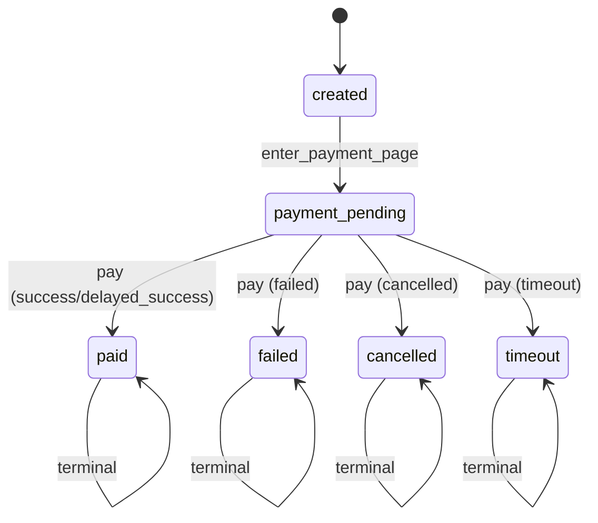
```mermaid
stateDiagram-v2
    [*] --> created
    created --> payment_pending : enter_payment_page
    payment_pending --> paid : pay (success/delayed_success)
    payment_pending --> failed : pay (failed)
    payment_pending --> cancelled : pay (cancelled)
    payment_pending --> timeout : pay (timeout)
    paid --> paid : terminal
    failed --> failed : terminal
    cancelled --> cancelled : terminal
    timeout --> timeout : terminal
```

#### 狀態轉換規則（Preconditions / Postconditions）

- **Transition**: Given 訂單 status=created，when 首次成功載入付款頁，then status=payment_pending 且寫入 OrderStateEvent(trigger=enter_payment_page, actor_type=system)。
- **Transition**: Given 訂單 status=payment_pending，when 使用者在付款頁觸發 pay，then 依 scenario 在 delay_sec 後轉為終態、寫入 completed_at 與 OrderStateEvent(trigger=pay)，並進行 Return dispatch 與（若設定）Webhook 排程。
- **Transition**: Given 訂單為終態，when 嘗試任何狀態改變動作，then 回 400 且不得寫入 OrderStateEvent。

#### 參考：端到端 transition diagrams（節錄）

> 你提供的 transition diagram 內容在此 spec 會被「視為驗收準則」的一部分。完整版本見文末附錄。

- Global App Page State Machine（①）
- Pay Page（⑤）
- Feature: Order State Machine & OrderStateEvent（⑲）
- Feature: Return Dispatch（㉑）
- Feature: Webhook Dispatch（㉒）
- Feature: Webhook Resend（㉓）
- Feature: Replay Run（㉔）

### Failure Modes & Recovery *(mandatory)*

- **Failure mode**: 建單欄位驗證失敗（amount/currency/URL/delay）
  - **Recovery**: 回 400 並回傳可對應欄位的錯誤；不得建立任何 Order/OrderStateEvent/ReturnLog/WebhookLog。
- **Failure mode**: 非法狀態轉換（含終態再轉換、跨狀態跳轉）
  - **Recovery**: 回 400；不得寫入 OrderStateEvent；AuditLog 可記錄拒絕行為（success=false）。
- **Failure mode**: callback_url 導向或 post_form 送出失敗（瀏覽器端或目標不可達）
  - **Recovery**: 訂單終態仍成立；ReturnLog.success=false 並記錄 error_message；使用者可透過 Replay(full_flow) 重新觸發回傳。
- **Failure mode**: Webhook 發送失敗（網路錯誤/非 2xx）
  - **Recovery**: WebhookLog.success=false 記錄 response；提供手動重送與 Replay(webhook_only/full_flow)。
- **Failure mode**: 系統非預期錯誤
  - **Recovery**: 回 5xx 並提供可重試；不得留下部分更新（例如已寫入終態但未寫入事件/Log 的不一致狀態）。

### Security & Permissions *(mandatory)*

- **Authentication**: 所有受保護頁面與 API 都 required；Guest 僅可進 /login。
- **Authorization**:
  - Guest：不可呼叫受保護 API；受保護頁面一律導向 /login。
  - User（Developer）：可建立/查看/操作自己的訂單、重送 webhook、執行 replay；不可進 /admin。
  - Admin：可管理全站資料與系統參數。
- **Sensitive data**:
  - 平台不得收集/保存真實卡號或持卡人資料。
  - Webhook 簽章密鑰屬敏感資訊：不得回傳至一般使用者；UI 顯示 timestamp 與 signature，但不得顯示 secret。
- **Replay protection**: timestamp 提供接收端檢查重放攻擊；平台需在 WebhookLog 中記錄 timestamp 並於 UI 顯示。

### Observability *(mandatory)*

- **Logging**:
  - OrderStateEvent：所有合法狀態轉換。
  - ReturnLog：每次 Return dispatch（含 replay 觸發）。
  - WebhookLog：每次 Webhook 發送/重送（含 replay 觸發）。
  - AuditLog：登入/登出/過期/管理操作/重送/重播等。
- **Tracing**: 每次對外送出（Return/Webhook）應能關聯到 order_no 與（若有）replay_run_id，以利追查。
- **User-facing errors**: 以 400/401/403/404/5xx 提供可理解且可重試的訊息；不得洩漏堆疊或敏感資訊。
- **Developer diagnostics**: 對每次 Webhook 送出記錄 response_status 與 response_body_excerpt（摘要）以利除錯。

### Backward Compatibility & Change Risk *(mandatory)*

- **Breaking change?**: No（新系統）。
- **Migration plan**: 無。
- **Rollback plan**: 若需暫停功能，至少需能停用 Webhook 發送與/或停用建立訂單入口（由管理參數控制）。

### Performance & Scale Assumptions *(mandatory)*

- **Growth assumption**:
  - QA/開發測試用途，預期同時有多位開發者並行建立與付款模擬。
  - 訂單與 log 會累積（AuditLog/WebhookLog/ReturnLog/OrderStateEvent）。
- **Constraints**:
  - 訂單列表每頁 20 筆，翻頁與篩選不應讓使用者等待超過 2 秒（在合理資料量下）。
  - Webhook 發送需非同步，避免阻塞付款完成與回傳流程。

### Key Entities *(include if feature involves data)*

- **User**: 平台使用者（email、role、last_login_at）。
- **Order**: 模擬訂單（order_no、amount、currency、callback_url、return_method、webhook_url、payment_method、scenario、delay/error、status、completed_at）。
- **PaymentMethod**: 可選付款方式（code、display_name、enabled、sort_order）。
- **SimulationScenarioTemplate**: 模擬情境模板預設（type、default_delay_sec、default_error_code/message、enabled）。
- **OrderStateEvent**: 不可變狀態轉換事件（from/to/trigger/actor/meta）。
- **ReturnLog**: Return 回傳紀錄（delivery_method、callback_url、payload、success、error）。
- **WebhookLog**: Webhook 發送紀錄（headers、payload、response、success）。
- **AuditLog**: 稽核紀錄（actor/action/target/result）。
- **ReplayRun**: 重播執行紀錄（scope、started/finished、result_status），並可關聯其產生的 ReturnLog/WebhookLog。

## Success Criteria *(mandatory)*

### Measurable Outcomes

- **SC-001**: 具備可端到端驗證的 P1 流程：使用者可在一次操作中完成「建立訂單 → 付款 → Return 回傳」，並可在訂單詳情看到 status 終態、OrderStateEvent 與 ReturnLog。
- **SC-002**: 支援 5 種模擬結果（success/failed/cancelled/timeout/delayed_success），且每種結果皆可由 QA 以固定步驟穩定重現（至少連續 10 次執行結果一致）。
- **SC-003**: Webhook 模擬具備可驗證簽章資料：每次 Webhook 送出都可在 UI 檢視 timestamp 與 signature，且重送時 timestamp/signature 會變更但業務 payload 不變。
- **SC-004**: 權限與資料隔離可驗證：User（Developer）無法以任一方式存取他人訂單（UI 與 API 均回 403），且 Guest 對受保護 API 一律 401。
- **SC-005**: Replay 能降低復現成本：對同一筆終態訂單執行 Replay 至少 5 次，皆能產生獨立 ReplayRun 與對應 log，且訂單終態不變。
- **SC-006**: 平台在任何流程中不保存真實卡號/持卡人資料（以資料庫欄位與紀錄內容檢查可驗證）。

---

## Appendix: Transition Diagrams (Reference)

> 本附錄收錄使用者提供的 transition diagram（mermaid）。本 spec 的行為定義與驗收測試必須遵循此附錄所述。

### ① Global App Page State Machine

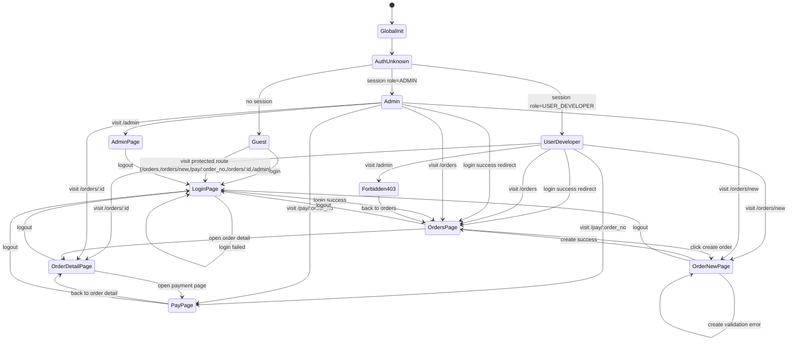
```mermaid
stateDiagram-v2
    [*] --> GlobalInit
    GlobalInit --> AuthUnknown
    AuthUnknown --> Guest : no session
    AuthUnknown --> UserDeveloper : session role=USER_DEVELOPER
    AuthUnknown --> Admin : session role=ADMIN
    Guest --> LoginPage : visit /login
    Guest --> LoginPage : visit protected route (/orders,/orders/new,/pay/:order_no,/orders/:id,/admin)
    UserDeveloper --> OrdersPage : login success redirect
    UserDeveloper --> OrdersPage : visit /orders
    UserDeveloper --> OrderNewPage : visit /orders/new
    UserDeveloper --> PayPage : visit /pay/:order_no
    UserDeveloper --> OrderDetailPage : visit /orders/:id
    UserDeveloper --> Forbidden403 : visit /admin
    Admin --> OrdersPage : login success redirect
    Admin --> OrdersPage : visit /orders
    Admin --> OrderNewPage : visit /orders/new
    Admin --> PayPage : visit /pay/:order_no
    Admin --> OrderDetailPage : visit /orders/:id
    Admin --> AdminPage : visit /admin
    LoginPage --> OrdersPage : login success
    LoginPage --> LoginPage : login failed
    OrdersPage --> OrderNewPage : click create order
    OrdersPage --> OrderDetailPage : open order detail
    OrderNewPage --> OrdersPage : create success
    OrderNewPage --> OrderNewPage : create validation error
    OrderDetailPage --> PayPage : open payment page
    PayPage --> OrderDetailPage : back to order detail
    OrdersPage --> LoginPage : logout
    OrderNewPage --> LoginPage : logout
    OrderDetailPage --> LoginPage : logout
    PayPage --> LoginPage : logout
    AdminPage --> LoginPage : logout
    Forbidden403 --> OrdersPage : back to orders
    state Forbidden403 <<choice>>
```

### ② Login Page

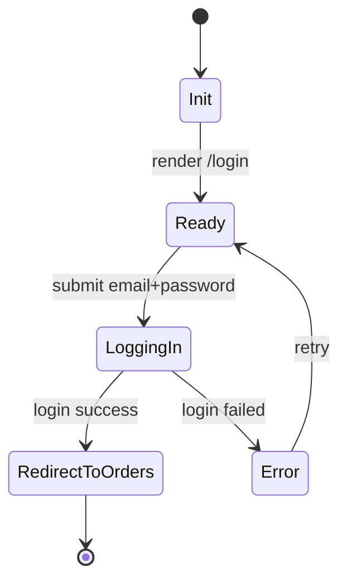
```mermaid
stateDiagram-v2
    [*] --> Init
    Init --> Ready : render /login
    Ready --> LoggingIn : submit email+password
    LoggingIn --> RedirectToOrders : login success
    LoggingIn --> Error : login failed
    Error --> Ready : retry
    RedirectToOrders --> [*]
```

### ③ Orders Page

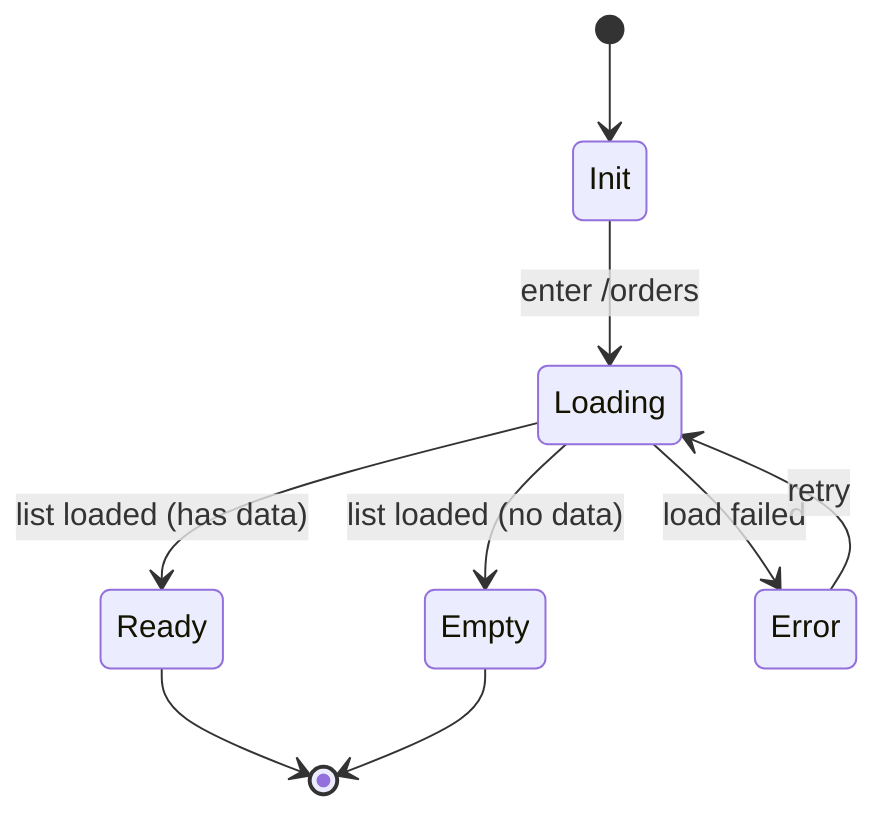
```mermaid
stateDiagram-v2
    [*] --> Init
    Init --> Loading : enter /orders
    Loading --> Ready : list loaded (has data)
    Loading --> Empty : list loaded (no data)
    Loading --> Error : load failed
    Error --> Loading : retry
    Ready --> [*]
    Empty --> [*]
```

### ④ Create Order Page (/orders/new)

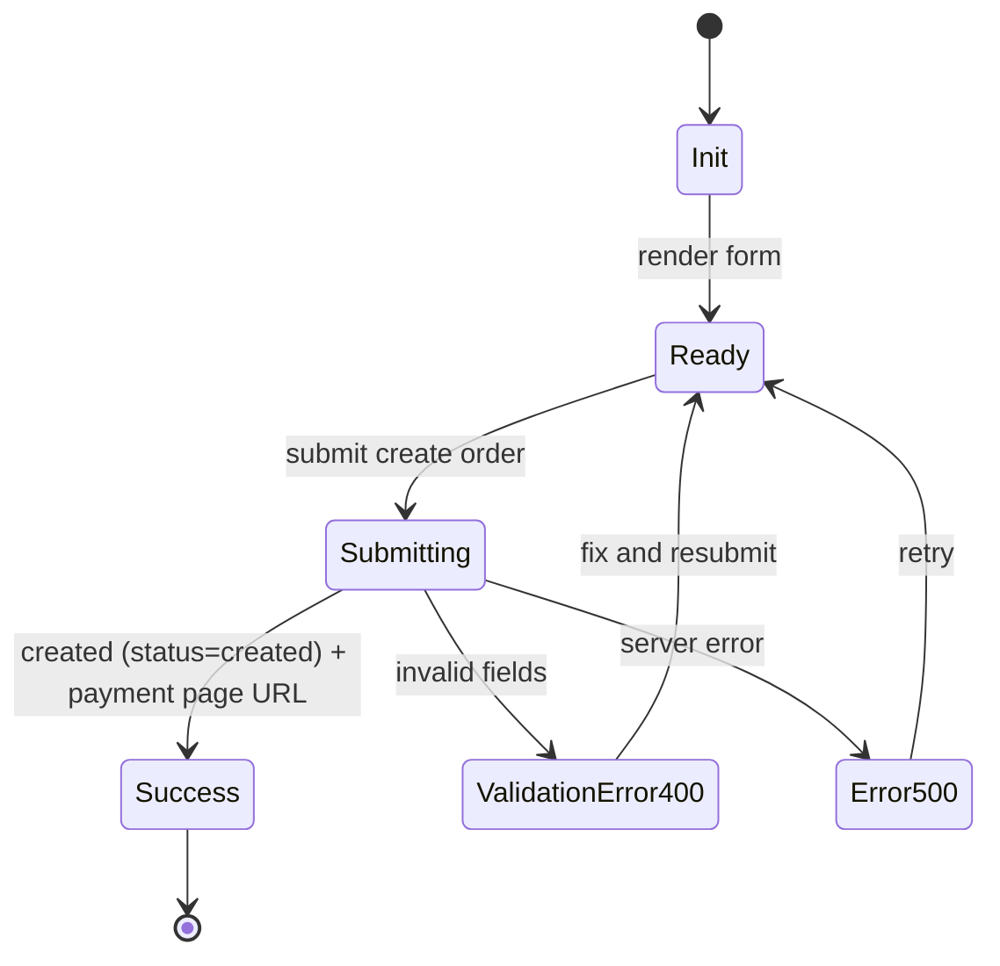
```mermaid
stateDiagram-v2
    [*] --> Init
    Init --> Ready : render form
    Ready --> Submitting : submit create order
    Submitting --> Success : created (status=created) + payment page URL
    Submitting --> ValidationError400 : invalid fields
    Submitting --> Error500 : server error
    ValidationError400 --> Ready : fix and resubmit
    Error500 --> Ready : retry
    Success --> [*]
```

### ⑤ Pay Page (/pay/:order_no)

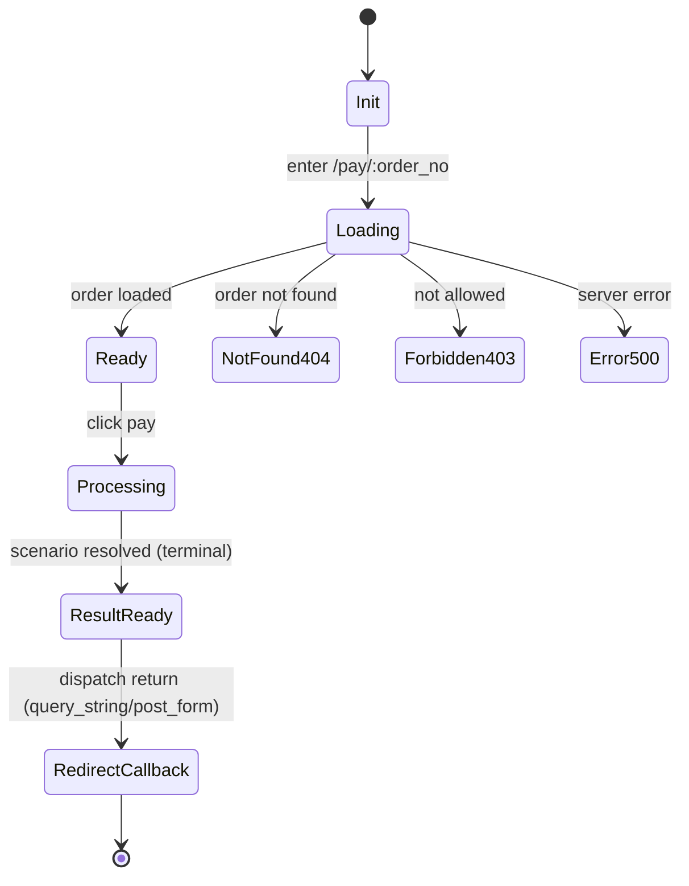
```mermaid
stateDiagram-v2
    [*] --> Init
    Init --> Loading : enter /pay/:order_no
    Loading --> Ready : order loaded
    Loading --> NotFound404 : order not found
    Loading --> Forbidden403 : not allowed
    Loading --> Error500 : server error
    Ready --> Processing : click pay
    Processing --> ResultReady : scenario resolved (terminal)
    ResultReady --> RedirectCallback : dispatch return (query_string/post_form)
    RedirectCallback --> [*]
    state NotFound404 <<choice>>
    state Forbidden403 <<choice>>
```

### ⑥ Order Detail Page (/orders/:id)

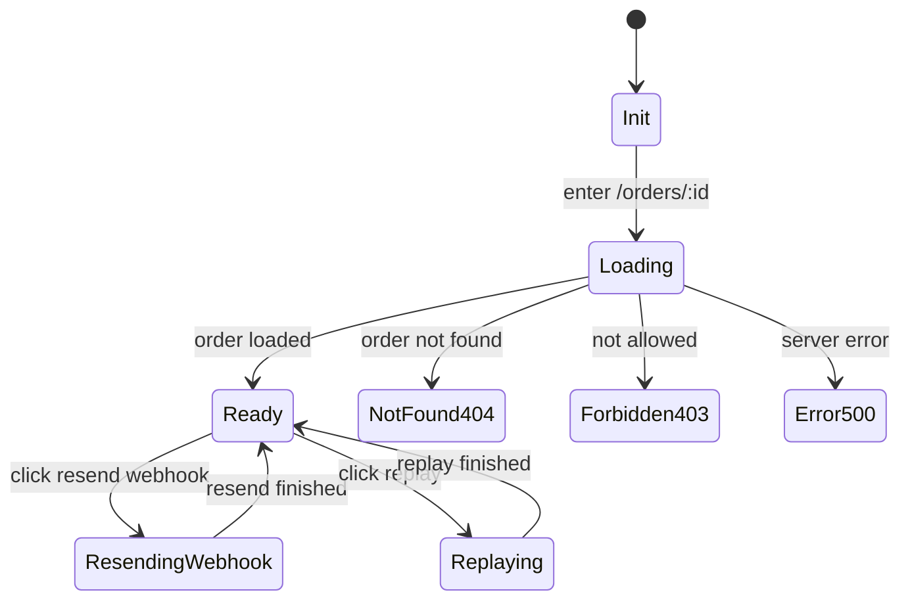
```mermaid
stateDiagram-v2
    [*] --> Init
    Init --> Loading : enter /orders/:id
    Loading --> Ready : order loaded
    Loading --> NotFound404 : order not found
    Loading --> Forbidden403 : not allowed
    Loading --> Error500 : server error
    Ready --> ResendingWebhook : click resend webhook
    ResendingWebhook --> Ready : resend finished
    Ready --> Replaying : click replay
    Replaying --> Ready : replay finished
    state NotFound404 <<choice>>
    state Forbidden403 <<choice>>
```

### ⑦ Admin Page (/admin)

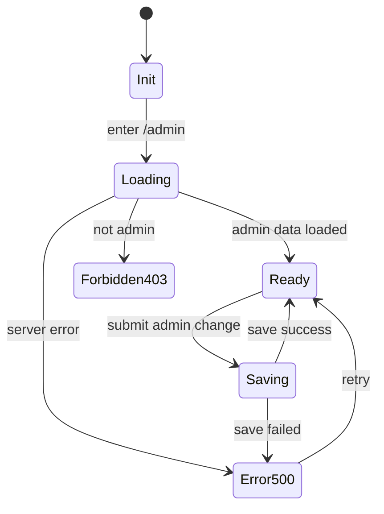
```mermaid
stateDiagram-v2
    [*] --> Init
    Init --> Loading : enter /admin
    Loading --> Ready : admin data loaded
    Loading --> Forbidden403 : not admin
    Loading --> Error500 : server error
    Ready --> Saving : submit admin change
    Saving --> Ready : save success
    Saving --> Error500 : save failed
    Error500 --> Ready : retry
    state Forbidden403 <<choice>>
```

### ⑧ Login Page（Guest 視角）

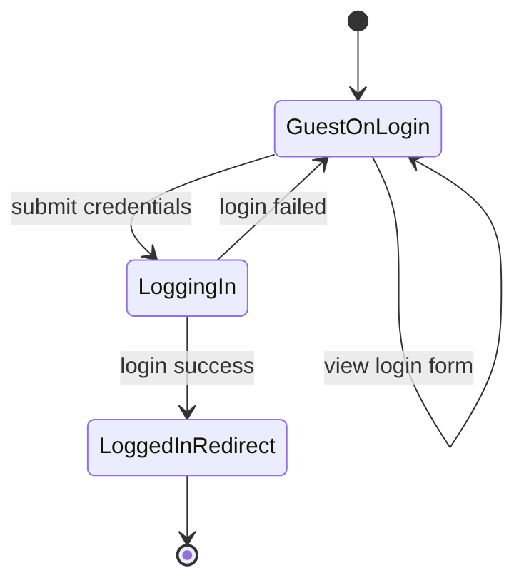
```mermaid
stateDiagram-v2
    [*] --> GuestOnLogin
    GuestOnLogin --> GuestOnLogin : view login form
    GuestOnLogin --> LoggingIn : submit credentials
    LoggingIn --> LoggedInRedirect : login success
    LoggingIn --> GuestOnLogin : login failed
    LoggedInRedirect --> [*]
```

### ⑨ Login Page（已登入 User/Admin 視角）

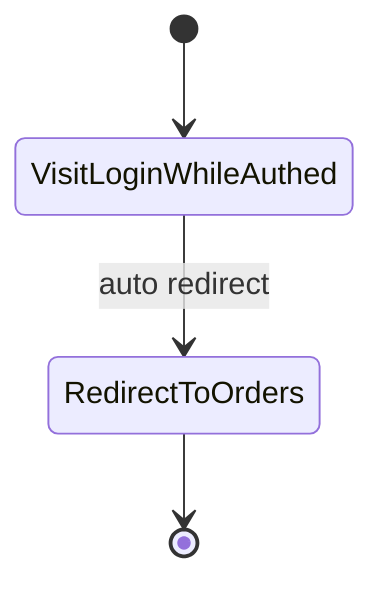
```mermaid
stateDiagram-v2
    [*] --> VisitLoginWhileAuthed
    VisitLoginWhileAuthed --> RedirectToOrders : auto redirect
    RedirectToOrders --> [*]
```

### ⑩ Orders Page（User（Developer） 視角）

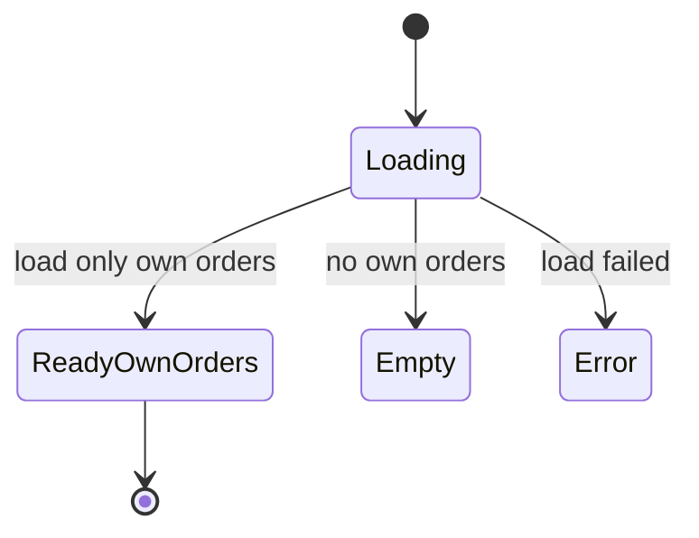
```mermaid
stateDiagram-v2
    [*] --> Loading
    Loading --> ReadyOwnOrders : load only own orders
    Loading --> Empty : no own orders
    Loading --> Error : load failed
    ReadyOwnOrders --> [*]
```

### ⑪ Orders Page（Admin 視角）

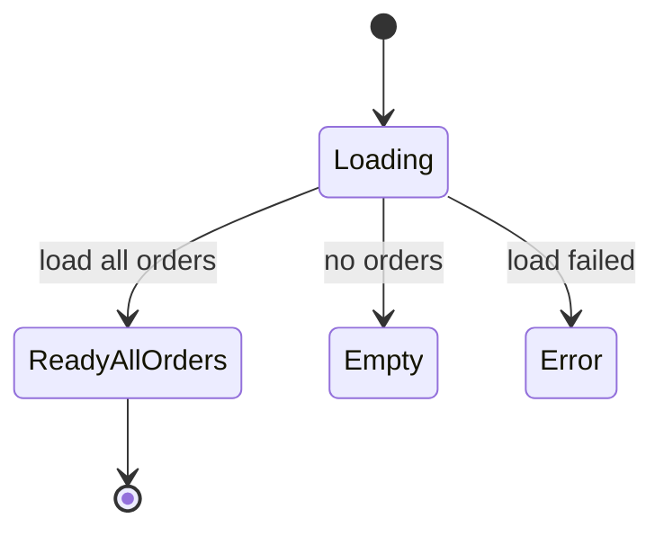
```mermaid
stateDiagram-v2
    [*] --> Loading
    Loading --> ReadyAllOrders : load all orders
    Loading --> Empty : no orders
    Loading --> Error : load failed
    ReadyAllOrders --> [*]
```

### ⑫ Order Detail Page（User（Developer） 視角）

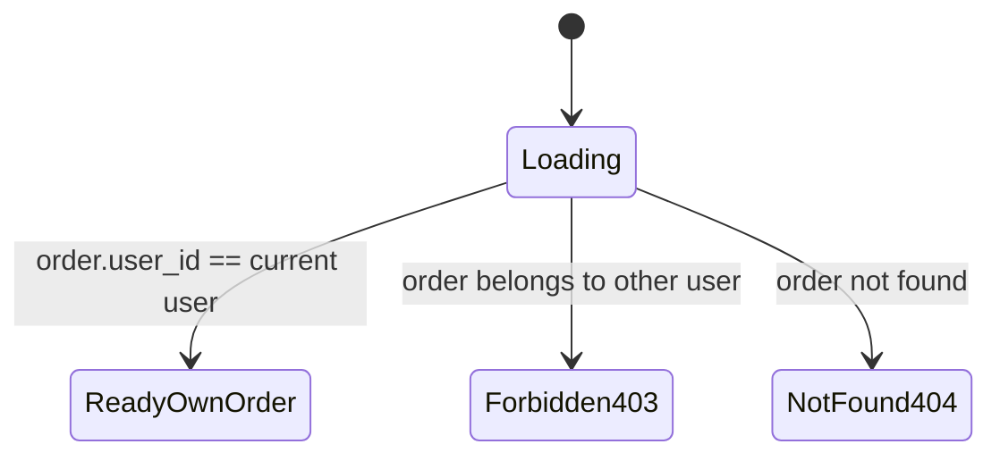
```mermaid
stateDiagram-v2
    [*] --> Loading
    Loading --> ReadyOwnOrder : order.user_id == current user
    Loading --> Forbidden403 : order belongs to other user
    Loading --> NotFound404 : order not found
    state Forbidden403 <<choice>>
    state NotFound404 <<choice>>
```

### ⑬ Order Detail Page（Admin 視角）

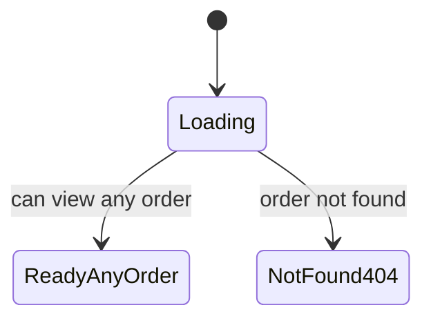
```mermaid
stateDiagram-v2
    [*] --> Loading
    Loading --> ReadyAnyOrder : can view any order
    Loading --> NotFound404 : order not found
    state NotFound404 <<choice>>
```

### ⑭ Admin Page（User（Developer） 視角）

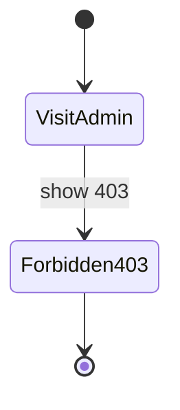
```mermaid
stateDiagram-v2
    [*] --> VisitAdmin
    VisitAdmin --> Forbidden403 : show 403
    Forbidden403 --> [*]
    state Forbidden403 <<choice>>
```

### ⑮ Feature: Global Navigation Rendering

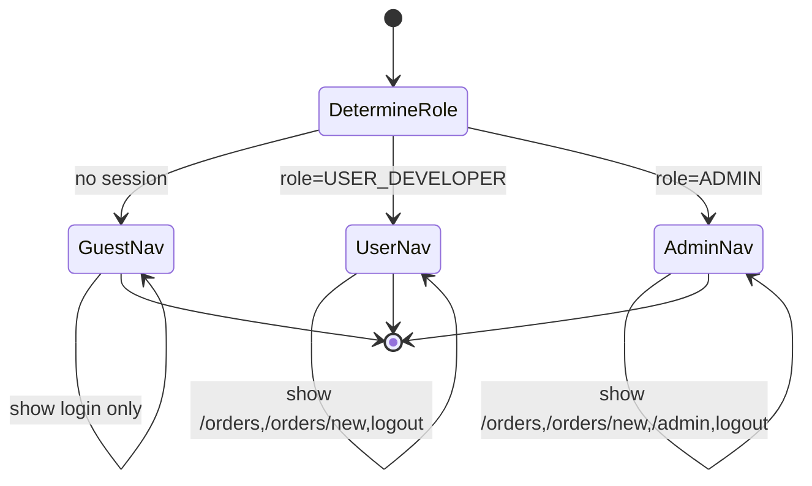
```mermaid
stateDiagram-v2
    [*] --> DetermineRole
    DetermineRole --> GuestNav : no session
    DetermineRole --> UserNav : role=USER_DEVELOPER
    DetermineRole --> AdminNav : role=ADMIN
    GuestNav --> GuestNav : show login only
    UserNav --> UserNav : show /orders,/orders/new,logout
    AdminNav --> AdminNav : show /orders,/orders/new,/admin,logout
    GuestNav --> [*]
    UserNav --> [*]
    AdminNav --> [*]
```

### ⑯ Feature: Authentication (Login/Logout/Session Expiry)

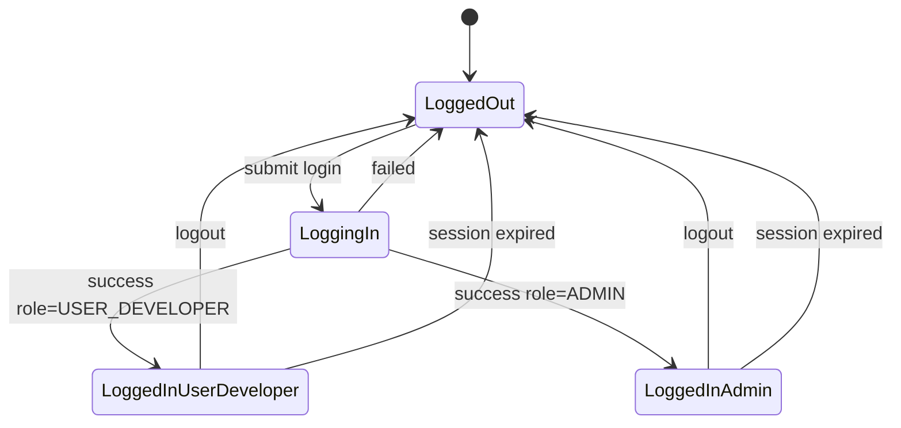
```mermaid
stateDiagram-v2
    [*] --> LoggedOut
    LoggedOut --> LoggingIn : submit login
    LoggingIn --> LoggedInUserDeveloper : success role=USER_DEVELOPER
    LoggingIn --> LoggedInAdmin : success role=ADMIN
    LoggingIn --> LoggedOut : failed
    LoggedInUserDeveloper --> LoggedOut : logout
    LoggedInAdmin --> LoggedOut : logout
    LoggedInUserDeveloper --> LoggedOut : session expired
    LoggedInAdmin --> LoggedOut : session expired
```

### ⑰ Feature: Order Create

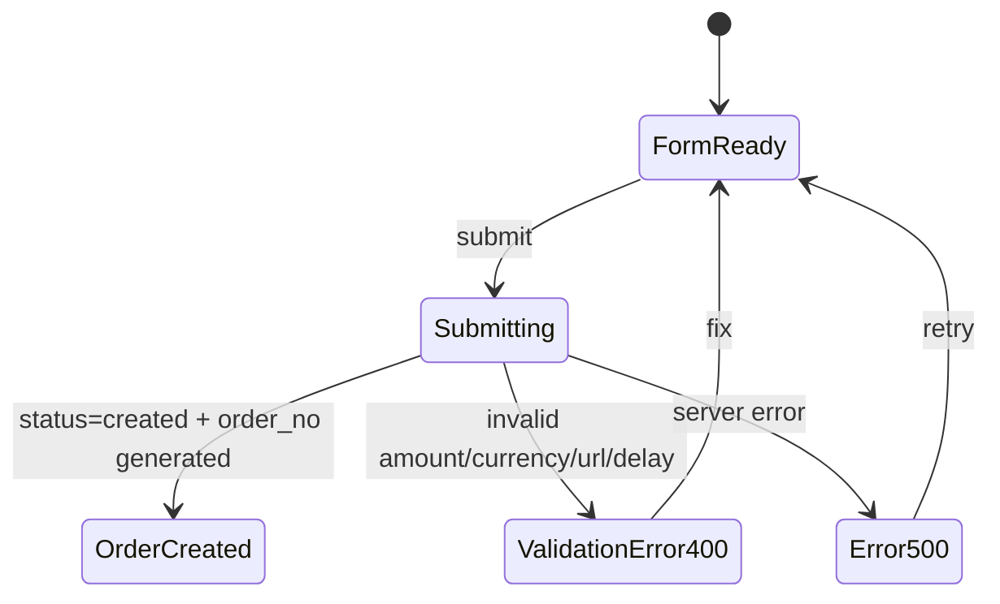
```mermaid
stateDiagram-v2
    [*] --> FormReady
    FormReady --> Submitting : submit
    Submitting --> OrderCreated : status=created + order_no generated
    Submitting --> ValidationError400 : invalid amount/currency/url/delay
    Submitting --> Error500 : server error
    ValidationError400 --> FormReady : fix
    Error500 --> FormReady : retry
```

### ⑱ Feature: Order List Query & Filters

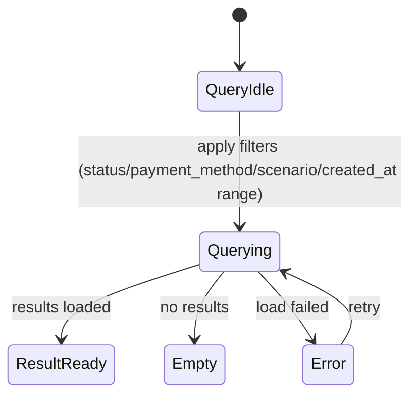
```mermaid
stateDiagram-v2
    [*] --> QueryIdle
    QueryIdle --> Querying : apply filters (status/payment_method/scenario/created_at range)
    Querying --> ResultReady : results loaded
    Querying --> Empty : no results
    Querying --> Error : load failed
    Error --> Querying : retry
```

### ⑲ Feature: Order State Machine & OrderStateEvent

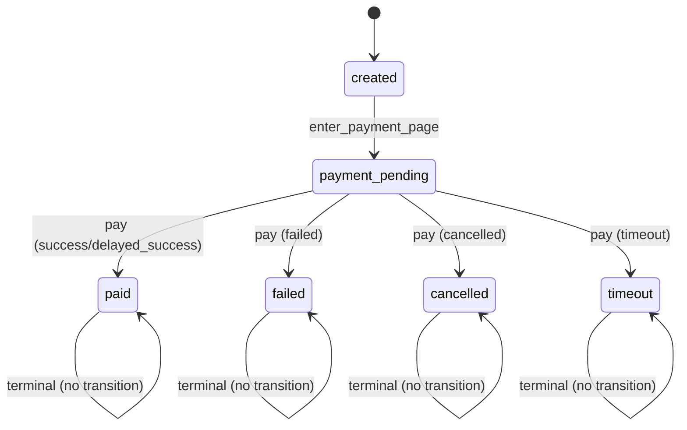
```mermaid
stateDiagram-v2
    [*] --> created
    created --> payment_pending : enter_payment_page
    payment_pending --> paid : pay (success/delayed_success)
    payment_pending --> failed : pay (failed)
    payment_pending --> cancelled : pay (cancelled)
    payment_pending --> timeout : pay (timeout)
    paid --> paid : terminal (no transition)
    failed --> failed : terminal (no transition)
    cancelled --> cancelled : terminal (no transition)
    timeout --> timeout : terminal (no transition)
```

### ⑳ Feature: Payment Simulation (delay_sec & scenario)

```mermaid
stateDiagram-v2
    [*] --> Waiting
    Waiting --> Delaying : start delay_sec countdown
    Delaying --> ResolvePaid : scenario success/delayed_success
    Delaying --> ResolveFailed : scenario failed
    Delaying --> ResolveCancelled : scenario cancelled
    Delaying --> ResolveTimeout : scenario timeout
    ResolvePaid --> [*]
    ResolveFailed --> [*]
    ResolveCancelled --> [*]
    ResolveTimeout --> [*]
```

### ㉑ Feature: Return Dispatch (callback_url)

```mermaid
stateDiagram-v2
    [*] --> BuildPayload
    BuildPayload --> DispatchQueryString : return_method=query_string
    BuildPayload --> DispatchPostForm : return_method=post_form
    DispatchQueryString --> ReturnLogged : ReturnLog written
    DispatchPostForm --> ReturnLogged : ReturnLog written
    ReturnLogged --> [*]
```

### ㉒ Feature: Webhook Dispatch (HMAC) & WebhookLog

```mermaid
stateDiagram-v2
    [*] --> DetermineWebhook
    DetermineWebhook --> Skip : webhook_url empty
    DetermineWebhook --> Schedule : webhook_url present
    Schedule --> Delaying : wait webhook_delay_sec (or delay_sec)
    Delaying --> Sign : compute signature
    Sign --> Send : POST webhook
    Send --> Logged : WebhookLog written (success/fail)
    Skip --> [*]
    Logged --> [*]
```

### ㉓ Feature: Webhook Resend

```mermaid
stateDiagram-v2
    [*] --> ResendRequested
    ResendRequested --> Sign : new timestamp + new signature
    Sign --> Send : POST webhook
    Send --> Logged : new WebhookLog + AuditLog
    Logged --> [*]
```

### ㉔ Feature: Replay Run

```mermaid
stateDiagram-v2
    [*] --> ReplayRequested
    ReplayRequested --> ReplayRunStarted : create ReplayRun
    ReplayRunStarted --> ReplayWebhookOnly : scope=webhook_only
    ReplayRunStarted --> ReplayFullFlow : scope=full_flow
    ReplayWebhookOnly --> WebhookResent : resend webhook
    ReplayFullFlow --> ReturnResent : guide open callback_url + log ReturnLog
    ReturnResent --> WebhookResent : if webhook_url present
    WebhookResent --> ReplayRunFinished : mark ReplayRun finished
    ReplayRunFinished --> [*]
```

### ㉕ Feature: PaymentMethod Management (Admin)

```mermaid
stateDiagram-v2
    [*] --> List
    List --> Editing : add/disable/sort/update display_name
    Editing --> Saved : save success
    Editing --> Error500 : save failed
    Error500 --> Editing : retry
    Saved --> List : back
```

### ㉖ Feature: SimulationScenarioTemplate Management (Admin)

```mermaid
stateDiagram-v2
    [*] --> List
    List --> Editing : create/update template defaults
    Editing --> Saved : save success
    Editing --> Error500 : save failed
    Error500 --> Editing : retry
    Saved --> List : back
```

### ㉗ Feature: AuditLog Recording

```mermaid
stateDiagram-v2
    [*] --> ActionHappened
    ActionHappened --> AuditWritten : write AuditLog
    AuditWritten --> [*]
```

### ㉘ 全站錯誤與權限

```mermaid
stateDiagram-v2
    [*] --> AnyRequest
    AnyRequest --> Unauthorized401 : protected API without session
    AnyRequest --> Forbidden403 : role not allowed / cross-user order access
    AnyRequest --> NotFound404 : order/payment method/template not found
    AnyRequest --> BadRequest400 : validation error / illegal state transition
    AnyRequest --> ServerError5xx : unexpected error
    Unauthorized401 --> LoginPage : route guard redirect
    Forbidden403 --> StayOnPage : show 403
    NotFound404 --> StayOnPage : show 404
    BadRequest400 --> StayOnPage : show inline validation error
    ServerError5xx --> StayOnPage : show error + retry
    state Unauthorized401 <<choice>>
    state Forbidden403 <<choice>>
    state NotFound404 <<choice>>
    state BadRequest400 <<choice>>
    state ServerError5xx <<choice>>
```
