# Feature Specification: 社團活動管理平台（Activity Management Platform）

**Feature Branch**: `001-activity-management-platform`  
**Created**: 2026-02-19  
**Status**: Draft  
**Input**: 使用者需求（整理後）：同一系統內完成找活動/看詳情/報名取消/我的活動，以及後台活動管理與名單匯出；高併發下名額一致性與防重複提交。

## User Scenarios & Testing *(mandatory)*

### User Story 1 - 瀏覽公開活動與查看詳情（Priority: P1）

作為 **訪客（Guest）或已登入使用者**，我希望能在活動列表看到公開活動並查看活動詳情，確保我能快速理解活動時間、地點、名額與目前狀態。

**Why this priority**: 這是所有角色進入系統的核心入口，也是後續報名與管理的前置基礎。

**Independent Test**: 以未登入狀態進入 `/activities` → 點選一筆活動 → 看到詳情；清單與詳情只包含公開狀態活動。

**Acceptance Scenarios**:

1. **Given** 我是 Guest，**When** 我進入活動列表，**Then** 我只能看到 `published` 或 `full` 的活動，且導覽列只顯示「活動列表、登入/註冊」。
2. **Given** 我是 Guest，**When** 我進入活動詳情，**Then** 我能看到完整活動資訊與「登入後可報名」提示，但不會看到可直接完成報名的可用 CTA。

---

### User Story 2 - 會員身分取得與報名/取消/我的活動（Priority: P2）

作為 **一般使用者（Member）**，我希望能註冊/登入後報名公開活動、在截止前取消報名，並在「我的活動」看到我已報名的活動；在高併發情境下也不會超賣或產生重複報名。

**Why this priority**: 這是平台的主要價值，直接影響使用者是否能完成「參與活動」的目標。

**Independent Test**: 建立一筆公開活動（可先以系統預置資料提供），以 Member 登入後完成「報名 → 查看我的活動 → 取消」全流程；同時對同活動重複送出報名請求不會產生多筆有效報名。

**Acceptance Scenarios**:

1. **Given** 我是 Guest 並嘗試報名，**When** 系統要求登入，**Then** 我會被導向 `/auth` 並保留 `returnTo`，登入成功後返回原本目標活動。
2. **Given** 我是 Member 且活動可報名，**When** 我報名成功，**Then** UI 顯示「已報名」，名額與狀態同步更新，且同一活動最多只有一筆有效報名。
3. **Given** 我是 Member 且已報名，**When** 我在截止前取消報名，**Then** 名額立即釋放並同步更新；已取消活動不再出現在「我的活動」。

---

### User Story 3 - 管理後台活動管理與名單匯出（Priority: P3）

作為 **管理員（Admin）**，我希望能在管理後台建立/編輯活動、發佈/關閉/下架活動、查看報名名單並匯出 CSV，以便掌握即時報名狀況並完成行政流程。

**Why this priority**: 沒有後台就無法有效管理活動與名額，且名單匯出是社團實務需求。

**Independent Test**: 以 Admin 登入後完成「建立 draft → 編輯欄位 → 發佈 → 查看名單 → 匯出 CSV → 關閉/下架」流程，且權限控管正確。

**Acceptance Scenarios**:

1. **Given** 我是 Admin，**When** 我建立活動，**Then** 活動以 `draft` 狀態存在且僅在管理後台可見。
2. **Given** 我是 Admin，**When** 我將活動由 `draft` 發佈，**Then** 該活動會出現在公開列表（`published` 或 `full`）。
3. **Given** 我是 Admin，**When** 我匯出某活動名單，**Then** 我會得到包含姓名、Email、報名時間的 CSV，且匯出行為被系統記錄為重要操作。

---

### Edge Cases

- 高併發報名：同一瞬間大量報名嘗試時，最終有效報名數 MUST 不超過名額上限，且不會出現同一使用者重複有效報名。
- 重複提交/重試：網路失敗後重送「報名/取消/匯出」請求，不會造成重複副作用（例如多筆報名或多次扣名額）。
- UI 與後端狀態短暫不一致：例如 UI 顯示可報名但後端已額滿時，必須以後端判定為準並顯示原因。
- 活動不可見：對 Guest/Member 而言，`draft/closed/archived` MUST 視為不存在（等同「找不到」的使用者體驗）。
- 時區/截止邊界：接近 deadline 時操作，系統判定規則一致且可預期。
- 取消與額滿回復：活動由 `full` 因取消而釋放名額後，在符合條件時可回到 `published`。

## Requirements *(mandatory)*

### Functional Requirements

以下各項 FR 的驗收，應以本文件的「User Stories / Acceptance Scenarios」與「參考：狀態機轉移圖」中的 verify 說明為準。

#### 認證與授權

- **FR-001**: 系統 MUST 提供 Email + 密碼的註冊與登入。
- **FR-002**: 註冊流程 MUST 只能建立 `Member`；`Admin` MUST 由系統預先建立/指派，使用者不可自行註冊成 Admin。
- **FR-003**: 系統 MUST 在每次受保護操作前驗證登入狀態；未登入時 MUST 阻擋受保護資源並引導至身分取得頁。
- **FR-004**: 系統 MUST 實作角色授權：`/admin/*` 僅 `Admin` 可進入；非 Admin 進入時 MUST 阻擋並導回公開頁。
- **FR-005**: 系統 MUST 支援登出；登出後使用者回到 Guest 視角且受保護操作需再次登入。
- **FR-006**: 系統 MUST 支援 `returnTo`：使用者被導向登入/註冊後，成功取得身分 MUST 返回原目標頁並保留操作上下文（例如原本想操作的活動）。

#### 活動（Activity）與可見性

- **FR-007**: 活動 MUST 具備欄位：title、description、date、location、deadline、capacity、status。
- **FR-008**: 系統 MUST 驗證：`date` 晚於 `deadline`，且 `capacity` 為正整數。
- **FR-009**: 活動狀態 MUST 為：`draft | published | full | closed | archived`。
- **FR-010**: 公開活動列表/詳情（Guest/Member/Admin 公開視角）MUST 只顯示：`published`、`full`。
- **FR-011**: `draft/closed/archived` MUST 只允許 `Admin` 在管理後台檢視；對 Guest/Member MUST 視為不存在。

#### 活動狀態機（State Machine）

- **FR-012**: `Admin` MUST 能將 `published/full → closed`。
- **FR-013**: `Admin` MUST 能將 `closed/draft → archived`。
- **FR-014**: 系統 MUST 自動在報名人數達 `capacity` 時將 `published → full`。
- **FR-015**: 系統 MUST 在取消後若已報名人數小於 `capacity` 且仍符合可報名條件時，將 `full → published`。
- **FR-016**: `archived` 活動 MUST 不對外顯示且不可報名/取消。

#### 報名（Registration）

- **FR-017**: 同一使用者對同一活動 MUST 只能有一筆「有效報名」（未取消）。
- **FR-018**: 取消後可再次報名 MUST 被允許（前提是活動仍符合可報名條件）。
- **FR-019**: 僅 `status=published` 且未過 deadline 且未額滿的活動 MUST 允許報名。
- **FR-020**: deadline 之後 MUST 不可報名；同時 deadline 之後若規則禁止，MUST 不可取消並顯示原因。
- **FR-021**: 活動「已結束」時（以活動開始時間為界）MUST 不可取消；需顯示原因。

#### 一致性與防重複（高併發核心）

- **FR-022**: 系統 MUST 在高併發報名下維持名額一致性：不得超賣（有效報名數不得超過 capacity）。
- **FR-023**: 系統 MUST 防止重複提交造成重複副作用：同一操作被重送（例如網路重試、使用者連點）時，不得產生多筆有效報名或重複扣/加名額。
- **FR-024**: 前端 MUST 在送出報名/取消/匯出等重要操作時呈現 loading 並避免重複觸發；失敗時 MUST 顯示可理解原因並允許重試。

#### 主要頁面與導覽（資訊架構）

- **FR-025**: 系統 MUST 提供頁面（含路由）：
  - 活動列表：`/activities`
  - 活動詳情：`/activities/:activityId`
  - 身分取得：`/auth`
  - 我的活動：`/my-activities`
  - 管理活動列表：`/admin/activities`
  - 管理活動編輯：`/admin/activities/new`、`/admin/activities/:activityId/edit`
  - 活動報名名單：`/admin/activities/:activityId/registrations`
- **FR-026**: Header/導覽列可見性 MUST 遵守：
  - Guest：顯示「活動列表、登入/註冊」，隱藏「我的活動、管理後台、登出」。
  - Member：顯示「活動列表、我的活動、登出」，隱藏「登入/註冊、管理後台」。
  - Admin：顯示「活動列表、我的活動、管理後台、登出」，隱藏「登入/註冊」。
- **FR-027**: CTA 去重 MUST 遵守：同頁面不得重複出現同一動作入口（例如登出只在 Header 出現一次）。

#### 管理後台能力

- **FR-028**: `Admin` MUST 能建立/編輯活動（至少包含：title/description/date/location/deadline/capacity）。
- **FR-029**: `Admin` MUST 能查看某活動報名名單，欄位包含：姓名、Email、報名時間。
- **FR-030**: `Admin` MUST 能匯出報名名單為 CSV。

#### 重要操作紀錄（稽核）

- **FR-031**: 系統 MUST 記錄重要操作（至少）：活動建立/修改/狀態變更/匯出、報名/取消。
- **FR-032**: 每筆記錄 MUST 包含操作者（若可得）、時間、目標資源與動作類型。

### Assumptions & Dependencies

- 使用者均以 Email 作為唯一登入識別。
- 活動「已結束」判定以活動開始時間為界（與需求文字一致），且該判定對所有使用者一致。
- CSV 匯出內容以規格要求的欄位為準；若未提供某欄位資料，需以空值或可理解方式呈現。

### Out of Scope

- 不包含付款/收費、票券、候補名單（waitlist）、多場次/系列活動、活動留言/討論等延伸功能。
- 不包含第三方登入（例如社群登入）。

### Non-Functional Requirements *(mandatory)*

- **NFR-UX-001**: 全站 MUST 提供一致的 Loading / Error / Empty 狀態，且錯誤訊息可理解並可重試（若適用）。
- **NFR-UX-002**: 全站 MUST 支援 RWD（桌機與手機）。
- **NFR-UX-003**: 可達性（accessibility）MUST 達到最低可用：可鍵盤操作、焦點可預期、文字可讀。
- **NFR-PERF-001**: 系統 MUST 明確宣告並驗證效能目標：
  - 公開活動列表載入：在一般網路環境下，多數使用者可於 2 秒內看到清單內容（可用載入骨架/指示）。
  - 報名/取消操作：在非故障情境下，多數操作可於 2 秒內完成回饋；失敗可重試且不產生重複副作用。
- **NFR-PERF-002**: 高併發一致性 MUST 可驗證：在壓力情境下不得超賣，且同一使用者不得出現重複有效報名。
- **NFR-SEC-001**: 密碼 MUST 以業界標準方式安全儲存（不得以可逆方式存放）。
- **NFR-DATA-001**: 系統時間 MUST 以單一基準時區運作；資料儲存與呈現的時區規則需一致且可對外說明。

### Key Entities *(include if feature involves data)*

- **User**：使用者帳號與身分（包含 Email、姓名與互斥角色：Member 或 Admin）。
- **Activity**：活動（標題、描述、時間、地點、截止時間、名額、狀態、目前有效報名數）。
- **Registration**：報名紀錄（關聯 User 與 Activity；可取消；取消後不視為有效報名）。
- **Idempotency Record**：用於辨識重送請求的紀錄（確保同一操作重送不產生重複副作用）。
- **Audit Log**：重要操作稽核（操作者、時間、動作、目標資源、必要的摘要）。

## Success Criteria *(mandatory)*

### Measurable Outcomes

- **SC-001**: 90% 的使用者可在 3 分鐘內完成「登入/註冊 → 找到活動 → 查看詳情 →（可報名時）完成報名」。
- **SC-002**: 在同一活動名額緊繃的情境下，1,000 次併發報名嘗試後，最終有效報名數不超過名額上限，且超賣事件為 0。
- **SC-003**: 在同一使用者對同一活動重複送出報名/取消請求（含重試）時，重複有效報名事件為 0，且名額計數保持正確。
- **SC-004**: 管理員可在 5 分鐘內完成「建立活動 → 發佈 → 下載 CSV 名單」流程。

---

## 參考：狀態機轉移圖（需求來源，必須遵守）

以下為需求提供的 transition diagram。此段落為規格參考來源，規劃與實作 MUST 遵守其角色/頁面/功能狀態的層級與轉移約束。

全體結構說明

```text
[Entry State]
    ↓
[Page State Machine]
    ↓
[Role-specific Page State]
    ↓
[Feature / Function State Machine]
    ↓
[可能回到 Page 或跳轉其他 Page]
```

### ① Entry State Machine

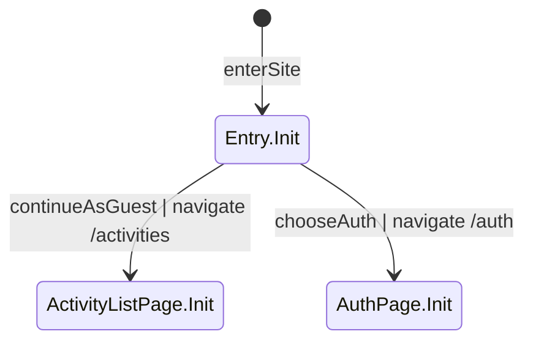
```mermaid
stateDiagram-v2
  %% role: none
  [*] --> Entry.Init : enterSite
  %% verify: UI 顯示公開入口（可繼續以 Guest 瀏覽、或前往登入/註冊）；導覽列不出現「我的活動/管理後台/登出」

  Entry.Init --> ActivityListPage.Init : continueAsGuest | navigate /activities
  %% verify: UI 導向活動列表；系統取得活動清單僅回傳公開狀態（published/full），且不要求先取得身分

  Entry.Init --> AuthPage.Init : chooseAuth | navigate /auth
  %% verify: UI 導向身分取得頁；若帶 returnTo 參數需保留，供成功後返回目標頁
```

### ② ActivityListPage Page（/activities）

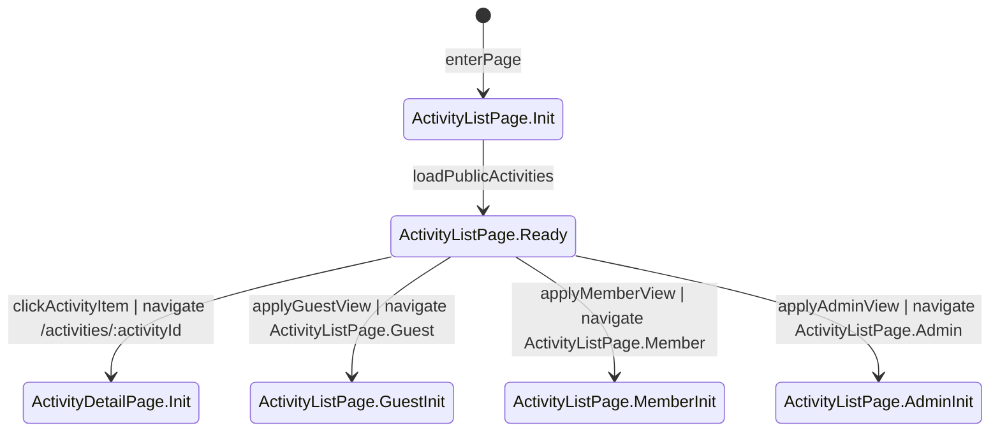
```mermaid
stateDiagram-v2
  %% role: none
  %% base: ActivityListPage
  [*] --> ActivityListPage.Init : enterPage
  %% verify: UI 進入活動列表頁；頁面顯示 loading 狀態直到清單回應

  ActivityListPage.Init --> ActivityListPage.Ready : loadPublicActivities
  %% verify: 系統回傳活動清單僅包含 status=published/full；UI 顯示每筆活動名稱/日期/地點/已報名人數/名額上限

  ActivityListPage.Ready --> ActivityDetailPage.Init : clickActivityItem | navigate /activities/:activityId
  %% verify: UI 導向活動詳情頁並帶入 activityId；導覽列維持與當前身分一致（Guest 不顯示我的活動/管理後台）

  ActivityListPage.Ready --> ActivityListPage.GuestInit : applyGuestView | navigate ActivityListPage.Guest
  %% verify: UI 以 Guest 視角渲染導覽；Header 只顯示「活動列表、登入/註冊」，不出現「我的活動/管理後台/登出」

  ActivityListPage.Ready --> ActivityListPage.MemberInit : applyMemberView | navigate ActivityListPage.Member
  %% verify: UI 以 Member 視角渲染差異操作（顯示報名/取消相關入口）；Header 顯示「我的活動、登出」，不顯示「登入/註冊」

  ActivityListPage.Ready --> ActivityListPage.AdminInit : applyAdminView | navigate ActivityListPage.Admin
  %% verify: UI 以 Admin 視角渲染導覽；Header 顯示「我的活動、管理後台、登出」且不顯示「登入/註冊」
```

### ③ ActivityListPage.Guest（Guest 視角）

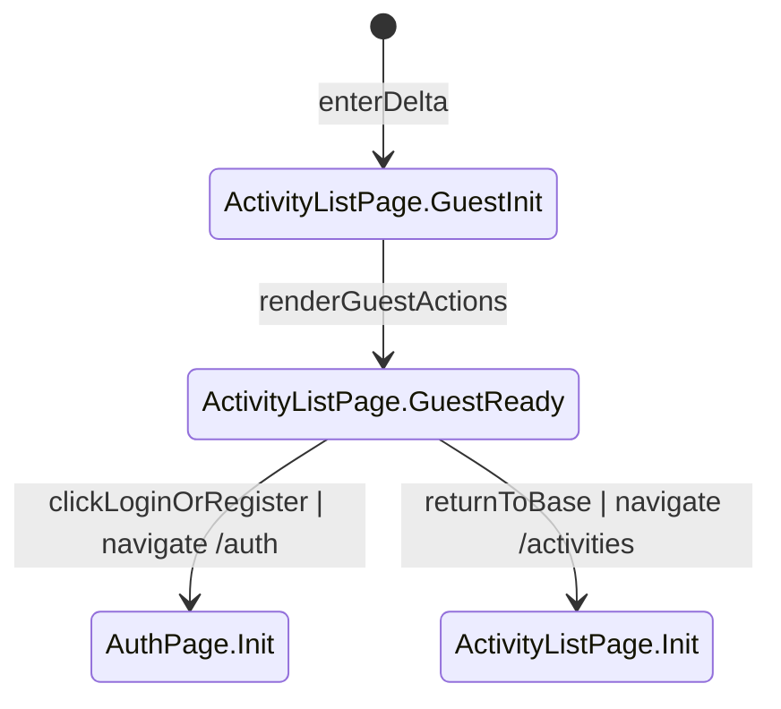
```mermaid
stateDiagram-v2
  %% role: Guest
  %% extends: ActivityListPage
  [*] --> ActivityListPage.GuestInit : enterDelta
  %% verify: UI 進入 Guest 差異視角；不得出現「我的活動/管理後台/登出」入口

  ActivityListPage.GuestInit --> ActivityListPage.GuestReady : renderGuestActions
  %% verify: UI 顯示登入/註冊入口；清單項目不提供可完成報名/取消的 CTA

  ActivityListPage.GuestReady --> AuthPage.Init : clickLoginOrRegister | navigate /auth
  %% verify: UI 導向 /auth 並保留 returnTo=/activities；成功登入後需回到活動列表

  ActivityListPage.GuestReady --> ActivityListPage.Init : returnToBase | navigate /activities
  %% verify: UI 返回 base 入口；仍維持 Guest Header 規則
```

### ④ ActivityListPage.Member（Member 視角）

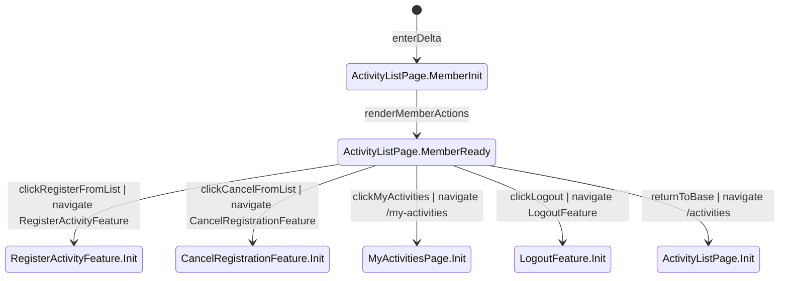
```mermaid
stateDiagram-v2
  %% role: Member
  %% extends: ActivityListPage
  [*] --> ActivityListPage.MemberInit : enterDelta
  %% verify: UI 進入 Member 差異視角；同一清單項目可顯示「可報名/已報名/額滿」狀態

  ActivityListPage.MemberInit --> ActivityListPage.MemberReady : renderMemberActions
  %% verify: UI 顯示 Member 可用操作；對每個活動正確顯示報名狀態（已報名/未報名）與是否額滿

  ActivityListPage.MemberReady --> RegisterActivityFeature.Init : clickRegisterFromList | navigate RegisterActivityFeature
  %% verify: UI 將「報名」按鈕設為 loading/disabled；送出請求必須具備防重複的等效機制（避免連點/重試造成重複副作用）

  ActivityListPage.MemberReady --> CancelRegistrationFeature.Init : clickCancelFromList | navigate CancelRegistrationFeature
  %% verify: UI 將「取消報名」按鈕設為 loading/disabled；取消成功後名額與狀態需同步更新

  ActivityListPage.MemberReady --> MyActivitiesPage.Init : clickMyActivities | navigate /my-activities
  %% verify: UI 導向我的活動；系統僅回傳本使用者已報名且未取消的活動

  ActivityListPage.MemberReady --> LogoutFeature.Init : clickLogout | navigate LogoutFeature
  %% verify: UI 呼叫登出；成功後回到 Guest 視角且 Header 不再顯示「我的活動/登出」

  ActivityListPage.MemberReady --> ActivityListPage.Init : returnToBase | navigate /activities
  %% verify: UI 返回 base 圖入口；清單仍可正常顯示，且 Member 身分下 Header/導覽仍維持 Member 可見規則
```

### ⑤ ActivityListPage.Admin（Admin 視角）

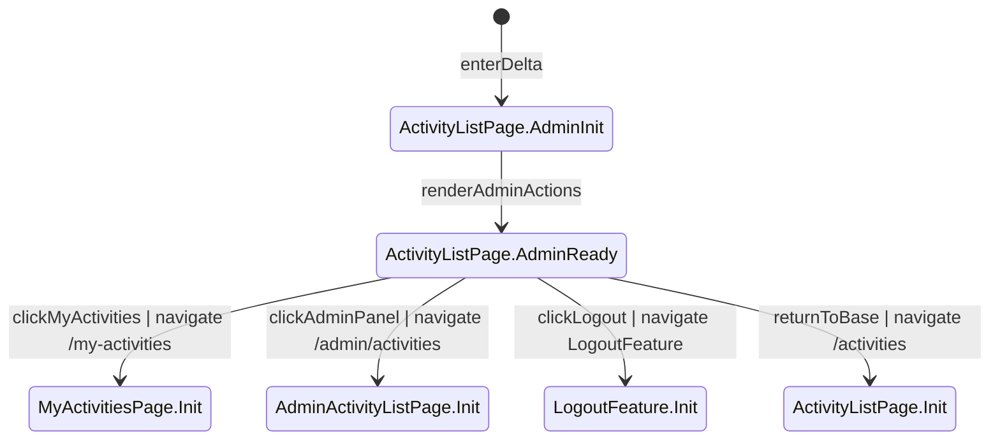
```mermaid
stateDiagram-v2
  %% role: Admin
  %% extends: ActivityListPage
  [*] --> ActivityListPage.AdminInit : enterDelta
  %% verify: UI 進入 Admin 差異視角；Header 顯示管理後台入口且不顯示登入/註冊

  ActivityListPage.AdminInit --> ActivityListPage.AdminReady : renderAdminActions
  %% verify: UI 顯示「我的活動/管理後台/登出」入口；不顯示第二個重複登出入口

  ActivityListPage.AdminReady --> MyActivitiesPage.Init : clickMyActivities | navigate /my-activities
  %% verify: UI 導向我的活動；Header 仍維持 Admin 規則

  ActivityListPage.AdminReady --> AdminActivityListPage.Init : clickAdminPanel | navigate /admin/activities
  %% verify: 存取控制檢查通過（Admin）；管理列表可載入所有狀態活動（draft/published/full/closed/archived）

  ActivityListPage.AdminReady --> LogoutFeature.Init : clickLogout | navigate LogoutFeature
  %% verify: 登出後回到 Guest 視角；Header 不再顯示管理後台入口

  ActivityListPage.AdminReady --> ActivityListPage.Init : returnToBase | navigate /activities
  %% verify: UI 返回 base 入口；仍維持 Admin Header 規則
```

### ⑥ ActivityDetailPage Page（/activities/:activityId）

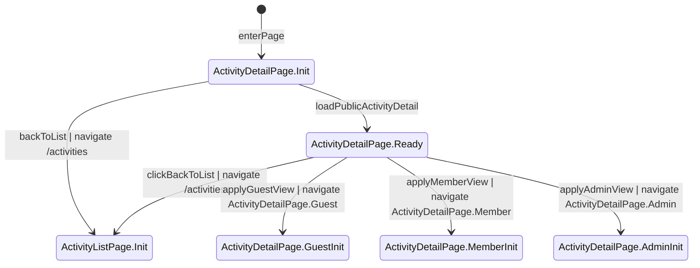
```mermaid
stateDiagram-v2
  %% role: none
  %% base: ActivityDetailPage
  [*] --> ActivityDetailPage.Init : enterPage
  %% verify: UI 進入活動詳情頁；在資料回來前顯示 loading

  ActivityDetailPage.Init --> ActivityDetailPage.Ready : loadPublicActivityDetail
  %% verify: 若活動存在且為公開狀態：系統回傳 title/description/date/location/deadline/capacity/registered_count/status；UI 顯示完整資訊

  ActivityDetailPage.Init --> ActivityListPage.Init : backToList | navigate /activities
  %% verify: 當 activityId 不存在或不可見：UI 顯示不存在提示並提供回列表操作，導向 /activities

  ActivityDetailPage.Ready --> ActivityListPage.Init : clickBackToList | navigate /activities
  %% verify: UI 返回活動列表；列表仍只顯示 published/full

  ActivityDetailPage.Ready --> ActivityDetailPage.GuestInit : applyGuestView | navigate ActivityDetailPage.Guest
  %% verify: UI 以 Guest 視角渲染；不得顯示可完成報名/取消的 CTA；顯示登入提示

  ActivityDetailPage.Ready --> ActivityDetailPage.MemberInit : applyMemberView | navigate ActivityDetailPage.Member
  %% verify: UI 切換為 Member 視角；根據「是否已報名/是否額滿/是否已截止/是否已結束」顯示報名或取消入口或提示

  ActivityDetailPage.Ready --> ActivityDetailPage.AdminInit : applyAdminView | navigate ActivityDetailPage.Admin
  %% verify: UI 以 Admin 視角渲染 Header；顯示管理後台入口與登出，不顯示登入/註冊
```

### ⑦ ActivityDetailPage.Guest（Guest 視角）

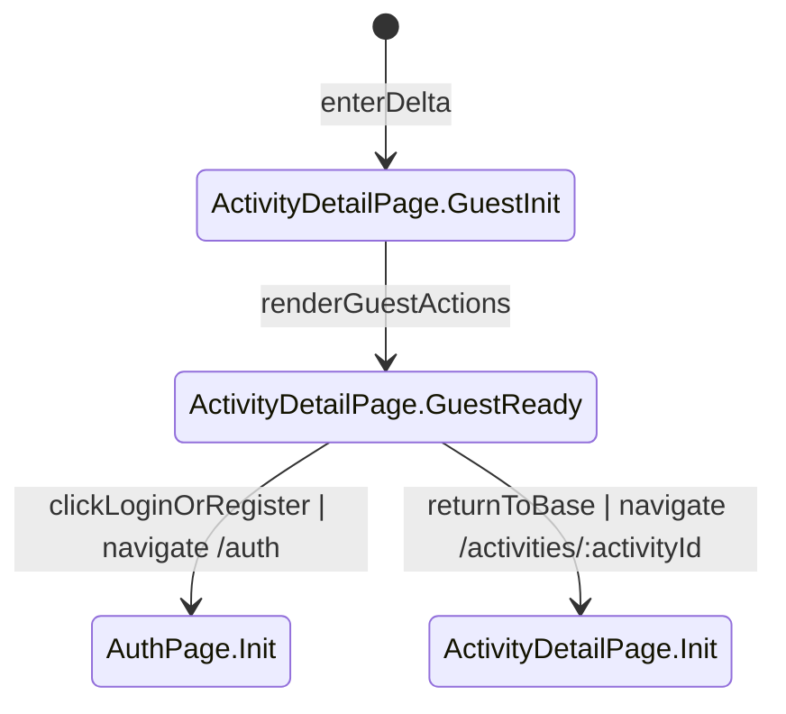
```mermaid
stateDiagram-v2
  %% role: Guest
  %% extends: ActivityDetailPage
  [*] --> ActivityDetailPage.GuestInit : enterDelta
  %% verify: UI 進入 Guest 差異視角；不得出現「取消報名/我的活動/管理後台/登出」入口

  ActivityDetailPage.GuestInit --> ActivityDetailPage.GuestReady : renderGuestActions
  %% verify: UI 顯示「登入後可報名」提示；報名按鈕若存在必須不可用且引導登入

  ActivityDetailPage.GuestReady --> AuthPage.Init : clickLoginOrRegister | navigate /auth
  %% verify: UI 導向 /auth 並保留 returnTo=/activities/:activityId；成功登入後回到同一活動詳情

  ActivityDetailPage.GuestReady --> ActivityDetailPage.Init : returnToBase | navigate /activities/:activityId
  %% verify: UI 返回 base 入口並可重新載入詳情；仍維持 Guest Header 規則
```

### ⑧ ActivityDetailPage.Member（Member 視角）

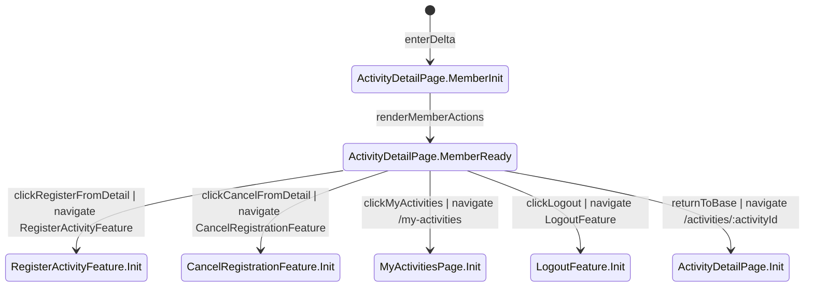
```mermaid
stateDiagram-v2
  %% role: Member
  %% extends: ActivityDetailPage
  [*] --> ActivityDetailPage.MemberInit : enterDelta
  %% verify: UI 進入 Member 差異視角；若已報名則顯示「取消報名」，若未報名且可報名則顯示「報名」

  ActivityDetailPage.MemberInit --> ActivityDetailPage.MemberReady : renderMemberActions
  %% verify: UI 同步顯示 registered_count/capacity 與 status；若 status=full 且未報名則顯示額滿提示並禁止報名

  ActivityDetailPage.MemberReady --> RegisterActivityFeature.Init : clickRegisterFromDetail | navigate RegisterActivityFeature
  %% verify: 送出報名時按鈕 disabled 且顯示 loading；若重送請求不得產生重複報名（同一 user+activity 最多一筆有效報名）

  ActivityDetailPage.MemberReady --> CancelRegistrationFeature.Init : clickCancelFromDetail | navigate CancelRegistrationFeature
  %% verify: 送出取消時按鈕 disabled 且顯示 loading；取消成功後 UI 需立刻反映名額釋放與狀態更新

  ActivityDetailPage.MemberReady --> MyActivitiesPage.Init : clickMyActivities | navigate /my-activities
  %% verify: UI 導向我的活動；已報名活動必須可在清單中看到，已取消的活動不得顯示

  ActivityDetailPage.MemberReady --> LogoutFeature.Init : clickLogout | navigate LogoutFeature
  %% verify: 登出後回到 Guest 視角；詳情頁上不再出現「報名/取消」可用入口，改顯示登入提示

  ActivityDetailPage.MemberReady --> ActivityDetailPage.Init : returnToBase | navigate /activities/:activityId
  %% verify: UI 回到 base 入口並重新載入/重整活動詳情；畫面不應同時出現兩個相同 CTA（例如兩個登出或兩個登入）
```

### ⑨ ActivityDetailPage.Admin（Admin 視角）

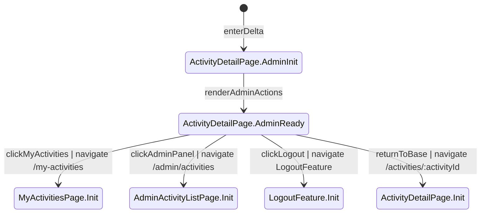
```mermaid
stateDiagram-v2
  %% role: Admin
  %% extends: ActivityDetailPage
  [*] --> ActivityDetailPage.AdminInit : enterDelta
  %% verify: UI 進入 Admin 差異視角；Header 顯示管理後台入口且不顯示登入/註冊

  ActivityDetailPage.AdminInit --> ActivityDetailPage.AdminReady : renderAdminActions
  %% verify: UI 顯示「我的活動/管理後台/登出」入口；不重複顯示登出

  ActivityDetailPage.AdminReady --> MyActivitiesPage.Init : clickMyActivities | navigate /my-activities
  %% verify: UI 導向我的活動；Header 維持 Admin 規則

  ActivityDetailPage.AdminReady --> AdminActivityListPage.Init : clickAdminPanel | navigate /admin/activities
  %% verify: 存取控制檢查通過；可進入管理活動列表

  ActivityDetailPage.AdminReady --> LogoutFeature.Init : clickLogout | navigate LogoutFeature
  %% verify: 登出後回到 Guest 視角；詳情頁不再出現可用的報名/取消入口

  ActivityDetailPage.AdminReady --> ActivityDetailPage.Init : returnToBase | navigate /activities/:activityId
  %% verify: UI 返回 base 入口；Header 仍維持 Admin 規則
```

### ⑩ AuthPage Page（/auth）

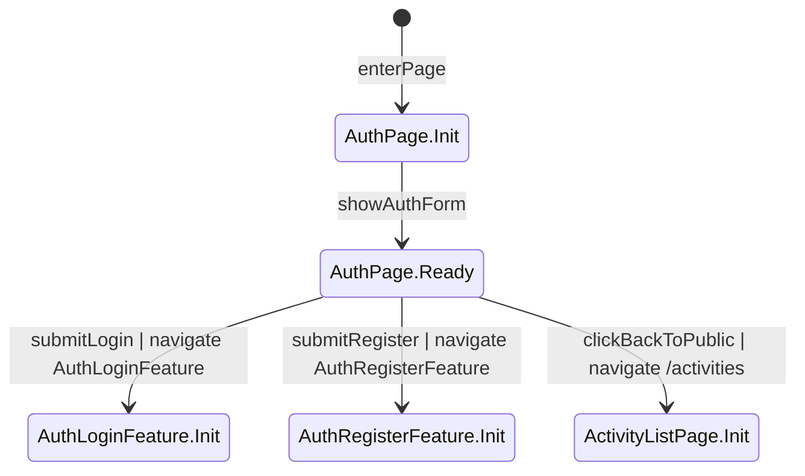
```mermaid
stateDiagram-v2
  %% role: none
  [*] --> AuthPage.Init : enterPage
  %% verify: UI 顯示登入/註冊表單（同頁可切換）；Header 不顯示「我的活動/管理後台」

  AuthPage.Init --> AuthPage.Ready : showAuthForm
  %% verify: 表單欄位可輸入 email/password（註冊另含 name）；提交按鈕可用狀態依必填驗證

  AuthPage.Ready --> AuthLoginFeature.Init : submitLogin | navigate AuthLoginFeature
  %% verify: 送出登入時 UI 顯示 loading 且不可重複提交；登入成功後必須建立可驗證身分的登入狀態

  AuthPage.Ready --> AuthRegisterFeature.Init : submitRegister | navigate AuthRegisterFeature
  %% verify: 送出註冊時 UI 顯示 loading 且不可重複提交；註冊成功必須建立 Member 帳號（不可建立 Admin）

  AuthPage.Ready --> ActivityListPage.Init : clickBackToPublic | navigate /activities
  %% verify: UI 返回公開活動列表；Guest Header 顯示登入/註冊，不顯示登出
```

### ⑪ MyActivitiesPage Page（/my-activities）

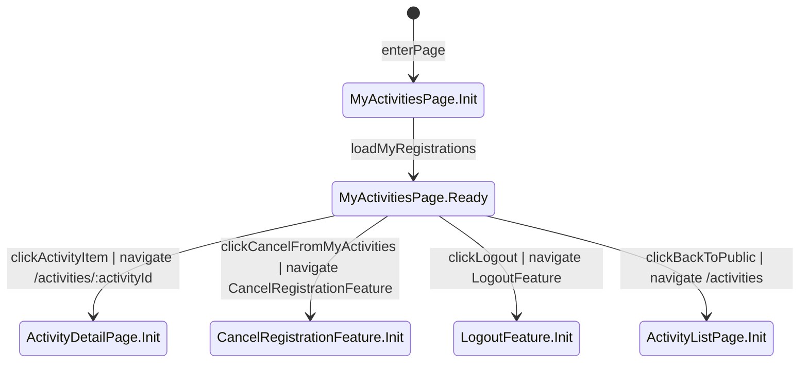
```mermaid
stateDiagram-v2
  %% role: Member|Admin
  [*] --> MyActivitiesPage.Init : enterPage
  %% verify: 若未登入：存取控制阻擋並導向 /auth（保留 returnTo=/my-activities）；若已登入：顯示 loading

  MyActivitiesPage.Init --> MyActivitiesPage.Ready : loadMyRegistrations
  %% verify: 系統僅回傳目前使用者已報名且未取消的活動；UI 依活動日期排序並顯示「即將開始/已結束」

  MyActivitiesPage.Ready --> ActivityDetailPage.Init : clickActivityItem | navigate /activities/:activityId
  %% verify: UI 導向活動詳情；對應活動仍需可見（公開活動）

  MyActivitiesPage.Ready --> CancelRegistrationFeature.Init : clickCancelFromMyActivities | navigate CancelRegistrationFeature
  %% verify: 取消報名需符合規則（deadline 前且活動未結束）；不符合時系統需阻擋並顯示原因

  MyActivitiesPage.Ready --> LogoutFeature.Init : clickLogout | navigate LogoutFeature
  %% verify: 登出成功後返回 /activities；Header 變為 Guest 規則

  MyActivitiesPage.Ready --> ActivityListPage.Init : clickBackToPublic | navigate /activities
  %% verify: UI 返回活動列表；不會顯示 MyActivities 導覽（Guest 時必須隱藏）
```

### ⑫ AdminActivityListPage Page（/admin/activities）

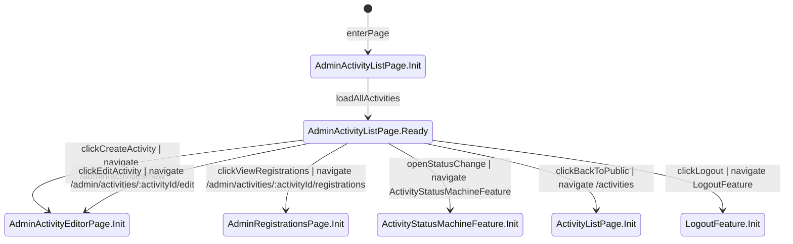
```mermaid
stateDiagram-v2
  %% role: Admin
  [*] --> AdminActivityListPage.Init : enterPage
  %% verify: 若非 Admin：存取控制阻擋（Member 權限不足或 Guest 未登入）；Admin 進入時顯示 loading

  AdminActivityListPage.Init --> AdminActivityListPage.Ready : loadAllActivities
  %% verify: 系統回傳所有狀態 draft/published/full/closed/archived；UI 顯示每筆活動目前報名人數與狀態

  AdminActivityListPage.Ready --> AdminActivityEditorPage.Init : clickCreateActivity | navigate /admin/activities/new
  %% verify: UI 導向建立活動頁；表單預設為 draft；capacity/date/deadline 等欄位可編輯

  AdminActivityListPage.Ready --> AdminActivityEditorPage.Init : clickEditActivity | navigate /admin/activities/:activityId/edit
  %% verify: UI 導向編輯頁；載入既有活動資料並可修改；修改後需更新 updated_at

  AdminActivityListPage.Ready --> AdminRegistrationsPage.Init : clickViewRegistrations | navigate /admin/activities/:activityId/registrations
  %% verify: UI 導向報名名單頁；系統回傳姓名/email/報名時間

  AdminActivityListPage.Ready --> ActivityStatusMachineFeature.Init : openStatusChange | navigate ActivityStatusMachineFeature
  %% verify: 僅 Admin 可操作狀態變更；狀態變更需符合合法轉移（例如 draft→published、published/full→closed、closed/draft→archived）

  AdminActivityListPage.Ready --> ActivityListPage.Init : clickBackToPublic | navigate /activities
  %% verify: UI 返回公開活動列表；Admin Header 仍可顯示管理後台入口

  AdminActivityListPage.Ready --> LogoutFeature.Init : clickLogout | navigate LogoutFeature
  %% verify: 登出成功後返回 /activities 並移除 Admin 導覽；再次進入 /admin/* 需重新登入
```

### ⑬ AdminActivityEditorPage Page（/admin/activities/new、/admin/activities/:activityId/edit）

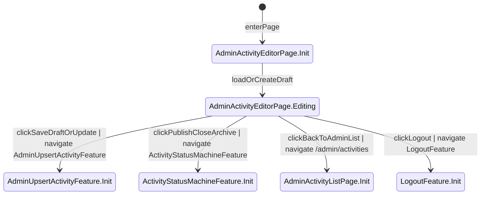
```mermaid
stateDiagram-v2
  %% role: Admin
  [*] --> AdminActivityEditorPage.Init : enterPage
  %% verify: 非 Admin 進入時被阻擋（未登入或權限不足）；Admin 進入時顯示 loading 或建立草稿

  AdminActivityEditorPage.Init --> AdminActivityEditorPage.Editing : loadOrCreateDraft
  %% verify: 建立時產生 draft；編輯時載入既有活動；date 必須晚於 deadline，capacity 必須為正整數（不符合需顯示表單錯誤）

  AdminActivityEditorPage.Editing --> AdminUpsertActivityFeature.Init : clickSaveDraftOrUpdate | navigate AdminUpsertActivityFeature
  %% verify: 送出儲存時 UI 顯示 loading 且不可重複提交；成功後資料持久化並更新 updated_at

  AdminActivityEditorPage.Editing --> ActivityStatusMachineFeature.Init : clickPublishCloseArchive | navigate ActivityStatusMachineFeature
  %% verify: 發佈/關閉/下架必須符合狀態轉移規則；成功後活動狀態改變並可在管理列表即時看到

  AdminActivityEditorPage.Editing --> AdminActivityListPage.Init : clickBackToAdminList | navigate /admin/activities
  %% verify: UI 返回管理活動列表；列表資料與剛才編輯結果一致

  AdminActivityEditorPage.Editing --> LogoutFeature.Init : clickLogout | navigate LogoutFeature
  %% verify: 登出成功後返回 /activities；未登入狀態不得保留管理頁可見入口
```

### ⑭ AdminRegistrationsPage Page（/admin/activities/:activityId/registrations）

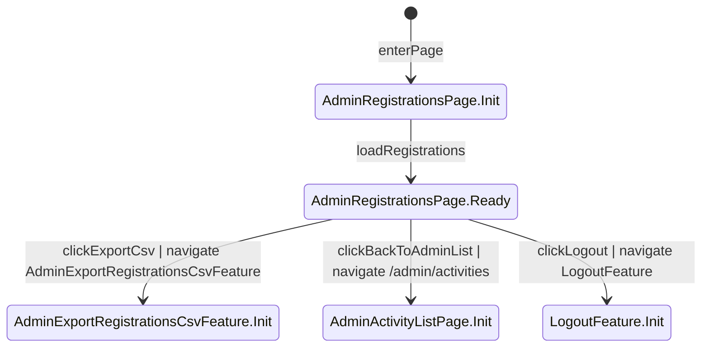
```mermaid
stateDiagram-v2
  %% role: Admin
  [*] --> AdminRegistrationsPage.Init : enterPage
  %% verify: 非 Admin 進入時被阻擋（未登入或權限不足）；Admin 進入時顯示 loading

  AdminRegistrationsPage.Init --> AdminRegistrationsPage.Ready : loadRegistrations
  %% verify: 系統回傳報名名單（姓名/email/報名時間）；若無報名 UI 顯示 empty 狀態

  AdminRegistrationsPage.Ready --> AdminExportRegistrationsCsvFeature.Init : clickExportCsv | navigate AdminExportRegistrationsCsvFeature
  %% verify: 匯出動作只有一個入口（頁面內）；匯出進行中顯示 loading 且避免重複觸發

  AdminRegistrationsPage.Ready --> AdminActivityListPage.Init : clickBackToAdminList | navigate /admin/activities
  %% verify: UI 返回管理列表；不需重新登入

  AdminRegistrationsPage.Ready --> LogoutFeature.Init : clickLogout | navigate LogoutFeature
  %% verify: 登出成功後返回 /activities；再次進入名單頁需重新授權
```

### ⑮ Feature: AuthLoginFeature

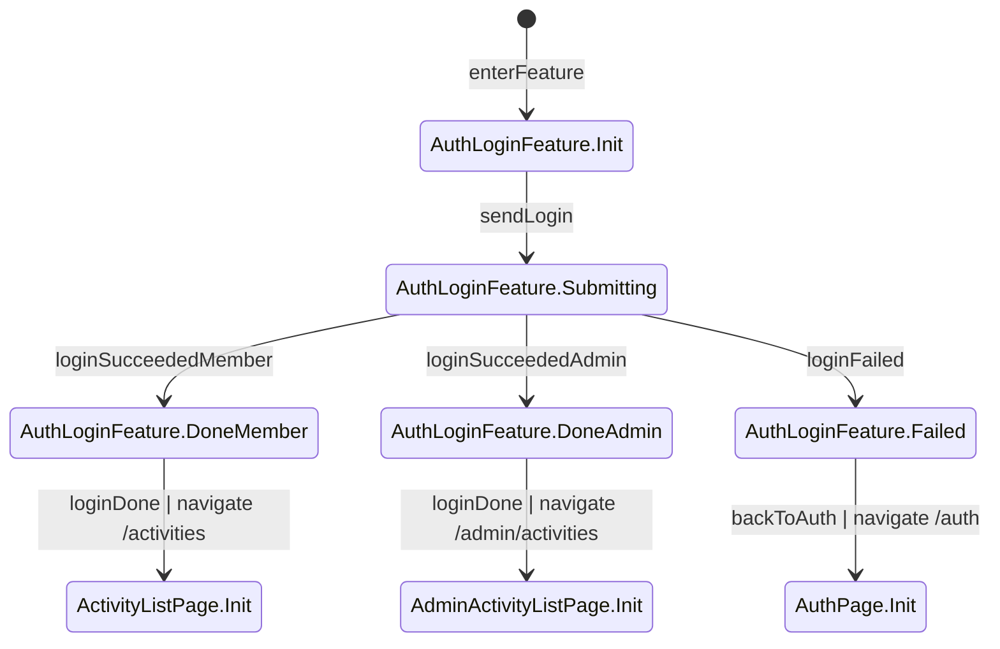
```mermaid
stateDiagram-v2
  %% role: none
  [*] --> AuthLoginFeature.Init : enterFeature
  %% verify: 進入登入流程後，AuthPage 的提交按鈕 disabled；若有 returnTo 需被保留

  AuthLoginFeature.Init --> AuthLoginFeature.Submitting : sendLogin
  %% verify: 系統送出登入請求；成功後必須建立可驗證身分的登入狀態；失敗回應需包含可顯示的錯誤訊息

  AuthLoginFeature.Submitting --> AuthLoginFeature.DoneMember : loginSucceededMember
  %% verify: 系統回傳角色=member；前端保存登入狀態；Header 切換為 Member 規則

  AuthLoginFeature.Submitting --> AuthLoginFeature.DoneAdmin : loginSucceededAdmin
  %% verify: 系統回傳角色=admin；前端保存登入狀態；Header 顯示管理後台入口

  AuthLoginFeature.Submitting --> AuthLoginFeature.Failed : loginFailed
  %% verify: 登入失敗時 UI 顯示失敗原因且允許重新輸入；不得建立登入狀態

  AuthLoginFeature.DoneMember --> ActivityListPage.Init : loginDone | navigate /activities
  %% verify: UI 導向 /activities；若存在 returnTo 則應導回 returnTo（例如 /my-activities 或 /activities/:activityId），且不遺失目標上下文

  AuthLoginFeature.DoneAdmin --> AdminActivityListPage.Init : loginDone | navigate /admin/activities
  %% verify: UI 導向管理活動列表；以 Admin 權限成功載入所有狀態活動

  AuthLoginFeature.Failed --> AuthPage.Init : backToAuth | navigate /auth
  %% verify: UI 返回 AuthPage；表單保留可重試狀態；不出現重複登入/註冊入口
```

### ⑯ Feature: AuthRegisterFeature

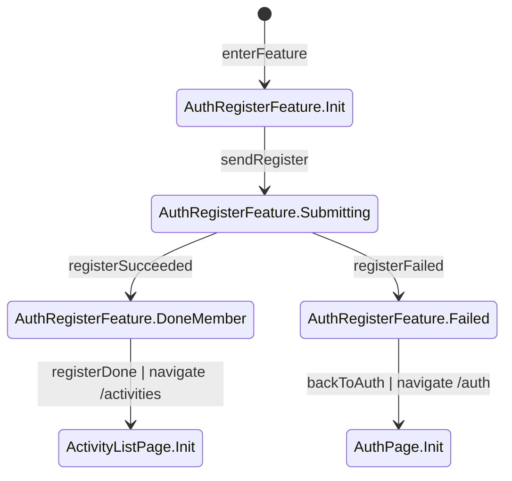
```mermaid
stateDiagram-v2
  %% role: none
  [*] --> AuthRegisterFeature.Init : enterFeature
  %% verify: 進入註冊流程後，提交按鈕 disabled 並顯示 loading；註冊僅能建立 Member

  AuthRegisterFeature.Init --> AuthRegisterFeature.Submitting : sendRegister
  %% verify: 系統送出註冊請求；email 必須唯一；password 需以業界標準方式安全儲存；成功後建立可驗證身分的登入狀態

  AuthRegisterFeature.Submitting --> AuthRegisterFeature.DoneMember : registerSucceeded
  %% verify: 系統回傳角色=member；不得產生 admin；Header 切換為 Member 規則

  AuthRegisterFeature.Submitting --> AuthRegisterFeature.Failed : registerFailed
  %% verify: 若 email 已存在或資料不合法：系統拒絕註冊；UI 顯示具體錯誤（例如 email 已使用）

  AuthRegisterFeature.DoneMember --> ActivityListPage.Init : registerDone | navigate /activities
  %% verify: UI 導向 /activities；若有 returnTo 則導回 returnTo；使用者可立即看到 Member 可用導覽（我的活動、登出）

  AuthRegisterFeature.Failed --> AuthPage.Init : backToAuth | navigate /auth
  %% verify: UI 回到 AuthPage 並保留可重試狀態；不會誤顯示管理後台入口
```

### ⑰ Feature: LogoutFeature

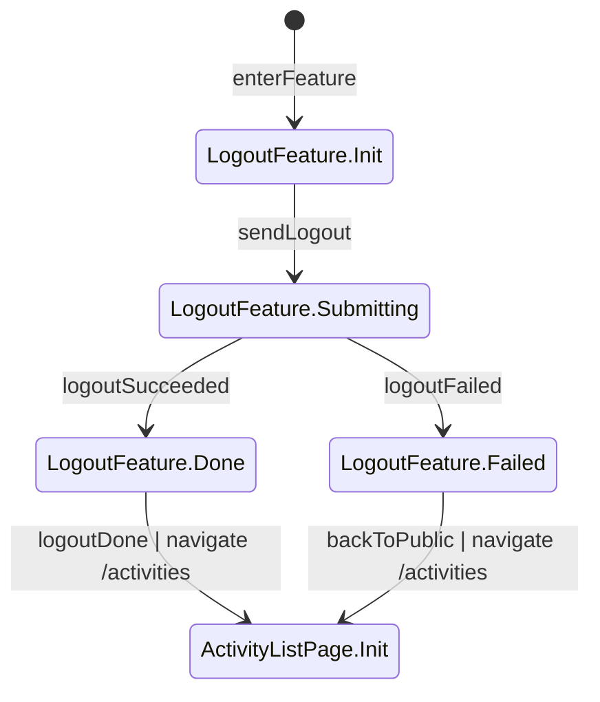
```mermaid
stateDiagram-v2
  %% role: Member|Admin
  [*] --> LogoutFeature.Init : enterFeature
  %% verify: 任何頁面觸發登出都只能有單一入口（Header）；觸發後 UI 顯示 loading 並禁止重複點擊

  LogoutFeature.Init --> LogoutFeature.Submitting : sendLogout
  %% verify: 系統送出登出；成功後登入狀態失效；後續受保護操作需再次登入

  LogoutFeature.Submitting --> LogoutFeature.Done : logoutSucceeded
  %% verify: 登出成功後前端清除登入狀態；Header 切回 Guest 規則

  LogoutFeature.Submitting --> LogoutFeature.Failed : logoutFailed
  %% verify: 若系統錯誤或網路失敗：UI 顯示登出失敗並保持原身分狀態不變（避免誤清除）

  LogoutFeature.Done --> ActivityListPage.Init : logoutDone | navigate /activities
  %% verify: UI 返回公開活動列表；不再可進入 /my-activities 或 /admin/*（需重新登入）

  LogoutFeature.Failed --> ActivityListPage.Init : backToPublic | navigate /activities
  %% verify: UI 導回 /activities 並顯示錯誤提示；若仍為已登入狀態，Header 仍顯示登出入口
```

### ⑱ Feature: RegisterActivityFeature

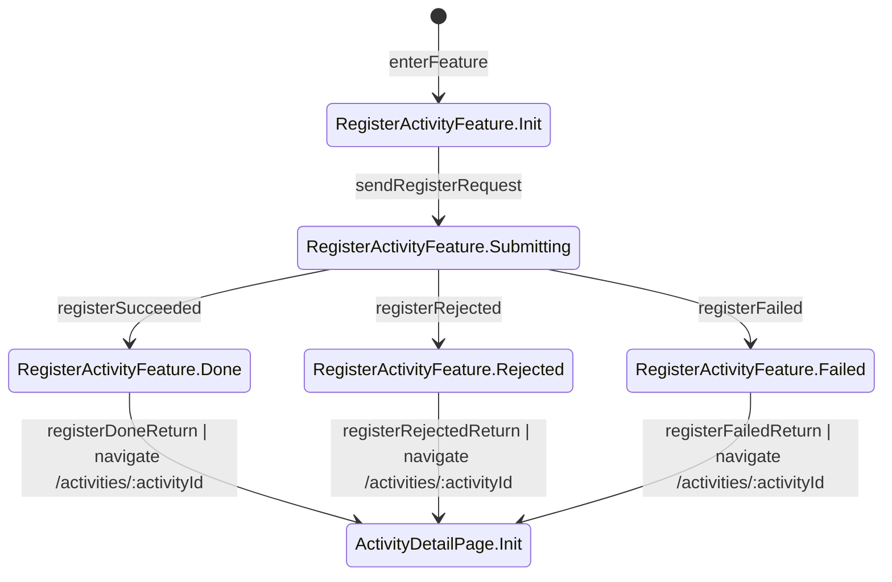
```mermaid
stateDiagram-v2
  %% role: Member
  [*] --> RegisterActivityFeature.Init : enterFeature
  %% verify: 觸發報名前需確認已登入（否則應先導向 /auth）；UI 顯示送出中並鎖定按鈕

  RegisterActivityFeature.Init --> RegisterActivityFeature.Submitting : sendRegisterRequest
  %% verify: 系統需驗證身分；以等效的原子更新避免超賣；同一 user+activity 的重送不得產生重複報名

  RegisterActivityFeature.Submitting --> RegisterActivityFeature.Done : registerSucceeded
  %% verify: 報名成功後建立有效 Registration（canceled_at 為 null）；Activity.registered_count 增加；若達 capacity 則 Activity.status 變為 full；UI 顯示已報名

  RegisterActivityFeature.Submitting --> RegisterActivityFeature.Rejected : registerRejected
  %% verify: 若活動非 published、已過 deadline、已額滿、或已結束：系統拒絕報名；UI 顯示不可報名原因且不建立報名

  RegisterActivityFeature.Submitting --> RegisterActivityFeature.Failed : registerFailed
  %% verify: 若系統錯誤或網路失敗：UI 顯示操作失敗且允許重試；重試仍不得造成重複報名

  RegisterActivityFeature.Done --> ActivityDetailPage.Init : registerDoneReturn | navigate /activities/:activityId
  %% verify: UI 回到活動詳情並重新載入；顯示「已報名」狀態與最新 registered_count/status；若因此額滿需顯示額滿提示

  RegisterActivityFeature.Rejected --> ActivityDetailPage.Init : registerRejectedReturn | navigate /activities/:activityId
  %% verify: UI 回到詳情並顯示被拒原因（例如額滿/截止）；按鈕狀態符合規則（不可報名時 disabled 或不顯示）

  RegisterActivityFeature.Failed --> ActivityDetailPage.Init : registerFailedReturn | navigate /activities/:activityId
  %% verify: UI 回到詳情並顯示錯誤訊息；可再次嘗試報名時必須先解除 loading 並避免重複提交
```

### ⑲ Feature: CancelRegistrationFeature

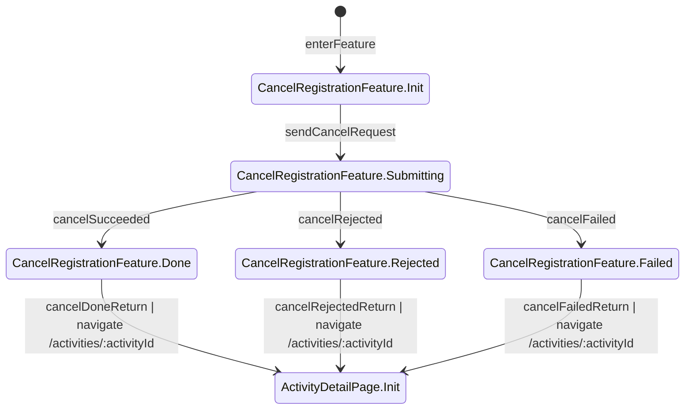
```mermaid
stateDiagram-v2
  %% role: Member
  [*] --> CancelRegistrationFeature.Init : enterFeature
  %% verify: 取消報名前需確認使用者對該活動已有有效報名；UI 顯示送出中並鎖定按鈕

  CancelRegistrationFeature.Init --> CancelRegistrationFeature.Submitting : sendCancelRequest
  %% verify: 系統需驗證身分；以等效的原子更新寫入 canceled_at、同步更新 Activity.registered_count，必要時 status 從 full 回到 published

  CancelRegistrationFeature.Submitting --> CancelRegistrationFeature.Done : cancelSucceeded
  %% verify: 取消成功後 Registration.canceled_at 被寫入；Activity.registered_count 減少；若原為 full 且釋放名額且仍可報名則 status 回 published；UI 顯示未報名

  CancelRegistrationFeature.Submitting --> CancelRegistrationFeature.Rejected : cancelRejected
  %% verify: 若已過 deadline、活動已結束、或根本未報名：系統拒絕取消；UI 顯示不可取消原因

  CancelRegistrationFeature.Submitting --> CancelRegistrationFeature.Failed : cancelFailed
  %% verify: 若系統錯誤或網路失敗：UI 顯示取消失敗；允許重試且不造成資料不一致（不會多次扣名額）

  CancelRegistrationFeature.Done --> ActivityDetailPage.Init : cancelDoneReturn | navigate /activities/:activityId
  %% verify: UI 回到詳情並重新載入；registered_count/status 與後端一致；若釋放後未額滿且仍可報名則顯示可報名

  CancelRegistrationFeature.Rejected --> ActivityDetailPage.Init : cancelRejectedReturn | navigate /activities/:activityId
  %% verify: UI 回到詳情並顯示拒絕原因；若規則禁止取消則不應顯示可點擊的取消入口

  CancelRegistrationFeature.Failed --> ActivityDetailPage.Init : cancelFailedReturn | navigate /activities/:activityId
  %% verify: UI 回到詳情並顯示錯誤訊息；可再次嘗試取消時必須先解除 loading 並避免重複提交
```

### ⑳ Feature: AdminUpsertActivityFeature

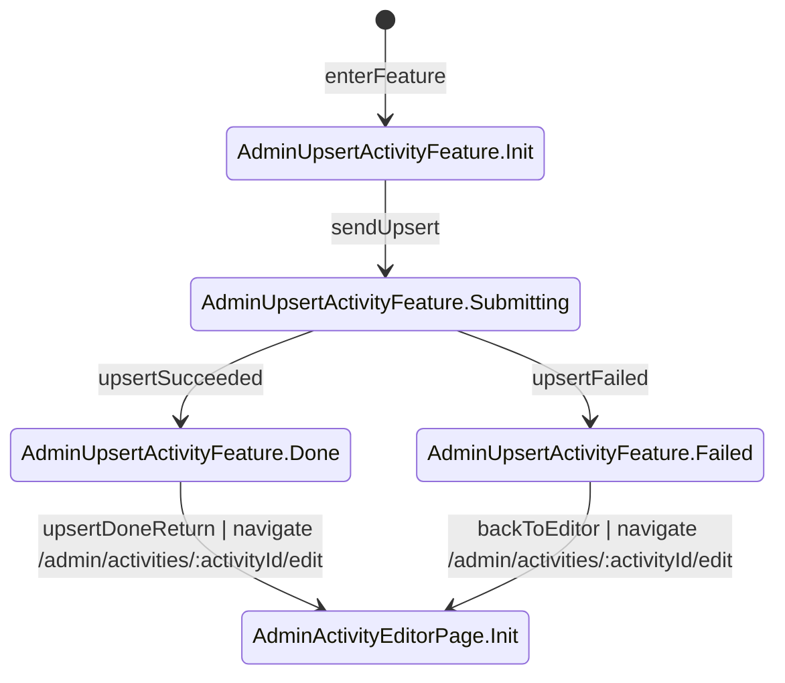
```mermaid
stateDiagram-v2
  %% role: Admin
  [*] --> AdminUpsertActivityFeature.Init : enterFeature
  %% verify: 僅 Admin 可進入；表單提交中按鈕 disabled 並顯示 loading

  AdminUpsertActivityFeature.Init --> AdminUpsertActivityFeature.Submitting : sendUpsert
  %% verify: 系統驗證 Admin 權限；驗證 date > deadline、capacity 為正整數；成功後更新 Activity.updated_at

  AdminUpsertActivityFeature.Submitting --> AdminUpsertActivityFeature.Done : upsertSucceeded
  %% verify: Activity 欄位與表單一致；若為新建則 created_by 設為當前 Admin

  AdminUpsertActivityFeature.Submitting --> AdminUpsertActivityFeature.Failed : upsertFailed
  %% verify: 若驗證失敗：回傳欄位錯誤；若系統錯誤：顯示操作失敗並允許重試；不得造成部分寫入

  AdminUpsertActivityFeature.Done --> AdminActivityEditorPage.Init : upsertDoneReturn | navigate /admin/activities/:activityId/edit
  %% verify: UI 回到編輯頁並載入最新資料；狀態仍維持（通常為 draft 或原狀態）

  AdminUpsertActivityFeature.Failed --> AdminActivityEditorPage.Init : backToEditor | navigate /admin/activities/:activityId/edit
  %% verify: UI 回到編輯頁並顯示錯誤；表單資料保留可修正；不會重複出現相同 CTA
```

### ㉑ Feature: AdminExportRegistrationsCsvFeature

```mermaid
stateDiagram-v2
  %% role: Admin
  [*] --> AdminExportRegistrationsCsvFeature.Init : enterFeature
  %% verify: 僅 Admin 可匯出；匯出按鈕進入 loading 並避免重複觸發

  AdminExportRegistrationsCsvFeature.Init --> AdminExportRegistrationsCsvFeature.Exporting : startExport
  %% verify: 系統產出 CSV；內容欄位包含姓名/email/報名時間；匯出行為需被 AuditLog 記錄

  AdminExportRegistrationsCsvFeature.Exporting --> AdminExportRegistrationsCsvFeature.Done : exportSucceeded
  %% verify: 匯出成功後瀏覽器觸發下載；檔案內容筆數與當前名單一致

  AdminExportRegistrationsCsvFeature.Exporting --> AdminExportRegistrationsCsvFeature.Failed : exportFailed
  %% verify: 若匯出失敗（系統錯誤/網路）：UI 顯示錯誤提示並允許重試；不產生重複下載行為

  AdminExportRegistrationsCsvFeature.Done --> AdminRegistrationsPage.Init : exportDoneReturn | navigate /admin/activities/:activityId/registrations
  %% verify: UI 回到名單頁；名單仍可正常載入；匯出入口仍為單一且可用

  AdminExportRegistrationsCsvFeature.Failed --> AdminRegistrationsPage.Init : exportFailedReturn | navigate /admin/activities/:activityId/registrations
  %% verify: UI 回到名單頁並顯示匯出失敗訊息；可再次點擊匯出
```

### ㉒ Feature: ActivityStatusMachineFeature

```mermaid
stateDiagram-v2
  %% role: Admin
  [*] --> ActivityStatusMachineFeature.Init : enterFeature
  %% verify: 僅 Admin 可進入狀態變更；UI 顯示可操作的狀態轉移選項（依目前 status）

  ActivityStatusMachineFeature.Init --> ActivityStatusMachineFeature.Draft : asDraft
  %% verify: 目前活動 status 為 draft；公開列表/詳情不可見；僅管理後台可見

  ActivityStatusMachineFeature.Init --> ActivityStatusMachineFeature.Published : asPublished
  %% verify: 目前活動 status 為 published；公開列表/詳情可見；若未過 deadline 且未額滿則允許報名

  ActivityStatusMachineFeature.Init --> ActivityStatusMachineFeature.Full : asFull
  %% verify: 目前活動 status 為 full；公開列表可見但不可再報名；registered_count 必須等於 capacity

  ActivityStatusMachineFeature.Init --> ActivityStatusMachineFeature.Closed : asClosed
  %% verify: 目前活動 status 為 closed；公開列表/詳情不可見（或依 Step1 規則視為非公開）；不可報名

  ActivityStatusMachineFeature.Init --> ActivityStatusMachineFeature.Archived : asArchived
  %% verify: 目前活動 status 為 archived；對外完全不可見；不可報名與取消

  ActivityStatusMachineFeature.Draft --> ActivityStatusMachineFeature.Published : publish
  %% verify: 系統驗證 Admin；驗證 date > deadline、capacity 正整數；成功後 status=published 且 AuditLog 記錄狀態變更

  ActivityStatusMachineFeature.Draft --> ActivityStatusMachineFeature.Archived : archive
  %% verify: 系統驗證 Admin；成功後 status=archived 並記錄 AuditLog；公開列表不再顯示該活動

  ActivityStatusMachineFeature.Published --> ActivityStatusMachineFeature.Closed : close
  %% verify: 系統驗證 Admin；成功後 status=closed 且不可報名；需記錄 AuditLog

  ActivityStatusMachineFeature.Published --> ActivityStatusMachineFeature.Full : autoFull
  %% verify: 當 registered_count 達 capacity 時系統自動切換 status=full；不得出現 registered_count > capacity（避免超賣）

  ActivityStatusMachineFeature.Full --> ActivityStatusMachineFeature.Closed : close
  %% verify: 系統驗證 Admin；成功後 status=closed；需記錄 AuditLog

  ActivityStatusMachineFeature.Full --> ActivityStatusMachineFeature.Published : autoReopenOnCapacity
  %% verify: 取消報名造成 registered_count < capacity 且仍未過 deadline 且未被手動關閉時，系統可切回 published；UI 顯示可報名

  ActivityStatusMachineFeature.Closed --> ActivityStatusMachineFeature.Archived : archive
  %% verify: 系統驗證 Admin；成功後 status=archived；需記錄 AuditLog

  ActivityStatusMachineFeature.Published --> AdminActivityListPage.Init : statusChangedReturn | navigate /admin/activities
  %% verify: UI 回到管理活動列表並顯示最新 status/registered_count；變更行為被 AuditLog 記錄

  ActivityStatusMachineFeature.Full --> AdminActivityListPage.Init : statusChangedReturn | navigate /admin/activities
  %% verify: UI 回到列表並顯示 full；公開列表仍可見但不可報名；registered_count 與 capacity 一致

  ActivityStatusMachineFeature.Closed --> AdminActivityListPage.Init : statusChangedReturn | navigate /admin/activities
  %% verify: UI 回到列表並顯示 closed；公開列表/詳情不再可見該活動（對 Guest/Member 視為不可見）

  ActivityStatusMachineFeature.Archived --> AdminActivityListPage.Init : statusChangedReturn | navigate /admin/activities
  %% verify: UI 回到列表並顯示 archived；公開列表/詳情不再可見；不可再進行狀態操作（或僅顯示不可變更）

  ActivityStatusMachineFeature.Draft --> AdminActivityListPage.Init : statusChangedReturn | navigate /admin/activities
  %% verify: UI 回到列表並顯示 draft；僅 Admin 可見；對外不可見
```
