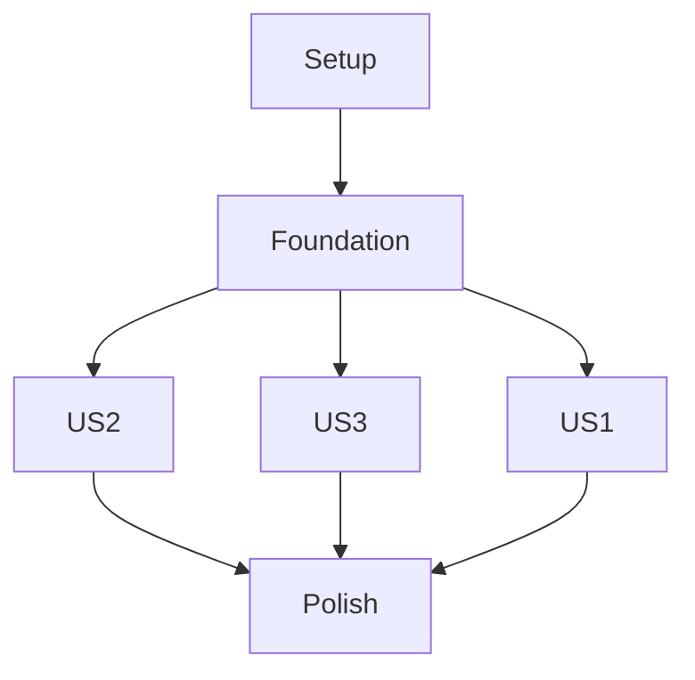

# Tasks: 社團活動管理平台（Activity Management Platform）

**Input**: Design documents from `/specs/001-activity-management-platform/`

- Required: `plan.md`, `spec.md`
- Optional (available): `research.md`, `data-model.md`, `contracts/openapi.yaml`, `quickstart.md`

**Tests**: 依據憲章，凡是會改變行為的變更，測試 MUST 預設納入工作項（至少單元測試；必要時整合/契約測試）。

**Organization**: Tasks are grouped by user story to enable independent implementation and testing of each story.

## Format

每一個 task 都必須嚴格符合：

- [ ] `T###`（例如 T001）
- 可平行才加 `[P]`
- User story phase 的 task 必須加 `[US1] / [US2] / [US3]`
- 描述必須包含明確檔案路徑

---

## Phase 1: Setup (Shared Infrastructure)

**Purpose**: 建立前後端分離的專案骨架、工具鏈、與最小可跑的 dev loop。

- [X] T001 建立前後端資料夾骨架與 README 指引於 `README.md`（包含 `backend/`、`frontend/`）
- [X] T002 [P] 初始化後端 NestJS 專案於 `backend/`（產出 `backend/package.json`, `backend/src/main.ts`）
- [X] T003 [P] 初始化前端 Vite+React+TS 專案於 `frontend/`（產出 `frontend/package.json`, `frontend/src/main.tsx`）
- [X] T004 [P] 後端加入 ESLint/Prettier 基礎設定於 `backend/eslint.config.js`, `backend/.prettierrc`
- [X] T005 [P] 前端加入 ESLint/Prettier 基礎設定於 `frontend/eslint.config.js`, `frontend/.prettierrc`
- [X] T006 [P] 前端整合 Tailwind CSS 於 `frontend/tailwind.config.ts`, `frontend/src/index.css`
- [X] T007 [P] 設定前端路由骨架（React Router）於 `frontend/src/routes/router.tsx`
- [X] T008 [P] 設定前端資料層骨架（TanStack Query provider）於 `frontend/src/main.tsx`
- [X] T009 後端加入 Jest 基礎設定（含 e2e/supertest）於 `backend/test/jest-e2e.config.cjs`
- [X] T010 前端加入 Vitest + RTL 基礎設定於 `frontend/vitest.config.ts`, `frontend/src/test/setup.ts`
- [X] T011 後端加入 `npm` scripts（dev/test/lint/format/prisma）於 `backend/package.json`
- [X] T012 前端加入 `npm` scripts（dev/test/lint/format）於 `frontend/package.json`
- [X] T013 建立後端環境變數範例檔於 `backend/.env.example`（含 `DATABASE_URL`, `JWT_SECRET`, `APP_TIMEZONE`）
- [X] T014 建立前端環境變數範例檔於 `frontend/.env.example`（含 `VITE_API_BASE_URL`）
- [X] T015 設定後端 CORS + cookie 基礎（允許前端 origin + credentials）於 `backend/src/main.ts`
- [X] T016 建立共用 HTTP 狀態呈現規範文件於 `frontend/src/components/states/README.md`（Loading/Error/Empty patterns）

**Checkpoint**: `backend` 與 `frontend` 均可啟動；前端能顯示一個基本頁面；後端能回應 health endpoint。

---

## Phase 2: Foundational (Blocking Prerequisites)

**Purpose**: DB、Auth/RBAC、共用錯誤處理、logging、時間基準、與測試基礎（BLOCKS all user stories）。

- [X] T017 建立後端 Config 模組（讀取 env 與型別驗證）於 `backend/src/config/config.module.ts`
- [X] T018 建立後端全域 validation pipe（class-validator/transformer）於 `backend/src/main.ts`
- [X] T019 建立後端全域例外處理（統一錯誤回應格式）於 `backend/src/common/filters/http-exception.filter.ts`
- [X] T020 建立後端 logging（Pino）整合於 `backend/src/main.ts`
- [X] T021 建立 Prisma schema（User/Activity/Registration/AuditLog/IdempotencyRecord）於 `backend/prisma/schema.prisma`
- [X] T022 建立 Prisma migrations（初始 migration）於 `backend/prisma/migrations/`
- [X] T023 建立 PrismaModule/PrismaService（DI）於 `backend/src/prisma/prisma.module.ts`, `backend/src/prisma/prisma.service.ts`
- [X] T024 建立 DB seed（至少 1 個 Admin + 1 個 Member + 3 個 Activity）於 `backend/prisma/seed.ts`
- [X] T025 後端加入 seed script 與 prisma 設定於 `backend/package.json`
- [X] T026 建立 Auth module（註冊/登入/登出/我）路由骨架於 `backend/src/auth/auth.module.ts`, `backend/src/auth/auth.controller.ts`
- [X] T027 實作密碼雜湊與驗證（bcrypt）於 `backend/src/auth/password.service.ts`
- [X] T028 實作 JWT 簽發與 cookie 寫入/清除（HttpOnly, SameSite=Lax）於 `backend/src/auth/jwt.service.ts`
- [X] T029 實作 `GET /me` 身分取得與 `cookieAuth` guard 於 `backend/src/auth/auth.guard.ts`
- [X] T030 建立 RBAC decorators/guards（Admin only）於 `backend/src/auth/roles.decorator.ts`, `backend/src/auth/roles.guard.ts`
- [X] T031 建立時間基準工具（UTC now 與比較）於 `backend/src/common/time/time.ts`
- [X] T032 建立 ActivityStatus 轉移驗證函式（合法/不合法轉移）於 `backend/src/activities/activity-status.ts`
- [X] T033 建立 Audit module 與寫入服務於 `backend/src/audit/audit.module.ts`, `backend/src/audit/audit.service.ts`
- [X] T034 建立 Idempotency module（create/get with TTL）於 `backend/src/idempotency/idempotency.service.ts`
- [X] T035 [P] 後端單元測試：ActivityStatus 轉移矩陣於 `backend/test/unit/activity-status.spec.ts`
- [X] T036 [P] 後端整合測試基礎（啟動 app、清 DB、seed）於 `backend/test/integration/test-app.ts`
- [X] T037 [P] 前端建立 API client（fetch + `credentials: include` + base URL）於 `frontend/src/api/http.ts`
- [X] T038 [P] 前端建立型別與 DTO（對齊 OpenAPI schemas）於 `frontend/src/api/types.ts`
- [X] T039 [P] 前端建立 Auth API（/auth/*, /me）於 `frontend/src/api/auth.ts`
- [X] T040 [P] 前端建立 Activities API（/activities*）於 `frontend/src/api/activities.ts`
- [X] T041 [P] 前端建立 Member API（/my-activities, registrations）於 `frontend/src/api/member.ts`
- [X] T042 [P] 前端建立 Admin API（/admin/*）於 `frontend/src/api/admin.ts`
- [X] T043 前端建立「身分狀態」hook（載入 /me，供導覽與路由保護使用）於 `frontend/src/hooks/useSession.ts`
- [X] T044 前端建立導覽列元件（依 role 顯示）並落實 CTA 去重於 `frontend/src/components/NavBar.tsx`
- [X] T045 前端建立路由保護（Member/Admin）於 `frontend/src/routes/guards.tsx`
- [X] T046 [P] 前端 RTL 測試：導覽列可見性（Guest/Member/Admin）於 `frontend/test/unit/NavBar.spec.tsx`

**Checkpoint**: Auth/RBAC、Prisma、logging、錯誤處理、前端 session/route/nav 基礎完成；後端能 seed 並可跑最小整合測試。

---

## Phase 3: User Story 1 - 瀏覽公開活動與查看詳情（Priority: P1）

**Goal**: Guest/登入者可瀏覽公開活動清單與詳情（僅 `published/full`）。

**Independent Test**:
- 未登入開啟 `/activities` → 看到清單（僅 published/full）
- 點進 `/activities/:activityId` → 看到詳情；若活動為 draft/closed/archived 則體驗為「找不到」

### Tests for User Story 1

- [X] T047 [P] [US1] 後端契約測試：`GET /activities` 回傳 items schema 於 `backend/test/contract/public-activities.contract.spec.ts`
- [X] T048 [P] [US1] 後端契約測試：`GET /activities/{id}` 200/404 行為於 `backend/test/contract/public-activity-detail.contract.spec.ts`
- [X] T049 [P] [US1] 前端 RTL 測試：Guest 導覽列只顯示「活動列表、登入/註冊」於 `frontend/test/integration/guest-nav.spec.tsx`

### Implementation for User Story 1

- [X] T050 [US1] 後端建立 Public Activities module/controller/service 於 `backend/src/activities/public-activities.controller.ts`
- [X] T051 [US1] 後端實作 `GET /activities`（只含 PUBLISHED/FULL）於 `backend/src/activities/public-activities.service.ts`
- [X] T052 [US1] 後端實作 `GET /activities/:activityId`（不可見狀態回 404）於 `backend/src/activities/public-activities.service.ts`
- [X] T053 [US1] 後端補齊 DTO 與輸出 mapping 於 `backend/src/activities/dto/activity.dto.ts`
- [X] T054 [US1] 後端整合測試：seed 後 public list/detail 行為於 `backend/test/integration/public-activities.e2e-spec.ts`
- [X] T055 [US1] 前端建立 ActivitiesList page（loading/error/empty）於 `frontend/src/pages/ActivitiesListPage.tsx`
- [X] T056 [US1] 前端建立 ActivitiesDetail page（Guest 顯示登入提示、無可報名 CTA）於 `frontend/src/pages/ActivityDetailPage.tsx`
- [X] T057 [US1] 前端建立對應 routes 於 `frontend/src/routes/router.tsx`
- [X] T058 [US1] 前端建立 Query hooks（list/detail）於 `frontend/src/hooks/queries/usePublicActivities.ts`
- [X] T059 [US1] 前端 E2E-ish RTL：清單 → 點擊 → 詳情（含 loading state）於 `frontend/test/integration/public-activities-flow.spec.tsx`

**Checkpoint**: US1 完成後，Guest 可獨立驗收清單與詳情，不需登入。

---

## Phase 4: User Story 2 - 會員身分取得與報名/取消/我的活動（Priority: P2）

**Goal**: Member 可註冊/登入、報名/取消、查看我的活動；高併發不得超賣且重送不產生重複副作用。

**Independent Test**:
- Guest 嘗試報名 → 導向 `/auth?returnTo=...` → 成功後回到原活動
- Member 可報名 → 我的活動可見 → 截止前可取消 → 我的活動移除
- 重複送出報名/取消不會造成重複有效報名或 registeredCount 錯誤

### Tests for User Story 2

- [X] T060 [P] [US2] 後端整合測試：註冊→登入→`/me`→登出於 `backend/test/integration/auth.e2e-spec.ts`
- [X] T061 [P] [US2] 後端單元測試：registerable/cancelable 規則（deadline/date/status/capacity）於 `backend/test/unit/registration-rules.spec.ts`
- [X] T062 [P] [US2] 後端整合測試：報名/取消流程與 registeredCount 正確性於 `backend/test/integration/registrations.e2e-spec.ts`
- [X] T063 [P] [US2] 後端整合測試：同一使用者重複報名不產生多筆有效報名於 `backend/test/integration/idempotent-register.e2e-spec.ts`
- [X] T064 [P] [US2] 前端 RTL 測試：`returnTo` 登入後返回活動詳情於 `frontend/test/integration/auth-returnto.spec.tsx`

### Implementation for User Story 2

- [X] T065 [US2] 後端完成 AuthController：`POST /auth/register`（只能建立 MEMBER）於 `backend/src/auth/auth.controller.ts`
- [X] T066 [US2] 後端完成 AuthController：`POST /auth/login`（寫入 cookie）於 `backend/src/auth/auth.controller.ts`
- [X] T067 [US2] 後端完成 AuthController：`POST /auth/logout`（清除 cookie）於 `backend/src/auth/auth.controller.ts`
- [X] T068 [US2] 後端完成 `GET /me` 回傳 AuthMe 於 `backend/src/me.controller.ts`
- [X] T069 [US2] 後端建立 Registrations module/controller/service 於 `backend/src/registrations/registrations.module.ts`
- [X] T070 [US2] 後端實作 `POST /activities/:id/registrations` 交易：檢查可報名→更新 Registration→registeredCount++→必要時 PUBLISHED→FULL 於 `backend/src/registrations/registrations.service.ts`
- [X] T071 [US2] 後端實作 `DELETE /activities/:id/registrations` 交易：檢查可取消→canceledAt=now→registeredCount--→必要時 FULL→PUBLISHED 於 `backend/src/registrations/registrations.service.ts`
- [X] T072 [US2] 後端處理「活動不可見」對 Member 視角等同 404（draft/closed/archived）於 `backend/src/registrations/registrations.service.ts`
- [X] T073 [US2] 後端寫入 AuditLog：register/cancel 於 `backend/src/audit/audit.service.ts`
- [X] T074 [US2] 後端整合 IdempotencyKeyBody（register/cancel）避免重試造成重複稽核紀錄於 `backend/src/idempotency/idempotency.service.ts`
- [X] T075 [US2] 後端實作 `GET /my-activities`（只回傳有效報名活動摘要）於 `backend/src/registrations/my-activities.controller.ts`
- [X] T076 [US2] 後端整合測試：`/my-activities` 行為（取消後移除）於 `backend/test/integration/my-activities.e2e-spec.ts`

- [X] T077 [US2] 前端建立 AuthPage（註冊/登入表單，RHF+Zod）於 `frontend/src/pages/AuthPage.tsx`
- [X] T078 [US2] 前端建立 schemas（Register/Login）於 `frontend/src/schemas/authSchemas.ts`
- [X] T079 [US2] 前端建立 auth mutations（register/login/logout）與錯誤呈現於 `frontend/src/hooks/mutations/useAuthMutations.ts`
- [X] T080 [US2] 前端在 ActivityDetailPage 顯示 Member 報名 CTA（且 CTA 去重）於 `frontend/src/pages/ActivityDetailPage.tsx`
- [X] T081 [US2] 前端在 ActivityDetailPage 實作報名/取消互斥與 loading 禁用（避免重複觸發）於 `frontend/src/pages/ActivityDetailPage.tsx`
- [X] T082 [US2] 前端建立 MyActivitiesPage（loading/error/empty）於 `frontend/src/pages/MyActivitiesPage.tsx`
- [X] T083 [US2] 前端建立「我的活動」query hook 於 `frontend/src/hooks/queries/useMyActivities.ts`
- [X] T084 [US2] 前端路由保護：`/my-activities` 需 Member/Admin（未登入導向 `/auth` + returnTo）於 `frontend/src/routes/guards.tsx`
- [X] T085 [US2] 前端 E2E-ish RTL：登入→報名→我的活動→取消 的 UI 流程於 `frontend/test/integration/member-flow.spec.tsx`

**Checkpoint**: US2 完成後，Member 全流程可獨立驗收，且重複提交不會造成副作用。

---

## Phase 5: User Story 3 - 管理後台活動管理與名單匯出（Priority: P3）

**Goal**: Admin 可建立/編輯/變更狀態、查看名單並匯出 CSV；權限與稽核正確。

**Independent Test**:
- Admin 登入 → 建立 draft → 編輯 → 發佈 → 公開列表可見
- Admin 可查看報名名單並匯出 CSV（含 UTF-8 BOM、欄位正確）
- 非 Admin 進入 `/admin/*` 會被阻擋並導回公開頁

### Tests for User Story 3

- [X] T086 [P] [US3] 後端整合測試：Admin RBAC（非 admin 403）於 `backend/test/integration/admin-rbac.e2e-spec.ts`
- [X] T087 [P] [US3] 後端整合測試：建立/更新活動欄位驗證（date > deadline, capacity > 0）於 `backend/test/integration/admin-activities.e2e-spec.ts`
- [X] T088 [P] [US3] 後端單元測試：手動狀態轉移（published/full→closed, closed/draft→archived）於 `backend/test/unit/admin-status-transition.spec.ts`
- [X] T089 [P] [US3] 後端整合測試：名單清單與 CSV 匯出內容/編碼於 `backend/test/integration/admin-export.e2e-spec.ts`
- [X] T090 [P] [US3] 前端 RTL 測試：Admin routes guard（非 admin 導回）於 `frontend/test/integration/admin-guard.spec.tsx`

### Implementation for User Story 3

- [X] T091 [US3] 後端建立 Admin Activities controller/service（list/create/update）於 `backend/src/admin/admin-activities.controller.ts`
- [X] T092 [US3] 後端實作 `GET /admin/activities`（回傳所有狀態）於 `backend/src/admin/admin-activities.service.ts`
- [X] T093 [US3] 後端實作 `POST /admin/activities`（建立 draft）於 `backend/src/admin/admin-activities.service.ts`
- [X] T094 [US3] 後端實作 `PUT /admin/activities/:id`（更新）於 `backend/src/admin/admin-activities.service.ts`
- [X] T095 [US3] 後端實作 `POST /admin/activities/:id/status`（驗證轉移）於 `backend/src/admin/admin-activities.service.ts`
- [X] T096 [US3] 後端在 admin 操作寫入 AuditLog（create/update/status change/export）於 `backend/src/audit/audit.service.ts`

- [X] T097 [US3] 後端實作 `GET /admin/activities/:id/registrations`（name/email/registeredAt）於 `backend/src/admin/admin-registrations.controller.ts`
- [X] T098 [US3] 後端實作 `POST /admin/activities/:id/registrations/export`（CSV + UTF-8 BOM）於 `backend/src/admin/admin-export.controller.ts`
- [X] T099 [US3] 後端 export 支援 IdempotencyKeyBody 避免重試造成重複稽核於 `backend/src/admin/admin-export.controller.ts`

- [X] T100 [US3] 前端建立 AdminActivitiesListPage（list all activities, filter 由 UI 端呈現即可）於 `frontend/src/pages/admin/AdminActivitiesListPage.tsx`
- [X] T101 [US3] 前端建立 AdminActivityFormPage（new/edit，共用表單）於 `frontend/src/pages/admin/AdminActivityFormPage.tsx`
- [X] T102 [US3] 前端建立 AdminRegistrationsPage（名單列表 + 匯出按鈕）於 `frontend/src/pages/admin/AdminRegistrationsPage.tsx`
- [X] T103 [US3] 前端建立 admin activities queries/mutations 於 `frontend/src/hooks/admin/useAdminActivities.ts`
- [X] T104 [US3] 前端建立 admin registrations queries/mutations（含 export）於 `frontend/src/hooks/admin/useAdminRegistrations.ts`
- [X] T105 [US3] 前端建立 activities form schemas（RHF+Zod；date/deadline/capacity 驗證）於 `frontend/src/schemas/activitySchemas.ts`
- [X] T106 [US3] 前端加入 admin routes 並套用 Admin guard 於 `frontend/src/routes/router.tsx`
- [X] T107 [US3] 前端在公開頁與後台頁落實 loading/error/empty pattern（統一元件）於 `frontend/src/components/states/LoadingState.tsx`, `frontend/src/components/states/ErrorState.tsx`, `frontend/src/components/states/EmptyState.tsx`
- [X] T108 [US3] 前端 E2E-ish RTL：Admin 建立→發佈→回到 public list 可見的最小流程於 `frontend/test/integration/admin-flow.spec.tsx`

**Checkpoint**: US3 完成後，Admin 後台可獨立驗收建立/發佈/匯出，且權限/稽核符合規格。

---

## Phase 6: Polish & Cross-Cutting Concerns

**Purpose**: 效能與一致性驗證、可達性最低門檻、文件收斂與回歸。

- [X] T109 建立 1,000 併發報名壓測腳本（命中同一活動）於 `backend/test/perf/concurrent-register.ts`
- [X] T110 建立壓測前置（建立活動、建立多個會員、登入取得 cookie）於 `backend/test/perf/perf-helpers.ts`
- [X] T111 壓測結果驗證：不得超賣、不得重複有效報名（輸出檢查報告）於 `backend/test/perf/verify-results.ts`
- [X] T112 後端補齊關鍵操作 latency log（register/cancel/export）於 `backend/src/common/logging/request-timing.interceptor.ts`
- [X] T113 前端可達性最低門檻修正：鍵盤可操作、focus 狀態可預期於 `frontend/src/components/NavBar.tsx`
- [X] T114 前端 RWD 檢查與修正（主要頁面斷點）於 `frontend/src/pages/ActivitiesListPage.tsx`
- [X] T115 更新 quickstart（以實作結果修正）於 `specs/001-activity-management-platform/quickstart.md`
- [X] T116 補上「如何跑測試/壓測」文件於 `specs/001-activity-management-platform/plan.md`

---

## Dependencies & Execution Order

### Phase Dependencies

- Setup（Phase 1）→ Foundational（Phase 2）→ US1/US2/US3（Phase 3~5）→ Polish（Phase 6）

### User Story Dependency Graph

- US1/US2/US3 都只依賴 Foundational；可並行開發（有多人時）。
- 為了降低返工，建議先完成 US1（公開瀏覽）再完成 US2（報名一致性）最後 US3（後台）。

---

## Parallel Execution Examples

### User Story 1

- [P] `T047`、`T048`、`T049` 可同時進行（不同目錄/檔案）
- `T050`~`T054`（後端）與 `T055`~`T059`（前端）可並行

### User Story 2

- [P] `T060`~`T064` 測試可先行撰寫
- 後端 `T065`~`T076` 與前端 `T077`~`T085` 可並行

### User Story 3

- [P] `T086`~`T090` 測試可先行撰寫
- 後端 `T091`~`T099` 與前端 `T100`~`T108` 可並行

---

## Implementation Strategy

- 先完成 Setup + Foundational，確保：Prisma/seed、Auth/RBAC、錯誤處理、logging、前端 session/nav/guards 都可運作。
- 之後每個 user story 都以「可獨立驗收」為目標：先測試（單元/整合/RTL）再落實功能。
- 最後進行壓測與跨切面修正，對齊 NFR（2 秒體驗目標與 1,000 併發不超賣）。
